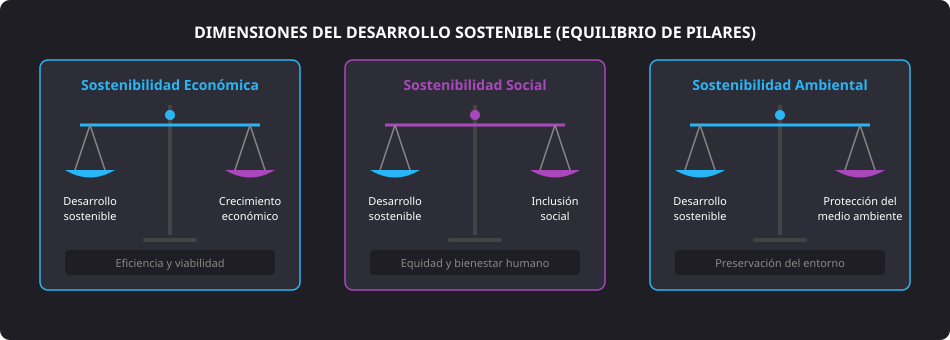
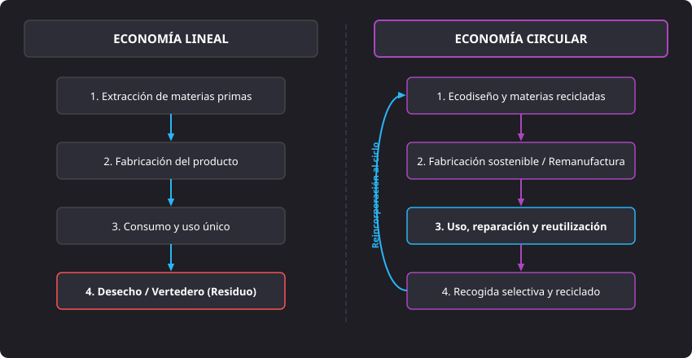

<h1 style="color: #ab47bc;">🌱 Tema 1 — Relación entre Digitalización y Sostenibilidad</h1>

<h2 style="color: #29b6f6;">1.1. Impacto de la Digitalización en el Desarrollo Sostenible</h2>

La digitalización de los sectores productivos se refleja en la incorporación de tecnologías avanzadas como robots para tareas repetitivas en fábricas o el uso de drones y sensores de riego en la agricultura para optimizar el consumo hídrico. Estas soluciones incrementan la productividad, reducen costes e impulsan la innovación, generando al mismo tiempo impactos positivos y negativos en la sostenibilidad ambiental.

#### Impactos Positivos
* **Optimización del uso de recursos:** Permite monitorizar en tiempo real el consumo de agua, energía y materias primas para evitar pérdidas y mermas en los procesos productivos.
* **Reducción de la huella de carbono:** Mejora la eficiencia energética y fomenta la integración de energías renovables, disminuyendo las emisiones de carbono globales.
* **Gestión de residuos:** Favorece la implantación de modelos de economía circular mediante estrategias de reutilización, trazabilidad y reciclaje de desechos.

#### Impactos Negativos
* **Consumo de energía y huella de carbono:** El funcionamiento continuo de centros de datos (CPD), servidores, redes de telecomunicaciones y dispositivos cliente exige elevadas cantidades de energía que, si proceden de fuentes no renovables, incrementan las emisiones de gases de efecto invernadero (GEI).
* **Consumo de recursos naturales:** La fabricación de ordenadores, teléfonos inteligentes y sensores requiere la extracción intensiva de minerales y tierras raras, consumiendo grandes volúmenes de agua y energía, degradando el medio ambiente y destruyendo ecosistemas.
* **Contaminación por desechos electrónicos (*e-waste*):** La basura electrónica contiene elementos tóxicos como plomo, mercurio y cadmio, los cuales contaminan gravemente el suelo y los acuíferos subterráneos si no reciben un tratamiento específico de reciclaje.

<figure markdown="span">
  
  <figcaption>Figura 1.2 — Equilibrio entre las tres dimensiones del desarrollo sostenible: económica, social y ambiental (Informe Brundtland).</figcaption>
</figure>

#### El Informe Brundtland (1987)
En 1987, la Comisión Mundial sobre el Medio Ambiente y el Desarrollo de la ONU publicó el Informe Brundtland, titulado *Nuestro futuro común*. Este documento estableció la necesidad de integrar tres dimensiones fundamentales en las decisiones económicas:

* **Sostenibilidad ambiental:** Preservación de los recursos naturales y minimización del impacto ecológico.
* **Sostenibilidad económica:** Promoción de un crecimiento económico inclusivo, viable y equitativo.
* **Sostenibilidad social:** Garantía de acceso universal a servicios básicos como educación, salud y vivienda.

!!! note "Definición Oficial de Desarrollo Sostenible"
    > *«El desarrollo que satisface las necesidades del presente sin comprometer la capacidad de las futuras generaciones para satisfacer sus propias necesidades»*.

---

<h2 style="color: #29b6f6;">1.2. Tecnologías Sostenibles</h2>

Las tecnologías sostenibles están orientadas a minimizar el impacto ambiental negativo y promover la eficiencia a largo plazo en el aprovechamiento de recursos. Se estructuran en cinco áreas principales:

#### 1. Energías Renovables
* **Energía solar:** Captura la radiación solar mediante paneles fotovoltaicos y colectores solares térmicos.
* **Energía eólica:** Genera electricidad aprovechando la energía cinética del viento mediante aerogeneradores.
* **Energía hidráulica:** Utiliza la corriente y fuerza del agua en ríos o saltos de embalses.
* **Biomasa:** Transforma la materia orgánica de residuos agrícolas, ganaderos o forestales en energía térmica o eléctrica.

#### 2. Eficiencia Energética
* **Edificios verdes:** Diseñados bajo estándares bioclimáticos con materiales reciclados y sistemas automatizados de climatización e iluminación.
* **Dispositivos eficientes:** Equipos electrónicos y servidores de menor consumo térmico, luminarias LED y certificaciones energéticas oficiales (ej. *Energy Star*).

#### 3. Transporte Sostenible
* **Vehículos eléctricos e híbridos:** Utilizan electricidad y baterías de alta densidad para reducir las emisiones de gases contaminantes en los núcleos urbanos.
* **Transporte público eficiente:** Optimización de redes colectivas mediante flotas electrificadas para desincentivar el uso del vehículo privado.

#### 4. Gestión de Residuos y Agua
* **Reciclaje y reutilización:** Procesamiento de residuos para reincorporarlos como materias primas secundarias en la cadena de valor.
* **Compostaje:** Descomposición biológica aeróbica de la materia orgánica para su transformación en abono natural.
* **Tecnologías de agua limpia:** Métodos avanzados de purificación de agua potable y plantas de desalación marina.
* **Depuración de aguas residuales:** Tratamiento biológico y químico de aguas residuales para su reutilización segura en riego o industria.

#### 5. Agricultura Sostenible
* **Cultivos hidropónicos y aeropónicos:** Cultivo en medios líquidos o aéreos sin suelo, optimizando hasta un 90% el consumo de agua y permitiendo la agricultura vertical urbana.
* **Agricultura regenerativa:** Prácticas agrícolas que restauran la materia orgánica del suelo, mejoran la biodiversidad y fijan carbono atmosférico.

---

<h2 style="color: #29b6f6;">1.3. Modelos Económicos: Economía Lineal versus Economía Circular</h2>

La diferencia esencial entre ambos modelos radica en el tratamiento de los recursos naturales y en el destino final de los residuos.

<figure markdown="span">
  
  <figcaption>Figura 1.1 — Comparativa funcional de flujos entre la Economía Lineal y la Economía Circular.</figcaption>
</figure>

#### Economía Lineal (EL)
* **Principio operativo:** Extraer, producir, usar y desechar. Asigna un ciclo de vida único y finito a los productos.
* **Gestión de recursos y residuos:** Exige una extracción ininterrumpida de materias primas vírgenes y genera ingentes volúmenes de desechos no recuperables destinados a vertederos o incineradoras.
* **Empresas representativas:** Tecnología de consumo rápido (*Apple*, *Samsung*) basada en renovaciones periódicas y moda rápida (*Zara*, *Primark*) con producción intensiva de corta durabilidad.

#### Economía Circular (EC)
* **Principio operativo:** Reducir, reutilizar, reciclar y regenerar. Su objetivo es «cerrar el círculo» reaprovechando materias primas y bienes manufacturados.
* **Gestión de recursos y residuos:** Mitiga la presión sobre los ecosistemas mediante ecodiseño, logística inversa, extensión de la vida útil y reincorporación de subproductos industriales.
* **Empresas representativas:** *Ikea* (programas de recompra, reparación y reciclaje de mobiliario) y diseñadores como *Piet Hein Eek* (fabricación exclusiva a partir de maderas y descartes industriales recuperados).

---

<h2 style="color: #29b6f6;">1.4. Importancia del Reciclaje en los Modelos Económicos</h2>

El modelo lineal provoca una sobreexplotación que amenaza con agotar materias primas no renovables (litio, cobre, cobalto). Frente a este riesgo, la economía circular propone:

1. **Considerar los materiales como recursos valiosos:** Deben mantenerse dentro del ciclo productivo el mayor tiempo posible.
2. **Sustituir el consumo de un solo uso por la extensión de la vida útil:** Diseñar productos concebidos para durar y ser mantenidos.

#### Prácticas Clave de Extensión del Ciclo de Vida
* **Reutilización:** Segundo uso de productos o componentes en su estado original sin necesidad de transformación industrial.
* **Reparación:** Intervención técnica sobre elementos averiados para devolverles su funcionalidad operativa, combatiendo la obsolescencia.
* **Remanufactura:** Proceso industrial en el que componentes usados se revisan, reacondicionan y ensamblan cumpliendo los estándares de calidad de un producto nuevo.

#### Efectos Ambientales del Reciclaje
* Disminuye la demanda de extracción de materias primas vírgenes.
* Minimiza drásticamente el espacio ocupado en vertederos y los lixiviados tóxicos.
* Reduce los niveles de contaminación del aire, suelo y acuíferos.
* Reduce la huella de carbono al requerir menor energía de procesado que la extracción minera inicial.

---

<h2 style="color: #29b6f6;">1.5. Comparativa entre los Modelos Circular y Lineal</h2>

| Dimensión | Modelo Circular (Tecnología Sostenible) | Modelo Lineal Tradicional |
| :--- | :--- | :--- |
| **Energía** | **Eficiencia energética:** Menor consumo por tarea, integración de energías renovables y monitorización inteligente en CPDs. | **Ineficiencia energética:** Procesos con alto consumo térmico y eléctrico basados en combustibles fósiles y altas emisiones de GEI. |
| **Recursos naturales** | **Prioriza recursos regenerables:** Empleo de materias primas recicladas, ecodiseño y fuentes de energía limpias (solar, eólica). | **Explotación intensiva:** Extracción continua de materiales vírgenes que degrada hábitats, provoca deforestación y pérdida de biodiversidad. |
| **Residuos** | **Minimización de desechos:** Enfoque *cradle-to-cradle* (de la cuna a la cuna), durabilidad, modularidad y fácil desmontaje. | **Generación masiva:** Acumulación en vertederos descontrolados y aumento exponencial de basura electrónica (*e-waste*). |
| **Contaminación** | **Emisiones mínimas:** Control riguroso de sustancias tóxicas en fases de fabricación, uso y final de vida útil. | **Emisiones elevadas:** Vertido de metales pesados y compuestos químicos nocivos que contaminan acuíferos y suelos. |
| **Impacto social y salud** | **Desarrollo inclusivo:** Creación de empleo verde, fomento del derecho a reparar y condiciones laborales justas. | **Riesgos para la salud:** Exposición laboral a sustancias tóxicas y degradación de la calidad de vida en entornos adyacentes a vertederos. |

---

<h2 style="color: #29b6f6;">1.6. Objetivos de Desarrollo Sostenible (ODS) de la Agenda 2030</h2>

Aprobados en 2015 por la Asamblea General de la ONU, los **17 ODS** fijan las prioridades de desarrollo sostenible global. Seis de ellos tienen un impacto directo en el ámbito medioambiental y tecnológico:

* **ODS 6 (Agua limpia y saneamiento):** Garantizar la disponibilidad y la gestión sostenible del agua y el saneamiento mediante sensores IoT y depuración avanzada.
* **ODS 7 (Energía asequible y no contaminante):** Aumentar sustancialmente la proporción de energía renovable y duplicar la tasa de eficiencia energética en infraestructuras TIC.
* **ODS 12 (Producción y consumo responsables):** Lograr la gestión ecológicamente racional de los productos químicos y desechos, reduciendo drásticamente la generación de residuos electrónicos.
* **ODS 13 (Acción por el clima):** Adoptar medidas urgentes contra el cambio climático, optimizando los centros de datos y monitorizando emisiones de gases contaminantes.
* **ODS 14 (Vida submarina):** Prevenir y reducir significativamente la contaminación marina de todo tipo, incluidos vertidos plásticos e industriales.
* **ODS 15 (Vida de ecosistemas terrestres):** Luchar contra la desertificación, detener y revertir la degradación de las tierras y frenar la pérdida de diversidad biológica.

---

<h2 style="color: #29b6f6;">1.7. Retrato Robot del Ecodiseño</h2>

El **ecodiseño** consiste en integrar criterios medioambientales durante la fase de concepción y desarrollo de un producto para minimizar su impacto ecológico a lo largo de todo su ciclo de vida.

#### Las 8 Características Fundamentales del Ecodiseño
1. **Materiales sostenibles:** Selección de plásticos reciclados, metales recuperados o biopolímeros, excluyendo sustancias peligrosas (plomo, mercurio, retardantes de llama halogenados).
2. **Alta durabilidad:** Componentes de alta calidad y chasis robustos preparados para resistir desgastes operativos continuados.
3. **Diseño modular:** Arquitectura por módulos que permite cambiar un elemento averiado (ej. puerto USB o pantalla) sin sustituir el equipo entero.
4. **Bajo consumo en uso:** Eficiencia energética acreditada durante el funcionamiento y modos de reposo (*standby*) de consumo residual ultra bajo.
5. **Fabricación limpia:** Optimización de líneas de montaje para minimizar la generación de recortes y reducir la huella de agua y carbono industrial.
6. **Logística y transporte optimizados:** Dispositivos más compactos y ligeros que permiten transportar más unidades por contenedor, recortando emisiones logísticas.
7. **Fácil desmontaje:** Uso de tornillería estándar y ausencia de pegamentos agresivos para facilitar que los técnicos separen los materiales al reciclar.
8. **Empaquetado mínimo:** Supresión de plásticos de un solo uso en las cajas, reduciendo el embalaje a cartón $100\%$ reciclado y tintas de origen vegetal.

--8<-- "docs/includes/glosario.md"
