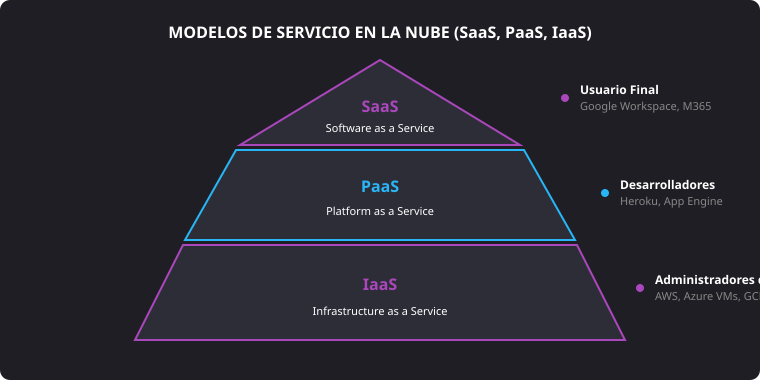
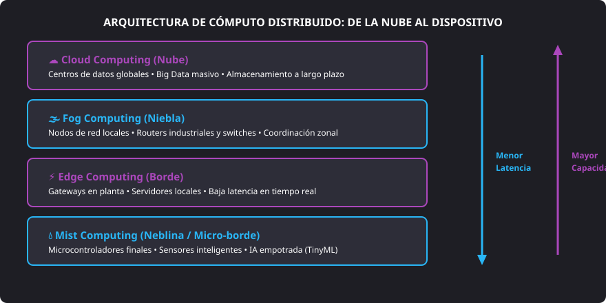

<h1 style="color: #ab47bc;">☁️ Tema 3 — Cloud y Sistemas Conectados</h1>

<h2 style="color: #29b6f6;">3.1. Cloud (Computación en la Nube)</h2>

### 3.1.1. ¿Qué es la Nube y cuál es su Funcionamiento?
* **Definición:** La nube (*cloud*) es un modelo de entrega bajo demanda de almacenamiento, bases de datos, redes, capacidad de cómputo y aplicaciones a través de Internet, operado por una red global de centros de procesamiento de datos (CPD).
* **Naturaleza de los servidores:** A diferencia de la infraestructura física local (*on-premises*), los recursos en la nube están virtualizados, residen en centros de datos especializados con alta redundancia y son gestionados directamente por proveedores de servicios en la nube (CSP).
* **Importancia estratégica:** Proporciona acceso universal a recursos tecnológicos elásticos desde cualquier terminal y ubicación, reduciendo la dependencia del hardware local.

#### Protocolo Básico de Funcionamiento
1. El dispositivo cliente (ordenador, tablet o smartphone) emite una solicitud mediante protocolos web estándar (HTTP/HTTPS, REST, gRPC).
2. El proveedor de acceso enruta los paquetes a través de Internet hasta las direcciones IP públicas y balanceadores de carga del proveedor cloud.
3. El clúster de servidores virtuales ejecuta el procesamiento, consulta las bases de datos requeridas y envía de vuelta la respuesta procesada a la interfaz del usuario.

---

### 3.1.2. Niveles de Servicios de Cloud Computing

La oferta en la nube se clasifica en tres capas según el grado de administración que conserva el cliente frente al proveedor:

<figure markdown="span">
  
  <figcaption>Figura 3.1 — Jerarquía de modelos de servicio en la nube y nivel de abstracción técnica.</figcaption>
</figure>

* **Infraestructura como Servicio (IaaS):**
    * Proporciona los bloques básicos de computación: máquinas virtuales (VM), almacenamiento en bloque u objetos y arquitectura de red virtual (VPC, cortafuegos, subredes).
    * El cliente instala, configura y mantiene el sistema operativo, los parches de seguridad, el entorno de ejecución y las aplicaciones.
    * **Proveedores de referencia:** Amazon Web Services (AWS EC2, S3), Google Cloud Platform (Compute Engine) y Microsoft Azure (Virtual Machines).
* **Plataforma como Servicio (PaaS):**
    * Ofrece un entorno gestionado donde los desarrolladores despliegan su código sin administrar hardware ni sistemas operativos subyacentes.
    * Incluye entornos de ejecución (*runtimes*), motores de bases de datos administradas y herramientas de integración.
    * **Proveedores de referencia:** Heroku, Google App Engine, AWS Elastic Beanstalk y Azure App Services.
* **Software como Servicio (SaaS):**
    * Entrega aplicaciones completas listas para su uso por el usuario final a través de la web o clientes ligeros.
    * El proveedor asume el mantenimiento, la seguridad, las copias de respaldo y la infraestructura.
    * **Proveedores de referencia:** Google Workspace, Microsoft 365 y Salesforce.

#### Modelos de Despliegue de la Nube
* **Nube pública:** Infraestructura de servidores compartida dinámicamente mediante arquitectura multiinquilino (*multi-tenant*), accesible para cualquier empresa o usuario vía Internet.
* **Nube privada:** Entorno de cómputo exclusivo para una única entidad corporativa, desplegado en su propio CPD o alojado por un tercero tras una red privada virtual (VPN).
* **Nube híbrida:** Ecosistema integrado que combina nubes públicas y privadas mediante capas de orquestación, permitiendo migrar cargas de trabajo según exigencias de rendimiento, coste o cumplimiento normativo.

---

<h2 style="color: #29b6f6;">3.2. Posibilidades y Ámbitos del Trabajo en la Cloud</h2>

#### Capacidades Operativas
* **Almacenamiento y bases de datos:** Repositorios de objetos de alta durabilidad (Amazon S3, Azure Blob, Google Cloud Storage) y bases de datos SQL/NoSQL administradas (Amazon RDS, Google Cloud SQL, Azure Cosmos DB).
* **Cómputo sin servidor (*Serverless*):** Ejecución de fragmentos de código disparados por eventos sin aprovisionar servidores (AWS Lambda, Google Cloud Functions, Azure Functions).
* **Integración y despliegue continuos (CI/CD):** Automatización de pruebas y despliegues mediante canalizaciones de código (GitHub Actions, GitLab CI, Jenkins).
* **Inteligencia Artificial y Machine Learning:** Entrenamiento y despliegue de modelos predictivos en plataformas gestionadas (AWS SageMaker, Google Vertex AI, Azure AI).
* **Distribución de contenido e IoT:** Redes de entrega de contenido (CDN) para acelerar la entrega multimedia y pasarelas IoT para gestionar millones de sensores de forma simultánea.

#### Ámbitos de Aplicación Sectorial
* **Empresarial:** Sistemas de planificación de recursos empresariales (ERP), gestión de clientes (CRM), automatización de nóminas y soporte al trabajo distribuido.
* **Educación y Sanidad:** Aulas virtuales de formación (LMS), digitalización de historiales médicos, receta electrónica interoperable y plataformas de telemedicina.
* **I+D y Entretenimiento:** Supercomputación escalable para simulación científica, domótica y transmisión de videojuegos en streaming (*Cloud Gaming*).

---

<h2 style="color: #29b6f6;">3.3. Edge Computing y su Relación con la Nube</h2>

* **Definición de Edge Computing:** Paradigma informático que traslada el almacenamiento y el procesamiento de datos a las inmediaciones de la fuente física que los genera (enlaces de red, pasarelas locales o dispositivos cliente), en lugar de remitirlos a un CPD centralizado distante.
* **Concepto de Latencia:** Periodo de tiempo requerido para que un paquete de datos viaje desde su origen hasta el destino y se reciba la confirmación de respuesta ($RTT$). El Edge Computing reduce este retardo a valores cercanos a cero.

#### Relación Sinérgica entre la Nube y el Edge
* **La Nube aporta:** Capacidad de cómputo elásticamente ilimitada, analítica de datos masivos agregados (*Big Data*) y custodia histórica a largo plazo.
* **El Edge aporta:** Procesamiento ultra rápido, toma de decisiones instantánea sin depender de la conexión a Internet y desahogo del ancho de banda al filtrar datos irrelevantes en origen.
* **Seguridad distribuida:** Mitiga el riesgo de caídas globales; si el nodo central se desconecta, las pasarelas del *edge* mantienen el control operativo de la planta.

#### Casos de Uso Críticos del Edge Computing
* **Movilidad autónoma y Smart Cities:** Procesamiento inmediato en vehículos para detección de obstáculos y control adaptativo de semáforos.
* **Fábricas inteligentes:** Monitorización de robots colaborativos (*cobots*) para detener la maquinaria en milisegundos si se detecta a un operario en el radio de giro.
* **Salud y telemetría médica:** Marcapasos y sensores de soporte vital que activan alarmas críticas de forma autónoma ante arritmias.
* **Realidad Aumentada y Virtual (AR/VR):** Tiempos de renderizado inmediatos para evitar el retardo visual que provoca mareos cinéticos (*motion sickness*).

---

<h2 style="color: #29b6f6;">3.4. Comparativa: Edge, Fog y Mist Computing</h2>

<figure markdown="span">
  
  <figcaption>Figura 3.2 — Niveles de procesamiento distribuido desde la nube central hasta los nodos finales.</figcaption>
</figure>

| Criterio | Edge Computing | Fog Computing | Mist Computing (Edge Intelligence) |
| :--- | :--- | :--- | :--- |
| **Concepto** | Procesa los datos en el extremo de la red local, directamente en pasarelas (*gateways*) o servidores de planta. | Arquitectura intermedia que descentraliza el cómputo y las comunicaciones en switches, routers y nodos intermedios de red. | Microprocesamiento extremo ejecutado directamente en los microcontroladores y sensores embebidos finales. |
| **Beneficios** | • Respuesta inmediata. • Reducción de latencia. • Ahorro drástico de ancho de banda. | • Agregación y procesado de múltiples fuentes heterogéneas. • Mayor cobertura de red zonal. | • Cómputo *in situ* sin necesidad de conectividad externa. • Consumo de energía ultra bajo. |
| **Inconvenientes** | • Capacidad analítica limitada comparada con un CPD centralizado. | • Elevada complejidad de orquestación y mayor coste de despliegue. | • Recursos de memoria y procesado muy reducidos. • Solo apto para algoritmos ligeros (TinyML). |
| **Aplicaciones** | Vehículos conectados, robótica industrial y streaming en tiempo real. | Smart Grids, subestaciones eléctricas y redes urbanas complejas. | Nodos de telemetría aislados, boyas marinas y sensores agrícolas remotos. |

---

<h2 style="color: #29b6f6;">3.5. Ventajas Estratégicas del Uso de Recursos en la Nube</h2>

* **Rápida implementación:** Aprovisionamiento de instancias de servidores, bases de datos o servicios completos en minutos mediante plantillas de infraestructura como código (IaC).
* **Alta disponibilidad y fiabilidad:** Acuerdos de nivel de servicio (SLA) con garantías de tiempo de actividad superiores al $99.9\%$, respaldados por redundancia geográfica.
* **Seguridad integral:** Cifrado automático de datos en reposo y en tránsito, autenticación multifactor (MFA), auditorías de cumplimiento normativo (ISO 27001, ENS) y mitigación de ataques DDoS.
* **Actualizaciones automatizadas:** El proveedor se responsabiliza del mantenimiento preventivo del hardware y de las actualizaciones del hipervisor.
* **Respaldo y recuperación ante desastres (*Disaster Recovery*):** Replicación geográfica de datos y creación de copias de seguridad instantáneas (*snapshots*) para restablecer servicios ante contingencias graves.
* **Innovación abierta y continua:** Incorporación nativa de servicios de última generación (modelos fundacionales de IA, procesamiento cuántico, cadenas de bloques).

---

<h2 style="color: #29b6f6;">3.6. Uso de la Cloud y Rentabilidad Empresarial</h2>

#### Transformación Financiera: De CapEx a OpEx
* **Eliminación del CapEx (*Capital Expenditure*):** Suprime el desembolso inicial destinado a la compra de servidores físicos, licencias perpetuas, sistemas de alimentación ininterrumpida (SAI) y climatización para salas de servidores.
* **Transición al OpEx (*Operational Expenditure*):** Adopción de un esquema de costes operativos variables bajo el principio de **pago por uso** (*pay-as-you-go*), pagando únicamente por las horas de CPU, gigabytes de RAM y almacenamiento consumidos.

#### Agilidad Empresarial y Reducción del *Time-to-Market*
* **Escalabilidad elástica:** Dimensionamiento automático (*autoscaling*) de recursos informáticos en periodos de alta demanda (como campañas comerciales) y reducción inmediata durante valles de actividad, evitando costes por sobredimensionamiento.
* **Optimización operativa y teletrabajo:** Homogeneización de herramientas seguras para empleados deslocalizados, garantizando la continuidad de negocio sin comprometer la seguridad corporativa.

--8<-- "docs/includes/glosario.md"
