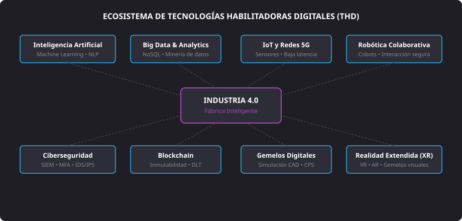
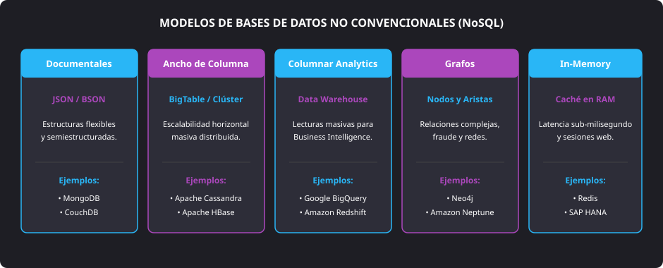

<h1 style="color: #ab47bc;">⚙️ Tema 4 — Características de los Sistemas de Producción y Tecnologías Habilitadoras Digitales (THD)</h1>

<h2 style="color: #29b6f6;">4.1. Tecnologías Habilitadoras Digitales (THD) Actuales</h2>

Las **Tecnologías Habilitadoras Digitales (THD)** son el conjunto de soluciones avanzadas que impulsan la innovación disruptiva y posibilitan la transformación digital en los procesos productivos. Constituyen los pilares de la Industria 4.0 en sectores como la manufactura, sanidad, energía, agricultura y movilidad.

<figure markdown="span">
  
  <figcaption>Figura 4.1 — Interrelación de las Tecnologías Habilitadoras Digitales dentro del modelo de fábrica inteligente.</figcaption>
</figure>

#### 4.1.1. Inteligencia Artificial (IA)
* **Definición:** Capacidad de las máquinas y sistemas informáticos para ejecutar tareas que habitualmente exigen cognición humana (aprendizaje experimental, deducción lógica, procesamiento del lenguaje y reconocimiento de patrones complejos).
* **Disciplinas clave:**
    * **Machine Learning (ML):** Entrenamiento de algoritmos capaces de generalizar y mejorar su precisión operativa a partir de datos empíricos sin requerir programación estricta.
    * **Procesamiento del Lenguaje Natural (NLP):** Modelos que permiten a las computadoras comprender, sintetizar e interactuar utilizando lenguaje humano.
    * **Big Data colaborativo:** Tratamiento de macrodatos estructurados para alimentar modelos predictivos de toma de decisiones.
* **Aplicaciones:** Previsión de demanda, optimización de stock, chatbots de soporte $24/7$, detección de fraude en banca y analítica de personal.

#### 4.1.2. Big Data y Tratamiento de Datos
* **Definición:** Infraestructura de almacenamiento y procesamiento masivo orientada a ingerir, transformar y analizar grandes volúmenes de datos con alta velocidad y variabilidad.
* **Naturaleza de los datos:**
    * **Estructurados:** Tablas relacionales estándar (SQL).
    * **Semiestructurados:** Registros en formatos JSON, XML o logs de servidor.
    * **No estructurados:** Audio, streams de vídeo, imágenes y texto libre.
* **Finalidad:** Detección de patrones de consumo y optimización de cadenas de suministro mediante modelos analíticos avanzados.

#### 4.1.3. Internet de las Cosas (IoT / IIoT)
* **Concepto:** Interconexión de objetos y máquinas físicas dotadas de sensórica, firmware y conectividad IP para monitorizar y gobernar procesos sin intermediación manual.
* **Casos de uso:**
    * **Mantenimiento predictivo:** Detección de vibraciones anómalas y sobrecalentamientos para reparar componentes antes de su rotura física.
    * **Trazabilidad logística:** Monitorización de temperatura, humedad y localización por GPS en transporte de mercancías perecederas.
    * **Eficiencia energética:** Climatización e iluminación inteligente regulada por presencia y costes tarifarios en tiempo real.

#### 4.1.4. Redes de Conectividad 5G
* **Prestaciones frente al estándar 4G LTE:**
    * **Ancho de banda gigabit:** Velocidades punta de hasta $10\text{ Gbps}$.
    * **Latencia sub-milisegundo:** Tiempos de tránsito inferiores a $1\text{ ms}$, críticos para el telecontrol en tiempo real.
    * **Densidad masiva:** Soporte para hasta $10^6\text{ dispositivos/km}^2$, imprescindible para el despliegue de redes de sensores masivos (*mMTC*).
* **Aplicaciones críticas:** Cirugías telemáticas asistidas, cobots industriales sincronizados y vehículos conectados autónomos.

#### 4.1.5. Robótica Colaborativa (Cobótica)
* **Definición:** Autómatas concebidos para compartir espacio físico con personas sin jaulas de seguridad perimetrales.
* **Mecanismos de protección:** Sensores de par articular, bordes sensibles y cámaras estereoscópicas que desaceleran o detienen al cobot de manera instantánea ante una colisión inminente.

#### 4.1.6. Blockchain (Tecnologías de Registro Distribuido - DLT)
* **Arquitectura:** Libro mayor compartido, descentralizado y criptográficamente sellado donde las transacciones se empaquetan en bloques inalterables.
* **Propiedades:**
    * **Descentralización:** Los datos se replican en todos los nodos de la red, suprimiendo puntos únicos de fallo.
    * **Inmutabilidad:** Todo registro convalidado mediante mecanismos de consenso (PoW, PoS) no puede ser modificado ni eliminado retrospectivamente.
* **Aplicaciones:** Trazabilidad de fármacos para evitar falsificaciones, seguimiento de origen en retail alimentario y contratos inteligentes (*smart contracts*).

#### 4.1.7. Ciberseguridad Industrial
* **Pilares de protección:**
    * **Prevención:** Segmentación de redes mediante modelos Zero Trust, cortafuegos industriales y autenticación MFA.
    * **Detección:** Sistemas de correlación de eventos (SIEM) y sondas de intrusión (IDS/IPS).
    * **Respuesta y Recuperación:** Aislamiento de incidentes de *ransomware*, análisis forense y respaldo automatizado en ubicaciones externas inmutables.

#### 4.1.8. Fabricación Aditiva (Impresión 3D)
* **Mecanismo:** Adición de material estrato a estrato (plásticos técnicos, resinas, polvos metálicos) directamente desde ficheros CAD tridimensionales.
* **Ventajas frente a la fabricación sustractiva:** Supresión de utillaje costoso, aligeramiento estructural mediante diseño generativo y erradicación del excedente de mecanizado.

#### 4.1.9. Realidades Inmersivas (Realidad Extendida - XR)
* **Realidad Virtual (RV):** Entorno simulado $100\%$ sintético que aísla visualmente al operario; empleada en simuladores críticos de vuelo y formación de quirófano.
* **Realidad Aumentada (RA):** Inserción de capas de telemetría y guías interactivas directamente sobre la maquinaria real mediante pantallas transparentes o dispositivos móviles.
* **Realidad Mixta (RM):** Interacción física y oclusión espacial precisa entre objetos digitales y herramientas reales.

#### 4.1.10. Gemelos Digitales (Digital Twins)
* **Definición:** Representación computacional dinámica y sincronizada en tiempo real de una máquina, planta o infraestructura.
* **Utilidad:** Evaluación de escenarios de estrés térmico o paradas de línea mediante simulación virtual previa sin perturbar el proceso productivo real.

---

<h2 style="color: #29b6f6;">4.2. Relación entre THD, Productividad y Reducción de Costes</h2>

| Tecnología Habilitadora | Mecanismo de Actuación | Impacto Operativo y Competitivo |
| :--- | :--- | :--- |
| **IA y Automatización (RPA)** | Ejecución no atendida de rutinas y decisiones algorítmicas repetitivas. | Erradica el error humano, trabaja en régimen $24/7$ y reduce los tiempos de ciclo. |
| **IoT y Sensórica Avanzada** | Telemetría continua de parámetros de maquinaria y condiciones ambientales. | Facilita el mantenimiento predictivo, reduce paradas imprevistas y optimiza el consumo de energía. |
| **Big Data e Inteligencia de Negocio** | Modelado prescriptivo y analítica predictiva en tiempo real sobre grandes volúmenes. | Acelera la toma de decisiones basada en datos y personaliza la relación con clientes. |
| **Cloud Computing y Redes** | Aprovisionamiento elástico bajo demanda y entornos colaborativos en la red. | Transforma costes fijos en variables (OpEx), recorta el *time-to-market* y facilita el trabajo distribuido. |

---

<h2 style="color: #29b6f6;">4.3. Sistemas Digitalizados Reales en la Empresa</h2>

Para unificar la operativa departamental, las organizaciones despliegan soluciones integradas de software de gestión:

* **ERP (*Enterprise Resource Planning*):** Columna vertebral que centraliza contabilidad, compras, finanzas, fabricación y ventas en una base de datos única (ej. SAP ERP, Microsoft Dynamics 365, Oracle).
* **CRM (*Customer Relationship Management*):** Seguimiento del ciclo comercial, embudos de venta, fidelización y atención posventa (ej. Salesforce, HubSpot).
* **ECM (*Enterprise Content Management*):** Indexación, versionado, firma digital y archivo seguro de documentos corporativos (ej. Microsoft SharePoint, Alfresco).
* **LMS (*Learning Management System*):** Impartición, seguimiento y certificación de planes de formación técnica (ej. Moodle, Canvas).
* **SCM (*Supply Chain Management*):** Orquestación logística y trazabilidad de pedidos desde el proveedor primario hasta el consumidor final.
* **HRMS (*Human Resources Management System*):** Control horario, gestión de talento, retenciones y confección de nóminas (ej. Workday, BambooHR).

---

<h2 style="color: #29b6f6;">4.4. Sistemas de Almacenamiento No Convencionales (Bases de Datos NoSQL)</h2>

Las bases de datos **NoSQL** (*Not Only SQL*) surgen para superar las limitaciones de concurrencia, rigidez de esquemas y escalabilidad de los motores relacionales clásicos ante los volúmenes masivos de la Industria 4.0.

<figure markdown="span">
  
  <figcaption>Figura 4.2 — Clasificación de los motores de bases de datos no relacionales según su modelo de almacenamiento.</figcaption>
</figure>

#### Principales Familias NoSQL
1. **Orientadas a Documentos:** Guardan la información en estructuras clave-valor jerárquicas auto-descriptivas (JSON, BSON o XML) sin esquemas predefinidos fijos.
    * **Ejemplos destacados:** MongoDB, CouchDB.
2. **Familia de Columnas (*Wide-Column*):** Organizan el almacenamiento por columnas agrupadas en familias, permitiendo lecturas y escrituras distribuidas a gran escala en clústeres.
    * **Ejemplos destacados:** Apache Cassandra, Apache HBase, Google Cloud Bigtable.
3. **Analíticas en Columnas (*Columnar Storage*):** Orientadas al procesamiento analítico en línea (OLAP), comprimiendo y leyendo únicamente las columnas solicitadas en consultas complejas.
    * **Ejemplos destacados:** Amazon Redshift, Google BigQuery, ClickHouse.
4. **Bases de Datos en Grafo:** Representan la información mediante nodos (entidades), aristas (relaciones dirigidas) y propiedades, permitiendo recorrer redes complejas con coste algorítmico mínimo.
    * **Ejemplos destacados:** Neo4j, Amazon Neptune, Azure Cosmos DB (Graph API).
5. **En Memoria RAM (*In-Memory*):** Prescinden del acceso a disco magnético o de estado sólido para operaciones transaccionales, manteniendo los registros en memoria volátil de alta velocidad.
    * **Ejemplos destacados:** Redis, SAP HANA, Memcached.

--8<-- "docs/includes/glosario.md"
