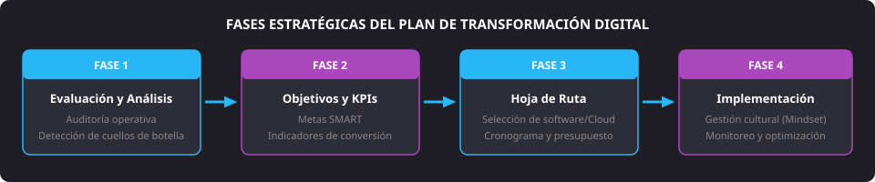
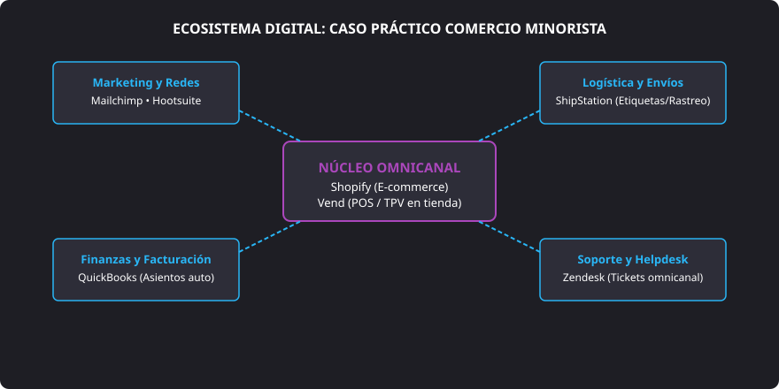

<h1 style="color: #ab47bc;">🚀 Tema 5 — Planes de Transformación</h1>

<h2 style="color: #29b6f6;">5.1. La Transformación Digital: Empresa Clásica vs. Empresa Digital</h2>

### 5.1.1. Concepto de Empresa Digital y Transformación Digital
* **Empresa Digital:** Organización cuyo modelo de negocio, procesos internos e interacciones con el mercado se articulan sobre tecnologías digitales, optimizando de manera continua todas sus áreas funcionales (dirección, finanzas, operaciones, ventas, logística y atención al cliente).
* **Transformación Digital:** Proceso evolutivo y estratégico integral orientado a migrar una estructura tradicional hacia un modelo digitalizado. Supera la mera adquisición de software o hardware, requiriendo una redefinición del modelo organizativo, inversión planificada, formación continua y una evolución del pensamiento cultural corporativo (**mindset**).

---

### 5.1.2. Tabla Comparativa: Empresa Clásica vs. Empresa Digital

| Dimensión | Empresa Clásica / Tradicional | Empresa Digital |
| :--- | :--- | :--- |
| **Estructura** | • Organización jerárquica y piramidal con múltiples niveles. • Toma de decisiones centralizada en la dirección ejecutiva. | • Estructura horizontal y ágil. • Células de trabajo autónomas y autogestionadas (**squads**). • Decisiones descentralizadas basadas en datos (*Data-Driven*). |
| **Departamentos** | • Silos departamentales estancos y aislados. • Procedimientos rígidos de comunicación formal. | • Equipos multidisciplinares coordinados (código, producto, UX). • Adopción de metodologías ágiles (Scrum, Kanban, Lean). |
| **Recursos Humanos** | • Empleo orientado a la permanencia y roles estáticos. • Planes de formación reglada espaciados en el tiempo. | • Flexibilidad de contratación, trabajo en remoto y teletrabajo. • Aprendizaje continuo autodirigido (*lifelong learning*). |
| **Comunicación** | • Flujo descendente y jerárquico (*top-down*). | • Canales abiertos, transparentes, colaborativos y bidireccionales. |
| **Tecnología** | • La informática se concibe como un gasto de soporte secundario. • Alta dependencia de oficinas físicas y servidores locales. | • La tecnología es el activo estratégico central y ventaja competitiva. • Infraestructura 100% en la nube, microservicios y SaaS. |
| **Cultura Corporativa** | • Aversión al riesgo, resistencia al cambio y foco en la estabilidad. | • Cultura de experimentación rápida, tolerancia al error e innovación continua. |

---

<h2 style="color: #29b6f6;">5.2. THD Implicadas en la Digitalización y Relación entre Etapas</h2>

Las **Tecnologías Habilitadoras Digitales (THD)** no actúan como herramientas aisladas, sino como engranajes interconectados a lo largo de toda la cadena de valor empresarial:

* **Inteligencia Artificial y Machine Learning:** Alimentan la toma de decisiones directivas mediante modelos predictivos de rotación de inventarios, estimación de ventas e hiperpersonalización de promociones comerciales.
* **Computación en la Nube (*Cloud Computing*):** Plataforma base escalable que aloja las herramientas de planificación empresarial (**ERP**), gestión de clientes (**CRM**), motores de macrodatos y canales de mensajería instantánea.
* **Análisis de Macrodatos (*Big Data*):** Capacidad analítica que ingiere millones de eventos para detectar patrones ocultos de demanda, optimizar rutas logísticas y definir nuevos productos antes que la competencia.
* **Tecnología Blockchain:** Registros compartidos e inmutables que garantizan la trazabilidad estricta y con certificación criptográfica en cadenas de suministro alimentarias o industriales.
* **Realidad Aumentada (RA):** Fusión visual entre el catálogo digital y el espacio real (probadores virtuales en comercio electrónico, esquemas de montaje interactivo y asistencia guiada para soporte técnico en planta).

---

<h2 style="color: #29b6f6;">5.3. Configuración de la Empresa Digitalizada</h2>

### 5.3.1. Estructura y Nuevos Roles Directivos (*C-Level*)
La organización moderna incorpora figuras directivas orientadas a la gobernanza del dato, el producto y la retención del cliente:

* **CEO (*Chief Executive Officer*):** Director general; lidera la visión estratégica y el rumbo corporativo global.
* **CFO (*Chief Financial Officer*):** Director financiero; gestiona presupuestos, viabilidad económica y control de inversiones de capital.
* **CTO (*Chief Technology Officer*):** Director de tecnología; diseña la arquitectura técnica, la infraestructura de sistemas y la ciberseguridad.
* **CDO (*Chief Data Officer*):** Responsable corporativo de datos; gobierna la calidad, privacidad y explotación analítica de la información.
* **CPO (*Chief Product Officer*):** Director de producto; coordina el diseño funcional y la evolución de los activos digitales.
* **CRO (*Chief Revenue Officer*):** Director de ingresos; alinea las operaciones comerciales, marketing y ventas para optimizar la rentabilidad.
* **CMO (*Chief Marketing Officer*):** Director de marketing; dirige las estrategias de posicionamiento, marca y captación de clientes.
* **COO (*Chief Operating Officer*):** Director de operaciones; asegura el funcionamiento operativo continuo y los procedimientos logísticos.
* **VP de CX (*Customer Experience*):** Vicepresidente de experiencia del cliente; monitoriza la satisfacción, resolución de incidencias y retención.
* **Responsable de Transformación Digital:** Agente de cambio; coordina la implantación de nuevas herramientas técnicas y metodologías de trabajo colaborativo.

---

### 5.3.2. Organización Ágil por Squads y Áreas de Trabajo
Se sustituyen los departamentos estancos por células ágiles multidisciplinares (**squads**) que aúnan perfiles diversos para cumplir objetivos de entrega continua:

* **Tecnología y Desarrollo:** Ingeniería de software, administración de entornos cloud, devops y ciberseguridad.
* **Marketing y Crecimiento:** Optimización de motores de búsqueda (SEO), publicidad digital (SEM), analítica web y redes sociales.
* **Éxito y Atención al Cliente:** Helpdesk técnico, Customer Success y recopilación de retroalimentación de usuario (*feedback*).
* **Diseño y Experiencia (UX/UI):** Arquitectura de la información, prototipado de interfaces y pruebas de usabilidad técnica.
* **Gobierno y Administración:** Asesoría legal, cumplimiento normativo (RGPD/LOPD-GDD) y gestión administrativa.
* **Ciencia de Datos y Analítica:** Minería de datos, mantenimiento de almacenes de datos (*Data Warehouses*) e informes de inteligencia de negocio (**BI**).

---

### 5.3.3. Modelos de Negocio 100% Digitales
* **Comercio Electrónico (*E-commerce*):** Venta directa de productos a través de escaparates digitales con pasarelas de pago y logística integrada.
* **Plataformas de Ecosistema:** Mercados multifacéticos (*marketplaces*) que ponen en contacto a compradores y vendedores cobrando comisiones por transacción (ej. Amazon, plataformas publicitarias).
* **Economía Colaborativa (*Peer-to-Peer*):** Intermediación digital para el aprovechamiento o alquiler temporal de activos compartidos (vehículos, alojamientos).
* **Tecnología Financiera (*Fintech*):** Prestación de servicios bancarios, pasarelas de pago virtuales y microcréditos automatizados mediante software.

---

### 5.3.4. Beneficios Principales de la Digitalización
* Apertura de nuevos canales de venta y detección ágil de nichos de mercado emergentes.
* Toma de decisiones basada estrictamente en métricas verificadas (*Data-Driven*) en lugar de intuiciones.
* Mayor fidelización y personalización en la atención recibida por el usuario.
* Evaluación del rendimiento en tiempo real mediante cuadros de mando con indicadores clave (**KPIs**).
* Reducción sistemática de costes operativos gracias a la automatización de procesos repetitivos.
* Eficiencia energética y sostenibilidad ligadas a la reducción de impresiones físicas y optimización de traslados.

---

<h2 style="color: #29b6f6;">5.4. El Plan de Transformación Digital: Fases y Caso Práctico</h2>

El proceso de modernización empresarial requiere una metodología secuencial rigurosa estructurada en cuatro fases:

<figure markdown="span">
  
  <figcaption>Figura 5.1 — Fases consecutivas para la formulación y despliegue de un Plan de Transformación Digital.</figcaption>
</figure>

#### Fase 1: Evaluación y Análisis Diagnóstico
* **Auditoría interna:** Examen de la infraestructura de hardware, conexiones de red y aplicaciones utilizadas.
* **Detección de cuellos de botella:** Entrevistas con la plantilla para localizar procesos manuales que provocan pérdidas de tiempo o duplicidades (hojas de cálculo inconexas, archivo en papel).

#### Fase 2: Definición de Objetivos Estratégicos
* **Formulación SMART:** Fijación de metas específicas, medibles, alcanzables, relevantes y acotadas en el tiempo (ej. *«Reducir un 40% el tiempo de tramitación de facturas en los próximos 6 meses»*).
* **Selección de KPIs:** Identificación de indicadores directos para medir el avance (tasa de conversión web, coste de adquisición de cliente, tiempo medio de resolución de incidencias).

#### Fase 3: Diseño de la Hoja de Ruta (*Roadmap*)
* **Selección de plataformas:** Elección del catálogo de herramientas de software (SaaS) e infraestructura en la nube adecuadas al presupuesto.
* **Liderazgo y asignación:** Nombramiento de responsables para cada línea de implantación técnica.
* **Cronograma y presupuesto:** Establecimiento de fases de despliegue por trimestres para asegurar una transición progresiva y escalable.

#### Fase 4: Implementación y Gestión del Cambio Cultural
* **Despliegue e integración:** Puesta en producción de los sistemas e interoperabilidad de bases de datos mediante APIs.
* **Gestión del cambio cultural (*Mindset*):** Talleres prácticos para los empleados para disipar el rechazo a la tecnología y fomentar una comunicación abierta.
* **Monitorización y mejora continua:** Revisión mensual de indicadores clave y ajuste de flujos de trabajo según las sugerencias de clientes y personal.

---

### Caso Práctico Real: Digitalización de un Comercio Minorista

<figure markdown="span">
  
  <figcaption>Figura 5.2 — Integración de software en la transformación digital de un comercio minorista.</figcaption>
</figure>

Un comercio tradicional con 4 empleados moderniza su operativa sustituyendo las libretas y hojas de cálculo locales por un ecosistema en la nube interconectado:

* **Plataforma E-commerce:** **Shopify**, permitiendo la apertura del canal de venta online las 24 horas.
* **Gestión de Stock y Ventas Físicas:** **Vend (Lightspeed POS)**, actuando como Terminal Punto de Venta (**POS/TPV**) en la tienda física y sincronizando el stock de almacén con la tienda web para evitar roturas de stock.
* **Marketing Digital:** **Mailchimp** para campañas de correo y promociones, y **Hootsuite** para la gestión programada de redes sociales.
* **Soporte y Atención al Cliente:** **Zendesk**, unificando correos, chats y consultas web en un único panel de incidencias.
* **Logística y Envíos:** **ShipStation**, automatizando la impresión de etiquetas postales y el envío del número de seguimiento al cliente.
* **Finanzas y Facturación:** **QuickBooks**, generando asientos contables y balances fiscales de forma automática a partir de cada venta realizada.

--8<-- "docs/includes/glosario.md"
