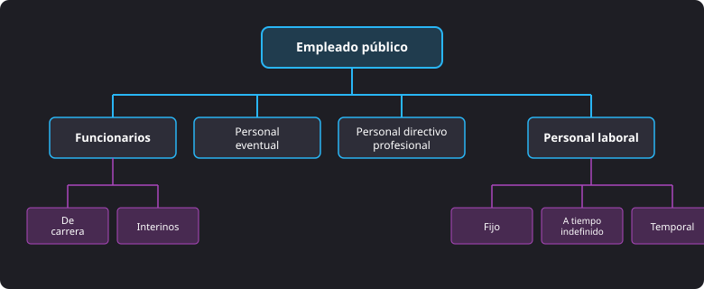
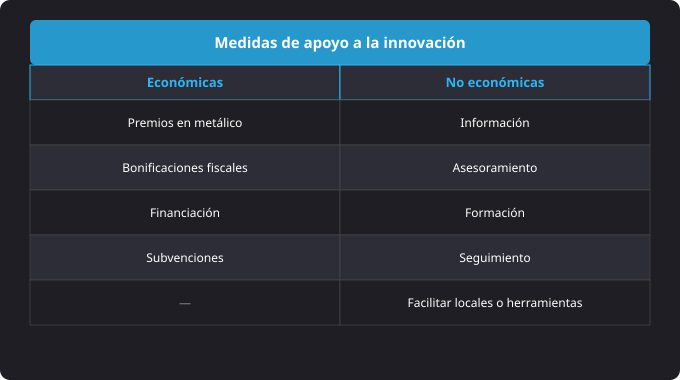
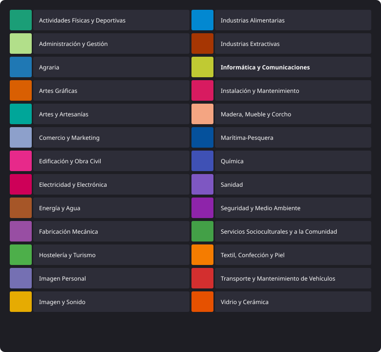

<h1 style="color: #ab47bc;">🏢 Tema 1 — Características del Sector Productivo</h1>

<h2 style="color: #29b6f6;">1.1. Definición y Análisis del Sector Productivo y del Perfil Profesional</h2>

**El Sector Productivo:** Engloba el conjunto de actividades económicas orientadas a la producción de bienes y servicios en una sociedad, dividiéndose en los subsectores agrícola, industrial y de servicios. El estudio del sector productivo requiere analizar el tamaño del mercado (dimensión y capacidad de producción/consumo), el nivel de competencia y sus barreras de entrada/salida, la adopción de tecnología e innovación, los factores económicos generales (inflación, políticas públicas) y las tendencias o necesidades emergentes.

**El Perfil Profesional:** Define el conjunto de conocimientos, destrezas y competencias necesarias para desempeñar adecuadamente un rol dentro del sistema productivo.

#### Componentes del Perfil Profesional:
* **Competencias técnicas:** Conocimientos específicos y habilidades operativas propias del puesto (programación, manejo de maquinaria, etc.).
* **Habilidades blandas:** Capacidades sociales e interpersonales como comunicación, liderazgo, trabajo en equipo y resolución de conflictos.
* **Experiencia laboral:** Trayectoria práctica previa que aporta comprensión de las funciones.
* **Formación académica:** Títulos, certificaciones y estudios requeridos para el desempeño.
* **Adaptabilidad y aprendizaje continuo:** Capacidad de ajuste ante cambios tecnológicos y evoluciones del sector.

**Análisis del Perfil:** Implica evaluar la demanda de perfiles en el mercado, identificar las brechas de competencias entre la oferta y la demanda, y diseñar programas de capacitación y desarrollo profesional.

---

<h2 style="color: #29b6f6;">1.2. Oportunidades Laborales, Áreas de Crecimiento y Tendencias (Yacimientos de Empleo)</h2>

**Yacimiento de Ocupación:** Se define como la posibilidad de crear empleo para satisfacer nuevas necesidades sociales no cubiertas o insuficientemente atendidas por el mercado laboral.

**Factores de Origen:** La aparición de yacimientos depende de tres elementos: los estilos de vida, los servicios disponibles en la sociedad y los regímenes fiscales aplicados. Los cambios familiares, la incorporación de la mujer al trabajo, el avance de las nuevas tecnologías y el incremento del bienestar impulsan la demanda de estos servicios.

#### Ámbitos Destacados de Empleo para Formación Profesional:
* Servicios a domicilio (cuidado de personas, servicio de comidas, compañía).
* Atención a la infancia (guarderías, canguros).
* Tecnologías de la información y la comunicación (TIC).
* Ayuda a jóvenes con dificultades de inserción (fracaso escolar, desempleo).
* Mejoras y rehabilitación de viviendas y bricolaje.
* Servicios de seguridad y localización.
* Transportes colectivos locales adaptados a nuevas tecnologías.
* Comercio de proximidad y alimentación especializada.
* Turismo y desarrollo cultural local (casas rurales, guías).
* Sector audiovisual (vídeo interactivo, procesamiento de imágenes).
* Aprovechamiento de espacios públicos y revalorización del patrimonio.
* Protección del medio ambiente (gestión de residuos, agua y contaminación).

#### Principales Yacimientos en España:
* Servicios vinculados al progresivo envejecimiento de la población.
* Servicios ligados a la protección del medio ambiente y la valoración ecológica.
* Servicios relacionados con las nuevas tecnologías aplicadas al marketing digital.

---

<h2 style="color: #29b6f6;">1.3. Requerimientos del Mercado de Trabajo</h2>

**Conocimientos Requeridos:** Constituyen el conjunto de saberes teóricos y prácticos sobre materias específicas que exige el mercado laboral para cada titulación y puesto de trabajo.

---

<h2 style="color: #29b6f6;">1.4. Características de la Oferta Pública y de la Oferta Privada</h2>

**Oferta Pública de Empleo (OPE):** Convocatoria anual y transparente de las Administraciones Públicas para anunciar las plazas vacantes disponibles en el sector público mediante oposiciones o concursos.

<figure markdown="span">
  
  <figcaption>Figura 1.2 — Clasificación y modalidades de contratación del personal en el sector público.</figcaption>
</figure>

#### Tipos de Empleados Públicos:
* **Funcionarios de carrera:** Personas vinculadas de forma permanente a la Administración mediante nombramiento oficial.
* **Interinos:** Personal contratado de forma temporal por razones de necesidad o urgencia.

#### Requisitos de Acceso a la Función Pública:
* **Nacionalidad:** Española, de un Estado miembro de la UE o de países con tratados de libre circulación (extensible a cónyuges y descendientes dependientes).
* **Edad:** Tener al menos 16 años y no superar la edad de jubilación.
* **Titulación:** Exigida según el cuerpo o escala de la convocatoria.
* **Capacitación:** Poseer la capacidad funcional sin limitaciones que impidan las tareas (con adaptaciones para personas con discapacidad).
* **Habilitación:** No haber sido separado mediante expediente disciplinario de una Administración ni estar inhabilitado para funciones públicas.

**Oferta Privada de Empleo:** Proceso generado por empresas particulares que requiere un papel activo del candidato.

#### Pasos en la Búsqueda de Empleo Privado:
1. **Análisis de la oferta:** Estudio del puesto, condiciones e investigación de la empresa (web, valores) para adaptar el currículum y la carta de presentación.
2. **Proceso de demanda:** Envío de candidaturas, participación en pruebas de selección y realización de la entrevista final.
3. **Conclusión:** Selección y contratación del candidato para cubrir la vacante.

<figure markdown="span">
  
  <figcaption>Figura 1.3 — Clasificación entre medidas económicas y no económicas de apoyo a la innovación empresarial.</figcaption>
</figure>

---

<h2 style="color: #29b6f6;">1.5. Perfil Profesional Exigible en el Sector Público y Privado (Itinerario Formativo)</h2>

**Itinerario Formativo (Perfil Académico):** Trayectoria de aprendizaje ordenada de menor a mayor dificultad. Se compone de:

* **Perfil del estudiante:** Hábitos, técnicas y estrategias de estudio.
* **Perfil de los estudios:** Conjunto de títulos y módulos necesarios para ejercer una profesión.

#### Modalidades de Formación:
* **Formación permanente:** Aprendizaje continuo a lo largo de toda la vida laboral para mantener la competitividad.
* **Formación continua:** Aprendizaje de especialización para perfeccionar habilidades y adaptarse a los cambios del mercado.
* **Vías de impartición:** Presencial, a distancia y mixta.

---

<h2 style="color: #29b6f6;">1.6. Aspectos Requeridos en las Ocupaciones (Aptitudes, Actitudes y Capacidades)</h2>

**Autoanálisis Personal:** Evaluación de capacidades, intereses, aptitudes, actitudes y motivaciones para seleccionar la ocupación adecuada.

**Aptitudes:** Características personales (hereditarias o aprendidas) que condicionan la conducta y facilitan la realización de tareas concretas. Destacan las capacidades intelectuales (razonamiento lógico-abstracto, mecánico, espacial, numérico, verbal, memoria, concentración), motrices, afectivas, manipulativas, artísticas y comunicativas.

**Actitudes:** Predisposición de comportamiento de la persona en el puesto de trabajo (pasiva, dinámica, comprometida, voluntariosa).

#### Tipos de Capacidades en la Empresa:
* **Capacidades Específicas:** Vinculadas a las tareas técnicas individuales de un puesto específico.
* **Capacidades Generales:** Cualidades comunes a cualquier puesto (lealtad, iniciativa, proactividad).
* **Capacidades Transversales:** Competencias altamente valoradas en los técnicos, entre las que destacan el trabajo en equipo, la iniciativa, la comunicación, aprender a aprender, la responsabilidad, la creatividad, el liderazgo, la escucha activa, la flexibilidad, la resolución de conflictos y la resiliencia.
* **Capacidades Técnicas:** Habilidades requeridas según el sector o ámbito profesional concreto.

---

<h2 style="color: #29b6f6;">1.7. Competencias Clave, Cualificaciones Profesionales y el CNCP</h2>

**Cualificación Profesional:** Conjunto de competencias profesionales necesarias para llevar a cabo actividades laborales reconocidas oficialmente mediante un estándar común.

#### Estructura de la Cualificación:
* **Unidad de Competencia:** Agrupación mínima de competencias profesionales susceptible de reconocimiento y acreditación parcial.
* **Módulo Formativo:** Unidad de enseñanza asociada a cada unidad de competencia que describe la formación requerida para adquirirla.

**Sistema Nacional de Cualificaciones y Formación Profesional:** Marco que promueve la integración de la oferta formativa y la acreditación de competencias en España.

#### Catálogo Nacional de Cualificaciones Profesionales (CNCP):
* Instrumento oficial que ordena las cualificaciones susceptibles de acreditación según niveles y familias profesionales.
* Sirve de base para elaborar la oferta formativa de los títulos de FP y certificados de profesionalidad.

**Instituto Nacional de las Cualificaciones (INCUAL):** Organismo encargado de crear, definir y mantener actualizado el CNCP.

#### Estructura del CNCP:
* **26 Familias Profesionales:** Agrupadas según criterios de afinidad de la competencia profesional.
* **3 Niveles de Cualificación:** Clasificados según el grado de conocimiento, autonomía, iniciativa y responsabilidad necesarios: **Nivel 1** (Básico), **Nivel 2** (Medio) y **Nivel 3** (Superior).

<figure markdown="span">
  
  <figcaption>Figura 1.1 — Catálogo de las 26 familias profesionales que componen el CNCP.</figcaption>
</figure>

--8<-- "docs/includes/glosario.md"
