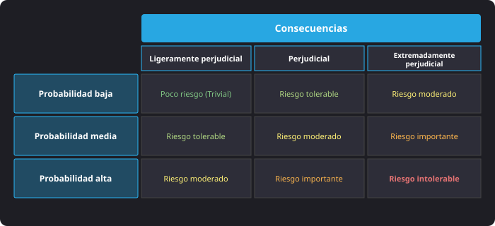
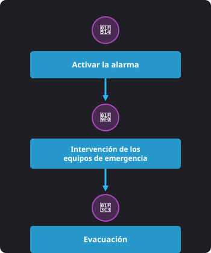
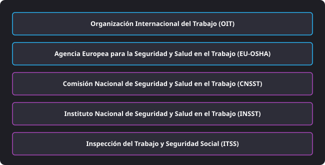
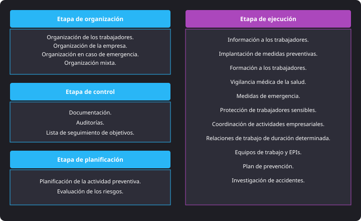
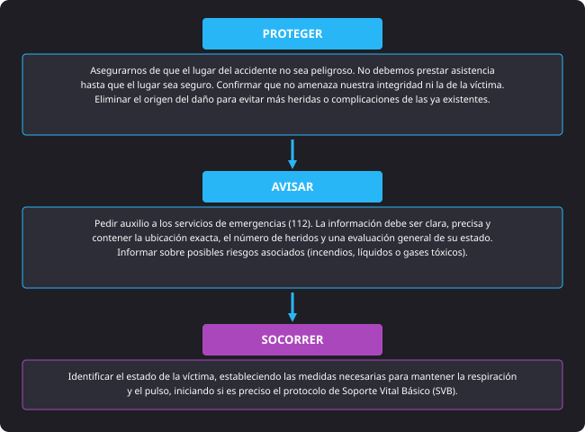

<h1 style="color: #ab47bc;">🛡️ Tema 2 — Competencias Necesarias para el Título de Técnico Básico en Prevención de Riesgos Laborales</h1>

<h2 style="color: #29b6f6;">2.1. El Trabajo y la Salud: Los Riesgos Profesionales y Factores de Riesgo</h2>

* **Riesgo Profesional:** Posibilidad de que un trabajador sufra un daño derivado de las condiciones peligrosas o nocivas de su trabajo.
* **Factor de Riesgo:** Cualquier objeto, sustancia o característica de la organización que contribuye a provocar un daño en la salud.

#### Clasificación de los Factores de Riesgo
* **Estructura y seguridad:** Instalaciones, máquinas, herramientas, riesgos eléctricos e incendios.
* **Medio ambiente de trabajo:** Agentes físicos, químicos y biológicos (polvo, humo, ruido, virus, etc.).
* **Carga de trabajo y factores psicosociales:** Posturas, esfuerzos excesivos, rutina y reparto del trabajo.
* **Circunstancias personales:** Edad, estado de salud u otras condiciones individuales.

**Evaluación de Riesgos (Método del INSST):** Proceso estructurado que identifica los peligros, establece el nivel de deficiencia y calcula la gravedad potencial cruzando la probabilidad de ocurrencia (baja, media, alta) con la severidad de las consecuencias (ligeramente perjudicial, perjudicial, extremadamente perjudicial). Los niveles de riesgo resultantes son: **trivial**, **tolerable**, **moderado**, **importante** e **intolerable**.

<figure markdown="span">
  
  <figcaption>Figura 2.1 — Matriz de evaluación de niveles de riesgo combinando probabilidad y consecuencias (INSST).</figcaption>
</figure>

---

<h2 style="color: #29b6f6;">2.2. Daños, Accidentes y Otras Patologías Derivados del Trabajo</h2>

* **Daño Laboral:** Estado de malestar físico o psíquico derivado de un riesgo no resuelto.
* **Accidente de Trabajo (LGSS):** Toda lesión corporal que el trabajador sufra con ocasión o como consecuencia del trabajo ejecutado por cuenta ajena (y aplicable a autónomos).
    * **Situaciones equiparadas:** Accidentes *in itinere* (al ir o volver del trabajo), en desempeño de cargos sindicales, por órdenes del empresario, en actos de salvamento, enfermedades con causa exclusiva en el trabajo, agravación de dolencias previas y enfermedades intercurrentes derivadas del accidente.
    * **Exclusiones:** Imprudencia temeraria del trabajador y fuerza mayor ajena al trabajo.
* **Accidente blanco (Incidente):** Suceso que no causa lesiones personales pero sí interrupciones o daños materiales.
* **Enfermedad Profesional:** Deterioro gradual y lento de la salud debido a la exposición crónica a situaciones adversas en el trabajo. Exige una relación causal directa y debe estar recogida oficialmente en el cuadro estatal de enfermedades profesionales.

#### Patologías Inespecíficas
Alteraciones no clasificadas como enfermedades profesionales que aparecen o se agravan por el entorno laboral:

* **Fatiga:** Cansancio físico o mental que disminuye la capacidad laboral. Se divide en 3 niveles:
    * **Nivel 1:** Desaparece con reposo.
    * **Nivel 2:** Postración y abatimiento.
    * **Nivel 3:** Trastornos físicos, calambres, pérdida de memoria o fallo cardíaco.
* **Insatisfacción, Estrés y Envejecimiento Prematuro:** Producidos por falta de autonomía, tensión excesiva o desgaste biológico acumulado.
* **Burnout, Boreout y Mobbing:** Alteraciones psicosociales ligadas al desgaste por estrés crónico (*burnout*), aburrimiento extremo (*boreout*) o acoso laboral (*mobbing*).

---

<h2 style="color: #29b6f6;">2.3. Marco Normativo Básico (Ley 31/1995 de PRL)</h2>

* **Principios de la LPRL:** Regula los derechos y deberes preventivos. La responsabilidad directa de la acción preventiva recae sobre el empresario. Su incumplimiento genera responsabilidades administrativas, civiles y penales.
* **Derechos de los Trabajadores:** Recibir equipos de protección individual (EPIs) gratuitos, formación e información, vigilancia de la salud, participación, y capacidad de interrumpir la actividad o abandonar el centro en caso de riesgo grave e inminente.
* **Obligaciones de los Trabajadores:** Usar adecuadamente máquinas, herramientas y EPIs; cumplir las medidas de seguridad; no desactivar dispositivos de protección; e informar de inmediato sobre situaciones de riesgo.
* **Obligaciones del Empresario:** Asumir los costes preventivos, elaborar el Plan de Prevención, evaluar riesgos, planificar la prevención, informar y formar al personal, adoptar medidas de emergencia y proteger a colectivos especialmente sensibles (menores, embarazadas/lactantes, trabajadores temporales o de ETT).

---

<h2 style="color: #29b6f6;">2.4. Riesgos Ligados a las Condiciones de Seguridad</h2>

* **Puestos de Trabajo:** Áreas del centro de trabajo (incluidas zonas de descanso, comedores y primeros auxilios) que deben diseñarse con dimensiones y condiciones ergonómicas y de seguridad adecuadas.
* **Equipos de Trabajo y Maquinaria:** Deben disponer de órganos de accionamiento visibles, puesta en marcha voluntaria, parada prioritaria, resguardos de seguridad y marcado CE para comercialización libre en la UE.

#### Riesgo Eléctrico
* **Contacto Directo:** Tocar partes activas de la instalación en tensión.
* **Contacto Indirecto:** Tocar elementos que han adquirido tensión de forma accidental.

#### Incendios y Extinción
* **Tetraedro del Fuego:** Requiere comburente (oxígeno), combustible, calor y reacción en cadena.
* **Métodos de Extinción:** Segregación (retirar combustible), Sofocación (eliminar oxígeno), Enfriamiento (reducir temperatura) e Inhibición (interrumpir reacción en cadena).

| Clase de Fuego | Tipo de Combustible | Identificación Visual |
| :--- | :--- | :--- |
| **Clase A** | Sólidos orgánicos (madera, papel) | Triángulo verde |
| **Clase B** | Líquidos inflamables (gasolina, aceites) | Cuadrado rojo |
| **Clase C** | Gases (butano, propano) | Círculo azul |
| **Clase D** | Metales combustibles (magnesio, sodio) | Estrella amarilla |
| **Clase F (K)** | Aceites y grasas de cocina | Hexágono con K |

* **Agentes Extintores:** Agua a chorro (solo Clase A; prohibida en electricidad), agua pulverizada, polvo seco (B, C y electricidad), polvo polivalente (A, B, C y electricidad <1000V), $\text{CO}_2$ (ideal para riesgo eléctrico) y acetato de potasio (Clase F).

---

<h2 style="color: #29b6f6;">2.5. Riesgos Ligados al Medio Ambiente de Trabajo</h2>

#### Agentes Físicos
* **Ruido:** Límite normativo de $87\text{ dB}$ en jornada de 8 horas y $140\text{ dB}$ para ruidos de pico.
* **Vibraciones:** Transmitidas a mano-brazo (nivel de acción $2{,}5\text{ m/s}^2$; límite $5\text{ m/s}^2$) o cuerpo entero (nivel de acción $0{,}5\text{ m/s}^2$; límite $1{,}15\text{ m/s}^2$).
* **Iluminación:** Mínimos de $100\text{ lux}$ (exigencia baja), $200\text{ lux}$ (mediana), $500\text{ lux}$ (alta) y $1.000\text{ lux}$ (muy elevada).
* **Temperatura:** Trabajos sedentarios ($17\text{ °C}$ a $27\text{ °C}$); trabajos ligeros u ordinarios ($14\text{ °C}$ a $25\text{ °C}$).
* **Radiaciones:** Ionizantes (rayos X/gamma; producen quemaduras y cáncer) y No ionizantes (UV/infrarroja).

**Agentes Químicos:** Tienen como vía de entrada principal la respiratoria, además de la dérmica, digestiva y parenteral.

#### Agentes Biológicos
Virus, bacterias, hongos, protozoos y parásitos. Se clasifican en 4 grupos según su peligro:

* **Grupo 1:** Poco probable que cause enfermedad.
* **Grupo 2:** Enfermedad poco probable de propagar; existe tratamiento.
* **Grupo 3:** Enfermedad grave con riesgo de propagación; existe tratamiento.
* **Grupo 4:** Enfermedad grave de elevada propagación; **NO** existe tratamiento conocido.

---

<h2 style="color: #29b6f6;">2.6. Carga de Trabajo, Ergonomía y Psicosociología</h2>

* **Carga Física y Mental:** Derivadas de esfuerzos, posturas forzadas o necesidades excesivas de atención. Provocan fatiga crónica y bajada de rendimiento.
* **Factores Psicosociales:** Trabajo por turnos, monotonía, falta de autonomía o estilo de mando. Producen estrés, *burnout*, *boreout* y *mobbing*.

---

<h2 style="color: #29b6f6;">2.7. Sistemas de Control: Prevención vs. Protección y Señalización</h2>

* **Medidas de Prevención:** Actúan sobre el origen del riesgo (seguridad en el trabajo, higiene industrial, ergonomía, psicosociología, política social y medicina laboral).
* **Medidas de Protección:** Reducen el daño cuando el riesgo no se ha eliminado en origen.
    * **Protección Colectiva:** Barandillas, resguardos, redes de seguridad, interruptores diferenciales.
    * **Protección Individual (EPIs):** Gratuitos, con marcado CE.
        * **Categoría 1:** Diseño sencillo, riesgos mínimos (gafas de sol, guantes de jardinería).
        * **Categoría 2:** Protección contra riesgos elevados (cascos, calzado de seguridad, tapones).
        * **Categoría 3:** Diseño complejo contra riesgos mortales o irreversibles (arneses, equipos de respiración). Requieren examen CE de tipo.

#### Señalización de Panel (RD 485/1997)
* **Prohibición:** Redonda, pictograma negro sobre fondo blanco, borde y banda roja.
* **Advertencia:** Triangular, pictograma negro sobre fondo amarillo.
* **Obligación:** Redonda, pictograma blanco sobre fondo azul.
* **Salvamento/Socorro:** Cuadrada/rectangular, pictograma blanco sobre fondo verde.
* **Lucha contra Incendios:** Cuadrada/rectangular, pictograma blanco sobre fondo rojo.

---

<h2 style="color: #29b6f6;">2.8. Planes de Emergencia y Autoprotección</h2>

* **Plan de Emergencia (Art. 20 LPRL):** Obligatorio para todas las empresas con trabajadores por cuenta ajena. Documento interno no registrable.
    * **Clasificación por gravedad:** **Conato de emergencia** (controlable con medios locales), **Emergencia parcial** (requiere equipos del sector) y **Emergencia general/total** (requiere todos los medios propios y ayuda exterior).
    * **Simulacros:** Obligatorios como mínimo una vez al año.
    * **Evacuación:** Incluye equipos de guía, vías señalizadas, punto de reunión y centro de comunicaciones (CCE).
* **Plan de Autoprotección (RD 393/2007):** Obligatorio para actividades con riesgo elevado (Anexo I). Redactado y firmado por un técnico competente, debe revisarse cada 3 años y registrarse administrativamente.

<figure markdown="span">
  
  <figcaption>Figura 2.2 — Secuencia de actuación ante una situación de emergencia en el centro de trabajo.</figcaption>
</figure>

---

<h2 style="color: #29b6f6;">2.9. Vigilancia de la Salud</h2>

* **Características:** Garantizada por el empresario, específica, voluntaria (salvo imperativo legal, necesidad de evaluación o peligro para terceros), confidencial, gratuita y realizada por personal sanitario especializado.
* **Conservación de Registros:** Los historiales médicos por exposición a agentes cancerígenos, biológicos o químicos deben conservarse un mínimo de **40 años** tras finalizar la exposición (*en normativa general suele fijarse en 20-40 años según agente*).

---

<h2 style="color: #29b6f6;">2.10. Organismos Públicos en PRL</h2>

* **Internacional:** Organización Internacional del Trabajo (OIT).
* **Europeo:** Agencia Europea para la Seguridad y Salud en el Trabajo (EU-OSHA, sede en Bilbao).
* **Estatal:**
    * **CNSST (Comisión Nacional):** Órgano colegiado consultivo y asesor.
    * **INSST (Instituto Nacional):** Órgano técnico de estudio, asesoramiento y formación.
    * **ITSS (Inspección de Trabajo):** Vigila el cumplimiento de la norma, asesora y puede ordenar la paralización inmediata de trabajos por riesgo grave e inminente.

<figure markdown="span">
  
  <figcaption>Figura 2.3 — Estructura jerárquica de organismos públicos competentes en prevención de riesgos laborales.</figcaption>
</figure>

---

<h2 style="color: #29b6f6;">2.12. Organización Preventiva y Representación de los Trabajadores</h2>

<figure markdown="span">
  
  <figcaption>Figura 2.4 — Fases organizativas, de planificación, ejecución y control de la actividad preventiva.</figcaption>
</figure>

#### Delegados de Prevención
Elegidos por y entre los representantes del personal:

* **11 a 30 emp.:** 1 (el delegado de personal).
* **31 a 49 emp.:** 1.
* **50 a 100 emp.:** 2.
* **101 a 500 emp.:** 3.
* **501 a 1.000 emp.:** 4 (escala progresiva hasta 8 para más de 4.000 empleados).

**Comité de Seguridad y Salud:** Órgano paritario obligatorio en empresas o centros de trabajo con **50 o más trabajadores**. Se reúne de forma trimestral.

---

<h2 style="color: #29b6f6;">2.13. Planificación y Evaluación de Riesgos</h2>

**Plan de Prevención:** Herramienta para integrar la prevención en la gestión general de la empresa.

#### Acción Preventiva según Riesgo:
* **Trivial:** No requiere acción específica.
* **Tolerable:** Comprobaciones periódicas.
* **Moderado:** Reducir riesgo con inversiones en un plazo determinado.
* **Importante:** Iniciar reducción de forma inmediata.
* **Intolerable:** Paralización inmediata del trabajo hasta reducir el riesgo.

---

<h2 style="color: #29b6f6;">2.14. Primeros Auxilios</h2>

**Protocolo PAS:** **P**roteger (el entorno y la víctima), **A**visar (a emergencias), **S**ocorrer (atender a los heridos).

<figure markdown="span">
  
  <figcaption>Figura 2.5 — Pasos del protocolo de primeros auxilios: Proteger, Avisar y Socorrer.</figcaption>
</figure>

#### Triaje (Tarjetas de Color)
* 🔴 **Rojo (Prioridad I):** Graves recuperables (atención inmediata).
* 🟡 **Amarillo (Prioridad II):** Graves estables (evacuación diferida).
* 🟢 **Verde (Prioridad III):** Leves.
* ⚫ **Negro (Prioridad IV):** Fallecidos o sin posibilidad de supervivencia.

#### Soporte Vital Básico (SVB)
* **Inconsciente + Respira:** Posición Lateral de Seguridad (PLS) (en embarazadas, sobre el costado izquierdo).
* **Inconsciente + NO respira:** Comprobar respiración máximo 10 segundos. Realizar la maniobra frente-mentón (o tracción mandibular si se sospecha lesión cervical).
* **Inconsciente + NO respira + NO tiene pulso:** RCP: 30 compresiones y 2 insuflaciones a ritmo de 100 a 120 compresiones/minuto, hundiendo el esternón entre 5 y 6 cm.

#### Quemaduras
* **1.er grado:** Epidermis (enrojecimiento).
* **2.º grado:** Dermis (ampollas y dolor).
* **3.er grado:** Espesor total (necrosis, sin dolor por destrucción de nervios).
* **Actuación:** Enfriar con agua a temperatura ambiente durante 10 minutos, retirar objetos susceptibles de impedir la circulación, cubrir la zona afectada con paños o apósitos limpios. **NUNCA** romper ampollas ni despegar ropa adherida.

**Hemorragias:** Compresión directa sobre la herida; si falla, compresión arterial (humeral o femoral). El torniquete es el último recurso (aflojar cada 10 minutos e indicar la hora de aplicación). En epistaxis (sangrado nasal), inclinar la cabeza hacia delante y comprimir 5 minutos.

**Maniobra de Heimlich:** Compresiones abdominales rápidas hacia arriba y hacia dentro, por encima del ombligo, en atragantamientos por cuerpo extraño.

<figure markdown="span">
  
  <figcaption>Figura 2.7 — Fases consecutivas para la ejecución de la maniobra de Heimlich en atragantamientos.</figcaption>
</figure>

--8<-- "docs/includes/glosario.md"
