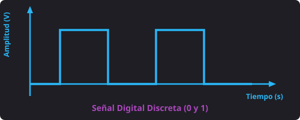
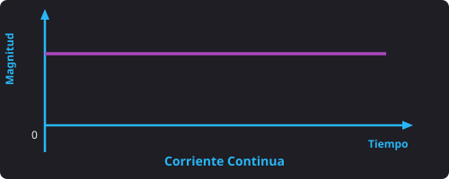
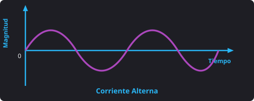
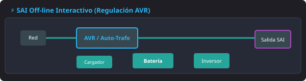
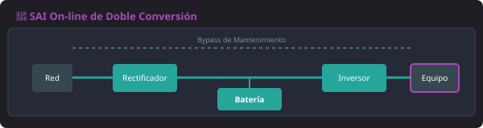

# ⚡ Tema 1 — Medición de Parámetros Eléctricos

## 1. Concepto de Electricidad y Tipos de Señales

- **Electricidad:** Flujo de cargas eléctricas utilizado como fuente de energía para el funcionamiento de los dispositivos que integran un sistema informático.
- **Señales:** Representaciones eléctricas o electromagnéticas de los datos. Se clasifican en:
  - **Analógicas:** Varían de forma **continua** a lo largo del tiempo. Pueden tomar infinitos valores dentro de un rango.
  - **Digitales:** Utilizan un número **discreto y determinado de niveles de tensión constantes** (por ejemplo, dos niveles en las señales binarias: **0** y **1**).

<figure markdown="span">
  
  <figcaption>Figura 1.1 — Representación de una señal digital discreta (niveles 0 y 1).</figcaption>
</figure>

### Métodos de Análisis de Señales
* **Dominio del tiempo:** Analiza las variables temporales de la señal mediante los parámetros de **amplitud**, **frecuencia** y **fase**.
* **Dominio de la frecuencia:** Descompone la señal en sus componentes sinusoidales de distintas frecuencias (mediante la **transformada de Fourier**) para analizar su frecuencia y amplitud.

---

## 2. Magnitudes Eléctricas Básicas y Fórmulas

* **Carga eléctrica:** Exceso o defecto de electrones que posee un objeto debido al flujo de electrones entre átomos. Los átomos se cargan eléctricamente formando **iones** al ganar o perder electrones.
  - **Equivalencia física:** 1 culombio = $6,3 \cdot 10^{18}$ electrones.
* **Voltaje / Tensión eléctrica (V):** 
  - Un átomo con más electrones que protones tiene potencial eléctrico negativo (**ion negativo**).
  - Un átomo con menos electrones que protones tiene potencial eléctrico positivo (**ion positivo**).
  - La **diferencia de potencial** entre dos cuerpos indica la diferencia de cargas entre ellos y se mide en **voltios (V)**. El paso de electrones entre cuerpos constituye la corriente eléctrica.
* **Intensidad (I):** Cantidad de corriente que atraviesa un conductor en un tiempo determinado. Se mide en **amperios (A)** mediante un **amperímetro**.
* **Resistencia (R):** Oposición al paso de la corriente eléctrica. Se mide en **ohmios (Ω)** utilizando un **ohmímetro**.
* **Potencia (P):** Magnitud que relaciona el trabajo realizado con el tiempo invertido en llevarlo a cabo. Se mide en **vatios (W)**.

---

### Formulario Principal (Ley de Ohm y Potencia)

$$I = \frac{V}{R} \quad \iff \quad V = I \cdot R$$

$$P = V \cdot I$$

---

## 3. Tipos de Corriente Eléctrica

* **Corriente Continua o Directa (C.C. / DC):** Flujo de electrones que circula **siempre en la misma dirección** a través de un conductor con tensión constante.

<figure markdown="span">
  
  <figcaption>Figura 1.2 — Comportamiento de la Corriente Continua (D.C.).</figcaption>
</figure>

* **Corriente Alterna (A.C. / AC):** Cambia **periódicamente la polaridad** en los extremos del conductor y el sentido del flujo de electrones, dibujando una onda cíclica que se repite en el tiempo (**periodo**).

<figure markdown="span">
  
  <figcaption>Figura 1.3 — Onda senoidal cíclica de la Corriente Alterna (A.C.).</figcaption>
</figure>

### Parámetros de la Onda de Corriente Alterna
- **Frecuencia (f):** Número de ciclos completos por segundo (se mide en Hertzios, **Hz**). Es el intervalo de corriente desde que la onda pasa por un punto concreto hasta que vuelve a pasar por ese mismo punto.
- **Amplitud:** Distancia máxima entre el punto medio de la onda y su punto más alejado (**cresta** o **valle**).

---

## 4. Instrumentos de Medida y Conexión en Circuito

- **Voltímetro (Medición de Tensión):** Se conecta en **PARALELO** con el componente. En corriente continua (donde existe polarización), se coloca el cable rojo en el polo positivo (+) y el negro en el negativo (-).
- **Amperímetro (Medición de Intensidad):** Se conecta en **SERIE**, lo que exige **abrir el circuito** e intercalar el aparato con el componente.
- **Polímetro / Multímetro:** Dispositivo electrónico capaz de medir distintas magnitudes mediante un conmutador selector (tensiones en AC/DC, intensidades en AC/DC y resistencias).

---

### Análisis de Circuitos Eléctricos

| Propiedad | Circuito en **Serie** (Un único camino) | Circuito en **Paralelo** (Elementos interconectados) |
| :--- | :--- | :--- |
| **Intensidad (I)** | Es la misma en todos los elementos: $I_t = I_1 = I_2 = I_3 = \dots$ | La intensidad total es la suma de las ramas: $I_t = I_1 + I_2 + I_3 + \dots$ |
| **Tensión (V)** | La tensión total es la suma de cada caída: $V_t = V_1 + V_2 + V_3 + \dots$ | Todos los elementos tienen la misma tensión: $V_t = V_1 = V_2 = V_3 = \dots$ |
| **Resistencia (R)** | Suma directa de resistencias: $R_t = R_1 + R_2 + R_3 + \dots$ | Suma inversa de resistencias: $\frac{1}{R_t} = \frac{1}{R_1} + \frac{1}{R_2} + \frac{1}{R_3} + \dots$ |

---

### 📐 Ejercicios Prácticos Resueltos

<h4 style="margin-top:0; color: #ab47bc;">Ejercicio 1: Circuito en Serie</h4>

**Datos:** $V_t = 6\text{ V}$, $R_1 = 10\ \Omega$, $R_2 = 5\ \Omega$, $R_3 = 15\ \Omega$

* **Paso 1: Resistencia Total ($R_t$):**  
  $R_t = R_1 + R_2 + R_3 = 10 + 5 + 15 = \mathbf{30\ \Omega}$
* **Paso 2: Intensidad Total ($I_t$):**  
  $I_t = \frac{V_t}{R_t} = \frac{6\text{ V}}{30\ \Omega} = \mathbf{0,2\text{ A}}$ *(Idéntica en todas las ramas: $I_1 = I_2 = I_3 = 0,2\text{ A}$)*
* **Paso 3: Caídas de Tensión Individuales:**  
  $V_1 = I_1 \cdot R_1 = 0,2 \cdot 10 = \mathbf{2\text{ V}}$  
  $V_2 = I_2 \cdot R_2 = 0,2 \cdot 5 = \mathbf{1\text{ V}}$  
  $V_3 = I_3 \cdot R_3 = 0,2 \cdot 15 = \mathbf{3\text{ V}}$
* **Paso 4: Verificación:**  
  $V_t = V_1 + V_2 + V_3 = 2 + 1 + 3 = \mathbf{6\text{ V}} \quad \checkmark$

<h4 style="margin-top:0; color: #29b6f6;">Ejercicio 2: Circuito en Paralelo</h4>

**Datos:** $V_t = 5\text{ V}$, $R_1 = 10\ \Omega$, $R_2 = 5\ \Omega$, $R_3 = 15\ \Omega$

* **Paso 1: Tensiones Individuales:**  
  Misma tensión en todas las ramas: $V_t = V_1 = V_2 = V_3 = \mathbf{5\text{ V}}$
* **Paso 2: Intensidades Individuales ($I = \frac{V}{R}$):**  
  $I_1 = \frac{5}{10} = \mathbf{0,5\text{ A}}$  
  $I_2 = \frac{5}{5} = \mathbf{1\text{ A}}$  
  $I_3 = \frac{5}{15} \approx \mathbf{0,33\text{ A}}$
* **Paso 3: Intensidad Total ($I_t$):**  
  $I_t = I_1 + I_2 + I_3 = 0,5 + 1 + 0,33 = \mathbf{1,83\text{ A}} \quad \checkmark$

---

## 5. Bloques de una Fuente de Alimentación

La fuente de alimentación conecta el equipo a la red eléctrica y a la placa base, **transformando la corriente alterna (230V AC) en continua (DC)** mediante 4 bloques consecutivos:

1. **Transformador:** Reduces el voltaje de entrada en corriente alterna.
2. **Rectificador:** Convierte la señal alterna en señal pulsante positiva.
3. **Filtro:** Aclara y suaviza la señal mediante condensadores.
4. **Regulador:** Estabiliza la señal filtrada a valores constantes.

---

## 6. Sistemas de Alimentación Ininterrumpida (SAI / UPS)

### Tipos de SAI

#### 1. SAI Standby / Off-line Pasivo
Conectado en paralelo; se activa únicamente cuando se produce un corte de corriente o una caída drástica de tensión.

<figure markdown="span">
  
  <figcaption>Figura 1.4 — Esquema de funcionamiento de un SAI Off-line Pasivo.</figcaption>
</figure>

#### 2. SAI Off-line Interactivo (Line-Interactive)
Incluye un autotransformador de regulación activa (**AVR**) que estabiliza pequeños sobrevoltajes o caídas de tensión sin gastar la reserva de las baterías.

<figure markdown="span">
  
  <figcaption>Figura 1.5 — Esquema de un SAI Interactivo con regulador AVR.</figcaption>
</figure>

#### 3. SAI On-line de Doble Conversión
La corriente alimenta los equipos de forma constante a través del inversor (AC -> DC -> AC). Garantiza cero tiempo de conmutación y aislamiento total de la red eléctrica.

<figure markdown="span">
  
  <figcaption>Figura 1.6 — Esquema de un SAI On-line de Doble Conversión.</figcaption>
</figure>

--8<-- "docs/includes/glosario.md"
