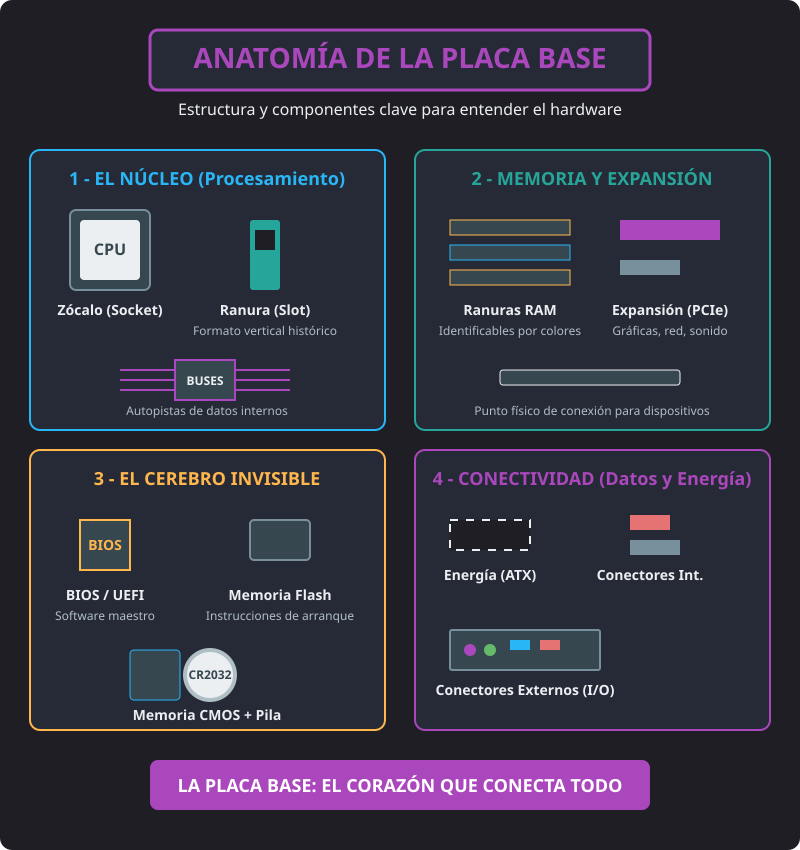

<h1 style="color: #ab47bc;">🖥️ Tema 3 — Identificación de los Bloques Funcionales de un Sistema Microinformático</h1>

<h2 style="color: #29b6f6;">1. Arquitectura General y Funciones de Cada Bloque (Modelo Von Neumann)</h2>

Un equipo informático se estructura físicamente en la **CPU** (***C***entral ***P***rocessing ***U***nit), los **periféricos internos** (dentro de la caja) y los **periféricos externos de entrada/salida** (**E/S** / **I/O** - ***I***nput/***O***utput). Su organización interna sigue el modelo de Von Neumann:

* **CPU (Unidad Central de Proceso):** Núcleo del sistema que integra:
  - **Unidad de Control (**UC** / **CU** - ***C***ontrol ***U***nit):** Interpreta y gestiona las instrucciones.
  - **Unidad Aritmético-Lógica (**ALU** - ***A***rithmetic ***L***ogic ***U***nit):** Realiza los cálculos matemáticos y las operaciones lógicas.
* **Placa base:** Circuito impreso principal anclado al chasis que interconecta físicamente todos los componentes del ordenador.
* **Microprocesador:** Circuito integrado encargado de ejecutar las instrucciones del sistema.
* **Memoria Principal (**RAM** - ***R***andom ***A***ccess ***M***emory):** Almacena y traslada temporalmente los datos e instrucciones en uso hacia el procesador.
* **Buses del sistema:** Conjunto de líneas eléctricas que conectan la **CPU**, la memoria y la **E/S**.
* **Subsistema de Entrada/Salida y Periféricos:**
  - **Periféricos internos:** Dispositivos de almacenamiento masivo secundario (**HDD** - ***H***ard ***D***isk ***D***rive, **SSD** - ***S***olid ***S***tate ***D***rive) y unidades ópticas (**CD**, **DVD**, **Blu-ray**).
  - **Periféricos externos (E/S):** Dispositivos de comunicación usuario-máquina (monitor, teclado, ratón).
* **Reloj del sistema:** Genera los impulsos eléctricos para sincronizar las operaciones de todos los componentes.

---

<h2 style="color: #29b6f6;">2. Reconocimiento de la Arquitectura de Buses</h2>

Los buses son las vías de comunicación compuestas por líneas de circuitos impresos o cables por donde circula la información entre los distintos bloques del equipo:

### Tipos de Señales Gestionadas por los Buses
- **Bus de Datos:** Transporta la información o valores numéricos entre componentes.
- **Bus de Direcciones:** Indica la posición física exacta de memoria o dispositivo al que se desea acceder.
- **Bus de Control:** Transporta las órdenes de mando y señales de sincronización del reloj.

### Principales Buses de Expansión (Slots)
* **ISA** (***I***ndustry ***S***tandard ***A***rchitecture): Bus estándar introducido por IBM en el PC AT; actualmente obsoleto.
* **PCI** (***P***eripheral ***C***omponent ***I***nterconnect): Estándar de expansión **Plug and Play (**PnP**)** que interactúa con la **BIOS** para la asignación automática de recursos.
* **AGP** (***A***ccelerated ***G***raphics ***P***ort): Bus dedicado exclusivamente a tarjetas de vídeo para gráficos 3D.
* **PCI-Express (**PCI-E** / **PCIe**):** Interfaz serie de alta velocidad moderna que sustituye a **PCI** y **AGP**.

---

<h2 style="color: #29b6f6;">3. Características de la Placa Base y Componentes</h2>

La **placa base** es el elemento determinante para comprobar las compatibilidades físicas y electrónicas de todo el equipo.

<figure markdown="span">
  
  <figcaption>Figura 3.1 — Estructura y componentes clave de la Placa Base: Procesamiento, Memoria, Control y Conectividad.</figcaption>
</figure>

> 🔌 **Tecnología Plug and Play (PnP):**
> Permite la configuración automática de las tarjetas de expansión mediante la interacción de tres factores: **Dispositivos PnP** (se autoidentifican), **BIOS PnP** (inicializa los componentes durante el arranque) y **Sistema Operativo PnP** (asigna recursos y controladores).

### Factor de Forma
Define las dimensiones físicas, orientación, conectores, puntos de anclaje, zócalos y tipo de fuente de alimentación requerida.
- **Factores más usuales:** **ATX**, **Micro ATX**, **Mini ITX**, **DTX** y **BTX**.

### Componentes Principales
- **Zócalo del microprocesador:** Lugar donde se conecta el procesador para interactuar con la placa.
- **Ranuras para Memoria RAM:** Conectores **DIMM** (***D***ual ***I***n-line ***M***emory ***M***odule) específicos según el tipo de memoria.
- **Ranuras de expansión (slots):** Huecos para insertar tarjetas adicionales.
- **Conectores de energía:** Tomas donde se conecta el cableado de la fuente de alimentación.
- **Conectores internos y externos:** Puertos **SATA**, **USB**, audio y panel trasero.
- **BIOS / UEFI y Memoria CMOS:** Software de base y memoria de configuración básica.

---

<h2 style="color: #29b6f6;">4. Dispositivos Integrados en Placa y Software de Base</h2>

### Conexión del Microprocesador
- **Zócalo (socket):** Conector plano matrizado formado por un gran número de orificios/contactos sobre el que se apoya el procesador.
- **Ranura (slot):** Conector vertical donde el procesador se inserta de forma perpendicular a la placa base.

### Evolución del Chipset
- **Puente Norte (**Northbridge**):** Conectaba directamente los componentes de alta velocidad (procesador, memoria RAM y bus gráfico PCIe/AGP).
- **Puente Sur (**Southbridge**):** Gestionaba los periféricos y buses más lentos (USB, discos SATA, audio, PCI).
- **PCH** (***P***latform ***C***ontroller ***H***ub): En placas modernas, las funciones del Northbridge se integran dentro del propio procesador y el Southbridge evoluciona al PCH.

### Software de Base y Sistema de Arranque
* **ROM BIOS** (***R***ead ***O***nly ***M***emory ***B***asic ***I***nput-***O***utput ***S***ystem / Memoria Flash): Memoria no volátil leíble y borrable eléctricamente. Contiene las rutinas básicas de comunicación **E/S**, ejecuta el test inicial **POST** (***P***ower-***O***n ***S***elf-***T***est) y el cargador de arranque (**Bootstrap Loader**).
* **UEFI** (***U***nified ***E***xtensible ***F***irmware ***I***nterface): Evolución moderna de la BIOS con interfaz gráfica, soporte para ratón, particiones **GPT** (***G***UID ***P***artition ***T***able) superiores a 2 TB y arranque seguro (**Secure Boot**).
* **Memoria CMOS** (***C***omplementary ***M***etal ***O***xide ***S***emiconductor): Almacena la configuración de los recursos del sistema, la fecha y la hora. Se alimenta continuamente mediante una pila (**CR2032**).

### Ámbito de los Buses
1. **Internos:** Comunican las distintas unidades dentro de un propio chip o integrado.
2. **Externos:** Comunican las unidades situadas sobre la placa base.
3. **Expansión:** Comunican la placa base con los dispositivos periféricos a través de ranuras (**ISA**, **PCI**, **PCIe**).

---

<h2 style="color: #29b6f6;">5. Características de los Microprocesadores</h2>

El microprocesador constituye, junto a la placa base, el núcleo principal de la **CPU**.

### Velocidad de Reloj
Se mide en megahercios (**MHz**) o gigahercios (**GHz**, $1 \text{ GHz} = 1.000 \text{ MHz}$).
- **Velocidad interna:** Frecuencia a la que trabaja el microprocesador internamente.
- **Velocidad externa / del bus (**FSB** - ***F***ront ***S***ide ***B***us):** Frecuencia a la que se comunica con la placa base.

### Alimentación y Voltajes
- **Voltaje externo (E/S):** Tensión para la comunicación eléctrica entre el procesador y la placa base.
- **Voltaje interno (núcleo / core):** Tensión de trabajo del núcleo, reducida para minimizar la temperatura.

### Memoria Caché
Memorias ultrarrápidas de baja capacidad integradas cerca del núcleo organizadas en niveles **L1** (interna), **L2** y **L3**.

---

<h2 style="color: #29b6f6;">6. Control de Temperatura y Refrigeración</h2>

Para evitar errores de funcionamiento o el quemado del chip, se emplean sistemas de refrigeración por aire:

- **Disipador (**heatsink**):** Elemento metálico pasivo fabricado con materiales de alta conductividad térmica (aluminio y cobre) que absorbe el calor por contacto y lo transfiere al aire.
- **Ventilador (**fan** / **cooler**):** Elemento activo que fuerza la circulación rápida de aire sobre el disipador. Se conecta a la placa en la toma de energía **CPU_FAN**.

---

<h2 style="color: #29b6f6;">7. Memorias Principales: La Memoria RAM y sus Tipos</h2>

La **RAM** (***R***andom ***A***ccess ***M***emory) es la memoria principal de lectura y escritura; es **volátil** porque requiere energía constante. Permite el acceso aleatorio directo a cualquier celda.

- **Parámetros de trabajo:** Refresco (recarga eléctrica periódica), Transferencia de datos, Frecuencia del bus e Índice PC.
- **Tecnología Dual Channel:** Permite al controlador de memoria acceder simultáneamente a dos módulos de memoria RAM de 64 bits, sumando un ancho de banda total de **128 bits** al colocarlos en los zócalos DIMM emparejados del mismo color.

| Tipo de RAM | Características Clave |
| :--- | :--- |
| **DRAM** (***D***ynamic ***R***AM) | Económica; requiere **refresco periódico constante**. Más lenta que la SRAM. |
| **SDRAM** (***S***ynchronous ***D***RAM) | Síncrona con el reloj del sistema para lectura y escritura en ráfagas. |
| **DDR-SDRAM** (***D***ouble ***D***ata ***R***ate) | Transfiere datos en el **flanco de subida y de bajada** del ciclo de reloj. |
| **DDR2 / DDR3** | Reducen progresivamente el voltaje de trabajo y aumentan la frecuencia. |
| **DDR4** | Mayor frecuencia y tasa de transferencia. Incompatible físicamente con versiones anteriores. |
| **DDR5** | Duplica el ancho de banda y la tasa de transferencia respecto a DDR4, reduciendo el consumo. |
| **SRAM** (***S***tatic ***R***AM) | Memoria estática que **no necesita refresco constante**; ultrarrápida y de elevado coste (usada en cachés). |

---

<h2 style="color: #29b6f6;">8. Almacenamiento Secundario Masivo</h2>

Almacenamiento no volátil, permanente, de gran capacidad y menor coste por megabyte que la **RAM**.

### Discos Magnéticos (HDD)
- **Geometría:** Platos/caras (*sides*), pistas (*tracks*), cilindros (*cylinders*) y sectores (*sectors*).
- **Sistemas de Direccionamiento:**
  - **CHS** (***C***ylinder-***H***ead-***S***ector): $\text{Capacidad} = \text{Cilindros} \times \text{Caras} \times \text{Sectores/pista} \times \text{Tamaño del sector}$.
  - **LBA** (***L***ogical ***B***lock ***A***ddressing): Enumera consecutivamente todos los sectores. $\text{Capacidad} = \text{Sectores totales} \times \text{Tamaño del sector}$.
- **Búfer / Caché del Disco:** Memoria intermedia (**DRAM**) para acelerar las lecturas.

### Dispositivos Ópticos
Graban información creando microhoyos (*pits*) mediante un haz láser.
- **Soportes:** Solo lectura (**CD-ROM**), una sola grabación (**DVD-R**, **DVD+R**) y reescribibles (**CD-RW**, **DVD+RW**).
- **CD:** Capacidad estándar de $700 \text{ MB}$. Velocidad base $1x = 150 \text{ KB/s}$ (ej. $72x = 10.800 \text{ KB/s}$). Funciona en modo **CLV** (***C***onstant ***L***inear ***V***elocity) o **CAV** (***C***onstant ***A***ngular ***V***elocity).
- **DVD:** Láser rojo de menor longitud de onda ($4,7 \text{ GB}$ a $17 \text{ GB}$). Opciones de doble capa y doble cara.
- **Blu-ray (BD):** Láser azul/violeta de longitud de onda reducida ($>100 \text{ GB}$ en discos multicapa).

### Memorias en Estado Sólido (SSD) e Híbridos (SSHD)
- **SSD** (***S***olid ***S***tate ***D***rive): Utilizan chips electrónicos no volátiles (**EEPROM** / Flash) sin partes móviles.
- **Formatos de Tarjetas Flash:** **CF** (***C***ompact ***F***lash), **MS** (***M***emory ***S***tick), **SD** (***S***ecure ***D***igital) y **SDHC** (***S***ecure ***D***igital ***H***igh ***C***apacity).
- **Discos Híbridos (SSHD):** Combinan platos magnéticos tradicionales con un búfer de memoria flash.

---

<h2 style="color: #29b6f6;">9. Adaptador Gráfico y Monitor</h2>

La tarjeta gráfica procesa la información que se muestra en la pantalla. Puede estar integrada en el procesador o ser una tarjeta de expansión independiente.

- **GPU** (***G***raphics ***P***rocessing ***U***nit): Procesador dedicado al cálculo de gráficos 2D y 3D en paralelo.
- **VRAM** (***V***ideo ***R***andom ***A***ccess ***M***emory): Memoria de vídeo dedicada (**SRAM** o **DDR**, $2 \text{ GB}$ a $8 \text{ GB}$).
- **Librerías Gráficas:** **OpenGL** (estándar abierto) y **Microsoft DirectX**.
- **Conectores de Salida:** **VGA** (***V***ideo ***G***raphics ***A***rray - analógico), **RCA** y **HDMI** (***H***igh-***D***efinition ***M***ultimedia ***I***nterface - vídeo y audio digital).
- **Interfaz de Expansión:** **AGP**, **PCI** y **PCIe**.

---

<h2 style="color: #29b6f6;">10. Otras Tarjetas de Expansión</h2>

- **Tarjeta Capturadora de Vídeo:** Convierte vídeo analógico a digital. Conectores **BNC**, **S-Video** y **RCA**.
- **Tarjeta Sintonizadora de Televisión:** Sintoniza y graba canales de TV (analógica, digital, híbrida, satélite).
- **Tarjeta de Sonido:**
  - *Parámetros:* Polifonía y canales envolventes (ej. 5.1, donde `.1` indica el *subwoofer*).
  - *Componentes:* Búfer, Sintetizador (**MIDI**), **DSP** (***D***igital ***S***ignal ***P***rocessor) y conversores **ADC** / **DAC**.
  - *Conectores:* **MiniJack**, **RCA**, **S/PDIF**, **GamePort** y **MIDI**.

---

<h2 style="color: #29b6f6;">11. Conectividad LAN y WAN</h2>

- **LAN** (***L***ocal ***A***rea ***N***etwork): Red privada local de extensión reducida.
- **MAN** (***M***etropolitan ***A***rea ***N***etwork): Red pública municipal o entre varios edificios.
- **WAN** (***W***ide ***A***rea ***N***etwork): Red de gran alcance geográfico (Internet).
- **Tarjeta de Red (**NIC** - ***N***etwork ***I***nterface ***C***ard):**
  - **Dirección MAC** (***M***edia ***A***ccess ***C***ontrol): Dirección física única e inalterable grabada de fábrica.
  - **Conexión:** Cableada (**RJ45**) e inalámbrica (**Wi-Fi**).

---

<h2 style="color: #29b6f6;">12. Controladores de Dispositivos (Drivers)</h2>

- **Driver / Controlador:** Software imprescindible facilitado por el fabricante que permite al **Sistema Operativo** reconocer, interpretar y gestionar el funcionamiento de un componente hardware.

--8<-- "docs/includes/glosario.md"
