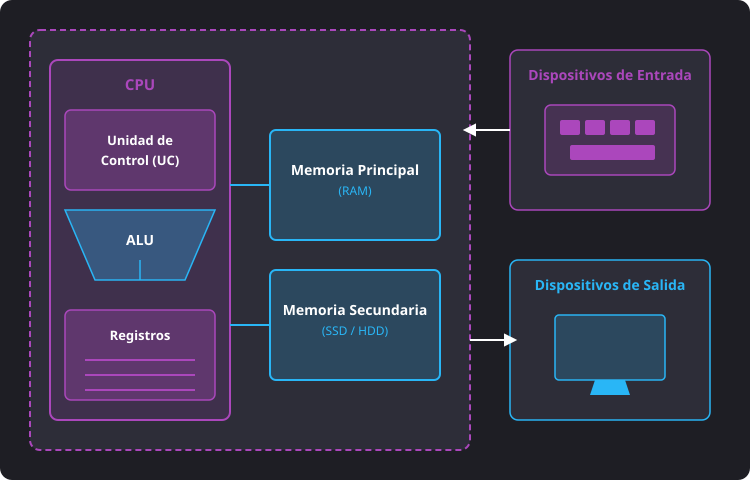
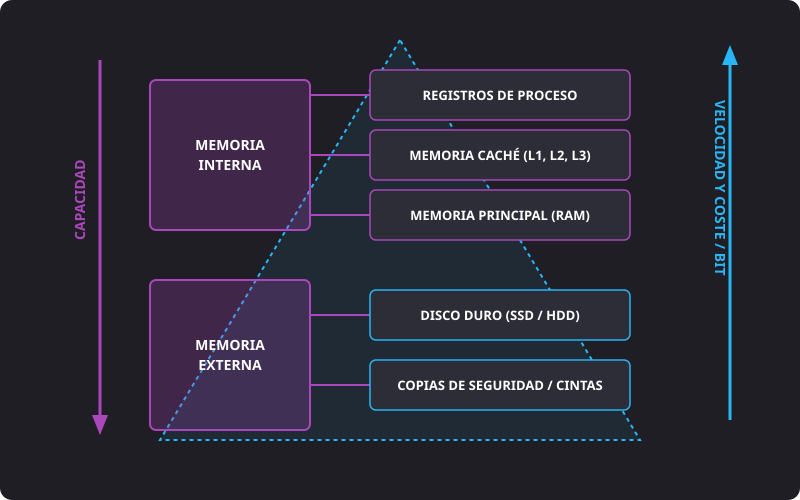
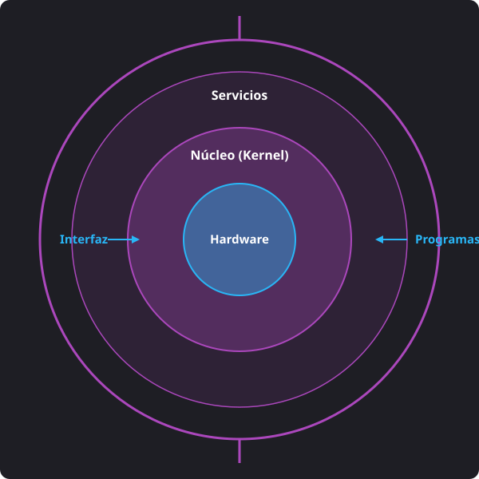
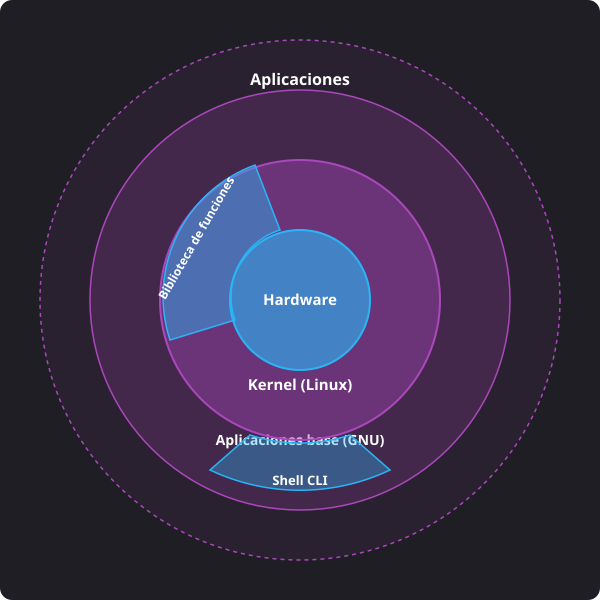
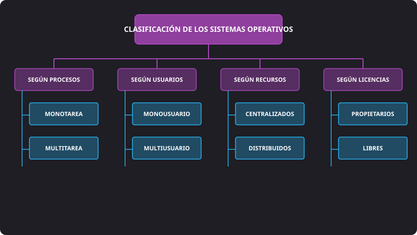

<h1 style="color: #ab47bc;">⚙️ Tema 1 — Caracterización de los Sistemas Operativos, Tipos y Aplicaciones</h1>

<h2 style="color: #29b6f6;">1. El Sistema Informático: Componentes Físicos y Lógicos</h2>

Un **sistema informático** es un conjunto ordenado de elementos interrelacionados diseñado para almacenar, procesar y recuperar información de manera automatizada. Se estructura en tres pilares fundamentales:

* **Hardware:** Componentes físicos y tangibles del sistema (circuitos electrónicos, microprocesadores, módulos de memoria y periféricos).
* **Software:** Componentes lógicos o intangibles (el sistema operativo, controladores y aplicaciones informáticas).
* **Usuarios:** Factor humano que interactúa con el sistema, divididos entre usuarios finales y personal técnico (desarrolladores, administradores de sistemas y personal de mantenimiento).

---

### Clasificación de los Sistemas Informáticos

#### A. Por su ámbito de uso
* **Uso específico:** Diseñados para ejecutar una tarea o conjunto de tareas muy concreto (ej. sistemas embebidos en electrodomésticos, unidades de electromedicina o centralitas de automoción).
* **Uso general:** Diseñados para ejecutar una amplia variedad de aplicaciones según las necesidades cambiantes del usuario (ordenadores personales, servidores, portátiles).

#### B. Por el procesamiento de datos (Taxonomía de Flynn)
* **SISD** (*Single Instruction, Single Data*): Una instrucción, un dato. Flujo de ejecución secuencial en un único procesador tradicional.
* **SIMD** (*Single Instruction, Multiple Data*): Una instrucción, múltiples datos. Aplica la misma operación sobre diferentes conjuntos de datos vectoriales en paralelo (común en GPU).
* **MISD** (*Multiple Instruction, Single Data*): Múltiples instrucciones, un dato. Varias unidades funcionales realizan distintas operaciones sobre un único flujo de datos (poco frecuente, usado en sistemas con redundancia crítica).
* **MIMD** (*Multiple Instruction, Multiple Data*): Múltiples instrucciones, múltiples datos. Múltiples núcleos o procesadores independientes ejecutan instrucciones distintas sobre datos diferentes de forma asíncrona.

#### C. Por el tipo de computadora
- **Estaciones de trabajo (**Workstations**):** Equipos de alto rendimiento optimizados para tareas de diseño técnico, procesado de imagen/vídeo o desarrollo.
- **Macrocomputadoras (**Mainframes**):** Sistemas orientados al procesamiento masivo de datos transaccionales con alta disponibilidad y tolerancia a fallos.
- **Minicomputadoras:** Equipos de gama media situados entre los ordenadores personales y las macrocomputadoras.
- **Supercomputadoras:** Clústeres de alto rendimiento diseñados para cálculos científicos y simulaciones complejas.
- **Terminales ligeros (**Thin Clients**):** Equipos con hardware mínimo que dependen casi en su totalidad de un servidor central para procesar datos y ejecutar programas.

---

### Componentes Físicos (Hardware)

El **hardware** se divide según su ubicación y cometido dentro del equipo:
- **Componentes internos:** Elementos alojados en el interior del chasis o caja del ordenador (placa base, **CPU**, memoria **RAM**, disco duro, tarjeta gráfica y fuente de alimentación).
- **Periféricos:** Dispositivos externos conectados a las interfaces de la placa base que extienden las capacidades de entrada, salida o almacenamiento del sistema.

---

### Arquitectura de Von Neumann

Modela la estructura física interna de un computador interconectando sus unidades funcionales primarias:

<figure markdown="span">
  
  <figcaption>Figura 1.1 — Arquitectura de Von Neumann y flujo de componentes.</figcaption>
</figure>

1. **CPU (Unidad Central de Procesamiento):** Núcleo del equipo donde se gestionan las operaciones:
   - **Unidad de Control (**UC**):** Lee e interpreta las instrucciones guardadas en la memoria principal y coordina la ejecución secuencial enviando señales de mando.
   - **Unidad Aritmético-Lógica (**ALU**):** Ejecuta las operaciones matemáticas (+, -, *, /) y comparaciones lógicas (AND, OR, NOT) sobre los datos presentes en los registros procesadores.
2. **Memoria:**
   - **Memoria Principal:** Almacenamiento primario volátil de alta velocidad donde residen los datos e instrucciones que la CPU procesa activamente.
   - **Memoria Secundaria / Masiva:** Dispositivos no volátiles permanentes (discos mecánicos **HDD**, unidades de estado sólido **SSD**).

---

### Jerarquía de Memorias

Se organiza jerárquicamente bajo tres premisas físicas: **capacidad**, **velocidad de acceso** y **coste por bit**. Cuanto más cerca está una memoria de la CPU, mayor es su velocidad y coste por megabyte, pero menor es su capacidad.

<figure markdown="span">
  
  <figcaption>Figura 1.2 — Jerarquía de memorias según capacidad, velocidad y coste por bit.</figcaption>
</figure>

#### Memoria Interna (Alta velocidad / Capacidad reducida)
- **Registros del procesador:** Celdas de memoria situadas en el interior de la propia **CPU**. De acceso instantáneo y volátiles.
- **Memoria Caché (**SRAM**):** Almacena copias de las instrucciones y datos de la **RAM** usados con más frecuencia. Se organiza en 3 niveles:
  - **Caché L1:** Integrada directamente en el núcleo de la CPU (dividida en L1 Datos y L1 Instrucciones).
  - **Caché L2:** Interna pero fuera del núcleo primario (también dividida en Datos e Instrucciones).
  - **Caché L3:** De mayor capacidad que L1/L2 y compartida por todos los núcleos del microprocesador.
- **Memoria RAM (**DRAM**):** Memoria de trabajo del sistema operativo. Es volátil:
  - **SRAM** (*Static RAM*): Estática; no requiere refresco eléctrico constante. Muy rápida pero costosa.
  - **DRAM** (*Dynamic RAM*): Dinámica; requiere un ciclo continuo de **refresco eléctrico** para mantener la carga de sus condensadores. Mientras se realiza el refresco, la celda no puede ser leída.

!!! info "Efecto de Saturación de RAM y Memoria Virtual"
    Cuando la memoria **RAM** física se agota al ejecutar muchas aplicaciones a la vez, el **Sistema Operativo** utiliza un fichero especial o partición dentro del almacenamiento masivo (disco duro o SSD) conocido como **Memoria Virtual** o *fichero de paginación*. Al ser el disco significativamente más lento que la RAM, el rendimiento global del sistema cae de forma acusada.

---

### Interconexión de la CPU: Buses del Sistema

Canales formados por pistas de circuito impreso o cables físicos que transportan señales eléctricas:

- **Bus de Datos:** Canal bidireccional por el que fluye la información real intercambiada entre la **CPU**, la memoria y los dispositivos.
- **Bus de Direcciones:** Canal unidireccional que lleva la dirección física de memoria o del puerto E/S al que la CPU desea acceder.
- **Bus de Control:** Canal que transmite las órdenes de mando, interrupciones y señales de sincronización del reloj emitidas por la **Unidad de Control**.

---

### Componentes Lógicos (Software)

Conjunto de instrucciones estructuradas encargadas de dirigir la operación del hardware. Se clasifica en:

1. **Software de Aplicación:** Programas orientados a la productividad o entretenimiento del usuario final (procesadores de texto, navegadores web, suites informáticas, videojuegos).
2. **Software de Programación:** Herramientas orientadas a los desarrolladores para crear nuevo software (compiladores, intérpretes, entornos **IDE** y editores de código).
3. **Software de Sistema / Software Base:** Programas de bajo nivel diseñados para gestionar el hardware y ofrecer un marco estable a las aplicaciones de usuario (sistemas operativos, herramientas de diagnóstico y drivers).

---

### Firmware de Base: BIOS vs. UEFI

El **firmware** es un bloque de software de bajo nivel grabado directamente en memorias de solo lectura (**ROM** / Flash) en la placa base que controla el hardware al nivel más elemental.

| Característica | **BIOS** Tradicional (*Legacy*) | **UEFI-BIOS** (*Unified Extensible Firmware Interface*) |
| :--- | :--- | :--- |
| **Arquitectura** | Ejecución limitada a 16 bits | Soporta arquitecturas de 32 y 64 bits de forma nativa |
| **Interfaz de Usuario** | Modo texto en 80x25 columnas (solo teclado) | Interfaz gráfica de alta resolución (navegable con ratón y teclado) |
| **Capacidad de Disco** | Soporte para particionado **MBR** (máx. 2 TB por disco) | Soporte para particiones **GPT** (discos de más de 2 TB) |
| **Seguridad de Arranque** | Sin validación de firma en arranque | Incluye **Secure Boot** (bloquea código sin certificado digital) |
| **Tiempo de Arranque** | Lento debido al POST secuencial estricto | Arranque optimizado y paralelizado ultra rápido |

#### Fases de Trabajo del Firmware durante el Encendido
1. **Fase 1 (Inicialización):** Suministro de energía a los circuitos y lectura del chip ROM.
2. **Fase 2 (**POST** - *Power-On Self-Test*):** Test automático inicial donde comprueba la presencia y salud de la **CPU**, la **RAM**, la tarjeta de vídeo y los teclados/discos. Si falla, emite combinaciones de pitidos auditivos o códigos de error en pantalla.
3. **Fase 3 (Carga del Sistema):** Localiza el dispositivo de almacenamiento configurado como prioridad de arranque e inicia el cargador de SO (**BootLoader**).

---

<h2 style="color: #29b6f6;">2. El Sistema Operativo</h2>

El **Sistema Operativo (SO)** es el software base esencial que actúa de intermediario entre el hardware físico del equipo y los programas que ejecuta el usuario, abstrayendo la complejidad de la máquina mediante interfaces estándar.

### Elementos y Estructura Elemental del Sistema Operativo

* **Núcleo (**Kernel**):** Componente central y crítico en contacto directo con el hardware. Es responsable de asignar memoria, priorizar operaciones y permitir un acceso seguro a los dispositivos.
* **Intérprete de Comandos (**Shell**):** Entorno encargado de traducir las instrucciones introducidas por el usuario (en texto mediante comandos o a través de menús gráficos) en llamadas que el **Kernel** pueda entender.
* **Sistema de Archivos:** Organización lógica encargada de estructurar los datos dentro de las unidades de almacenamiento. Divide el disco en sectores o bloques y realiza el seguimiento de qué bloques corresponden a cada archivo (ejemplos: **FAT32**, **NTFS**, **ext4**, **APFS**).

---

<h2 style="color: #29b6f6;">3. Funciones del Sistema Operativo y Gestión de Recursos</h2>

El **SO** actúa como un administrador de recursos eficiente. Sus cometidos principales incluyen:

1. **Gestión del Procesador (**CPU**):** Reparte el tiempo de cálculo entre los procesos activos utilizando algoritmos de planificación (*scheduling*).
2. **Gestión de la Memoria Principal (**RAM**):** Asigna y libera rangos de memoria a cada aplicación en ejecución. Si la RAM escasea, gestiona la paginación a **memoria virtual**.
3. **Gestión de la Entrada/Salida (**E/S**):** Administra el flujo de datos que entra y sale hacia los periféricos mediante **controladores de dispositivos (drivers)**.
4. **Gestión de Procesos:** Crea, suspende, reanuda o destruye los procesos del sistema, asegurando que un error en una aplicación no colapse el resto del equipo.
5. **Gestión de Permisos y Seguridad:** Autentica usuarios y limita el acceso a archivos y recursos mediante permisos de **lectura (*r*)**, **escritura (*w*)** y **ejecución (*x*)**.
6. **Gestión del Sistema de Archivos:** Permite operaciones de lectura, creación, modificación, renombrado y borrado de carpetas y ficheros.

!!! note "¿Qué es un Proceso?"
    Un **proceso** es la representación activa de un programa en ejecución. Incluye el código ejecutable en memoria, sus variables de trabajo, el contador de programa y los recursos asignados por el sistema operativo.

---

<h2 style="color: #29b6f6;">4. Arquitectura del Sistema Operativo</h2>

Los sistemas operativos estructuran su **Kernel** siguiendo distintos modelos arquitectónicos:

<figure markdown="span">
  
  <figcaption>Figura 1.3 — Estructura concéntrica de capas de un Sistema Operativo.</figcaption>
</figure>

| Tipo de Núcleo | Funcionamiento | Ventajas | Desventajas | Ejemplos |
| :--- | :--- | :--- | :--- | :--- |
| **Monolítico** | Todos los servicios (drivers, sistemas de archivos, memoria) se ejecutan dentro del espacio del núcleo. | Máxima velocidad y elevado rendimiento. | Si un driver falla, todo el sistema operativo colapsa (pantallazo azul/panic). | Linux, MS-DOS, Unix tradicional. |
| **Micronúcleo** (*Microkernel*) | El núcleo se reduce al mínimo (comunicación e hilos). El resto corre en espacio de usuario. | Alta modularidad, portabilidad y máxima estabilidad. | Menor velocidad por el intercambio continuo de mensajes. | Minix, QNX, Symbian. |
| **Híbrido** | Estructura modular tipo micronúcleo, pero ejecutando ciertos servicios clave dentro del espacio del núcleo para ganar velocidad. | Buen equilibrio entre estabilidad y rendimiento. | Complejidad de diseño. | Windows NT/10/11, macOS. |
| **Exonúcleo** (*Exokernel*) | El núcleo solo protege la asignación de hardware. Las funciones avanzadas se delegan a librerías de aplicación. | Gran adaptabilidad para software especializado. | Complejidad para aplicaciones convencionales. | Nemesis, ExOS. |

En los sistemas basados en GNU/Linux, la arquitectura se organiza mediante capas concéntricas donde cada nivel abstrae la complejidad del nivel inferior:

<figure markdown="span">
  
  <figcaption>Figura 1.4 — Arquitectura concéntrica del sistema GNU/Linux y relación entre el Kernel, la biblioteca de funciones (glibc) y las utilidades GNU.</figcaption>
</figure>

* **Hardware (Centro):** Componentes físicos sobre los que se ejecuta todo el sistema.
* **Kernel (Linux):** Núcleo encargado de gestionar los recursos de hardware de forma segura.
* **Biblioteca de funciones (`glibc`):** Conjunto de funciones estándar que permiten a las aplicaciones comunicarse con las llamadas al sistema del Kernel.
* **Aplicaciones base (GNU) y Shell CLI:** Herramientas e intérprete de comandos esenciales para la administración del sistema.
* **Aplicaciones:** Software de usuario final (navegadores, ofimática, etc.).

---

<h2 style="color: #29b6f6;">5. Evolución Histórica y Sistemas Operativos Actuales</h2>

### Hitos Históricos Clave

- **Década de 1940:** Primeras computadoras sin sistema operativo. La programación se realizaba directamente conectando cables o con tarjetas perforadas en código máquina.
- **Década de 1960:** Nace **Multics**, sistema operativo multitarea y multiusuario escrito en lenguajes de alto nivel que sentó las bases de los sistemas operativos modernos.
- **Década de 1980 (Inicio de la Informática Personal):**
  - **MS-DOS (1982):** Desarrollado por Microsoft a partir de QDOS. Sistema monousuario y monotarea con núcleo monolítico operado exclusivamente mediante comandos de texto (**CLI**).
  - **Mac OS (1984):** Lanzado por Apple para Macintosh. Primer sistema comercial masivo con **Interfaz Gráfica de Usuario (GUI)** y control mediante ratón.
- **Década de 1990:**
  - **Windows 95:** Integró la interfaz gráfica de usuario de forma nativa en la línea doméstica de Microsoft y popularizó la tecnología **Plug and Play**.
  - **Nacimiento de GNU/Linux (1991):** Linus Torvalds combina el núcleo Linux escrito en C con las herramientas libres del proyecto **GNU** impulsado por Richard Stallman.
- **Década de 2000 en adelante:**
  - **Windows XP (2001):** Unificó la línea profesional (Windows NT) y la doméstica (Windows 9x) en una única plataforma sólida basada en núcleo híbrido.
  - **macOS (Mac OS X):** Reescritura del sistema operativo de Apple basado en un entorno Unix de alta seguridad y rendimiento gráfico.

---

### Panorama Actual de Sistemas Operativos Móviles

- **Android (2008):** Sistema operativo móvil de código abierto desarrollado bajo el patrocinio de Google, respaldado por un **kernel Linux**. Es la plataforma móvil más utilizada del planeta.
- **iOS (2007):** Sistema operativo cerrado de Apple desarrollado en exclusiva para la gama iPhone. Destaca por su alta integración hardware-software y optimización energética.
- **Windows Phone:** Sistema operativo de Microsoft para smartphones cuyo desarrollo oficial finalizó debido a la baja cuota de mercado frente al binomio Android/iOS.

---

<h2 style="color: #29b6f6;">6. Clasificación de los Sistemas Operativos</h2>

Los sistemas operativos se encuadran en función de sus capacidades operativas:

#### A. Por la cantidad de tareas simultáneas
* **Monotarea:** Solo pueden ejecutar un proceso al mismo tiempo. Para iniciar una nueva tarea, la anterior debe haber concluido o ser cerrada manualmente (ej. **MS-DOS**).
* **Multitarea:** Capaces de repartir el tiempo de **CPU** entre múltiples programas activos al mismo tiempo mediante alternancia rápida de hilos.

#### B. Por la cantidad de usuarios simultáneos
* **Monousuario:** Un único usuario tiene acceso a las aplicaciones del sistema en un momento dado (ej. sistemas domésticos antiguos o móviles).
* **Multiusuario:** Múltiples usuarios pueden iniciar sesión, ejecutar programas y compartir el hardware del equipo simultáneamente garantizando el aislamiento de sus datos privados.

#### C. Por la ubicación de los recursos de hardware
* **Centralizados:** El procesador, las memorias y los dispositivos de almacenamiento masivo residen físicamente en un único equipo local.
* **Distribuidos:** Los recursos de computación y almacenamiento están repartidos entre múltiples máquinas físicas conectadas mediante una red de datos, comportándose visualmente ante el usuario como un único sistema.

#### D. Por su modelo de licenciamiento
* **Propietarios / Privativos:** Licencias comerciales donde el fabricante restringe la copia, modificación o redistribución del software, ocultando su código fuente (ej. **Windows**, **macOS**).
* **Libres / Código Abierto:** Garantizan la libertad de usar el programa con cualquier fin, inspeccionar su código fuente, modificarlo y distribuir copias libremente (ej. **GNU/Linux**, **FreeBSD**).

<figure markdown="span">
  
  <figcaption>Figura 1.6 — Mapa conceptual de la clasificación de sistemas operativos por tareas, usuarios, arquitectura de recursos y licenciamiento.</figcaption>
</figure>

---

<h2 style="color: #29b6f6;">7. Sistemas Transaccionales y Procesamiento por Lotes</h2>

### Sistemas Transaccionales

Son sistemas de información altamente optimizados para procesar transacciones bancarias, reservas de billetes o tiendas online con absoluta integridad sin perder información en caso de fallo técnico.

!!! example "El Criterio ACID en Sistemas Transaccionales"
    Para que un sistema operativo o base de datos sea considerado **transaccional**, debe garantizar estrictamente las 4 propiedades **ACID**:

    - **A — Atomicidad (*Atomicity*):** La transacción es indivisible. O se completan todas sus operaciones con éxito o no se aplica ninguna (operación "*todo o nada*").
    - **C — Consistencia (*Consistency*):** Garantiza que la información pasa de un estado válido e íntegro a otro estado válido, respetando las reglas impuestas en el sistema.
    - **I — Aislamiento (*Isolation*):** La ejecución simultánea de múltiples transacciones no provoca interferencias ni lecturas erróneas entre ellas.
    - **D — Durabilidad (*Durability*):** Una vez que una transacción ha sido confirmada, sus datos quedan guardados de forma permanente aunque se produzca un corte de luz en el servidor.

--8<-- "docs/includes/glosario.md"
