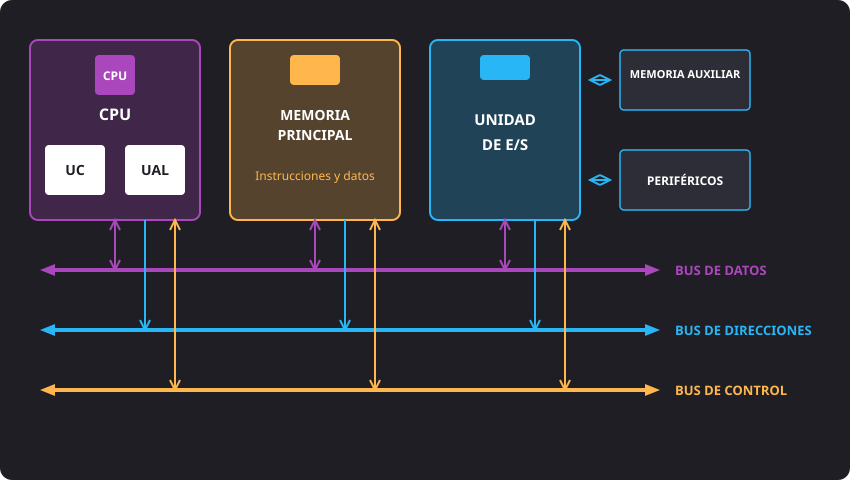
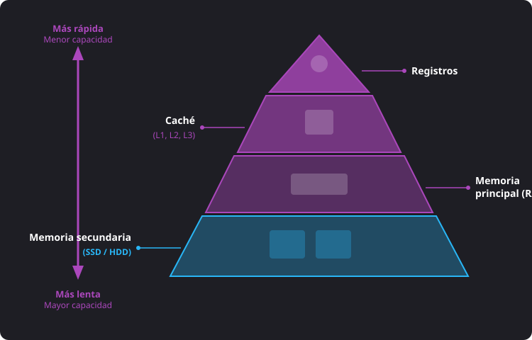
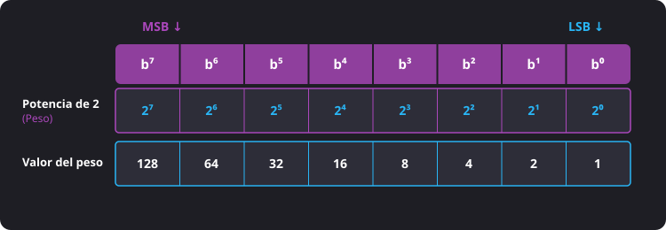
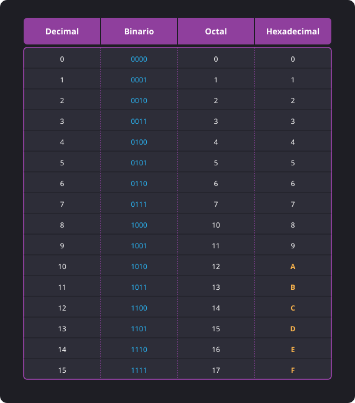

<h1 style="color: #ab47bc;">⚙️ Tema 1 — Caracterización de los Sistemas Operativos</h1>

<h2 style="color: #29b6f6;">1.1. El Sistema Informático</h2>

La palabra *informática* deriva de los términos **información automática**, que significa procesar o automatizar la información de forma electrónica.

Un **sistema informático** es el conjunto de elementos físicos, lógicos y humanos que trabajan de forma coordinada para almacenar, procesar y transmitir información. Actualmente, este concepto abarca desde ordenadores personales tradicionales hasta smartphones, tabletas, servidores, consolas, Smart TVs y sistemas embebidos.

---

### Componentes del Sistema Informático

* **Hardware:** Parte física y tangible del sistema informático (placa base, procesador, memoria RAM, discos de almacenamiento, periféricos).
* **Software:** Parte lógica e intangible. Formada por programas, instrucciones y datos que permiten controlar el hardware y realizar tareas.
* **Firmware:** Software especializado grabado en memoria no volátil dentro de un dispositivo hardware encargándose de su funcionamiento básico a bajo nivel (ej. BIOS o UEFI).
* **Usuarios:** Elemento humano necesario para utilizar, configurar, administrar, mantener y desarrollar los sistemas informáticos.

---

<h2 style="color: #29b6f6;">1.2. Arquitectura de Von Neumann</h2>

Propuesta en 1945 por John Von Neumann, su característica fundamental es que **los datos y las instrucciones se almacenan en la misma memoria principal**, permitiendo que el procesador acceda a ambos de forma secuencial.

---

### Elementos Funcionales

<figure markdown="span">
  
  <figcaption>Figura 1.1 — Esquema de la arquitectura de Von Neumann y buses del sistema.</figcaption>
</figure>

#### 1. CPU (Unidad Central de Procesamiento)
Cerebro del ordenador encargado de interpretar y ejecutar las instrucciones:
* **Unidad de Control (**UC** / *Control Unit*):** Dirige y coordina las operaciones enviando señales a través del bus de control.
* **Unidad Aritmético-Lógica (**ALU** / *Arithmetic Logic Unit*):** Realiza las operaciones matemáticas y lógicas (comparaciones).

#### 2. Memoria Principal (RAM)
Espacio de trabajo temporal y volátil que necesita la **CPU** para ejecutar programas y gestionar datos en tiempo real mediante memoria **RAM** (*Random Access Memory*).

#### 3. Bus del Sistema
Conexiones eléctricas para la comunicación entre componentes:
* **Bus de datos:** Transporta información (datos e instrucciones). Es **bidireccional**.
* **Bus de direcciones:** Transporta la dirección física de memoria donde se leerá o escribirá. Es **unidireccional**.
* **Bus de control:** Transporta las señales de mando enviadas por la **Unidad de Control**.

#### 4. Unidad de Entrada/Salida (E/S) y Periféricos
* **Periféricos de Entrada:** Introducen datos en el sistema (teclado, ratón, escáner).
* **Periféricos de Salida:** Muestran los resultados procesados (monitor, impresora, altavoces).
* **Periféricos de Entrada/Salida (Bidireccionales):** Envían y reciben información (pantalla táctil, impresora multifunción, tarjeta de red).

#### 5. Dispositivos de Almacenamiento Secundario
Medios permanentes no volátiles que mantienen los datos sin corriente eléctrica (**SSD**, **HDD**).

---

### Jerarquía de Memorias

Organizada según velocidad, capacidad y coste:

<figure markdown="span">
  
  <figcaption>Figura 1.2 — Jerarquía de memoria de un sistema informático.</figcaption>
</figure>

1. **Registros del procesador:** Memorias más rápidas y de menor capacidad situadas dentro del propio chip de la **CPU**.
2. **Memoria Caché:** Ultra rápida, situada entre la **CPU** y la **RAM**:
   * **L1:** Integrada en el propio núcleo del procesador (dividida en L1 Datos y L1 Instrucciones).
   * **L2:** Interna pero fuera del núcleo primario.
   * **L3:** De mayor capacidad y compartida entre distintos núcleos.
3. **Memoria RAM:** Memoria principal volátil.
4. **Memoria Auxiliar / Secundaria:** Almacenamiento permanente no volátil a largo plazo (**SSDs**, **HDDs**).

!!! info "Memoria Virtual / Swap"
    Si la memoria **RAM** física se satura, el **Sistema Operativo** recurre a la **Memoria Virtual** (fichero de paginación o espacio *swap*) en el disco duro, provocando una ralentización notable en el rendimiento general.

---

### El Ciclo de Instrucción

Proceso repetitivo mediante el cual la **CPU** ejecuta cada instrucción a través de 4 fases:

1. **Búsqueda (*Fetch*):** La CPU lee desde la memoria principal la siguiente instrucción.
2. **Decodificación (*Decode*):** La Unidad de Control interpreta y traduce la instrucción.
3. **Ejecución (*Execute*):** La CPU (vía ALU u otros bloques) realiza la operación.
4. **Almacenamiento (*Store*):** Se guardan los resultados en memoria o se envían a la salida.

---

### Ventajas y Limitaciones

* **Ventajas:** Simplicidad de diseño (memoria unificada), flexibilidad y economía de fabricación.
* **Cuello de Botella de Von Neumann:** Al compartir un único bus para datos e instrucciones, la CPU y la memoria no pueden transferir ambos elementos simultáneamente.
* **Soluciones modernas:** Uso de memorias caché integradas, ejecución segmentada (*pipeline*), procesadores multinúcleo y ejecución simultánea de instrucciones.

---

<h2 style="color: #29b6f6;">1.3. El Software de un Sistema Informático</h2>

Conjunto de programas, instrucciones y datos intangibles que hacen funcionar al sistema informático.

### Tipos de Software

1. **Software de Aplicación:** Programas para realizar tareas concretas de usuario final (hojas de cálculo, navegadores web, Zoom).
2. **Software de Desarrollo:** Herramientas empleadas por programadores para crear, probar y mantener programas (compiladores, IDEs, editores de código).
3. **Software de Sistema / Base:** Programas que gestionan y controlan el hardware (sistemas operativos, drivers, utilidades de diagnóstico).

---

### Licencias de Software

Contrato legal que establece las condiciones de uso, modificación y distribución:

* **Software Propietario (Privativo):** Código fuente no disponible públicamente. Licencia comercial que limita su uso y prohíbe la modificación o redistribución.
* **Software Libre:** Garantiza las 4 libertades fundamentales:
  * **Libertad 0:** Utilizar el programa para cualquier propósito.
  * **Libertad 1:** Estudiar el funcionamiento y adaptarlo (requiere acceso al código fuente).
  * **Libertad 2:** Distribuir copias para ayudar a otros.
  * **Libertad 3:** Modificar el programa y publicar mejoras a la comunidad.
* **Freeware:** Uso gratuito cuyo código fuente sigue siendo del desarrollador. No se puede modificar ni redistribuir libremente.
* **Shareware:** Permite probar el programa de forma limitada (en tiempo o funciones) antes de adquirir la licencia comercial completa.

---

### Normativa Legal

* **Propiedad Intelectual:** Derechos reconocidos por ley a los creadores sobre sus obras. Los programas informáticos están protegidos legalmente al mismo nivel que las obras literarias.
* **Derechos de Autor (*Copyright*):** Protegen al desarrollador frente a copias, distribuciones o usos no autorizados.
* **Auditorías de Software:** Revisiones en entornos corporativos para comprobar la legalidad de las licencias y evitar sanciones.

---

<h2 style="color: #29b6f6;">1.4. El Sistema Operativo</h2>

Software principal que actúa como intermediario entre el hardware y el usuario, administrando los recursos del equipo.

### Elementos y Estructura

* **Núcleo (**Kernel**):** Componente central cargado permanentemente en RAM que se comunica directamente con el hardware.
* **Intérprete de Comandos (**Shell**):** Traduce las órdenes del usuario al Kernel. Puede ser en modo texto (**CLI**: CMD, PowerShell, Bash) o interfaz gráfica (**GUI**).
* **Sistema de Archivos:** Organiza y gestiona la información en los dispositivos mediante carpetas (directorios) y archivos (ficheros).

---

### Panorama de Sistemas Operativos Actuales

| Sistema Operativo | Tipo de Licencia | Ámbito / Uso | Sistema de Archivos por Defecto |
| :--- | :--- | :--- | :--- |
| **Microsoft Windows** | Propietario | Windows 11 (Doméstico) / Windows Server 2025 (Servidores) | **NTFS** (permisos, cifrado, cuotas, tolerancia a fallos) |
| **macOS** | Propietario | Ordenadores Mac (Apple) | **APFS** (optimizado para SSDs) |
| **GNU/Linux** | Libre / Código Abierto | Escritorio, servidores y supercomputación (Distros: Ubuntu, Debian, Fedora) | **ext4** |
| **iOS / iPadOS** | Propietario | Dispositivos móviles Apple (iPhone / iPad) | **APFS** |
| **Android** | Código Abierto (Google/AOSP) | Smartphones, tablets y Smart TVs (basado en Kernel Linux) | **ext4** / **f2fs** |
| **ChromeOS** | Propietario / Abierto | Chromebooks (Google, optimizado para la nube) | **ext4** |

---

<h2 style="color: #29b6f6;">1.5. La Representación de la Información</h2>

Internamente, un ordenador procesa señales eléctricas representadas en código binario ($0$ y $1$).

### Conceptos Clave

* **Bit (*Binary Digit*):** Unidad mínima de información ($0$ = apagado / $1$ = encendido).
* **Byte (u Octeto):** Secuencia ordenada de **8 bits**. Unidad básica de almacenamiento direccionable en memoria **RAM**. Permite $2^8 = 256$ combinaciones (del $0$ al $255$).
  * **LSB** (*Least Significant Bit* / Bit Menos Significativo): Bit situado más a la derecha (peso $2^0 = 1$).
  * **MSB** (*Most Significant Bit* / Bit Más Significativo): Bit situado más a la izquierda (peso $2^7 = 128$).
* **Palabra:** Conjunto de $n$ bits que el procesador maneja simultáneamente (32 bits o 64 bits). Una arquitectura de 64 bits maneja palabras de **8 bytes** a la vez.

<figure markdown="span">
  
  <figcaption>Figura 1.3 — Estructura de un byte y peso posicional de sus bits (MSB / LSB).</figcaption>
</figure>

---

### Escala de Medidas de Información (Potencias de Base 2)

* **Byte (B):** $2^0 = 1 \text{ Byte}$
* **KiloByte (KB):** $2^{10} = 1.024 \text{ Bytes}$
* **MegaByte (MB):** $2^{20} = 1.048.576 \text{ Bytes}$
* **GigaByte (GB):** $2^{30} = 1.073.741.824 \text{ Bytes}$
* **TeraByte (TB):** $2^{40} = 1.099.511.627.776 \text{ Bytes}$
* **PetaByte (PB):** $2^{50} \text{ Bytes}$
* **ExaByte (EB):** $2^{60} \text{ Bytes}$
* **ZettaByte (ZB):** $2^{70} \text{ Bytes}$
* **YottaByte (YB):** $2^{80} \text{ Bytes}$

---

<h2 style="color: #29b6f6;">1.6. Sistemas de Numeración</h2>

Conjunto de símbolos y reglas utilizados para representar cantidades numéricas.

* **Sistemas No Posicionales:** El valor del símbolo es fijo y no depende de la posición (ej. sistema romano).
* **Sistemas Posicionales:** El valor depende del símbolo y de su posición en la base $b$. Las cifras válidas van desde $0$ hasta $b - 1$.

---

### Teorema Fundamental de la Numeración (TFN)

Permite calcular el valor decimal de cualquier número expresado en un sistema posicional de base $b$:

$$N = \dots + (a_2 \cdot b^2) + (a_1 \cdot b^1) + (a_0 \cdot b^0)$$

Donde $N$ es el valor decimal, $b$ es la base del sistema, $a$ es el dígito y la posición se cuenta de derecha a izquierda comenzando por cero.

---

### Bases Utilizadas en Informática

* **Decimal (Base 10):** Cifras $0$ al $9$. Uso cotidiano.
* **Binario (Base 2):** Cifras $0$ y $1$. Uso interno en circuitos digitales.
* **Octal (Base 8):** Cifras $0$ al $7$. Cada cifra octal equivale exactamente a **3 bits** ($8 = 2^3$).
* **Hexadecimal (Base 16):** Cifras $0$ al $9$ y letras **A, B, C, D, E, F** ($10$ al $15$). Cada cifra hexadecimal equivale exactamente a **4 bits** ($16 = 2^4$). Se utiliza en direcciones de memoria, colores web, direcciones MAC y programación.

<figure markdown="span">
  
  <figcaption>Figura 1.4 — Correspondencia entre los sistemas decimal, binario, octal y hexadecimal.</figcaption>
</figure>

---

### Resumen de Métodos de Conversión

| Conversión | Método Utilizado |
| :--- | :--- |
| **Cualquier base $\rightarrow$ Decimal** | **Teorema Fundamental de la Numeración:** Multiplicar cada dígito por la potencia posicional de la base origen. |
| **Decimal $\rightarrow$ Cualquier base** | **Divisiones sucesivas** entre la base de destino; leer el último cociente seguido de los restos en orden inverso (de abajo a arriba). |
| **Binario $\rightarrow$ Octal** | Agrupar los bits de **3 en 3** desde la derecha y convertir cada bloque a su dígito octal. |
| **Octal $\rightarrow$ Binario** | Sustituir cada cifra octal por su equivalente directo en **3 bits binarios**. |
| **Binario $\rightarrow$ Hexadecimal** | Agrupar los bits de **4 en 4** desde la derecha y convertir cada bloque a su carácter hexadecimal. |
| **Hexadecimal $\rightarrow$ Binario** | Sustituir cada carácter hexadecimal por su equivalente directo en **4 bits binarios**. |
| **Octal $\leftrightarrow$ Hexadecimal** | Usar el **sistema binario como paso intermedio** (pasar a bits de 3 en 3 y luego reagrupar de 4 en 4, o viceversa). |

--8<-- "docs/includes/glosario.md"
