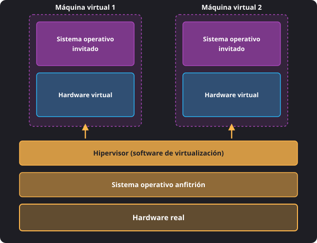
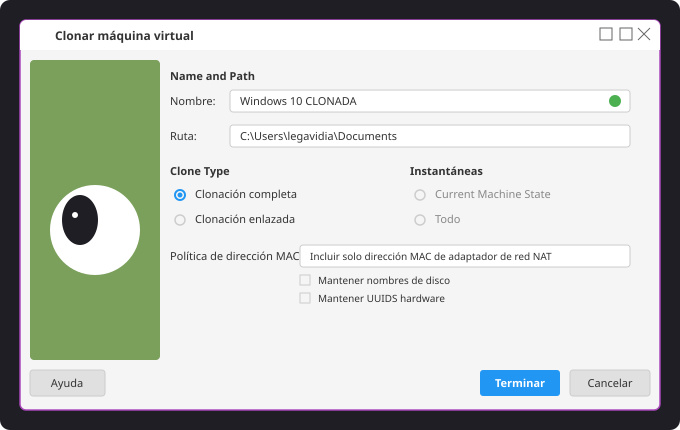
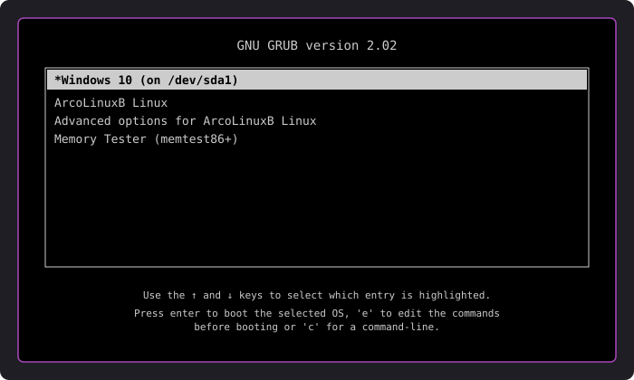
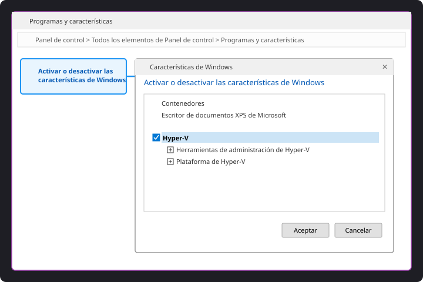
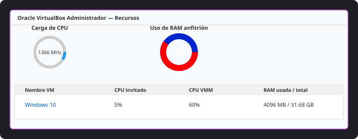
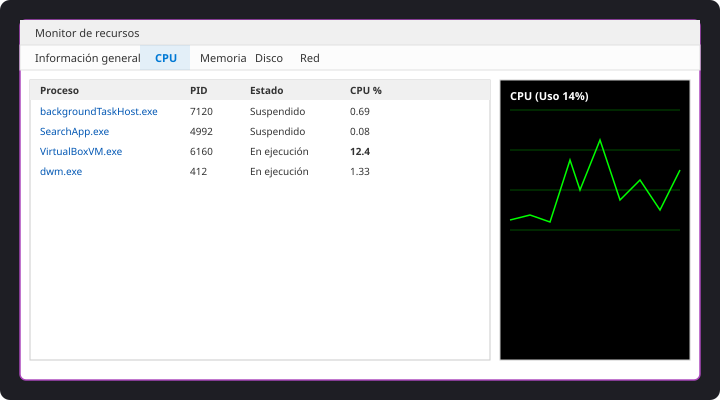

<h1 style="color: #ab47bc;">💻 Tema 2 — Máquinas Virtuales</h1>

<h2 style="color: #29b6f6;">2.1. Virtualización y Máquinas Virtuales</h2>

La **virtualización** es una tecnología que permite crear versiones virtuales de los recursos físicos de un sistema informático (servidores, sistemas operativos, unidades de almacenamiento o redes). Un único equipo físico puede ejecutar de forma simultánea varios entornos independientes, optimizando el hardware y facilitando la gestión global.

---

### El Rol del Hipervisor

La virtualización se fundamenta en el uso de un software denominado **hipervisor** (o *Virtual Machine Monitor* — VMM). El hipervisor actúa como una capa intermedia entre el hardware real del equipo y los sistemas operativos instalados en las máquinas virtuales, gestionando y repartiendo de forma aislada y segura la CPU, la memoria RAM, el almacenamiento y la red.

<figure markdown="span">
  
  <figcaption>Figura 2.1 — Capas del modelo de virtualización hospedada (Hardware Real, Sistema Anfitrión, Hipervisor y Máquinas Virtuales).</figcaption>
</figure>

---

### Ventajas e Inconvenientes de la Virtualización

<figure markdown="span">
  
  <figcaption>Figura 2.2 — Asistente de clonación completa de máquina virtual en VirtualBox.</figcaption>
</figure>

#### Ventajas Principales
* **Aprovechamiento del hardware y ahorro económico:** Consolida varios servidores en una sola máquina física, reduciendo costes en equipamiento, consumo eléctrico y espacio.
* **Aislamiento entre sistemas:** Cada máquina virtual funciona de manera independiente. Un error crítico o infección por malware en una máquina virtual no afecta a la máquina anfitriona ni a las demás VMs.
* **Facilidad para pruebas y mantenimiento:** Permite crear, clonar, eliminar o restaurar entornos de prueba sin riesgo para el sistema principal.
* **Uso de Instantáneas (*Snapshots*):** Permite guardar el estado exacto de una máquina virtual en un instante determinado para regresar a dicho punto de forma inmediata en caso de fallo.

#### Inconvenientes Principales
* **Pérdida de rendimiento:** Las máquinas virtuales acceden al hardware a través del hipervisor, lo que introduce una ligera penalización en la velocidad de ejecución.
* **Consumo elevado de recursos:** Ejecutar múltiples máquinas virtuales exige disponer de gran capacidad de memoria RAM, procesamiento en la CPU y almacenamiento masivo.
* **Mayor complejidad de gestión:** Requiere conocimientos técnicos para configurar correctamente los hipervisores, asignar cuotas de recursos y garantizar la seguridad.

---

### Arranque Dual (*Dual Boot*) vs. Virtualización

<figure markdown="span">
  
  <figcaption>Figura 2.3 — Menú del gestor de arranque GNU GRUB para selección entre Windows y Linux.</figcaption>
</figure>

| Característica | Arranque Dual (*Dual Boot*) | Virtualización (Máquinas Virtuales) |
| :--- | :--- | :--- |
| **Ejecución** | Un solo sistema operativo a la vez | Múltiples sistemas operativos simultáneos en ventanas |
| **Acceso al Hardware** | Directo y nativo | Intermediado a través del hipervisor |
| **Rendimiento** | Máximo rendimiento posible | Ligeramente inferior por la capa de abstracción |
| **Cambio de Sistema** | Requiere reiniciar el equipo | Inmediato (cambio de ventana en el SO anfitrión) |
| **Consumo de RAM** | Solo consume la RAM del SO en ejecución | Elevará el consumo al sumar el SO anfitrión y las VMs |

---

<h2 style="color: #29b6f6;">2.2. Máquina Real vs. Máquina Virtual</h2>

Para comprender la estructura de la virtualización es necesario diferenciar los siguientes conceptos:

* **Máquina Real (o Física):** El ordenador tangible que existe físicamente.
* **Sistema Operativo Anfitrión (*Host*):** El sistema operativo instalado directamente en el disco duro de la máquina real sobre el cual se ejecuta el software de virtualización.
* **Máquina Virtual (VM):** Entorno informático simulado por software que se ejecuta dentro de la máquina real. Aunque no tiene existencia física propia, se comporta como un ordenador real.
* **Sistema Operativo Invitado (*Guest* / Huésped):** El sistema operativo instalado dentro de la máquina virtual.

!!! info "Principio de Aislamiento"
    Para el sistema operativo anfitrión, una máquina virtual es simplemente una aplicación más en ejecución. Cualquier modificación, fallo de sistema, instalación o formateo realizado dentro de la máquina virtual queda confinado dentro de sus archivos de disco virtual, sin afectar al sistema operativo anfitrión.

---

<h2 style="color: #29b6f6;">2.3. Software para Creación de Máquinas Virtuales</h2>

Según la capa en la que se instale dentro del sistema informático, los hipervisores se clasifican en dos tipos principales:

### Clasificación de Hipervisores

#### Hipervisores de Tipo 1 (*Bare Metal* / Nativos)
Se instalan y ejecutan directamente sobre el hardware físico del equipo, sin necesidad de un sistema operativo anfitrión previo. Al arrancar el equipo se carga directamente el hipervisor.
* **Características:** Máximo rendimiento, gran eficiencia y alta estabilidad.
* **Uso:** Servidores empresariales y centros de datos.
* **Ejemplo insigne:** **VMware ESXi**.

#### Hipervisores de Tipo 2 (*Hosted* / Hospedados)
Se instalan como una aplicación más dentro de un sistema operativo anfitrión convencional.
* **Características:** Instalación sencilla y uso muy intuitivo, con un rendimiento ligeramente inferior al Tipo 1.
* **Uso:** Entornos de desarrollo, pruebas y equipos de escritorio.
* **Ejemplos:** Oracle VirtualBox, VMware Workstation Pro, VMware Fusion Pro, Microsoft Hyper-V.

---

### Principales Programas de Virtualización de Escritorio

1. **Oracle VirtualBox:**
   * Hipervisor de **Tipo 2**, gratuito y de código abierto (*Open Source*).
   * Compatible con múltiples sistemas anfitriones (Windows, Linux, macOS).
   * Incluye las **Guest Additions**: paquete de controladores optimizadores para el sistema invitado que mejoran la resolución gráfica, integran la captura del ratón y permiten compartir carpetas y portapapeles.
2. **VMware:**
   * Software propietario comercial integrado en Broadcom.
   * **VMware Workstation Pro:** Hipervisor de Tipo 2 para entornos profesionales en Windows y Linux.
   * **VMware Fusion Pro:** Hipervisor de Tipo 2 diseñado para macOS.
   * **VMware ESXi:** Hipervisor de Tipo 1 (*bare metal*) para servidores de centros de datos.
3. **Microsoft Hyper-V:**
   * Hipervisor integrado de manera nativa en Windows (ediciones Pro, Enterprise, Education y Windows Server). No disponible en la edición Home.
   * Se activa como una característica opcional del sistema operativo.

<figure markdown="span">
  
  <figcaption>Figura 2.5 — Activación del hipervisor Hyper-V desde las características opcionales de Windows.</figcaption>
</figure>

---

<h2 style="color: #29b6f6;">2.4. Pruebas de Rendimiento del Sistema</h2>

Evaluar el comportamiento de una máquina virtual permite comprobar si los recursos asignados le permiten funcionar con fluidez sin saturar al equipo anfitrión.

<figure markdown="span">
  
  <figcaption>Figura 2.8 — Herramienta interna de VirtualBox para la monitorización de carga de CPU y RAM del anfitrión.</figcaption>
</figure>

### Recursos Clave que Afectan al Rendimiento

* **Procesador (CPU):** Si se asignan insuficientes núcleos virtuales o la CPU física del anfitrión está saturada, la máquina virtual responderá con lentitud.
* **Memoria RAM:** El recurso más crítico. Si la VM no dispone de suficiente RAM física asignada, el sistema invitado recurrirá a la memoria de intercambio en disco (*swap*), reduciendo drásticamente la velocidad.
* **Red:** Afecta a la velocidad de transferencia y comunicación. Se configura habitualmente en dos modos:
  * **NAT:** La VM accede a Internet utilizando la dirección IP del equipo anfitrión (modo por defecto).
  * **Adaptador Puente (*Bridged*):** La VM se conecta directamente a la red física obteniendo su propia dirección IP independiente en el mismo rango que la red real.
* **Almacenamiento:** Espacio en disco y velocidad de lectura/escritura de los archivos de disco virtual (`.vdi`, `.vmdk`).

---

### Herramientas de Monitorización y Diagnóstico

#### En Windows
* **Administrador de Tareas:** Muestra el porcentaje global de uso de CPU, RAM, Disco y Red.
* **Monitor de Recursos:** Muestra de forma desglosada el consumo de CPU, memoria, disco y red proceso por proceso en tiempo real.
* **Monitor de Rendimiento:** Genera informes detallados sobre contadores específicos del sistema.

<figure markdown="span">
  
  <figcaption>Figura 2.7 — Monitor de recursos en Windows midiendo el consumo de CPU y memoria en tiempo real.</figcaption>
</figure>

#### En Ubuntu / Linux
* **Monitor del Sistema:** Aplicación gráfica equivalente al Administrador de Tareas.
* **Comandos de consola (CLI):**
  * `top`: Muestra en tiempo real la lista de procesos activos y el porcentaje de uso de CPU y memoria.
  * `htop`: Versión mejorada, más visual e interactiva del comando `top`.
  * `free`: Muestra la cantidad de memoria RAM física y de memoria de intercambio (*swap*) usada y libre.
  * `df`: Consulta el espacio ocupado, disponible y el porcentaje de uso de las particiones de almacenamiento.

---

### Ajustes para Optimizar el Rendimiento de una VM

1. **Garantizar la Virtualización por Hardware:** Verificar en la BIOS/UEFI de la máquina real que las tecnologías de virtualización asistida por hardware (**Intel VT-x** o **AMD-V**) estén habilitadas.
2. **Regla de asignación de RAM:** No asignar más del **50% - 60%** de la memoria RAM física real del equipo anfitrión a las máquinas virtuales para evitar congelar el sistema principal.
3. **Instalación de controladores de integración:** Instalar las **Guest Additions** en VirtualBox o las **VMware Tools** en VMware dentro del sistema operativo invitado.
4. **Aceleración Gráfica:** Activar la aceleración 3D en la configuración de pantalla de la VM y aumentar la memoria de vídeo dedicada.

--8<-- "docs/includes/glosario.md"
