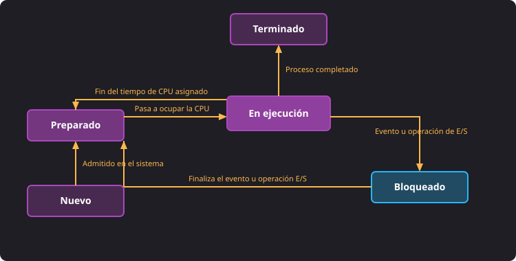
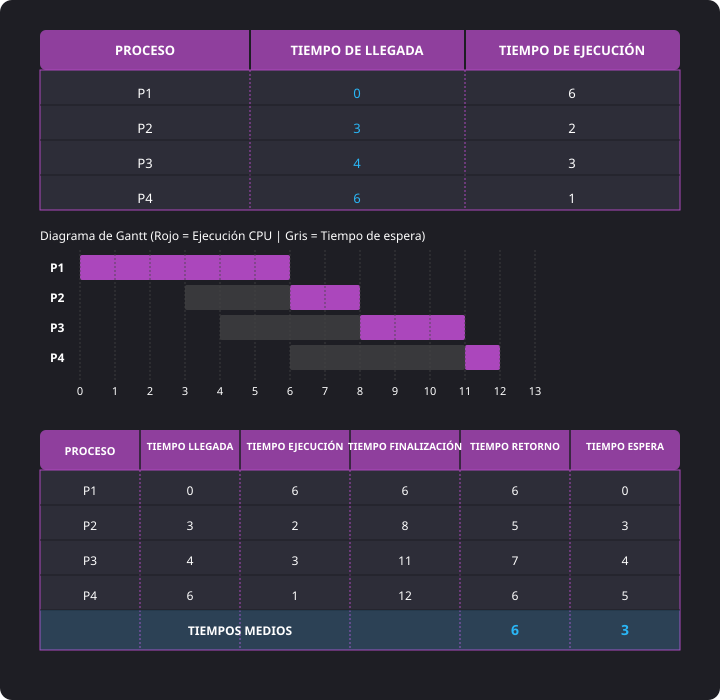
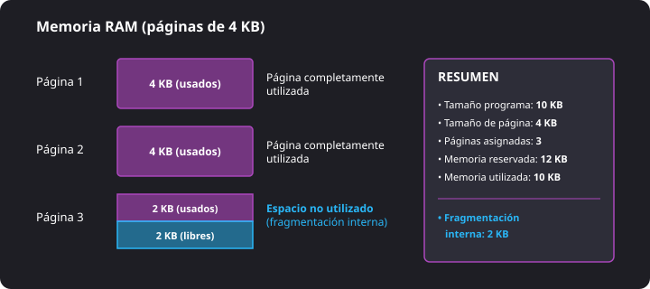
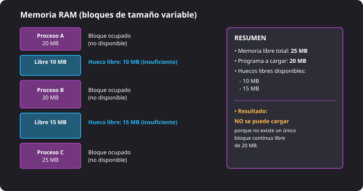
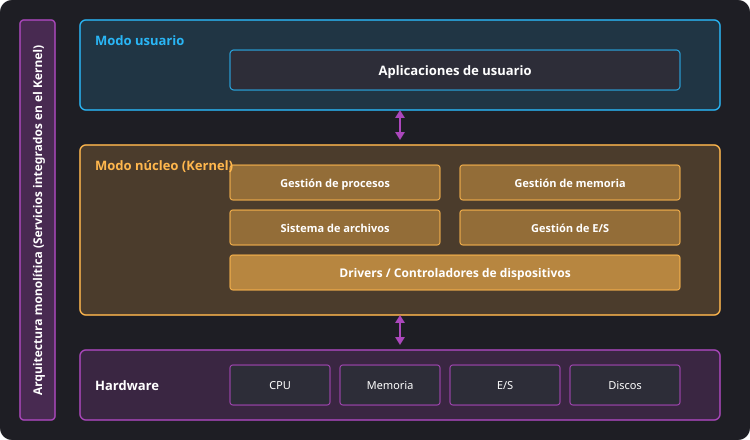
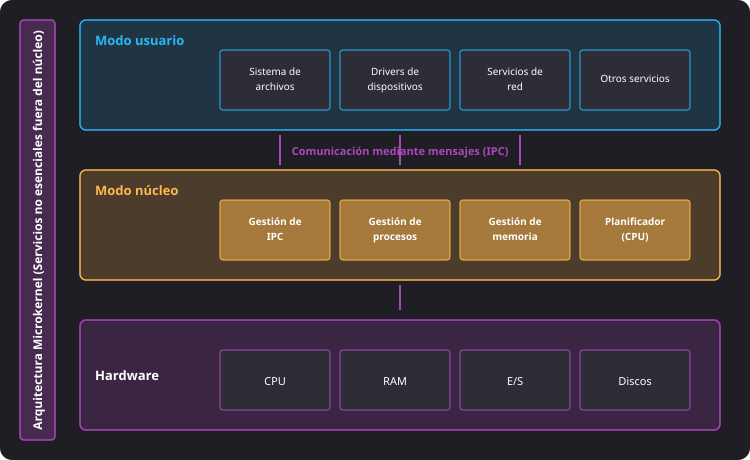
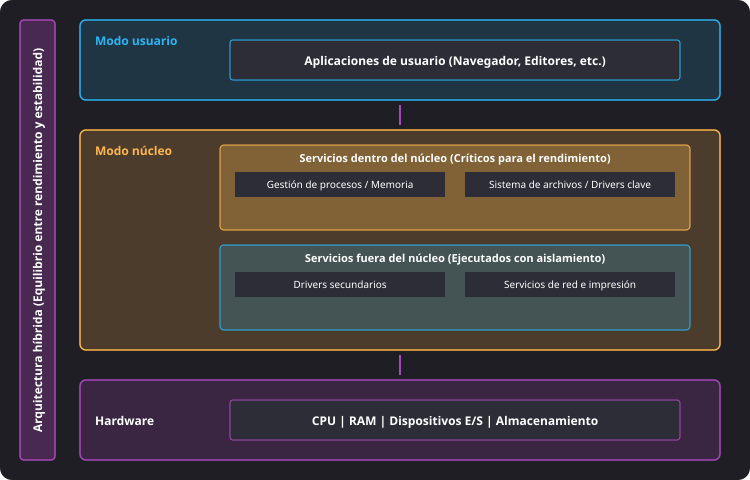
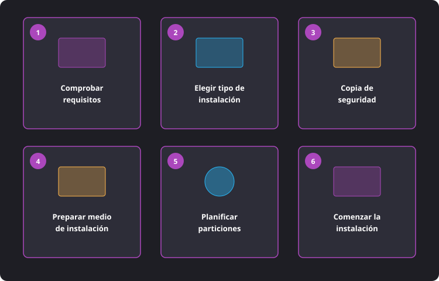
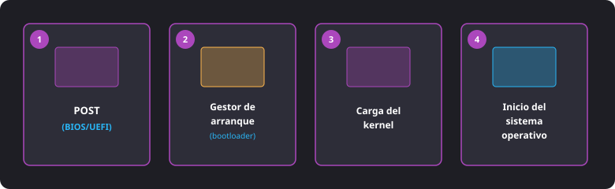

<h1 style="color: #ab47bc;">💿 Tema 3 — Instalación de Sistemas Operativos Libres y Propietarios</h1>

<h2 style="color: #29b6f6;">3.1. Funciones del Sistema Operativo</h2>

El sistema operativo es el software encargado de coordinar, controlar y administrar los recursos del ordenador, haciendo posible la interacción entre el hardware, las aplicaciones y el usuario.

---

### 1. Gestión de Procesos

* **Programa:** Conjunto de instrucciones estático almacenado en el disco de almacenamiento masivo.
* **Proceso:** Programa en ejecución en la memoria RAM utilizando tiempo de procesador (CPU) y recursos del sistema.

#### Bloque de Control de Procesos (BCP / PCB)
Estructura de datos que crea el sistema operativo para gestionar cada proceso individual:
* **PID** (*Process Identifier*): Número entero único que identifica al proceso dentro del sistema.
* **Prioridad:** Determina el orden de acceso a la CPU.
* **Estado:** Situación operacional actual del proceso.

#### Estados de un Proceso y Sus Transiciones

<figure markdown="span">
  
  <figcaption>Figura 3.2a — Estados por los que pasa un proceso durante su ciclo de vida y sus transiciones.</figcaption>
</figure>

Durante su ciclo de vida, un proceso evoluciona por 5 estados fundamentales:

1. **Nuevo:** El proceso está siendo creado y el SO le asigna recursos e identificador iniciales. Pasa a *Preparado* tras la **admisión**.
2. **Preparado:** Dispone de todos los recursos necesarios excepto la CPU; espera en cola a que el planificador le asigne tiempo de ejecución.
3. **En ejecución:** Ocupa la CPU y ejecuta activamente sus instrucciones.
4. **Bloqueado:** Detiene su ejecución a la espera de que finalice un evento externo o una operación de Entrada/Salida (E/S). Al concluir, regresa a *Preparado*.
5. **Terminado:** Finaliza su ejecución y el SO libera sus recursos asociados.

#### Planificación de Procesos
Algoritmos del SO para decidir qué proceso ocupa la CPU en cada instante:

* **Algoritmos No Expulsivos (*Non-preemptive*):** Un proceso no puede ser interrumpido hasta que finalice o se bloquee voluntariamente.
  * **FIFO / FCFS (*First In First Out*):** Ejecuta estrictamente por orden de llegada.
  * **SJF (*Shortest Job First*):** Selecciona el proceso con menor tiempo de ejecución estimado.
* **Algoritmos Expulsivos (*Preemptive*):** El SO puede interrumpir el proceso activo para asignar la CPU a otro con mayor prioridad o menor tiempo restante.
  * **SRTF (*Shortest Remaining Time First*):** Versión expulsiva de SJF. Ejecuta el proceso con menor tiempo restante.

<figure markdown="span">
  
  <figcaption>Figura 3.2b — Ejercicio práctico resuelto de planificación de procesos mediante el algoritmo FIFO.</figcaption>
</figure>

!!! note "Fórmulas para Tiempos de Planificación"
    * **Tiempo de Espera ($TE$):** $TE = \text{Tiempo de Retorno} - \text{Tiempo de Ejecución}$
    * **Tiempo de Retorno ($TR$):** $TR = \text{Tiempo de Finalización} - \text{Tiempo de Llegada}$

---

### 2. Gestión de Memoria

Organiza el espacio disponible en RAM cuando este resulta insuficiente para todas las aplicaciones activas:

* **Paginación:** Divide la memoria RAM en marcos de tamaño fijo y las aplicaciones en páginas del mismo tamaño.
* **Segmentación:** Divide los programas en bloques de tamaño variable (segmentos) organizados según su función lógica (código, datos, pila).
* **Memoria Virtual (*Swap* / Intercambio):** Utiliza un área reservada del disco como extensión no volátil de la RAM.

#### Tipos de Fragmentación
* **Fragmentación Interna:** Típica de la **Paginación**. Aparece cuando un programa no ocupa la totalidad del último bloque asignado, dejando espacio inutilizado dentro de esa página.

<figure markdown="span">
  
  <figcaption>Figura 3.3 — Ejemplo de fragmentación interna en un sistema de paginación de memoria.</figcaption>
</figure>

* **Fragmentación Externa:** Típica de la **Segmentación**. Aparece cuando quedan pequeños huecos libres dispersos por la memoria que no forman un bloque continuo de tamaño suficiente.

<figure markdown="span">
  
  <figcaption>Figura 3.4 — Ejemplo de fragmentación externa en un sistema de asignación variable por segmentación.</figcaption>
</figure>

---

### 3. Gestión de Entrada/Salida (E/S)
Coordina el flujo de datos entre el procesador, la memoria principal y los periféricos mediante **controladores de dispositivos (drivers)**, evitando conflictos o colisiones.

---

### 4. Gestión de Seguridad

* **Autenticación:** Verificación de la identidad del usuario (contraseñas, PIN, biometría).
* **Permisos y Privilegios:** Control de acceso a directorios y archivos: **lectura (*r*)**, **escritura (*w*)** y **ejecución (*x*)**.
* **Gestión de Cuentas:**
  * **Usuario Estándar:** Permisos limitados para uso cotidiano.
  * **Usuario Administrador:** Elevados privilegios de configuración y gestión.
  * **Cuenta Root (Superusuario):** Control absoluto del sistema en Linux. Se utiliza el comando `sudo` para privilegios administrativos puntuales.
* **Cifrado de la Información:** Transformación de datos mediante algoritmos para hacerlos ilegibles sin la clave correspondiente.

---

### 5. Gestión de Archivos y Sistemas de Archivos

| Sistema de Archivos | Ámbito / Compatibilidad | Características Principales |
| :--- | :--- | :--- |
| **FAT32** | Universal (Medios extraíbles) | Tamaño máximo de archivo limitado a **4 GB**. |
| **exFAT** | Universal (Microsoft / Apple / Linux) | Elimina la limitación de 4 GB para unidades externas. |
| **NTFS** | Microsoft Windows | Soporta permisos de acceso, cifrado, compresión, cuotas y tolerancia a fallos. |
| **ext4** | GNU/Linux | Sistema por defecto en la mayoría de distribuciones Linux. |
| **APFS** | Apple macOS / iOS | Diseñado y optimizado de forma nativa para unidades de estado sólido (**SSD**). |

!!! info "Journaling (Transaccionalidad)"
    El **Journaling** es una técnica presente en NTFS, ext4 y APFS que registra las transacciones pendientes en un diario especial antes de escribirlas en disco, facilitando la recuperación de la estructura de datos tras un apagado inesperado.

---

<h2 style="color: #29b6f6;">3.2. Arquitectura del Sistema Operativo</h2>

Organización interna de los módulos del sistema y sus niveles de acceso a la instrucción de la CPU.

### Modo Núcleo vs. Modo Usuario

* **Modo Núcleo (*Kernel Mode* / Modo Privilegiado):** Nivel de máximo privilegio donde se ejecuta el **Kernel**. Acceso directo e ilimitado al hardware. Un error crítico provoca la caída del sistema (*pantallazo azul* o *kernel panic*).
* **Modo Usuario (*User Mode*):** Nivel protegido donde corren las aplicaciones de usuario. Cualquier petición al hardware debe canalizarse obligatoriamente mediante una **llamada al sistema (*system call*)** hacia el Kernel.

---

### Modelos de Arquitectura de Kernel

* **Monolítica:** Todos los servicios del sistema operativo se ejecutan integrados dentro del propio núcleo en modo privilegiado.
  * *Ventaja:* Elevado rendimiento y velocidad.
  * *Ejemplo:* Núcleo Linux.

  <figure markdown="span">
  
  <figcaption>Figura 3.5 — Arquitectura monolítica de un sistema operativo (todos los servicios integrados en el Kernel).</figcaption>
</figure>

* **Micronúcleo (*Microkernel*):** Solo las funciones básicas permanecen en el núcleo. Los demás servicios (drivers, sistemas de archivos) corren como procesos en modo usuario.
  * *Ventaja:* Gran estabilidad y aislamiento de fallos.
  * *Ejemplo:* MINIX.

  <figure markdown="span">
  
  <figcaption>Figura 3.6 — Arquitectura microkernel de un sistema operativo (servicios no esenciales fuera del núcleo).</figcaption>
</figure>

* **Híbrida:** Combina la velocidad del núcleo monolítico con la modularidad externa del micronúcleo.
  * *Ejemplos:* Windows NT/11 y macOS.

<figure markdown="span">
  
  <figcaption>Figura 3.7 — Arquitectura híbrida de un sistema operativo (combinación de alto rendimiento y estabilidad).</figcaption>
</figure>

---

<h2 style="color: #29b6f6;">3.3. Selección del Sistema Operativo</h2>

Criterios de evaluación técnica:

1. **Compatibilidad con el Hardware:** Disponibilidad de controladores (*drivers*) oficiales.
2. **Requisitos Mínimos del Sistema:** Verificación de las especificaciones publicadas (CPU, RAM, disco).
3. **Compatibilidad con Aplicaciones:** Disponibilidad del software profesional o personal requerido.
4. **Coste y Licencias:** Evaluación de licencias privativas frente a libres y costes de mantenimiento.
5. **Seguridad y Actualizaciones:** Frecuencia de parches de seguridad y ciclo de soporte de larga duración (**LTSC**).
6. **Facilidad de Uso:** Curva de aprendizaje del usuario y soporte de la comunidad.

---

<h2 style="color: #29b6f6;">3.4. Planificación de la Instalación</h2>

Pasos previos para un despliegue correcto:

<figure markdown="span">
  
  <figcaption>Figura 3.8 — Pasos secuenciales para planificar correctamente la instalación de un sistema operativo.</figcaption>
</figure>

1. **Comprobar los requisitos del sistema.**
2. **Elegir el tipo de instalación:**
   * **Instalación limpia / Desde cero:** Formateo completo de la unidad de destino.
   * **Actualización (*Upgrade*):** Instalación de versión superior manteniendo archivos y configuraciones.
   * **Instalación desatendida:** Automática mediante un archivo de respuestas preconfigurado.
   * **Arranque Dual (*Dual Boot*):** Coexistencia de varios SOs en particiones independientes.
3. **Realizar una copia de seguridad (*Backup*).**
4. **Preparar el medio de instalación:** Creación de una unidad USB arrancable desde una imagen ISO oficial.
5. **Planificar las particiones:** Definición previa del esquema de particionado.

---

<h2 style="color: #29b6f6;">3.5. Gestor de Arranque</h2>

El **gestor de arranque (*Bootloader*)** es un programa especializado ejecutado tras el firmware para localizar el núcleo del SO, cargarlo en RAM y transferirle el control del equipo.

### Secuencia de Arranque del Ordenador (4 Pasos)

<figure markdown="span">
  
  <figcaption>Figura 3.9 — Fases consecutivas de la secuencia de arranque de un ordenador.</figcaption>
</figure>

1. **POST (*Power-On Self-Test*):** El firmware (BIOS/UEFI) comprueba la salud del hardware.
2. **Localización del Bootloader:** El firmware busca el gestor de arranque en la unidad de prioridad de inicio.
3. **Carga del Kernel:** El *Bootloader* lee e introduce el núcleo del sistema operativo en la RAM.
4. **Inicio del Sistema Operativo:** El Kernel inicializa los drivers, procesos base y la interfaz de usuario.

---

### Firmware de Arranque: BIOS vs. UEFI

| Característica | **BIOS** Tradicional | **UEFI** (*Unified Extensible Firmware Interface*) |
| :--- | :--- | :--- |
| **Arquitectura** | Modo real de 16 bits | Ejecución en 32 y 64 bits de forma nativa |
| **Ubicación del Bootloader** | Primer sector del disco (**MBR**) | Partición dedicada **ESP** (*EFI System Partition*) |
| **Interfaz de Usuario** | Modo texto en pantalla | Interfaz gráfica personalizable con soporte de ratón |
| **Seguridad de Arranque** | Sin comprobación de firmas | Incluye **Secure Boot** para bloquear malware previo al SO |

---

### Esquemas de Particionado: MBR vs. GPT

| Característica | **MBR** (*Master Boot Record*) | **GPT** (*GUID Partition Table*) |
| :--- | :--- | :--- |
| **Firmware Asociado** | BIOS Tradicional (*Legacy*) | **UEFI** |
| **Particiones Primarias** | Máximo 4 particiones primarias | Hasta 128 particiones primarias (en Windows) |
| **Tamaño Máximo de Disco** | Hasta **2 TB** | Superior a **2 TB** (soporte para PetaBytes) |
| **Fiabilidad y Respaldo** | Sector único inicial (falla el arranque si se daña) | Copias de seguridad de la tabla guardadas al final del disco |

#### Gestores de Arranque Principales
* **Windows Boot Manager:** Gestor nativo de los sistemas Microsoft Windows.
* **GRUB (*GRand Unified Bootloader*):** Gestor estándar en distribuciones GNU/Linux. Reconoce automáticamente otros sistemas operativos para desplegar un entorno de **Arranque Dual**.

---

<h2 style="color: #29b6f6;">3.6. Actualización y Mantenimiento Básico</h2>

### Mantenimiento en Windows 11

* **Windows Update:** Herramienta gráfica integrada para descargar parches y parches de seguridad.
* **Comandos en Consola (CLI):**
  * `systeminfo`: Muestra información detallada de la versión, compilación, procesador y parches (*hotfixes*) instalados.
  * `start ms-settings:windowsupdate`: Abre la ventana de Windows Update desde la consola.
  * `sfc /scannow`: Comprobador de archivos del sistema. Analiza y repara archivos protegidos corruptos.

---

### Mantenimiento en Ubuntu / Linux

* **Actualización de Software (GUI):** Aplicación gráfica que conecta con los repositorios oficiales.
* **Comandos en Terminal (CLI):**
  * `lsb_release -a`: Muestra la versión oficial y el nombre en clave de la distribución instalada.
  * `sudo apt update`: Actualiza la lista de paquetes disponibles desde los repositorios (no instala paquetes).
  * `sudo apt upgrade`: Descarga e instala las versiones más recientes de todos los paquetes instalados.
  * `sudo apt autoremove`: Elimina automáticamente paquetes antiguos y dependencias en desuso.
  * `sudo apt clean`: Limpia la caché local de archivos `.deb` descargados para liberar espacio.
  * `sudo reboot`: Reinicia el sistema operativo de forma segura.

--8<-- "docs/includes/glosario.md"
