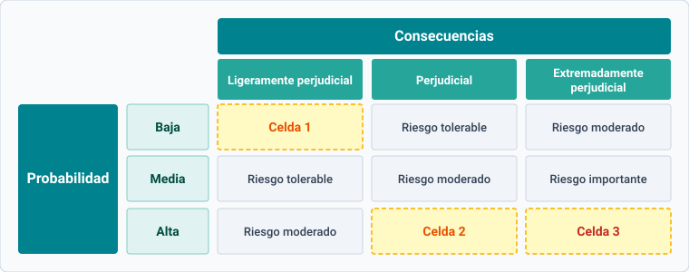
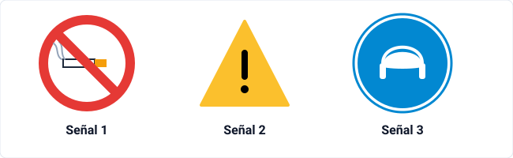

[← Volver al Índice de PACs](./index.md)

---

### Pregunta 1
Relaciona cada concepto relativo al trabajo y la salud con su definición correspondiente:

#### 1.1. Cualquier objeto, sustancia o característica de la organización que contribuye a provocar un daño en la salud del trabajador. Se clasifican en diferentes tipologías para analizar las condiciones de trabajo:

  
A) Factor de riesgo

  

    
✓ ¡Exacto!

    El factor de riesgo es la condición de trabajo, elemento material, ambiental u organizativo que actúa como causa o desencadenante potencial de un daño para la salud del trabajador.
  

  
B) Riesgo profesional

  

    
✗ Incorrecto

    El riesgo profesional es la probabilidad o posibilidad de que el daño se materialice ante la presencia del factor de riesgo.
  

  
C) Accidente de trabajo

  

    
✗ Incorrecto

    El accidente de trabajo es la materialización súbita y lesiva del daño, no la condición o elemento originario.
  

  
D) Enfermedad profesional

  

    
✗ Incorrecto

    La enfermedad profesional es el deterioro gradual de la salud tipificado en el cuadro legal correspondiente, no el factor causal.
  

#### 1.2. Posibilidad de que se generen los efectos y las alteraciones que pueden originar en la salud del trabajador los factores nocivos o de riesgo. Es la situación de peligro en la que una persona se encuentra por ejecutar su trabajo en condiciones nocivas:

  
A) Factor de riesgo

  

    
✗ Incorrecto

    El factor de riesgo es el elemento o condición desencadenante, mientras que la probabilidad de sufrir el daño derivado define el riesgo en sí.
  

  
B) Riesgo profesional

  

    
✓ ¡Exacto!

    Según el artículo 4 de la Ley de Prevención de Riesgos Laborales (LPRL), se entiende por riesgo laboral la posibilidad de que un trabajador sufra un determinado daño derivado del trabajo, ponderando su probabilidad y severidad.
  

  
C) Accidente de trabajo

  

    
✗ Incorrecto

    El accidente supone la consumación real e inmediata de una lesión corporal con ocasión del trabajo.
  

  
D) Daño derivado del trabajo

  

    
✗ Incorrecto

    El daño es la enfermedad, patología o lesión real sufrida por el trabajador, mientras que el riesgo mide la contingencia o probabilidad de que ocurra.
  

#### 1.3. Suceso anormal, ni querido ni deseado, que se presenta brusca e inesperadamente y que interrumpe la continuidad normal del trabajo:

  
A) Accidente de trabajo

  

    
✓ ¡Exacto!

    Técnicamente se define como un acontecimiento imprevisto y súbito que interrumpe el desarrollo normal de la actividad laboral y que produce o puede producir lesiones corporales.
  

  
B) Enfermedad profesional

  

    
✗ Incorrecto

    La enfermedad profesional tiene una evolución lenta e insidiosa por exposición continuada, nunca de aparición brusca o instantánea.
  

  
C) Incidente laboral

  

    
✗ Incorrecto

    El incidente o «conato de accidente» no llega a producir lesión física en el trabajador, aunque comparta el carácter imprevisto.
  

  
D) Fatiga laboral

  

    
✗ Incorrecto

    La fatiga es una disminución progresiva de la capacidad psicofísica del trabajador por esfuerzo prolongado.
  

#### 1.4. Deterioro gradual y lento de la salud de los trabajadores como consecuencia de la exposición crónica a diferentes situaciones adversas producidas por la organización o el ambiente de trabajo:

  
A) Accidente de trabajo

  

    
✗ Incorrecto

    El accidente se caracteriza por su instantaneidad y carácter traumático agudo.
  

  
B) Enfermedad profesional

  

    
✓ ¡Exacto!

    La enfermedad profesional implica una evolución paulatina originada por la exposición ambiental, química, física o biológica reiterada a lo largo del tiempo, recogida en el RD 1299/2006.
  

  
C) Estrés laboral

  

    
✗ Incorrecto

    El estrés es una patología inespecífica o respuesta psicofisiológica que puede desencadenar múltiples trastornos, pero no constituye por sí sola la definición genérica de deterioro gradual regulado.
  

  
D) Envejecimiento prematuro

  

    
✗ Incorrecto

    El envejecimiento prematuro es una consecuencia patológica derivada del desgaste biológico acumulado, no la definición formal de contingencia profesional.
  

---

### Pregunta 2
¿Cuál es el primer paso en la evaluación de la prevención?

  
A) Identificar los posibles riesgos laborales

  

    
✓ ¡Exacto!

    El proceso sistemático de gestión preventiva exige, en primer lugar, la identificación rigurosa de los peligros y factores de riesgo en cada puesto de trabajo para posteriormente proceder a su medición, valoración y planificación correctora.
  

  
B) Contactar con los organismos públicos relacionados con la prevención de riesgos laborales

  

    
✗ Incorrecto

    La relación con la autoridad laboral o el INSST se produce dentro del marco normativo general o en actuaciones específicas, no como paso técnico inicial de la evaluación de un centro de trabajo.
  

  
C) Evaluar los riesgos estableciendo un nivel de deficiencia

  

    
✗ Incorrecto

    Determinar el nivel de deficiencia es una fase posterior de cuantificación que presupone haber identificado previamente las condiciones peligrosas existentes.
  

  
D) Evaluar los riesgos estableciendo la gravedad potencial

  

    
✗ Incorrecto

    La estimación de la gravedad o severidad de las consecuencias es un cálculo que opera sobre riesgos ya detectados y clasificados.
  

---

### Pregunta 3
El método del INSST (Instituto Nacional de Seguridad y Salud en el Trabajo) es un método simplificado de evaluación de riesgos laborales que clasifica los niveles de riesgo combinando la probabilidad de ocurrencia y la severidad de las consecuencias.

<figure markdown="span">
  
  <figcaption>Matriz de evaluación de riesgos según el método simplificado del INSST (Probabilidad frente a Consecuencias).</figcaption>
</figure>

Determina el nivel de riesgo que corresponde a cada una de las celdas señaladas:

#### 3.1. Celda 1 (Probabilidad Baja × Consecuencia Ligeramente Perjudicial):

  
A) Riesgo trivial (Poco riesgo)

  

    
✓ ¡Exacto!

    La intersección entre una probabilidad baja y consecuencias ligeramente perjudiciales determina un nivel de riesgo trivial (o poco riesgo), en el cual no se requiere ninguna acción preventiva específica ni registro documental detallado.
  

  
B) Riesgo tolerable

  

    
✗ Incorrecto

    El riesgo tolerable corresponde a la combinación de probabilidad baja con daño perjudicial o probabilidad media con daño ligeramente perjudicial.
  

  
C) Riesgo moderado

  

    
✗ Incorrecto

    El riesgo moderado requiere una severidad o probabilidad significativamente mayor (por ejemplo, media × perjudicial).
  

  
D) Riesgo importante

  

    
✗ Incorrecto

    El riesgo importante implica situaciones graves con alta potencialidad de daño que exigen medidas correctoras urgentes.
  

#### 3.2. Celda 2 (Probabilidad Alta × Consecuencia Perjudicial):

  
A) Riesgo moderado

  

    
✗ Incorrecto

    El riesgo moderado se asigna a probabilidad alta con daño ligeramente perjudicial, o probabilidad media con daño perjudicial.
  

  
B) Riesgo importante

  

    
✓ ¡Exacto!

    La combinación de una probabilidad alta con consecuencias perjudiciales genera un riesgo importante. No debe iniciarse el trabajo hasta que no se haya reducido el riesgo, precisando recursos considerables para su control.
  

  
C) Riesgo tolerable

  

    
✗ Incorrecto

    Un riesgo tolerable no admite probabilidades altas asociadas a daños perjudiciales.
  

  
D) Riesgo intolerable

  

    
✗ Incorrecto

    El riesgo intolerable está reservado a la combinación de probabilidad alta con consecuencias extremadamente perjudiciales.
  

#### 3.3. Celda 3 (Probabilidad Alta × Consecuencia Extremadamente Perjudicial):

  
A) Riesgo importante

  

    
✗ Incorrecto

    Aunque grave, el riesgo importante aún contempla la viabilidad del trabajo con medidas correctoras previas; aquí nos encontramos en el nivel máximo de gravedad.
  

  
B) Riesgo moderado

  

    
✗ Incorrecto

    Un daño extremadamente perjudicial con alta concurrencia nunca puede catalogarse como moderado.
  

  
C) Riesgo intolerable

  

    
✓ ¡Exacto!

    La confluencia de probabilidad alta y consecuencias extremadamente perjudiciales califica el riesgo como intolerable. Se debe prohibir o paralizar de inmediato el trabajo hasta que el riesgo sea reducido por completo.
  

  
D) Riesgo tolerable

  

    
✗ Incorrecto

    El riesgo tolerable representa niveles mínimos de afección que permiten mantener la actividad con comprobaciones periódicas.
  

---

### Pregunta 4
Ana María trabaja en una fábrica al lado de unas máquinas que hacen muchísimo ruido y ya lleva en ese puesto unos 15 años. En su empresa no le han dado un equipo de protección individual adecuado y al final le han diagnosticado que tiene una sordera grave como consecuencia del desarrollo de su trabajo.

¿Con qué tipo de factor de riesgo está relacionado lo que le ha pasado a Ana María?

  
A) Con la carga de trabajo y las condiciones psicofísicas y psicosociales

  

    
✗ Incorrecto

    La carga de trabajo se divide en física (posturas, manipulación de cargas) y mental, mientras que los factores psicosociales abordan la organización del tiempo, autonomía o relaciones de liderazgo.
  

  
B) Con las condiciones medioambientales (agentes físicos)

  

    
✓ ¡Exacto!

    El ruido es un agente ambiental físico (energía acústica en forma de vibración o presión sonoro-mecánica). La exposición continuada a niveles de presión acústica elevados sin la debida protección ocasiona hipoacusia profesional o sordera neurosensorial.
  

  
C) Con las características generales o estructurales (condiciones de seguridad)

  

    
✗ Incorrecto

    Las condiciones estructurales o de seguridad hacen referencia a pasillos, barandillas, resguardos de máquinas o escaleras causantes de caídas y atrapamientos mecánicos.
  

  
D) Con las circunstancias personales de Ana María

  

    
✗ Incorrecto

    La patología no se debe a una predisposición o afección previa individual, sino a una exposición ambiental nociva directa y continuada derivada del puesto de trabajo sin medidas protectoras.
  

---

### Pregunta 5
Determina si las siguientes afirmaciones sobre las condiciones de trabajo y la salud son verdaderas o falsas:

#### 5.1. El accidente de trabajo es un suceso normal, ni querido ni deseado, que se presenta brusca e inesperadamente y que interrumpe la continuidad normal del trabajo:

  
A) Verdadero

  

    
✗ Incorrecto

    El accidente de trabajo nunca es un suceso «normal»; se define estrictamente como un acontecimiento **anormal**, imprevisto, súbito y no deseado.
  

  
B) Falso

  

    
✓ ¡Exacto!

    Es falso porque la definición técnica establece que es un suceso **anormal**, no querido ni deseado, que interrumpe la continuidad del proceso laboral y causa daños físicos o materiales.
  

#### 5.2. Se considera accidente de trabajo los que tienen lugar en los trayectos de ida o vuelta del trabajo (in itinere):

  
A) Verdadero

  

    
✓ ¡Exacto!

    El artículo 156.2 de la Ley General de la Seguridad Social reconoce formalmente como accidente de trabajo el siniestro que sufra el trabajador al ir o al volver del lugar de trabajo (*in itinere*), siempre que cumpla los requisitos cronológicos, topográficos y de medio de transporte idóneo.
  

  
B) Falso

  

    
✗ Incorrecto

    La legislación española ampara explícitamente los accidentes *in itinere* dentro del régimen general de contingencias profesionales.
  

#### 5.3. Para que una enfermedad pueda ser considerada profesional, debe existir una relación causal entre la exposición continuada a las condiciones de trabajo y la enfermedad:

  
A) Verdadero

  

    
✓ ¡Exacto!

    La definición legal de enfermedad profesional (art. 157 LGSS) exige la concurrencia de nexo causal directo: haber contraído la patología a consecuencia del trabajo ejecutado en las actividades y por efecto de las sustancias especificadas en el cuadro oficial.
  

  
B) Falso

  

    
✗ Incorrecto

    Sin relación de causalidad probada entre el agente ambiental del trabajo y la patología, esta no puede ser catalogada jurídicamente como enfermedad profesional.
  

#### 5.4. La enfermedad profesional es un deterioro rápido de la salud del trabajador como consecuencia de no exponerse a situaciones adversas:

  
A) Verdadero

  

    
✗ Incorrecto

    La enfermedad profesional cursa de forma **lenta y progresiva**, y surge precisamente por la exposición reiterada a elementos nocivos, no por ausencia de exposición.
  

  
B) Falso

  

    
✓ ¡Exacto!

    Es falso puesto que se trata de un proceso crónico, lento y gradual motivado por la exposición repetida y continuada a condiciones laborales insalubres.
  

#### 5.5. Las cargas de trabajo y las condiciones psicofísicas y psicosociales son uno de los factores de riesgo profesional:

  
A) Verdadero

  

    
✓ ¡Exacto!

    Forman parte del catálogo básico de factores de riesgo laboral junto con las condiciones de seguridad, las condiciones medioambientales y las organizativas.
  

  
B) Falso

  

    
✗ Incorrecto

    Tanto el sobreesfuerzo muscular y las posturas forzadas (carga física) como el ritmo de trabajo y la presión mental (factores psicosociales) son reconocidos como factores de riesgo profesional directos.
  

---

### Pregunta 6
¿Cuál de las siguientes situaciones NO es un accidente de trabajo según la Ley General de la Seguridad Social?

  
A) María es una trabajadora en una empresa de dietética que sufrió un ictus durante su jornada laboral debido al estrés que padece por la carga de trabajo

  

    
✗ Incorrecto

    El art. 156.3 LGSS establece la presunción *iuris tantum* de que son constitutivas de accidente de trabajo todas las lesiones que sufra el trabajador durante el tiempo y en el lugar de trabajo, incluidos eventos cardiovasculares sobrevenidos.
  

  
B) Joaquín manipula elementos tóxicos y peligrosos en un hospital y, sin ponerse los EPI adecuados y haciendo el tonto para impresionar a sus compañeros, sufre una quemadura de segundo grado

  

    
✓ ¡Exacto!

    El artículo 156.4.b de la LGSS excluye expresamente de la consideración de accidente de trabajo aquellos que sean debidos a **imprudencia temeraria** o dolo del trabajador accidentado, donde se asume un riesgo manifiesto, consciente e innecesario desobedeciendo las normas básicas.
  

  
C) Luisa sufre una caída cuando caminaba hacia el trabajo desde su domicilio habitual realizando el recorrido que hace todos los días

  

    
✗ Incorrecto

    Cumple todos los requisitos del accidente *in itinere*: trayecto directo, en el tiempo prudencial y con el medio habitual de desplazamiento entre el domicilio y el centro de trabajo.
  

  
D) Francisco es un obrero industrial y representante de los trabajadores que sufrió una caída por unas escaleras al acudir caminando a una reunión sindical

  

    
✗ Incorrecto

    El art. 156.2.b LGSS equipara a accidente laboral los acaecidos con ocasión o por consecuencia del desempeño de cargos electivos de carácter sindical, así como los ocurridos al ir o volver del lugar de celebración de las funciones representativas.
  

---

### Pregunta 7
Relaciona cada definición con la patología inespecífica a la que hace referencia:

#### 7.1. Cansancio físico o mental, real o imaginario, que tiene un trabajador y que disminuye su capacidad de trabajo:

  
A) Fatiga

  

    
✓ ¡Exacto!

    La fatiga laboral es la disminución temporal de la capacidad de trabajo y de rendimiento debida al agotamiento muscular o sensorial tras un esfuerzo sostenido sin pausas de recuperación.
  

  
B) Envejecimiento prematuro

  

    
✗ Incorrecto

    El envejecimiento prematuro es una degeneración biológica acumulada irreversible a largo plazo, no la sensación de agotamiento puntual.
  

  
C) Estrés

  

    
✗ Incorrecto

    El estrés se relaciona con el desajuste entre las demandas del entorno y los recursos del individuo para responder.
  

  
D) Insatisfacción

  

    
✗ Incorrecto

    La insatisfacción es un estado actitudinal y psicoafectivo de malestar o desinterés frente al puesto de trabajo.
  

#### 7.2. Aceleración del proceso normal de envejecimiento fisiológico y que conduce a una muerte prematura por desgaste biológico acumulado:

  
A) Fatiga

  

    
✗ Incorrecto

    La fatiga es reversible mediante el descanso y la paulatina recuperación física y mental.
  

  
B) Envejecimiento prematuro

  

    
✓ ¡Exacto!

    Se produce por la fatiga crónica residual no recuperada a lo largo de los años, acelerando los procesos de deterioro celular y reduciendo la expectativa de vida del trabajador.
  

  
C) Estrés

  

    
✗ Incorrecto

    Aunque el estrés agrava la salud general, la definición específica de aceleración biológica corresponde al envejecimiento prematuro.
  

  
D) Síndrome de Burnout

  

    
✗ Incorrecto

    El burnout o síndrome del trabajador quemado cursa con despersonalización, agotamiento emocional y baja realización profesional, no con el concepto médico global de envejecimiento biológico prematuro.
  

#### 7.3. Situación de tensión en el trabajador que aparece por un exceso de exigencias laborales y la incapacidad de poder asumirlas y alcanzar los objetivos:

  
A) Fatiga

  

    
✗ Incorrecto

    La fatiga deriva del gasto energético fisiológico, mientras que el estrés tiene un componente de valoración cognitiva ante demandas excesivas.
  

  
B) Estrés

  

    
✓ ¡Exacto!

    El estrés laboral aparece como respuesta adaptativa de tensión psicoemocional cuando las exigencias del entorno productivo superan manifiestamente las capacidades o recursos del trabajador para afrontarlas.
  

  
C) Envejecimiento prematuro

  

    
✗ Incorrecto

    El envejecimiento es la consecuencia terminal biológica de la exposición sostenida a agresiones laborales crónicas.
  

  
D) Apatía

  

    
✗ Incorrecto

    La apatía describe la falta de emoción o motivación, pero no el estado de activación y tensión fisiológica característico del estrés.
  

#### 7.4. Estado de descontento derivado de trabajar por mera necesidad, aburrimiento, falta de interés o carencia de autonomía laboral:

  
A) Fatiga

  

    
✗ Incorrecto

    La fatiga es un estado físico o cognitivo de cansancio funcional, no de desafección laboral.
  

  
B) Insatisfacción

  

    
✓ ¡Exacto!

    La insatisfacción laboral es la vivencia subjetiva y afectiva de desagrado hacia las condiciones del puesto (monotonía, falta de reconocimiento o bajo control sobre el trabajo).
  

  
C) Estrés

  

    
✗ Incorrecto

    El estrés suele ir asociado a una sobrecarga de presión y demandas, mientras que la insatisfacción puede surgir incluso de la subcarga laboral o tareas vacías de contenido.
  

  
D) Envejecimiento prematuro

  

    
✗ Incorrecto

    Corresponde a la merma biológica orgánica y fisiológica irreversible.
  

---

### Pregunta 8
Relaciona cada tipología de responsabilidad en prevención de riesgos laborales con su definición correspondiente:

#### 8.1. Aquella en la que los trabajadores incurren por el incumplimiento de sus obligaciones en prevención y que no es atribuible a los empresarios:

  
A) Responsabilidad laboral

  

    
✗ Incorrecto

    La responsabilidad laboral engloba obligaciones contractuales y de recargo de prestaciones imputables a la parte empleadora.
  

  
B) Responsabilidad disciplinaria

  

    
✓ ¡Exacto!

    El artículo 29.3 de la LPRL faculta al empresario a sancionar disciplinariamente al trabajador (según el régimen de faltas y sanciones del convenio colectivo o el Estatuto de los Trabajadores) que incumpla deliberadamente las obligaciones de seguridad.
  

  
C) Responsabilidad administrativa

  

    
✗ Incorrecto

    La responsabilidad administrativa en PRL es de carácter sancionador y recae de manera exclusiva sobre los empresarios titulares de los centros de trabajo.
  

  
D) Responsabilidad civil

  

    
✗ Incorrecto

    La responsabilidad civil tiene naturaleza resarcitoria y de reparación económica de daños y perjuicios.
  

#### 8.2. Aquella que se produce por el incumplimiento de normas legales y reglamentarias, siendo únicamente atribuible a los empresarios:

  
A) Responsabilidad administrativa

  

    
✓ ¡Exacto!

    Se canaliza a través del procedimiento sancionador incoado por la Inspección de Trabajo y Seguridad Social (ITSS) en aplicación del Texto Refundido de la Ley sobre Infracciones y Sanciones en el Orden Social (LISOS).
  

  
B) Responsabilidad disciplinaria

  

    
✗ Incorrecto

    La disciplina laboral opera a nivel interno de la empresa y se aplica a trabajadores que desobedecen las pautas de prevención.
  

  
C) Responsabilidad penal

  

    
✗ Incorrecto

    La responsabilidad penal castiga delitos tipificados en el Código Penal y puede alcanzar tanto a empresarios como a encargados, técnicos y trabajadores.
  

  
D) Responsabilidad civil

  

    
✗ Incorrecto

    Su función primordial es indemnizar patrimonialmente los daños y no sancionar administrativamente la mera infracción de preceptos reglamentarios.
  

#### 8.3. Aquella que tiene por objetivo compensar económicamente los daños y perjuicios ocasionados por el incumplimiento de obligaciones (contractual o extracontractual):

  
A) Responsabilidad administrativa

  

    
✗ Incorrecto

    Las multas administrativas ingresan en el erario público; no indemnizan de forma directa el daño sufrido por la víctima.
  

  
B) Responsabilidad civil

  

    
✓ ¡Exacto!

    Regulada en el Código Civil (arts. 1101 y 1902), su fin es la reparación económica del daño emergente, lucro cesante y daño moral originados a la persona afectada.
  

  
C) Responsabilidad disciplinaria

  

    
✗ Incorrecto

    La vía disciplinaria persigue castigar faltas laborales (suspensión de empleo y sueldo, amonestaciones), no abonar indemnizaciones.
  

  
D) Responsabilidad penal

  

    
✗ Incorrecto

    La responsabilidad penal busca el castigo y la reeducación mediante penas de prisión o inhabilitación, al margen de la responsabilidad civil accesoria que pueda derivarse.
  

#### 8.4. Aquella cuyo objetivo es dar una tutela específica contra conductas que atentan contra el derecho a una protección eficaz en seguridad y salud, tipificadas como falta o delito:

  
A) Responsabilidad administrativa

  

    
✗ Incorrecto

    La vía administrativa juzga infracciones contempladas en la LISOS, reservando las conductas de gravedad extrema y dolo o imprudencia grave a la jurisdicción penal.
  

  
B) Responsabilidad civil

  

    
✗ Incorrecto

    La responsabilidad civil no tutela penalmente la conducta antisocial ni impone penas privativas de libertad.
  

  
C) Responsabilidad penal

  

    
✓ ¡Exacto!

    Regulada en los artículos 316 a 318 del Código Penal (delitos contra los derechos de los trabajadores), castiga penalmente el hecho de no facilitar los medios necesarios para desempeñar la actividad con seguridad con penas de prisión e inhabilitación.
  

  
D) Responsabilidad disciplinaria

  

    
✗ Incorrecto

    Opera exclusivamente dentro del ámbito interno del poder de dirección del empresario frente al trabajador.
  

---

### Pregunta 9
Conocer los derechos de los trabajadores comporta saber las obligaciones que los empresarios deben conocer y cumplir. Los trabajadores pueden exigirlos y en caso de no cumplimiento pueden generarse sanciones importantes.

Selecciona en la siguiente lista aquellos enunciados que sean derechos de los trabajadores en materia preventiva. *(Four options are correct)*

<label class="quiz-multi-option correct">
<input type="checkbox" data-opt="A"> A) Vigilancia de la salud mediante reconocimientos médicos.

✓ ¡Correcta!

Es un derecho fundamental del trabajador reconocido en el artículo 22 de la Ley de Prevención de Riesgos Laborales (LPRL), garantizando reconocimientos periódicos adecuados a los riesgos y con carácter habitualmente voluntario.

</label>
<label class="quiz-multi-option incorrect">
<input type="checkbox" data-opt="B"> B) No desactivar los dispositivos de seguridad y usarlos correctamente.

✗ Incorrecta

Constituye una obligación o deber expreso del trabajador según el artículo 29.2.c de la LPRL, no un derecho.

</label>
<label class="quiz-multi-option incorrect">
<input type="checkbox" data-opt="C"> C) Asumir el coste de las medidas de seguridad y salud.

✗ Incorrecta

El artículo 14.5 de la LPRL establece con total claridad que las medidas de seguridad y salud no deberán implicar en ningún caso un coste económico para los trabajadores.

</label>
<label class="quiz-multi-option correct">
<input type="checkbox" data-opt="D"> D) Recibir información y formación sobre prevención de riesgos laborales.

✓ ¡Correcta!

Regulado en los artículos 18 y 19 de la LPRL como un derecho irrenunciable: el empresario debe garantizar una formación teórica y práctica centrada en el puesto de trabajo.

</label>
<label class="quiz-multi-option correct">
<input type="checkbox" data-opt="E"> E) Interrumpir su actividad laboral en caso de riesgo grave e inminente.

✓ ¡Correcta!

Amparado por el artículo 21 de la LPRL, facultando al trabajador a interrumpir su labor e incluso abandonar el centro de trabajo sin sufrir represalia alguna si concurre un riesgo inminente para su vida o salud.

</label>
<label class="quiz-multi-option correct">
<input type="checkbox" data-opt="F"> F) A que le suministren los equipos de protección individual (EPI) necesarios y adecuados para el normal desarrollo de su actividad.

✓ ¡Correcta!

Es un derecho directo derivado de la obligación patronal (artículo 17 de la LPRL y Real Decreto 773/1997) de proporcionar gratuitamente los EPI necesarios para el puesto.

</label>
<label class="quiz-multi-option incorrect">
<input type="checkbox" data-opt="G"> G) Elaborar el plan de prevención.

✗ Incorrecta

La elaboración e implantación del plan de prevención es una obligación indelegable del empresario (artículo 16 de la LPRL).

</label>
<label class="quiz-multi-option incorrect">
<input type="checkbox" data-opt="H"> H) Planificar la acción preventiva y la evaluación de riesgos laborales.

✗ Incorrecta

Es una obligación técnica atribuida por ley a la dirección empresarial y al servicio de prevención correspondiente.

</label>

<button type="button" class="quiz-btn-confirm">Comprobar selección</button>

---

### Pregunta 10
Determina si las siguientes afirmaciones sobre derechos y deberes en materia de prevención son verdaderas o falsas:

#### 10.1. El empresario no tiene la obligación de proporcionar equipos de protección individual a los trabajadores:

  
A) Verdadero

  

    
✗ Incorrecto

    El empresario tiene el deber legal estricto de suministrar gratuitamente los EPI idóneos a su plantilla.
  

  
B) Falso

  

    
✓ ¡Exacto!

    El art. 17.2 LPRL y el RD 773/1997 imponen al empresario la obligación legal de proporcionar gratuitamente a los trabajadores los equipos de protección individual adecuados para el desempeño de sus funciones.
  

#### 10.2. Los trabajadores tienen derecho a recibir información y formación sobre todas las cuestiones relativas a la prevención de riesgos laborales que les afecten:

  
A) Verdadero

  

    
✓ ¡Exacto!

    Los artículos 18 y 19 de la LPRL garantizan que todo trabajador reciba formación teórica y práctica suficiente y adecuada en materia preventiva dentro de la jornada laboral o compensada en tiempo de descanso.
  

  
B) Falso

  

    
✗ Incorrecto

    La formación e información en prevención es uno de los derechos laborales irrenunciables en materia preventiva.
  

#### 10.3. Los trabajadores pueden desactivar los equipos y dispositivos de seguridad si lo creen oportuno para agilizar su labor:

  
A) Verdadero

  

    
✗ Incorrecto

    Desactivar protecciones constituye una falta muy grave sujeta a sanción disciplinaria y eventual responsabilidad penal.
  

  
B) Falso

  

    
✓ ¡Exacto!

    El art. 29.2.c LPRL establece de forma obligatoria que el trabajador no debe poner fuera de funcionamiento ni manipular los dispositivos de seguridad instalados en máquinas o centros de trabajo.
  

#### 10.4. Los trabajadores deben cooperar con el empresario para que este pueda garantizar unas condiciones de trabajo seguras y sin riesgos:

  
A) Verdadero

  

    
✓ ¡Exacto!

    El deber de cooperación es una obligación activa recogida en el art. 29.2.f LPRL para que el empresario pueda dar cumplimiento estricto al deber de protección eficaz.
  

  
B) Falso

  

    
✗ Incorrecto

    La prevención es un proceso participativo; la legislación exige expresamente la cooperación activa de todo el personal.
  

#### 10.5. Proporcionar a los trabajadores los equipos de protección individual corresponde a los sindicatos, no al empresario:

  
A) Verdadero

  

    
✗ Incorrecto

    Los sindicatos representan y defienden los intereses laborales de la plantilla, pero la provisión de materiales y EPI es carga obligatoria de la empresa.
  

  
B) Falso

  

    
✓ ¡Exacto!

    El suministro de los EPI es responsabilidad y coste exclusivo del empresario como garante de la seguridad en el centro de trabajo.
  

---

### Pregunta 11
La prevención y extinción del fuego se basa en actuar sobre el tetraedro del fuego (comburente, combustible, calor o energía de activación, y reacción en cadena). 

Relaciona cada mecanismo de extinción con su principio operativo:

#### 11.1. Reducción de la temperatura del combustible por debajo de su punto de ignición, por ejemplo, proyectando agua pulverizada o a chorro:

  
A) Enfriamiento

  

    
✓ ¡Exacto!

    El enfriamiento elimina el factor calor (energía de activación) absorbiendo las calorías liberadas por la combustión.
  

  
B) Inhibición catalítica

  

    
✗ Incorrecto

    La inhibición neutraliza los radicales libres intermediarios que mantienen la llama, no la temperatura global.
  

  
C) Sofocación

  

    
✗ Incorrecto

    La sofocación impide el aporte del comburente (oxígeno), sin actuar directamente sobre el enfriamiento térmico.
  

  
D) Segregación (desalimentación)

  

    
✗ Incorrecto

    La segregación retira el material inflamable de la zona próxima al frente de llamas.
  

#### 11.2. Interrupción química de la reacción en cadena mediante la captura de radicales libres, por ejemplo, aplicando extintores de polvo químico seco o halones:

  
A) Enfriamiento

  

    
✗ Incorrecto

    El polvo químico actúa a nivel molecular impidiendo la continuidad de la reacción, no mediante el descenso brusco de temperatura.
  

  
B) Inhibición (o inhibición catalítica)

  

    
✓ ¡Exacto!

    La inhibición actúa sobre el cuarto factor del tetraedro (la reacción en cadena), capturando los radicales libres hidroxilos mediante agentes químicos extintores e impidiendo la propagación de la llama.
  

  
C) Sofocación

  

    
✗ Incorrecto

    La sofocación reduce la concentración de $O_2$, no interrumpe químicamente la reacción en fase gaseosa.
  

  
D) Desalimentación

  

    
✗ Incorrecto

    Consiste en cortar el suministro de combustible (ej. cerrar una válvula de gasoducto).
  

#### 11.3. Retirada de la materia combustible, cierre de llaves de paso de gas o corte físico con elementos incombustibles:

  
A) Sofocación

  

    
✗ Incorrecto

    La sofocación aísla el comburente gaseoso (aire), no la materia combustible.
  

  
B) Enfriamiento

  

    
✗ Incorrecto

    Actúa extrayendo calor para bajar de la temperatura de autoignición.
  

  
C) Segregación (o desalimentación / dilución)

  

    
✓ ¡Exacto!

    Consiste en suprimir o alejar el combustible (sustancia combustible sólida, líquida o gaseosa) para privar al fuego de la masa material que alimenta su avance.
  

  
D) Inhibición

  

    
✗ Incorrecto

    Interfiere en la química interna de los enlaces moleculares de la llama activa.
  

#### 11.4. Exclusión del oxígeno reduciendo su concentración por debajo del 14-15%, cubriendo con mantas ignífugas, tierra, espuma o gases inertes como CO2:

  
A) Sofocación

  

    
✓ ¡Exacto!

    La sofocación ataca el comburente impidiendo el contacto entre el oxígeno atmosférico y los gases que desprende el combustible.
  

  
B) Enfriamiento

  

    
✗ Incorrecto

    El enfriamiento se basa en el abatimiento térmico mediante agua.
  

  
C) Inhibición química

  

    
✗ Incorrecto

    Los extintores que sofocan (como el $CO_2$) desplazan el aire para asfixiar el foco, sin generar reacción catiónica neutralizadora.
  

  
D) Segregación

  

    
✗ Incorrecto

    La segregación elimina el combustible, mientras que la sofocación neutraliza el comburente.
  

---

### Pregunta 12
Los factores de riesgo derivados del entorno ambiental de trabajo se dividen en agentes físicos, químicos y biológicos. Relaciona cada definición con el **agente físico** correspondiente:

#### 12.1. Un ambiente térmico no adecuado (estrés térmico por frío o calor extremo) que puede causar golpes de calor, hipotermia, somnolencia o temblores:

  
A) Temperatura (ambiente térmico)

  

    
✓ ¡Exacto!

    El estrés térmico y la falta de confort termohigrométrico (regulado en el RD 486/1997 sobre lugares de trabajo) inciden directamente sobre la regulación fisiológica y el bienestar laboral.
  

  
B) Ruido

  

    
✗ Incorrecto

    El ruido es una perturbación sonora y mecánica, no térmica.
  

  
C) Radiaciones ionizantes

  

    
✗ Incorrecto

    Las radiaciones transmiten ondas o partículas energéticas, pero no definen el microclima térmico habitual de un local.
  

  
D) Presión atmosférica

  

    
✗ Incorrecto

    Afecta en trabajos subacuáticos o de gran altitud mediante barotraumatismos, no en el confort por temperatura ordinaria.
  

#### 12.2. Movimientos oscilatorios transmitidos al cuerpo humano por estructuras sólidas como maquinaria pesada, motores o martillos neumáticos:

  
A) Ruido

  

    
✗ Incorrecto

    El ruido se propaga a través de un medio fluido (aire), mientras que las vibraciones se transmiten por contacto directo con sólidos.
  

  
B) Vibraciones (mano-brazo o cuerpo entero)

  

    
✓ ¡Exacto!

    Reguladas en el RD 1311/2005, se clasifican en vibraciones mano-brazo (síndrome de Raynaud o dedo blanco) y vibraciones de cuerpo entero (lesiones en la columna lumbar).
  

  
C) Radiaciones

  

    
✗ Incorrecto

    Son emisiones de energía electromagnética sin soporte mecánico oscilatorio de cuerpos sólidos.
  

  
D) Fatiga postural

  

    
✗ Incorrecto

    La fatiga muscular deriva de la carga postural sostenida, no de la absorción de energía cinética oscilatoria.
  

#### 12.3. Forma de energía que se desplaza por el espacio mediante ondas electromagnéticas o partículas subatómicas emitidas por determinadas materias:

  
A) Iluminación

  

    
✗ Incorrecto

    Aunque la luz visible es radiación óptica, el concepto físico genérico abarca tanto las radiaciones ionizantes (rayos X, gamma) como las no ionizantes (UV, IR, microondas).
  

  
B) Radiaciones

  

    
✓ ¡Exacto!

    Constituyen emisiones energéticas corpusculares o electromagnéticas capaces de interactuar con la materia biológica provocando quemaduras, mutaciones o daños tisulares.
  

  
C) Ruido acústico

  

    
✗ Incorrecto

    El ruido es una onda de presión puramente mecánica que requiere un medio material elástico para propagarse.
  

  
D) Vibraciones mecánicas

  

    
✗ Incorrecto

    Son oscilaciones de baja frecuencia en cuerpos sólidos.
  

#### 12.4. El contraste lumínico, el ambiente cromático, los deslumbramientos y el nivel de luxes requeridos para evitar fatiga visual y caídas:

  
A) Iluminación

  

    
✓ ¡Exacto!

    El anexo IV del RD 486/1997 fija los niveles mínimos de iluminación en luxes según el tipo de exigencia visual de la tarea, controlando sombras y deslumbramientos directos o reflejados.
  

  
B) Radiación ultravioleta

  

    
✗ Incorrecto

    La radiación UV es un agente no visible que provoca queratoconjuntivitis y lesiones epidérmicas, ajeno a los luxes para la agudeza en tareas de precisión.
  

  
C) Ambiente térmico

  

    
✗ Incorrecto

    Trata los intercambios de calor metabólico y ambiental (grados centígrados, humedad y velocidad del aire).
  

  
D) Carga mental

  

    
✗ Incorrecto

    Aunque una iluminación precaria acelera la fatiga, el factor físico emisor primario es la iluminación.
  

#### 12.5. Cualquier sonido desagradable, molesto y no deseado que puede provocar hipoacusia o efectos extraauditivos en la salud:

  
A) Vibración

  

    
✗ Incorrecto

    Se percibe a través del tacto y las masas osteomusculares por contacto directo, no a través del tímpano por el aire.
  

  
B) Ruido

  

    
✓ ¡Exacto!

    El RD 286/2006 regula la protección frente al ruido estableciendo valores límite de exposición diaria de $87\text{ dB(A)}$ y picos de $137\text{ dB(C)}$, evitando tanto la sordera profesional como alteraciones vasculares y psicológicas.
  

  
C) Presión acústica lineal

  

    
✗ Incorrecto

    Es una unidad de medida biofísica ($Pa$), no la denominación técnica del factor de riesgo contaminante.
  

  
D) Eco o reverberación

  

    
✗ Incorrecto

    Es una propiedad acústica del recinto cerrado, no el contaminante global definido como sonido no deseado.
  

---

### Pregunta 13
Los ________ son aquellos elementos ambientales, ya sean de origen artificial o natural, inorgánicos u orgánicos, que se encuentran en el medio laboral y que producirán en el organismo diversos tipos de daños cuando se absorban dosis determinadas. Estos agentes presentan diferentes vías de entrada en el organismo. La más importante es la vía respiratoria, por donde acceden los líquidos en forma de vapor, los gases y los sólidos en forma de polvo:

  
A) Agentes químicos

  

    
✓ ¡Exacto!

    Los agentes químicos (regulados en el RD 374/2001) son sustancias o preparados en forma de polvo, humo, niebla, gas o vapor con capacidad tóxica, asfixiante, corrosiva o sensibilizante, siendo la vía inhalatoria su vía principal de entrada, seguida de la dérmica, digestiva y parenteral.
  

  
B) Agentes biológicos

  

    
✗ Incorrecto

    Los agentes biológicos comprenden virus, bacterias, hongos y parásitos con capacidad infectiva, no sustancias puramente químicas orgánicas o inorgánicas no vivas.
  

  
C) Agentes psicosociales

  

    
✗ Incorrecto

    Son factores derivados de la organización del trabajo, relaciones interpersonales y diseño del puesto, sin entidad molecular que ingrese por vías de absorción biológica.
  

  
D) Agentes físicos

  

    
✗ Incorrecto

    Son distintas formas de energía (mecánica, térmica o electromagnética), no sustancias materiales en forma de gases, vapores o polvos químicos.
  

---

### Pregunta 14
Las disciplinas de prevención son el conjunto de especialidades técnicas y sanitarias encaminadas a evitar anticipadamente los daños derivados del trabajo. Relaciona cada una con su definición:

#### 14.1. Normas, reglamentos y políticas públicas que regulan las condiciones de trabajo y salud, así como la actuación de los organismos competentes en materia preventiva:

  
A) Política social (o marco normativo institucional)

  

    
✓ ¡Exacto!

    Representa el marco legislativo y la acción gubernamental emanada de la Administración Pública que planifica, inspecciona y coordina las exigencias de seguridad y salud en el tejido productivo.
  

  
B) Ergonomía

  

    
✗ Incorrecto

    La ergonomía es la disciplina aplicada al diseño y adaptación de puestos a las características del ser humano.
  

  
C) Higiene industrial

  

    
✗ Incorrecto

    La higiene industrial mide y evalúa concentraciones de contaminantes ambientales (físicos, químicos o biológicos) para evitar enfermedades profesionales.
  

  
D) Medicina del trabajo

  

    
✗ Incorrecto

    Se encarga de la vigilancia de la salud, curación y rehabilitación clínica de los trabajadores.
  

#### 14.2. Técnica de prevención que persigue el confort en el trabajo y adapta el puesto, la maquinaria y las herramientas a las condiciones psicofisiológicas del trabajador:

  
A) Seguridad en el trabajo

  

    
✗ Incorrecto

    La seguridad se centra en eliminar o controlar los riesgos de accidente traumático de trabajo.
  

  
B) Ergonomía

  

    
✓ ¡Exacto!

    La ergonomía estudia y acondiciona el puesto de trabajo al individuo (geometría postural, cargas mecánicas, visibilidad y mandos) para evitar sobreesfuerzos y trastornos musculoesqueléticos.
  

  
C) Higiene del trabajo

  

    
✗ Incorrecto

    Su objetivo es controlar la presencia de contaminantes químicos, físicos y biológicos en el aire y el ambiente.
  

  
D) Política social

  

    
✗ Incorrecto

    Pertenece a la dimensión jurídica y gubernamental de la seguridad laboral.
  

#### 14.3. Técnica preventiva que busca evitar los accidentes de trabajo actuando directamente sobre sus causas materiales y organizativas:

  
A) Seguridad en el trabajo

  

    
✓ ¡Exacto!

    La seguridad en el trabajo analiza las condiciones estructurales, máquinas, herramientas, instalaciones eléctricas y procesos para erradicar las causas directas de accidentes laborales traumáticos.
  

  
B) Ergonomía

  

    
✗ Incorrecto

    Combate la fatiga y optimiza la interacción hombre-máquina, no el siniestro accidental súbito.
  

  
C) Medicina laboral

  

    
✗ Incorrecto

    Actúa sobre el organismo biológico de la persona una vez manifestado el síntoma o mediante cribado de salud.
  

  
D) Higiene industrial

  

    
✗ Incorrecto

    Su propósito es prevenir la enfermedad profesional evitando intoxicaciones o sorderas por agentes ambientales.
  

#### 14.4. Especialidad sanitaria con funciones preventivas, reparadoras y rehabilitadoras de la salud del trabajador:

  
A) Seguridad en el trabajo

  

    
✗ Incorrecto

    Es una especialidad técnica de ingeniería y procedimientos, sin ejercicio médico asistencial.
  

  
B) Medicina laboral (Medicina del trabajo)

  

    
✓ ¡Exacto!

    Es la especialidad médica dedicada a la vigilancia de la salud, vacunación, tratamiento clínico de lesiones y readaptación de secuelas tras un daño laboral.
  

  
C) Higiene industrial

  

    
✗ Incorrecto

    Es una disciplina no médica enfocada en el análisis químico y físico del medio ambiente laboral.
  

  
D) Psicosociología

  

    
✗ Incorrecto

    Estudia las relaciones psíquicas y de comportamiento, sin funciones clínico-asistenciales.
  

#### 14.5. Especialidad técnica orientada a combatir el estrés, la insatisfacción y la desmotivación provocados por la organización y el contenido del trabajo:

  
A) Higiene industrial

  

    
✗ Incorrecto

    Analiza tóxicos y ruidos, no variables organizativas ni relaciones de mando.
  

  
B) Medicina laboral

  

    
✗ Incorrecto

    Diagnostica clínicamente los trastornos provocados por el estrés una vez somatizados, pero no diseña los modelos organizativos de prevención técnica.
  

  
C) Psicosociología aplicada

  

    
✓ ¡Exacto!

    La psicosociología aplicada evalúa factores organizativos como la turnicidad, monotonía, sobrecarga horaria, relaciones interpersonales y autonomía en la tarea para garantizar el bienestar mental del trabajador.
  

  
D) Seguridad industrial

  

    
✗ Incorrecto

    Aborda riesgos físicos inmediatos como incendios, choques o atrapamientos en maquinaria.
  

---

### Pregunta 15
Los dirigentes de la empresa "UAE, S.L." están muy preocupados por la salud y seguridad de sus trabajadores y trabajadoras. En estos momentos están analizando los problemas físicos ocasionados por las malas posturas de sus trabajadores al emplear las máquinas de la cadena de montaje; además, están considerando adaptar los puestos de trabajo de oficina comprando sillas ergonómicas y reposapiés para mejorar la postura, así como regular la distancia a la pantalla del ordenador. 

¿Qué técnica de prevención se describe en el caso?

  
A) Ergonomía

  

    
✓ ¡Exacto!

    La ergonomía busca adaptar los métodos, herramientas y el entorno laboral a las capacidades anatómicas y fisiológicas del trabajador, previniendo trastornos musculoesqueléticos mediante mobiliario regulable (sillas y reposapiés) y pantallas de visualización de datos (RD 488/1997).
  

  
B) Medicina laboral

  

    
✗ Incorrecto

    La medicina laboral se ocuparía de atender o valorar clínicamente las dolencias de espalda a través de reconocimientos médicos, no del rediseño material de los puestos y adquisición de mobiliario.
  

  
C) Política social

  

    
✗ Incorrecto

    Alude al compendio legislativo de carácter macroestructural de la Administración, no a la compra material de accesorios ergonómicos.
  

  
D) Higiene industrial

  

    
✗ Incorrecto

    La higiene industrial analiza agentes contaminantes (vapores químicos, niveles de ruido o agentes biológicos), elementos ajenos a la postura de trabajo.
  

  
E) Seguridad en el trabajo

  

    
✗ Incorrecto

    La seguridad se centra en resguardos, interruptores o dispositivos para evitar accidentes mecánicos violentos o choques, no en la corrección postural continuada de oficina.
  

---

### Pregunta 16
Determina si las siguientes afirmaciones sobre las medidas de prevención y protección en el trabajo son verdaderas o falsas:

#### 16.1. La seguridad en el trabajo intenta evitar los accidentes de trabajo actuando sobre sus causas:

  
A) Verdadero

  

    
✓ ¡Exacto!

    Es el postulado fundamental de la seguridad: suprimir o controlar las condiciones inseguras y los actos peligrosos que actúan como causas desencadenantes del accidente.
  

  
B) Falso

  

    
✗ Incorrecto

    La seguridad interviene preventivamente sobre las instalaciones y equipos para impedir la consumación del accidente laboral.
  

#### 16.2. Las medidas de protección pueden ser individuales o colectivas:

  
A) Verdadero

  

    
✓ ¡Exacto!

    La prevención distingue entre protección colectiva (barandillas, redes, resguardos que amparan al grupo simultáneamente) y protección individual (EPI portados por cada operario), con prioridad legal de la primera sobre la segunda.
  

  
B) Falso

  

    
✗ Incorrecto

    La clasificación entre protección colectiva e individual es el eje rector del art. 15 de la Ley de Prevención de Riesgos Laborales.
  

#### 16.3. Los equipos de protección individual (EPI) se clasifican en dos categorías: la primera relativa a riesgos mínimos y la segunda a riesgos de consecuencias muy graves:

  
A) Verdadero

  

    
✗ Incorrecto

    La legislación europea y nacional clasifica los EPI en **tres categorías**, no en dos.
  

  
B) Falso

  

    
✓ ¡Exacto!

    Bajo el Reglamento (UE) 2016/425, los EPI se dividen en **tres categorías**: Categoría I (riesgos mínimos), Categoría II (riesgos medios que no encajan en I ni en III) y Categoría III (riesgos muy graves, irreversibles o mortales).
  

#### 16.4. No es necesario que, para la comercialización de equipos de protección individual, el fabricante reúna la documentación técnica correspondiente:

  
A) Verdadero

  

    
✗ Incorrecto

    Es obligatorio por ley que todo EPI cuente con expediente técnico, declaración de conformidad y marcado CE antes de salir al mercado.
  

  
B) Falso

  

    
✓ ¡Exacto!

    La normativa comunitaria exige que el fabricante elabore un expediente técnico de diseño, redacte la Declaración de Conformidad UE y disponga del marcado CE visible en el producto.
  

---

### Pregunta 17
Relaciona cada descripción con la medida de **protección colectiva** a la que hace referencia:

#### 17.1. Dispositivos electromecánicos de seguridad que desconectan de manera automática el suministro eléctrico al detectar una derivación a tierra:

  
A) Interruptor diferencial

  

    
✓ ¡Exacto!

    El interruptor diferencial protege a cualquier persona que use la instalación eléctrica frente a contactos indirectos al interrumpir el paso de corriente de forma inmediata.
  

  
B) Resguardo envolvente

  

    
✗ Incorrecto

    Es una barrera física mecánica que cubre partes móviles peligrosas de motores o engranajes, no un dispositivo eléctrico.
  

  
C) Barandilla de seguridad

  

    
✗ Incorrecto

    Es un elemento perimetral para evitar caídas en altura.
  

  
D) Red de recogida

  

    
✗ Incorrecto

    Es un sistema pasivo de retención de cuerpos u objetos en caída libre.
  

#### 17.2. Elementos elásticos textiles utilizados en obras de construcción para amortiguar y minimizar los efectos de caídas de personas o desprendimiento de objetos:

  
A) Barandilla perimetral

  

    
✗ Incorrecto

    La barandilla previene activamente la caída, mientras que la red limita los daños una vez producida.
  

  
B) Red de seguridad

  

    
✓ ¡Exacto!

    Las redes de seguridad (horca, bandeja o bajo forjado) constituyen una protección colectiva secundaria que minimiza la distancia y amortigua el impacto en caso de precipitación accidental.
  

  
C) Plataforma móvil

  

    
✗ Incorrecto

    Es una superficie transitable de trabajo temporal.
  

  
D) Arnés anticaídas

  

    
✗ Incorrecto

    El arnés es un equipo de protección individual (EPI), no una medida colectiva.
  

#### 17.3. Elementos físicos acoplados a una máquina que interponen una barrera material impidiendo el acceso a piezas móviles, cortes, atrapamientos o proyecciones:

  
A) Resguardo

  

    
✓ ¡Exacto!

    Los resguardos (fijos, móviles o regulables) son defensas de protección colectiva integradas en la máquina que impiden que el operario entre en contacto con zonas mecánicas peligrosas.
  

  
B) Interruptor diferencial

  

    
✗ Incorrecto

    Es un automatismo de seguridad eléctrica frente a derivaciones a masa.
  

  
C) Guante de cota de malla

  

    
✗ Incorrecto

    El guante es un equipo de protección individual (EPI).
  

  
D) Señal de advertencia

  

    
✗ Incorrecto

    La señal informa del riesgo, pero no interpone una barrera física infranqueable frente al mecanismo activo.
  

#### 17.4. Elemento rígido compuesto por pasamanos, listón intermedio y rodapié instalado en bordes con desnivel para impedir la caída en altura:

  
A) Resguardo fijo

  

    
✗ Incorrecto

    Se destina a cubrir órganos y transmisiones en máquinas.
  

  
B) Barandilla de seguridad

  

    
✓ ¡Exacto!

    La barandilla reglamentaria (con altura mínima de $90\text{ cm}$, listón intermedio y rodapié de $15\text{ cm}$) impide la caída al vacío tanto de operarios como de materiales y herramientas.
  

  
C) Señal de peligro

  

    
✗ Incorrecto

    La señalización avisa del desnivel pero no ejerce una función de retención física perimetral.
  

  
D) Línea de vida

  

    
✗ Incorrecto

    La línea de vida es un anclaje estructural sobre el cual se fija el arnés individual del trabajador.
  

#### 17.5. Sistema de información que advierte, prohibe o instruye sobre peligros mediante paneles con colores, formas geométricas y pictogramas normalizados:

  
A) Señalización de seguridad

  

    
✓ ¡Exacto!

    Regulada en el RD 485/1997, ofrece una indicación rápida e intuitiva a todo el personal de un área o centro sobre los riesgos, deberes y pautas de salvamento.
  

  
B) Resguardo de enclavamiento

  

    
✗ Incorrecto

    Es un dispositivo mecánico que bloquea el funcionamiento del motor al abrirse una puerta protectora.
  

  
C) Manual de instrucciones

  

    
✗ Incorrecto

    Es un documento técnico operativo, no una señalización visual colectiva in situ.
  

  
D) Barandilla

  

    
✗ Incorrecto

    Es una estructura física de contención perimetral, no una medida de codificación visual o simbólica.
  

#### 17.6. Superficies rígidas o tableros resistentes colocados sobre huecos y aberturas en el suelo para impedir la caída de personas:

  
A) Red de horca

  

    
✗ Incorrecto

    Es una red perimetral suspendida en fachadas exteriores de edificios en construcción.
  

  
B) Plataforma (o tapa de hueco resistente)

  

    
✓ ¡Exacto!

    Las plataformas y cubiertas rígidas fijadas y señalizadas sobre los huecos horizontales de forjado impiden el tránsito directo sobre el vacío y suprimen el riesgo de precipitación interior.
  

  
C) Andamio tubular

  

    
✗ Incorrecto

    Es una estructura completa para realizar trabajos en altura en paramentos verticales, no una cubierta de hueco.
  

  
D) Interruptor magnetotérmico

  

    
✗ Incorrecto

    Protege instalaciones eléctricas frente a sobrecargas y cortocircuitos.
  

---

### Pregunta 18
Los equipos de protección individual (EPI) se clasifican en tres categorías según la gravedad del riesgo frente al que protegen. Clasifica cada uno de los siguientes equipos en su categoría correspondiente:

#### 18.1. Gorra convencional frente a la intemperie:

  
A) Categoría 1

  

    
✓ ¡Exacto!

    La Categoría 1 engloba EPI destinados a proteger frente a riesgos mínimos o superficiales (rayos solares leves, suciedad o agua sin presión).
  

  
B) Categoría 2

  

    
✗ Incorrecto

    La Categoría 2 está reservada a riesgos que no son ni mínimos ni mortales (como impactos mecánicos o calzado de seguridad reforzado).
  

  
C) Categoría 3

  

    
✗ Incorrecto

    La Categoría 3 protege frente a riesgos de consecuencias irreversibles o peligro de muerte.
  

#### 18.2. Equipos de protección respiratoria con filtros para atmósferas tóxicas, polvos peligrosos o gases nocivos:

  
A) Categoría 1

  

    
✗ Incorrecto

    Los fallos en la filtración de atmósferas tóxicas pueden causar la asfixia o intoxicación letal inmediata del operario.
  

  
B) Categoría 2

  

    
✗ Incorrecto

    No cubre equipos cuya rotura o mal funcionamiento conlleve consecuencias mortales o daños irreversibles para la salud pulmonar.
  

  
C) Categoría 3

  

    
✓ ¡Exacto!

    Los equipos de protección respiratoria pertenecen a la Categoría 3 por proteger contra sustancias químicas peligrosas, atmósferas deficitarias en oxígeno o agentes biológicos patógenos capaces de causar la muerte o daños irreversibles.
  

#### 18.3. Pantalla de protección facial para soldadura o proyecciones mecánicas de partículas:

  
A) Categoría 1

  

    
✗ Incorrecto

    El impacto de virutas metálicas a gran velocidad supera con creces el umbral de los riesgos leves o superficiales de Categoría 1.
  

  
B) Categoría 2

  

    
✓ ¡Exacto!

    Las pantallas de protección facial pertenecen a la Categoría 2 al proteger frente a impactos mecánicos y esquirlas, requiriendo un examen de tipo UE por un Organismo Notificado.
  

  
C) Categoría 3

  

    
✗ Incorrecto

    No se engloban en Categoría 3 a menos que estén combinadas con cascos de buceo o protección respiratoria química de alto riesgo.
  

#### 18.4. Guantes desechables comunes para limpieza del hogar:

  
A) Categoría 1

  

    
✓ ¡Exacto!

    Diseñados para proteger frente a agresiones mecánicas muy débiles y productos de limpieza domésticos no corrosivos (detergentes diluidos).
  

  
B) Categoría 2

  

    
✗ Incorrecto

    Los guantes de Categoría 2 protegen frente a agresiones mecánicas notables como cortes de cuchillos, desgarros o abrasiones en talleres.
  

  
C) Categoría 3

  

    
✗ Incorrecto

    En Categoría 3 se incluyen los guantes de protección química severa frente a ácidos concentrados o alta tensión eléctrica.
  

#### 18.5. Casco de obra para edificación e industria:

  
A) Categoría 1

  

    
✗ Incorrecto

    Un gorro antigolpes ligero pertenece a Categoría 1, pero un casco de obra protege de impactos contundentes de objetos caídos en altura.
  

  
B) Categoría 2

  

    
✓ ¡Exacto!

    El casco industrial de protección para la cabeza está clasificado como Categoría 2, ya que previene traumatismos craneoencefálicos por golpes o caída de fragmentos.
  

  
C) Categoría 3

  

    
✗ Incorrecto

    Únicamente pertenecería a Categoría 3 si se tratara de un casco con aislamiento eléctrico certificado frente a alta tensión.
  

#### 18.6. Equipos de protección contra caídas de altura (arneses anticaídas, absorbedores de energía y conectores):

  
A) Categoría 1

  

    
✗ Incorrecto

    Una caída en altura es una de las causas principales de siniestros mortales en el trabajo.
  

  
B) Categoría 2

  

    
✗ Incorrecto

    Los sistemas anticaídas requieren auditorías anuales del sistema de calidad del fabricante y control de un organismo notificado debido al riesgo letal intrínseco.
  

  
C) Categoría 3

  

    
✓ ¡Exacto!

    Pertenecen estrictamente a la Categoría 3, ya que un fallo o diseño defectuoso en el arnés o la cuerda de sujeción causaría la muerte o lesiones corporales permanentes irreversibles al trabajador.
  

---

### Pregunta 19
La señalización de seguridad proporciona una indicación u obligación relativa a la seguridad o salud en el trabajo mediante formas geométricas, colores de seguridad y símbolos normalizados por el RD 485/1997.

<figure markdown="span">
  [cite: 1]
  <figcaption>Tipología de señales en forma de panel: prohibición, advertencia y obligación.</figcaption>
</figure>

Relaciona cada imagen con el tipo de señalización en forma de panel que le corresponde:

#### 19.1. Señal 1 (Forma circular, pictograma negro sobre fondo blanco, borde y banda transversal roja descendente a 45°):

  
A) Señal de prohibición

  

    
✓ ¡Exacto!

    La señal de prohibición se caracteriza por su geometría redonda, fondo blanco, pictograma negro y una orla y banda roja transversal que prohíbe un comportamiento que pueda suscitar peligro (en este caso, prohibido fumar).
  

  
B) Señal de advertencia

  

    
✗ Incorrecto

    Las señales de advertencia presentan forma triangular y fondo amarillo.
  

  
C) Señal de obligación

  

    
✗ Incorrecto

    Las señales de obligación son circulares pero tienen fondo azul con pictograma blanco.
  

  
D) Señal de lucha contra incendios

  

    
✗ Incorrecto

    Las señales de equipos contra incendios son rectangulares o cuadradas con fondo rojo y pictograma blanco.
  

#### 19.2. Señal 2 (Forma triangular, pictograma negro sobre fondo amarillo con bordes negros):

  
A) Señal de salvamento o socorro

  

    
✗ Incorrecto

    Las señales de salvamento son rectangulares o cuadradas, con fondo verde y pictograma blanco.
  

  
B) Señal de advertencia

  

    
✓ ¡Exacto!

    Las señales de advertencia de peligro tienen forma triangular, pictograma negro sobre fondo amarillo (que debe cubrir al menos el 50% de la superficie) y bordes negros (en este caso, atención / peligro general).
  

  
C) Señal de prohibición

  

    
✗ Incorrecto

    Las señales de prohibición son circulares con marco y barra roja cruzada.
  

  
D) Señal de obligación

  

    
✗ Incorrecto

    Las señales de obligación tienen forma redonda y color de seguridad azul.
  

#### 19.3. Señal 3 (Forma circular, pictograma blanco sobre fondo azul que cubre al menos el 50% de la superficie):

  
A) Señal de prohibición

  

    
✗ Incorrecto

    Las señales de prohibición impiden una acción mediante color rojo, mientras que las azules prescriben una conducta preceptiva.
  

  
B) Señal de advertencia

  

    
✗ Incorrecto

    Las señales de advertencia tienen color amarillo y geometría triangular.
  

  
C) Señal de obligación

  

    
✓ ¡Exacto!

    Las señales de obligación imponen el uso de un equipo o una pauta de conducta imprescindible para la seguridad (en la imagen, uso obligatorio de casco y protección auditiva), caracterizándose por su silueta circular, fondo azul y dibujo blanco.
  

  
D) Señal indicativa de socorro

  

    
✗ Incorrecto

    Las señales de salvamento y auxilio médico poseen fondo verde y geometría rectangular o cuadrada.
  

---

### Pregunta 20
Siguiendo con la señalización de seguridad según el Real Decreto 485/1997, relaciona cada enunciado con la modalidad o tipo de señal al que hace referencia:

#### 20.1. Mensaje verbal predeterminado y conciso emitido mediante una voz humana o sintética:

  
A) Comunicación verbal

  

    
✓ ¡Exacto!

    La comunicación verbal se compone de textos cortos o palabras clave directas («alto», «marcha», «evacuar») pronunciadas con claridad mediante megafonía o intercomunicadores.
  

  
B) Señal acústica

  

    
✗ Incorrecto

    La señal acústica es un sonido no articulado (sirenas, timbres o zumbadores), sin el uso de lenguaje verbal articulado.
  

  
C) Señal gestual

  

    
✗ Incorrecto

    Los gestos emplean movimientos de brazos y manos sin emisión vocal.
  

  
D) Señal en forma de panel

  

    
✗ Incorrecto

    Es una señal óptica fija impresa sobre soporte rígido.
  

#### 20.2. Señal que, por la combinación de una forma geométrica determinada, colores de seguridad y contraste, y un pictograma simbólico, proporciona una indicación preventiva:

  
A) Señal luminosa

  

    
✗ Incorrecto

    La señal luminosa emite destellos o luz propia a través de superficies transparentes o difusoras, no sobre un cartel impreso pasivo.
  

  
B) En forma de panel

  

    
✓ ¡Exacto!

    La señal en forma de panel es aquella colocada en muros, puertas o pasillos que transmite información mediante su silueta geométrica, color y pictograma normalizado.
  

  
C) Señal acústica

  

    
✗ Incorrecto

    Se fundamenta en la percepción por el canal auditivo, no visual sobre panel.
  

  
D) Comunicación verbal

  

    
✗ Incorrecto

    Utiliza la palabra hablada o grabada.
  

#### 20.3. Dispositivo emisor constituido por materiales traslúcidos iluminados desde detrás o desde el interior para resaltar su mensaje:

  
A) Señal luminosa

  

    
✓ ¡Exacto!

    Es un dispositivo visible por contraste de luminosidad que puede ser continua o intermitente para indicar mayor nivel de urgencia (por ejemplo, rótulos de salida iluminados de emergencia).
  

  
B) En forma de panel

  

    
✗ Incorrecto

    El panel no incorpora iluminación interna propia (a lo sumo es fotoluminiscente pasivo ante la oscuridad).
  

  
C) Señal gestual

  

    
✗ Incorrecto

    Corresponde a movimientos corporales coordinados.
  

  
D) Señal acústica

  

    
✗ Incorrecto

    Se percibe exclusivamente mediante el canal sonoro.
  

#### 20.4. Señal sonora codificada emitida y difundida por medio de un mecanismo sin intervención directa de la voz humana:

  
A) Comunicación verbal

  

    
✗ Incorrecto

    La comunicación verbal requiere palabras habladas de forma humana o sintetizada.
  

  
B) Señal acústica

  

    
✓ ¡Exacto!

    La señal acústica es un aviso sonoro codificado (claxon, alarma contra incendios, sirena de evacuación o timbre) con un nivel de decibelios superior al ruido ambiental para ser audible de inmediato.
  

  
C) Señal luminosa

  

    
✗ Incorrecto

    Se dirige al sentido de la vista, no del oído.
  

  
D) Señal gestual

  

    
✗ Incorrecto

    Es un lenguaje no verbal exclusivamente motriz y visual.
  

#### 20.5. Movimientos y disposiciones normalizadas de los brazos o de las manos de forma codificada para guiar y orientar al operador:

  
A) Comunicación verbal

  

    
✗ Incorrecto

    Prescinde de la emisión sonora o vocal, siendo de percepción puramente ocular.
  

  
B) En forma de panel

  

    
✗ Incorrecto

    El panel es estático y físico, no una serie de ademanes dinámicos realizados por una persona señalista.
  

  
C) Señales gestuales

  

    
✓ ¡Exacto!

    Las señales gestuales son movimientos reglamentados de brazos y manos empleados habitualmente en maniobras con grúas o movimiento de cargas pesadas donde el ruido de fondo impide la comunicación oral.
  

  
D) Señal luminosa

  

    
✗ Incorrecto

    Las señales luminosas son artificios eléctricos fijos o estroboscópicos.
  

