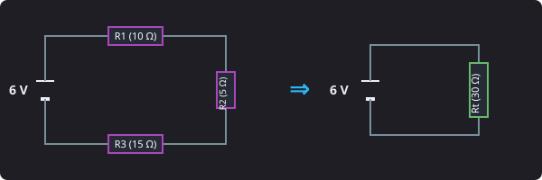
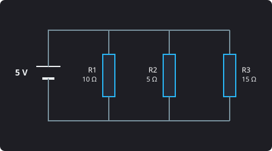
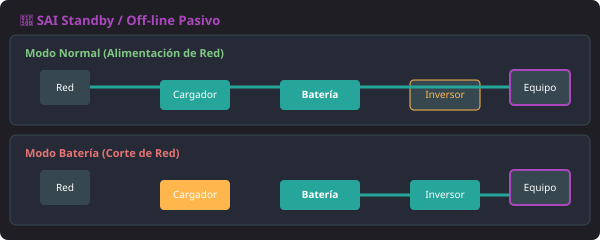

<h1 style="color: #ab47bc;">⚡ Tema 1 — Medición de Parámetros Eléctricos</h1>

<h2 style="color: #29b6f6;">1.1. Concepto de Electricidad y Tipos de Señales</h2>

- **Electricidad:** Flujo de cargas eléctricas utilizado como fuente de energía para el funcionamiento de los dispositivos que integran un sistema informático.
- **Señales:** Representaciones eléctricas o electromagnéticas de los datos. Se clasifican en:
  - **Analógicas:** Varían de forma continua a lo largo del tiempo. Pueden tomar infinitos valores dentro de un rango.
  - **Digitales:** Utilizan un número discreto y determinado de niveles de tensión constantes (por ejemplo, dos niveles en las señales binarias: **0** y **1**).

<figure markdown="span">
  
  <figcaption>Figura 1.1 — Representación de una señal digital discreta (niveles 0 y 1).</figcaption>
</figure>

### Métodos de Análisis de Señales
* **Dominio del tiempo:** Analiza las variables temporales de la señal mediante los parámetros de **amplitud**, **frecuencia** y **fase**.
* **Dominio de la frecuencia:** Descompone la señal en sus componentes sinusoidales de distintas frecuencias (mediante la transformada de Fourier) para analizar su frecuencia y amplitud.

---

<h2 style="color: #29b6f6;">1.2. Magnitudes Eléctricas Básicas y Fórmulas</h2>

* **Carga eléctrica:** Exceso o defecto de electrones que posee un objeto debido al flujo de electrones entre átomos. Los átomos se cargan eléctricamente formando **iones** al ganar o perder electrones.
  - **Equivalencia física:** 1 culombio = $6,3 \cdot 10^{18}$ electrones.
* **Voltaje / Tensión eléctrica (V):** 
  - Un átomo con más electrones que protones tiene potencial eléctrico negativo (**ion negativo**).
  - Un átomo con menos electrones que protones tiene potencial eléctrico positivo (**ion positivo**).
  - La diferencia de potencial entre dos cuerpos indica la diferencia de cargas entre ellos y se mide en **voltios (V)**. El paso de electrones entre cuerpos constituye la corriente eléctrica.
* **Intensidad (I):** Cantidad de corriente que atraviesa un conductor en un tiempo determinado. Se mide en **amperios (A)** mediante un **amperímetro**.
* **Resistencia (R):** Oposición al paso de la corriente eléctrica. Se mide en **ohmios (Ω)** utilizando un **ohmímetro**.
* **Potencia (P):** Magnitud que relaciona el trabajo realizado con el tiempo invertido en llevarlo a cabo. Se mide en **vatios (W)**.

---

### Formulario Principal (Ley de Ohm y Potencia)

$$I = \frac{V}{R} \quad \iff \quad V = I \cdot R$$

$$P = V \cdot I$$

---

<h2 style="color: #29b6f6;">1.3. Tipos de Corriente Eléctrica</h2>

* **Corriente Continua o Directa (**C.C.** / **DC** - ***D***irect ***C***urrent):** Flujo de electrones que circula siempre en la misma dirección a través de un conductor con tensión constante.

<figure markdown="span">
  
  <figcaption>Figura 1.2 — Comportamiento de la Corriente Continua (D.C.).</figcaption>
</figure>

* **Corriente Alterna (**A.C.** / **AC** - ***A***lternating ***C***urrent):** Cambia **periódicamente la polaridad** en los extremos del conductor y el sentido del flujo de electrones, dibujando una onda cíclica que se repite en el tiempo (periodo).

<figure markdown="span">
  
  <figcaption>Figura 1.3 — Onda senoidal cíclica de la Corriente Alterna (A.C.).</figcaption>
</figure>

### Parámetros de la Onda de Corriente Alterna
- **Frecuencia (f):** Número de ciclos completos por segundo (se mide en Hertzios, **Hz**). Es el intervalo de corriente desde que la onda pasa por un punto concreto hasta que vuelve a pasar por ese mismo punto.
- **Amplitud:** Distancia máxima entre el punto medio de la onda y su punto más alejado (**cresta** o **valle**).

---

<h2 style="color: #29b6f6;">1.4. Instrumentos de Medida y Conexión en Circuito</h2>

- **Voltímetro (Medición de Tensión):** Se conecta en PARALELO con el componente. En corriente continua (donde existe polarización), se coloca el cable rojo en el polo positivo (+) y el negro en el negativo (-).
- **Amperímetro (Medición de Intensidad):** Se conecta en SERIE, lo que exige **abrir el circuito** e intercalar el aparato con el componente.
- **Polímetro / Multímetro:** Dispositivo electrónico capaz de medir distintas magnitudes mediante un conmutador selector (tensiones en AC/DC, intensidades en AC/DC y resistencias).

### Tipos de Multímetros
1. **Analógicos:** Representan los valores mediante una aguja o varilla que se desplaza sobre una escala impresa.
2. **Digitales:** Muestran los datos numéricos de forma directa en una pantalla o display LCD.

---

### Análisis de Circuitos Eléctricos

| Propiedad | Circuito en **Serie** (Un único camino) | Circuito en **Paralelo** (Elementos interconectados) |
| :--- | :--- | :--- |
| **Intensidad (I)** | Es la misma en todos los elementos: $I_t = I_1 = I_2 = I_3 = \dots$ | La intensidad total es la suma de las ramas: $I_t = I_1 + I_2 + I_3 + \dots$ |
| **Tensión (V)** | La tensión total es la suma de cada caída: $V_t = V_1 + V_2 + V_3 + \dots$ | Todos los elementos tienen la misma tensión: $V_t = V_1 = V_2 = V_3 = \dots$ |
| **Resistencia (R)** | Suma directa de resistencias: $R_t = R_1 + R_2 + R_3 + \dots$ | Suma inversa de resistencias: $\frac{1}{R_t} = \frac{1}{R_1} + \frac{1}{R_2} + \frac{1}{R_3} + \dots$ |

---

### 📐 Ejercicios Prácticos Resueltos

!!! example "Ejercicio 1: Circuito en Serie"
    

    **Datos:** $V_t = 6\text{ V}$, $R_1 = 10\ \Omega$, $R_2 = 5\ \Omega$, $R_3 = 15\ \Omega$

    * **Paso 1: Resistencia Total ($R_t$):**  
      $R_t = R_1 + R_2 + R_3 = 10 + 5 + 15 = \mathbf{30\ \Omega}$
    * **Paso 2: Intensidad Total ($I_t$):**  
      $I_t = \frac{V_t}{R_t} = \frac{6\text{ V}}{30\ \Omega} = \mathbf{0,2\text{ A}}$ *(Idéntica en todas las ramas: $I_1 = I_2 = I_3 = 0,2\text{ A}$)*
    * **Paso 3: Caídas de Tensión Individuales:**  
      $V_1 = I_1 \cdot R_1 = 0,2 \cdot 10 = \mathbf{2\text{ V}}$  
      $V_2 = I_2 \cdot R_2 = 0,2 \cdot 5 = \mathbf{1\text{ V}}$  
      $V_3 = I_3 \cdot R_3 = 0,2 \cdot 15 = \mathbf{3\text{ V}}$
    * **Paso 4: Verificación:**  
      $V_t = V_1 + V_2 + V_3 = 2 + 1 + 3 = \mathbf{6\text{ V}} \quad \checkmark$

!!! info "Ejercicio 2: Circuito en Paralelo"
    

    **Datos:** $V_t = 5\text{ V}$, $R_1 = 10\ \Omega$, $R_2 = 5\ \Omega$, $R_3 = 15\ \Omega$

    * **Paso 1: Tensiones Individuales:**  
      Misma tensión en todas las ramas: $V_t = V_1 = V_2 = V_3 = \mathbf{5\text{ V}}$
    * **Paso 2: Intensidades Individuales ($I = \frac{V}{R}$):**  
      $I_1 = \frac{5}{10} = \mathbf{0,5\text{ A}}$  
      $I_2 = \frac{5}{5} = \mathbf{1\text{ A}}$  
      $I_3 = \frac{5}{15} \approx \mathbf{0,33\text{ A}}$
    * **Paso 3: Intensidad Total ($I_t$):**  
      $I_t = I_1 + I_2 + I_3 = 0,5 + 1 + 0,33 = \mathbf{1,83\text{ A}} \quad \checkmark$
---

<h2 style="color: #29b6f6;">1.5. Bloques de una Fuente de Alimentación</h2>

La fuente de alimentación conecta el equipo a la red eléctrica y a la placa base, **transformando la corriente alterna (230V AC) en continua (DC)** mediante 4 bloques consecutivos:

1. **Transformador:** Dispositivo electromagnético que **reduce el voltaje** de la señal de entrada en corriente alterna manteniendo la misma frecuencia. Consta de dos bobinas aisladas:
   - *Bobina primaria:* Recibe la señal eléctrica de entrada de la red.
   - *Bobina secundaria:* Entrega el voltaje transformado y reducido.
2. **Rectificador:** Convierte la señal alterna (con polaridad positiva y negativa) en una señal **únicamente positiva**.
   - *Media onda:* Utiliza 1 solo diodo y transforma los semiciclos negativos en tensión nula.
   - *Onda completa:* Utiliza 2 o 4 diodos (puente de diodos) y transforma los semiciclos negativos en positivos.
3. **Filtro:** Formado por uno o varios **condensadores** que retienen la corriente y la van liberando lentamente para aplanar y suavizar la señal hasta hacerla casi continua.
4. **Regulador:** **Estabiliza por completo** la señal filtrada para mantener el voltaje de salida constante sin que le afecten las variaciones de la señal de entrada o la carga.

---

<h2 style="color: #29b6f6;">1.6. Especificaciones Técnicas de la Fuente de Alimentación</h2>

- **Potencia:** Se mide en **vatios (W)** (modelos comerciales de 500W, 600W, 1000W+). Debe dimensionarse según el consumo: si es escasa, generará sobrecalentamiento y ruido; si es holgada, trabajará en su curva de mejor rendimiento.
- **Eficiencia:** Porcentaje fijado por el fabricante que relaciona la potencia aprovechada frente a la desaprovechada (disipada en calor). Se considera aceptable a partir del 80% de eficiencia (Certificaciones 80 PLUS).
- **Factores condicionales:** Formato físico (determina la compatibilidad con la caja: ATX, SFX), variedad de conectores disponibles (SATA, PCIe, ATX 24 pines) y efectividad o ruido del ventilador.

---

<h2 style="color: #29b6f6;">1.7. Anomalías de la Red Eléctrica y Sistemas de Alimentación Ininterrumpida (SAI / UPS)</h2>

### Anomalías Eléctricas Comunes
* **Apagones:** Pérdida total del suministro eléctrico.
* **Caídas de tensión:** Bajadas repentinas de voltaje en un espacio corto de tiempo.
* **Bajo voltaje:** Tensión por debajo del nivel recomendado durante un periodo prolongado.
* **Picos de tensión:** Subidas repentinas y bruscas de voltaje en un espacio corto de tiempo.
* **Sobrevoltajes:** Subidas de voltaje durante un periodo prolongado.
* **Ruido eléctrico:** Interferencias o parásitos que se acoplan a la señal principal alterándola.

---

### Sistemas de Alimentación Ininterrumpida (SAI / UPS)

Dispositivo que proporciona alimentación a los equipos cuando ocurre un corte de corriente. En funcionamiento normal filtra la señal eléctrica y recarga sus baterías. Su autonomía es limitada (medida en minutos) para garantizar el tiempo suficiente para realizar un apagado adecuado y seguro.

#### Bloques Internos de un SAI
- **Batería y cargador:** Almacenan la energía (habitualmente baterías de 12V).
- **Filtro:** Elimina las interferencias y picos de la señal.
- **Conversor:** Transformador que adapta los niveles de tensión de corriente continua.
- **Inversor:** Circuito que **convierte la corriente continua (DC) de las baterías en corriente alterna (AC)** para los equipos.
- **Conmutador:** Circuito que cambia el suministro de la red eléctrica por el de la batería de forma automática.

#### Tipos de SAI
<h4 style="color: #29b6f6;">1. SAI Standby / Off-line Pasivo</h4>
Conectado en paralelo a la corriente; **solo se activa en caso de apagón o caída drástica de tensión** (existe un pequeño microsegundo de conmutación).

<figure markdown="span">
  
  <figcaption>Figura 1.4 — Esquema de funcionamiento de un SAI Off-line Pasivo.</figcaption>
</figure>

<h4 style="color: #29b6f6;">2. SAI Off-line Interactivo (Line-Interactive)</h4>
Conectado en serie; permanece siempre preparado y cuenta con un regulador de tensión (**AVR** - ***A***utomatic ***V***oltage ***R***egulator) que protege contra sobrevoltajes y picos sin gastar batería.

<figure markdown="span">
  
  <figcaption>Figura 1.5 — Esquema de un SAI Interactivo con regulador AVR.</figcaption>
</figure>

<h4 style="color: #29b6f6;">3. SAI On-line de Doble Conversión</h4>
La conversión se efectúa continuamente desde el inversor (AC -> DC -> AC). Ofrece máxima calidad de filtrado, aislamiento total de la red y cero tiempo de conmutación. Ideal para servidores.

<figure markdown="span">
  
  <figcaption>Figura 1.6 — Esquema de un SAI On-line de Doble Conversión.</figcaption>
</figure>

#### Parámetros de Medida en un SAI
- **Tiempo de autonomía:** Tiempo (en minutos) que el SAI mantiene con vida los equipos sin red de entrada.
- **Potencia Real (W):** Potencia en vatios consumida realmente por los equipos.
- **Potencia Aparente (VA):** Resultado de multiplicar Voltios por Amperios ($V \times A$).
- **Factor de Potencia (FP):** Relación entre vatios y voltamperios ($\frac{W}{VA}$). Su valor se sitúa siempre **entre 0 y 1**.

---

<h2 style="color: #29b6f6;">1.8. Medición de Señales de Control de un SAI</h2>

Un SAI profesional dispone de salidas de comunicación de control (puerto serie / USB / red) hacia el equipo:

1. **Primera salida (Señal de fallo de red):** Identifica cuando el SAI pasa a modo batería. Permite al sistema operativo iniciar automáticamente un script de apagado seguro, cerrar aplicaciones y desactivar la fuente.
2. **Segunda salida (Señal de batería baja):** Emite una advertencia crítica indicando que la reserva de energía de la batería está a punto de agotarse.

--8<-- "docs/includes/glosario.md"
