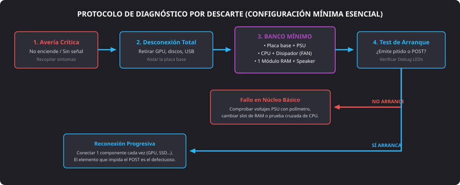

<h1 style="color: #ab47bc;">🛠️ Tema 10 — Mantenimiento de Equipos Microinformáticos y Gestión de Incidencias</h1>

<h2 style="color: #29b6f6;">10.1. Mantenimiento Preventivo</h2>

El **mantenimiento preventivo** abarca el conjunto sistemático de intervenciones físicas, limpiezas técnicas y revisiones periódicas efectuadas sobre el hardware y las condiciones del entorno del ordenador. Su finalidad es prolongar la vida útil de los circuitos integrados, evitar el sobrecalentamiento y minimizar la probabilidad de paradas imprevistas antes de que se manifieste una avería destructiva.

### 10.1.1. Control del Entorno Físico de Trabajo
* **Ventilación y circulación de aire:** Disponer las torres en espacios abiertos preservando un espacio de desahogo perimetral (al menos $10\text{ a }15\text{ cm}$) alrededor de las tomas frontales, laterales y traseras. Evitar encajonar la caja en huecos ciegos de mesas que originen bolsas de calor estancado.
* **Protección frente a radiación solar directa:** Orientar el chasis fuera de la trayectoria directa de ventanas. La exposición solar eleva la temperatura interna de manera pasiva y acelera la degradación y fragilidad de los componentes plásticos y aislantes de mangueras de cables.
* **Aislamiento de campos magnéticos:** Alejar altavoces de gran bobinado, transformadores electromagnéticos o motores industriales. Las radiaciones magnéticas intensas pueden desalinear los cabezales o corromper irreversiblemente la estructura de pistas y sectores en **discos duros magnéticos (SATA/HDD)**.

---

### 10.1.2. Hábitos Operativos y Buenas Prácticas
* **Prohibición de alimentos y bebidas:** Vetar el consumo de líquidos y comida en las inmediaciones del puesto técnico. El derrame accidental de un fluido conductor sobre la botonera, teclado o ranuras de ventilación desencadena cortocircuitos masivos inmediatos. En caso de vertido fortuito, se debe desconectar instantáneamente la toma eléctrica de red.
* **Descarga estática continua:** Mantener un entorno libre de cargas electrostáticas (**ESD**) utilizando calzado con suela semiconductora y evitando frotamientos sobre moquetas sintéticas durante la manipulación de componentes.

---

### 10.1.3. Limpieza Interna y Control Térmico
* **Optimización de caudales internos:** Configurar una ventilación en presión positiva o neutra combinando un ventilador frontal inferior (introducción de aire fresco) con un ventilador trasero superior (extracción forzada del aire caldeado).
* **Peinado y gestión de cables:** Agrupar y embridar el cableado sobrante en el reverso de la bandeja de la placa base mediante **bridas** de plástico, evitando que mangueras sueltas obstruyan el tiro de aire o rocen con las aspas de ventilación.
* **Periodicidad de la revisión:** Ejecutar una limpieza técnica integral del chasis cada **6 a 12 meses**, incrementando la frecuencia en ambientes industriales o talleres con alta concentración de polvo ambiental.

#### Instrumental Técnico de Limpieza Recomendado
* **Bote de aire comprimido o soplador:** Expulsión de partículas y pelusas acumuladas entre las aletas de aluminio del **disipador**, aspas de ventiladores y componentes de la **fuente de alimentación**. Se deben inmovilizar mecánicamente las aspas con el dedo al soplar para evitar que el giro forzado actúe como un alternador e introduzca voltaje inductivo a la placa base.
* **Brocha o pincel antiestático (cerdas de nylon/fibra):** Remoción de suciedad adherida sobre el circuito impreso (**PCB**) y zócalos sin riesgo de transferir electricidad estática.
* **Aspiradora de taller de bajo caudal:** Recogida de polvo ambiental en suspensión en el fondo de la caja, evitando tocar componentes electrónicos directamente.
* **Goma de borrar sintética blanda:** Útil clásico para frotar los contactos dorados de módulos de memoria **RAM** o tarjetas **PCI-Express**. Elimina eficazmente las películas microscópicas de sulfatación y óxido que originan falsos contactos e inestabilidad en los buses.

---

<h2 style="color: #29b6f6;">10.2. Ampliaciones de Hardware</h2>

Una ampliación de hardware consiste en la sustitución estratégica o adición de nuevos componentes físicos para elevar el techo operativo de un equipo amortizado, adaptándolo a demandas recientes sin afrontar el coste íntegro de sustitución del sistema.

### Factores Condicionantes y Arquitectura
* **El manual de la placa base como factor limitante:** Dictamina de forma irrefutable el catálogo de actualizaciones viables: zócalo (**socket**) admitido, familias de procesadores soportadas mediante versiones de firmware **UEFI/BIOS**, número de ranuras **DIMM** vacías, estándares de memoria admitidos (**DDR4 / DDR5**) y ancho de banda en líneas **PCI-Express**.
* **Sobremesa (*Desktops*) frente a Portátiles (*Laptops*):**
    * **Equipos de sobremesa:** Arquitectura altamente modular y desmontable. Admiten la actualización individualizada de tarjeta gráfica, fuente de alimentación, añadir bancos de memoria RAM o incorporar tarjetas controladoras adicionales.
    * **Equipos portátiles:** Elevado grado de integración superficial (**BGA**). La CPU y los chips gráficos están soldados al circuito impreso, restringiendo habitualmente el margen de ampliación a sustituir la unidad de almacenamiento (**SSD NVMe M.2**) o incrementar la memoria RAM si cuenta con ranuras **SO-DIMM** libres.

---

<h2 style="color: #29b6f6;">10.3. Mantenimiento Correctivo y Detección de Averías</h2>

El **mantenimiento correctivo** aglutina las maniobras técnicas de localización, reparación, sustitución y reajuste de componentes que han experimentado fallos totales o intermitencias, restaurando el funcionamiento nominal del ordenador.

<figure markdown="span">
  
  <figcaption>Figura 10.1 — Procedimiento de aislamiento técnico mediante configuración mínima esencial para diagnóstico por descarte.</figcaption>
</figure>

### 10.3.1. Protocolo de Ensayo y Configuración Mínima
Ante averías bloqueantes en las que el equipo no completa el encendido, la técnica estándar consiste en el aislamiento por descarte:

1. **Recogida y observación de síntomas:** Registrar ruidos anormales de rodamientos, olores a baquelita quemada, ciclos continuos de reinicio (*boot loop*) o ausencia absoluta de corriente.
2. **Desconexión periférica e interna:** Retirar todas las unidades de almacenamiento, tarjetas de expansión secundarias, cables del panel frontal accesorios y dispositivos USB.
3. **Arranque en banco mínimo esencial:** Conectar exclusivamente:
    * **Placa base** sobre una superficie aislante.
    * **Fuente de alimentación** comprobada.
    * **Microprocesador** con su conjunto disipador y ventilador (**CPU_FAN**).
    * Un único módulo de memoria **RAM** en la ranura preferente.
    * Altavoz de diagnóstico (**speaker**) o lectura de los diodos **Debug LEDs**.
4. **Reconexión secuencial:** Si el banco básico supera el arranque, apagar y reconectar los componentes descartados de uno en uno hasta reproducir el fallo, localizando de forma unívoca el elemento averiado.

---

### 10.3.2. Diagnóstico en el Arranque (Test POST)
Durante la fase de comprobación inicial por hardware (**POST**), la placa base emite mensajes de estado antes de cargar el sistema operativo:

* **Secuencias acústicas por altavoz (*Speaker*):**
    * **Un pitido corto:** Verificación de hardware superada con éxito.
    * **Pitidos continuos o ininterrumpidos:** Fallo crítico en el suministro de energía de la fuente o sobrecalentamiento grave en la CPU.
    * **Patrones combinados (ej. 1 largo y 2/3 cortos):** Error de direccionamiento en la memoria RAM o imposibilidad de inicializar la controladora gráfica.
* **Indicadores visuales integrados (*Debug LEDs*):** Cuatro microdiodos en la placa base que se apagan secuencialmente al validar cada subsistema: `CPU` $\rightarrow$ `DRAM` $\rightarrow$ `VGA` $\rightarrow$ `BOOT`. Si la secuencia se detiene en uno de ellos de forma fija, identifica el componente causante del bloqueo.
* **Mensajes en pantalla:** Avisos alfanuméricos directos del firmware (ej. *"CMOS Checksum Error"*, *"Disk Boot Failure"*, *"CPU Fan Error"*).

---

<h2 style="color: #29b6f6;">10.4. Matriz de Resolución de Averías Comunes</h2>

| Componente | Síntomas Observados | Causa Probable | Solución Técnica Aplicable |
| :--- | :--- | :--- | :--- |
| **Conexiones y Cableado** | El equipo permanece inerte o los discos no aparecen en el firmware. | Cable de corriente desconectado, interruptor de la PSU en `0` o conector SATA flojo. | Comprobar enchufes, reasentar las mangueras de corriente continua y verificar el cable plano de datos SATA. |
| **Fuente de Alimentación** | Ausencia total de energía, apagados súbitos bajo carga o zumbidos eléctricos. | Raíl de $+12\text{ V}$ degradado, condensadores agotados o ventilador de la fuente gripado. | Evaluar tensiones con el **polímetro**, realizar puente de arranque verde-negro (*paperclip test*) o sustituir la PSU. |
| **Placa Base** | Ventiladores giran pero el sistema no emite pitidos ni señal POST. | Cortocircuito contra el chasis, condensadores electrolíticos hinchados o microfisuras. | Desmontar fuera de la caja, verificar ausencia de pistas cortadas o sustituir la placa tras prueba cruzada. |
| **Microprocesador** | Apagados automáticos a los pocos segundos o aviso *"CPU Overheating"*. | Disipador mal anclado, pines doblados en el socket o ausencia/degradación de pasta térmica. | Desmontar disipador, enderezar pines con lupa si procede, limpiar y aplicar nueva **pasta térmica**. |
| **Pila de la CMOS (CR2032)** | Pérdida de la hora/fecha al desenchufar de la pared y mensaje *"CMOS Checksum Error"*. | Tensión de la pila de litio por debajo del umbral de trabajo ($< 2.8\text{ V}$). | Sustituir la pila de botón por una nueva pila **CR2032** de $3\text{ V}$ y reajustar los perfiles en la BIOS/UEFI. |
| **Ventiladores** | Traqueteo mecánico, vibraciones o mensaje *"CPU Fan Error"* en pantalla. | Desgaste en rodamientos, suciedad adherida o conexión en un cabezal erróneo. | Limpiar con aire comprimido, lubricar eje o conectar obligatoriamente a la toma serigrafiada como **CPU_FAN**. |
| **Memoria RAM** | Ráfaga de pitidos al encender, reinicios cíclicos o pantallas azules (**BSOD**). | Módulo desalineado en el zócalo DIMM o sulfatación en los contactos dorados. | Extraer el módulo, limpiar los terminales con una goma de borrar sintética y reinsertar hasta oír el clic. |
| **Almacenamiento (HDD/SSD)** | Mensaje *"Disk Boot Failure"*, cuelgues del sistema o clics mecánicos continuos. | Cable SATA defectuoso, sectores mecánicos reasignados o celdas de memoria agotadas. | Cambiar cable SATA de puerto, verificar detección en BIOS y examinar los atributos de salud **S.M.A.R.T.** |

---

<h2 style="color: #29b6f6;">10.5. Gestión e Informe de Incidencias</h2>

En entornos de soporte empresarial, la atención a averías se organiza mediante procedimientos formales que aseguran la trazabilidad, el control del inventario y la satisfacción del usuario.

### 10.5.1. Estructura Organizativa del Soporte Técnico
* **CAU (Centro de Atención al Usuario):** Servicio de primer nivel (*Helpdesk* / Nivel 1). Actúa como punto único de contacto (SPOC) para registrar solicitudes, recabar síntomas preliminares, categorizar el impacto y emitir el tique de servicio (*ticket*).
* **SAT (Servicio de Asistencia Técnica):** Departamento especializado (Nivel 2 y Nivel 3) provisto de instrumental y banco de pruebas. Asume el diagnóstico profundo, sustitución de componentes averiados, microelectrónica y reinstalación de software de base.

---

### 10.5.2. Modalidades de Intervención Técnica
* **Asistencia Telefónica:** Guía verbal estructurada orientada a que el usuario verifique comprobaciones elementales (tomas eléctricas, encendido de regletas, conexión de cables de vídeo).
* **Control Remoto:** Conexión interactiva a distancia mediante software autorizado a través de la red local o Internet para examinar controladores, registros de eventos del sistema o actualizar el firmware sin traslados.
* **Intervención Presencial (*In Situ*):** Desplazamiento del técnico al puesto de trabajo físico o laboratorio para ejecutar maniobras mecánicas sobre el chasis y sustituir piezas dañadas.

---

### 10.5.3. El Parte y el Informe de Incidencias
Todo proceso técnico concluye formalmente con la redacción del **informe de incidencias**, el cual debe incluir obligatoriamente los siguientes campos:

1. **Datos administrativos y de control:** Identificador único de incidencia (*Ticket ID*), fecha/hora de recepción, asignación y cierre técnico.
2. **Filiación del usuario y equipo:** Nombre del empleado solicitante, departamento, ubicación física de la máquina y número de serie del componente intervenido.
3. **Descripción de la incidencia:** Detalle cronológico del fallo experimentado por el cliente y reproducibilidad observada por el soporte.
4. **Acciones técnicas efectuadas:** Registro del método de diagnóstico aplicado, relación de piezas sustituidas (con referencia de almacén) y pruebas de estrés superadas.
5. **Aceptación y conformidad:** Horas de mano de obra invertidas, desglose de materiales y firma de conformidad del cliente para autorizar el cierre definitivo del caso.

--8<-- "docs/includes/glosario.md"
