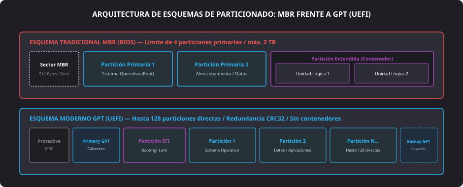

<h1 style="color: #ab47bc;">💿 Tema 11 — Instalación de Programas y Despliegue de Sistemas</h1>

<h2 style="color: #29b6f6;">11.1. Tipos de Instalaciones de Software</h2>

El despliegue de sistemas operativos y suites de aplicaciones requiere adaptar la metodología técnica al volumen del parque informático. En entornos profesionales, los métodos manuales se complementan con procesos desatendidos y clonaciones masivas para garantizar configuraciones homogéneas y acortar los tiempos de parada.

### 11.1.1. Instalaciones Estándar o Completas
* **Concepto técnico:** Procedimiento interactivo convencional efectuado desde cero sobre un equipo recién ensamblado o formateado.
* **Secuencia operativa:**
    1. Ensamblaje del hardware e inserción del soporte físico de instalación (**memoria USB booteable** o soporte óptico).
    2. Acceso a la utilidad de configuración de la **BIOS / UEFI** para priorizar el dispositivo de arranque (**Boot Order**).
    3. Ejecución del asistente gráfico: particionado manual del disco de almacenamiento, selección de la partición de destino y formateo con el sistema de archivos correspondiente.
    4. Copia de binarios base, reinicio y posterior instalación y actualización manual de los **controladores (drivers)** de cada subsistema (chipset, gráfica, red y audio).

---

### 11.1.2. Sistemas Preinstalados con Partición de Recuperación
* **Finalidad:** Técnica implantada por fabricantes de equipos originales (**OEM**) para acelerar la restauración técnica a valores de fábrica sin requerir soportes físicos externos y blindar las licencias de software preactivadas.
* **Funcionamiento:** Se genera una imagen comprimida del sistema operativo configurado junto con sus controladores propietarios y software corporativo. Esta imagen se almacena en una **partición oculta de recuperación** (*Recovery Partition*) dentro de la propia unidad de almacenamiento, accesible durante el arranque mediante combinaciones especiales de teclado (como ++f11++ o ++alt+f10++).

---

### 11.1.3. Instalaciones Desatendidas (*Unattended Setup*)
* **Automatización integral:** Despliegue donde el instalador omite la interacción humana respondiendo de forma programada a todas las preguntas del asistente.
* **Archivo de respuesta (*Answer File*):** Fichero estructurado (generalmente en formato XML o texto plano, como `autounattend.xml` en entornos Windows o esquemas *Kickstart/Preseed* en GNU/Linux). Contiene los parámetros obligatorios preconfigurados: clave de licencia, particionado de disco, idioma, huso horario, usuario inicial y ajustes de red.
* **Comportamiento ante omisiones:** Si el instalador requiere un dato no declarado en el archivo de respuesta, detiene la ejecución automática y muestra la ventana de diálogo para que el técnico lo introduzca manualmente.

---

<h2 style="color: #29b6f6;">11.2. Instalaciones Masivas y Herramientas de Preinstalación</h2>

Las instalaciones masivas resuelven el despliegue simultáneo de sistemas operativos y software ofimático en decenas de ordenadores a través de la infraestructura de red local o mediante clonación de soportes.

#### Personalización mediante Software de Preinstalación
Existen herramientas especializadas (como *RT7 Lite*, *NTLite* o kits de evaluación tipo Windows ADK) orientadas a modificar y recompilar **imágenes ISO** maestras antes del volcado:

* **Personalización del entorno gráfico:** Inclusión de fondos corporativos predeterminados, menús de inicio unificados y eliminación de aplicaciones de consumo (*bloatware*).
* **Optimización de servicios:** Deshabilitación de procesos innecesarios en segundo plano, supresión de componentes heredados y configuración de directivas locales de seguridad.
* **Integración nativa (*Slipstreaming*):** Inyección directa de actualizaciones acumulativas de seguridad del sistema operativo, paquetes de controladores de red/almacenamiento masivo y aplicaciones de productividad empaquetadas de serie en la propia imagen de instalación.

---

<h2 style="color: #29b6f6;">11.3. Particionado de Disco y Sistemas de Archivos</h2>

Un disco físico recién salido de fábrica no dispone de una estructura lógica que permita albergar datos. Para su aprovechamiento, es imperativo establecer una tabla de particiones y formatear cada volumen con un **sistema de archivos**.

### 11.3.1. Sistema de Archivos
* **Definición:** Estructura lógica mediante la cual el sistema operativo clasifica, almacena, indexa y recupera los archivos y directorios dentro de una partición.
* **Variantes según plataforma:**
    * **NTFS:** Estándar nativo de Microsoft Windows; incorpora listas de control de acceso (**ACL**), permisos de seguridad, compresión nativa y registro de transacciones (*journaling*).
    * **ext4:** Sistema de archivos consolidado en distribuciones Linux; soporta grandes volúmenes con alta tolerancia a fallos mediante bitácora (*journaling*).
    * **FAT32 / exFAT:** Estándares universales de alta compatibilidad multiplataforma empleados en medios extraíbles USB y tarjetas de memoria.

---

### 11.3.2. Esquemas de Particionado: MBR frente a GPT/EFI

<figure markdown="span">
  
  <figcaption>Figura 11.1 — Comparativa estructural entre el esquema tradicional MBR y la tabla de particiones moderna GPT (asociada a UEFI).</figcaption>
</figure>

* **Esquema MBR (*Master Boot Record*):**
    * Estándar tradicional vinculado a placas con **ROM BIOS**.
    * Límite estructural de **4 particiones primarias** por disco físico o un máximo de 3 primarias y 1 extendida.
    * La **partición extendida** opera exclusivamente como un contenedor lógico que alberga un número indefinido de **unidades lógicas**.
    * El arranque del sistema operativo sólo puede realizarse desde particiones marcadas como activas/primarias.
    * Limitación de direccionamiento por bloques de $32\text{ bits}$, restringiendo el tamaño máximo del disco a $2\text{ TB}$.
* **Esquema GPT (*GUID Partition Table*):**
    * Estándar contemporáneo vinculado a la interfaz de firmware **UEFI**.
    * Permite la creación directa de hasta **128 particiones primarias** independientes por unidad, suprimiendo la necesidad de particiones extendidas y lógicas.
    * Utiliza direccionamiento por bloques de $64\text{ bits}$, admitiendo volúmenes de almacenamiento en el orden de los zettabytes ($ZB$).
    * Aporta alta fiabilidad mediante redundancia cíclica (**CRC32**) y una copia de seguridad automática de la tabla de particiones (*Backup GPT Header*) grabada en los últimos sectores del disco.

---

### 11.3.3. Operaciones Básicas con Particiones
Las suites de administración de almacenamiento permiten gestionar el ciclo de vida de los volúmenes sin destruir los datos almacenados:

* **Creación y formateo:** Asignación de espacio no particionado y estructuración del sistema de archivos con su tamaño de clúster correspondiente.
* **Redimensionamiento dinámico:** Ampliación o reducción del tamaño de una partición aprovechando espacio contiguo sin pérdida de información.
* **Eliminación y unión:** Borrado de estructuras lógicas y consolidación de bloques libres contiguos.
* **Ocultación:** Modificación del identificador de tipo de partición para evitar que el explorador de archivos del usuario la monte automáticamente (mecanismo base de las particiones de recuperación).

---

<h2 style="color: #29b6f6;">11.4. Creación de Imágenes de Disco y Restauración del Sistema</h2>

### 11.4.1. Archivos de Imagen ISO
* **Concepto:** Fichero individualizado estandarizado (norma ISO 9660 / UDF) que contiene una copia sector a sector, estructurada e íntegra del sistema de archivos de un medio óptico o unidad de almacenamiento.
* **Gestión técnica:** Se descargan desde repositorios oficiales o se generan con software técnico para transferirse a memorias flash mediante utilidades de volcado sectorial (como *Rufus* o *Ventoy*).

---

### 11.4.2. Técnicas de Restauración del Sistema
* **Clonación de disco:** Duplicación bit a bit o bloque a bloque de la totalidad de una unidad física hacia otro medio de destino o fichero contenedor de imagen (usando suites como *Clonezilla* o *Macrium Reflect*). Permite la sustitución inmediata de discos averiados o la replicación simultánea en máquinas idénticas.
* **Puntos de restauración:** Instantáneas lógicas automáticas registradas por el sistema operativo que congelan el estado de los archivos del núcleo, el registro y los **controladores (drivers)**. Permiten regresar a un estado funcional previo ante problemas causados por una actualización fallida o la instalación de software corrupto, sin alterar los documentos personales del usuario.

---

<h2 style="color: #29b6f6;">11.5. Opciones de Arranque del Sistema (Boot Order)</h2>

El menú **BOOT** del firmware determina la secuencia jerárquica en la que el sistema interroga a los dispositivos conectados para localizar el cargador del sistema operativo:

* **Unidades internas de estado sólido y discos magnéticos:** Puertos **SATA** y ranuras **NVMe M.2**.
* **Soportes externos USB:** Memorias flash de instalación o discos duros externos booteables.
* **Unidades de lectura óptica:** Dispositivos lectores de CD, DVD o Blu-Ray.
* **Arranque en red (Network / PXE):** Mecanismo de inicialización remota donde la tarjeta de red solicita una dirección por DHCP y descarga la imagen del instalador desde un servidor central (TFTP/WDS), eliminando la necesidad de medios físicos individuales.

---

<h2 style="color: #29b6f6;">11.6. Tablas Comparativas de Despliegue y Particionado</h2>

#### Comparativa de Métodos de Instalación de Software

| Método de Instalación | Grado de Intervención | Ventajas Principales | Inconvenientes / Limitaciones |
| :--- | :--- | :--- | :--- |
| **Estándar / Completa** | **Alta:** Interacción en cada paso del asistente. | Personalización total desde cero y control milimétrico de volúmenes. | Proceso inviable y lento para parques con múltiples ordenadores. |
| **Preinstalación (Recovery)** | **Baja / Nula:** Restauración automatizada por partición. | Recuperación rápida al estado de fábrica y drivers OEM validados. | Consume espacio de almacenamiento permanente en el disco. |
| **Desatendida (*Unattended*)** | **Nula:** Guiada por archivo de respuesta (*script*). | Eliminación de tareas repetitivas y ahorro masivo de horas técnicas. | Exige la redacción y prueba previa del archivo de automatización. |
| **Masiva / Clonación** | **Nula:** Volcado de imagen por bloque o red **PXE**. | Despliegue simultáneo y homogéneo en decenas de puestos. | Requiere hardware idéntico para evitar conflictos de controladores. |

---

#### Comparativa de Esquemas de Particionado: MBR vs. GPT

| Característica | Esquema MBR (*Master Boot Record*) | Esquema GPT (*GUID Partition Table*) |
| :--- | :--- | :--- |
| **Límite de particiones** | Máximo **4 particiones primarias** (o 3 primarias + 1 extendida). | Hasta **128 particiones primarias** directas por unidad. |
| **Estructura jerárquica** | Requiere una partición extendida contenedora de unidades lógicas. | Particiones lineales homogéneas sin necesidad de contenedores. |
| **Tamaño máximo de disco** | Limitado a **$2\text{ TB}$** por direccionamiento de 32 bits. | Soporta volúmenes teóricos de hasta **$9.4\text{ ZB}$** (64 bits). |
| **Firmware requerido** | Compatible con **ROM BIOS** tradicional y modo UEFI-CSM. | Requiere **UEFI** nativo y partición del sistema EFI (**ESP**). |
| **Seguridad y redundancia** | Sin comprobación de integridad; sector único de arranque sin copia. | Sumas de verificación **CRC32** y cabecera de respaldo al final del disco. |
| **Arranque del sistema** | Exclusivamente desde particiones marcadas como activas. | Desde cualquier partición registrada con ejecutable de arranque. |

--8<-- "docs/includes/glosario.md"
