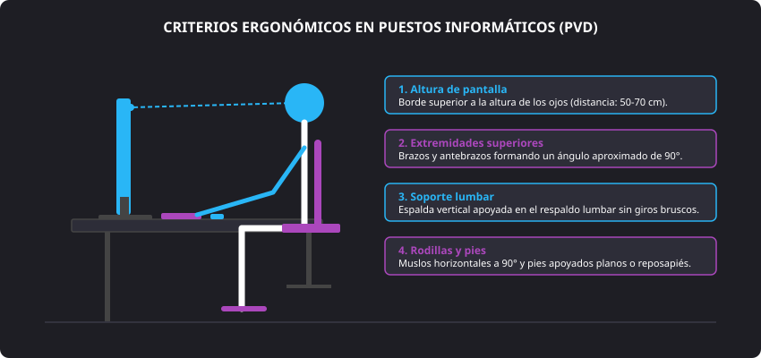

<h1 style="color: #ab47bc;">🔒 Tema 2 — Cumplimiento de las Normas de Prevención de Riesgos Laborales y Ambientales</h1>

<h2 style="color: #29b6f6;">2.1. Cumplimiento de la Normativa de Prevención de Riesgos Laborales</h2>

En las tareas de montaje y mantenimiento de equipos microinformáticos es indispensable aplicar rigurosamente las medidas de prevención de riesgos laborales debido a la manipulación directa de líneas de corriente, herramientas cortantes y componentes electrónicos de alta sensibilidad.

#### Conceptos Fundamentales
* **Prevención:** Conjunto de actividades o medidas adoptadas o previstas en todas las fases de actividad de la empresa con el fin de evitar o disminuir los riesgos derivados del trabajo.
* **Daños derivados del trabajo:** Enfermedades, patologías o lesiones corporales sufridas con motivo u ocasión del trabajo prestado.
* **Condiciones de trabajo:** Cualquier característica del puesto de trabajo (instalaciones, agentes físicos o químicos, procedimientos operativos y organización) susceptible de influir en la generación de riesgos para la seguridad y salud del personal técnico.

#### Marco Legal Regulador
* **Constitución Española de 1978 (Artículo 40.2):** Establece el mandato constitucional que encomienda expresamente a los poderes públicos velar por la seguridad e higiene en el puesto de trabajo.
* **Estatuto de los Trabajadores (Artículo 19):** Reconoce formalmente el derecho de los asalariados a una protección eficaz en materia de seguridad y salud laboral, emparejado con su deber correlativo de cumplir las instrucciones y normas de prevención.
* **Ley 31/1995 de Prevención de Riesgos Laborales (LPRL):** Norma marco que define los derechos, responsabilidades de la dirección y obligaciones técnicas en las empresas.

---

<h2 style="color: #29b6f6;">2.2. Técnicas de Prevención e Identificación de Causas de Accidentes</h2>

Las técnicas preventivas se estructuran según el área específica de la salud, seguridad o bienestar sobre la que actúan:

* **Seguridad en el trabajo:** Conjunto de técnicas que inciden directamente sobre las condiciones materiales e instalaciones del taller para evitar la aparición de accidentes.
    * **Medidas de prevención:** Actúan sobre el foco emisor para anticiparse a los hechos y erradicar el riesgo.
    * **Medidas de protección:** Destinadas a neutralizar, contener o mitigar las consecuencias de los riesgos que no han podido eliminarse completamente en origen.
* **Higiene industrial:** Técnicas no médicas orientadas a identificar, evaluar y controlar los contaminantes ambientales (físicos como ruido y temperatura; químicos como vapores de soldadura; biológicos) para evitar la aparición de enfermedades profesionales.
* **Ergonomía:** Estudio y adecuación del puesto de trabajo, herramientas manuales y mobiliario a las características físicas, visuales y fisiológicas del técnico.
* **Psicosociología:** Disciplina que evalúa la carga mental, la organización horaria y los factores de estrés laboral derivados de ritmos de trabajo intensos o soporte bajo presión.

#### Principios de la Acción Preventiva
1. Evitar los riesgos en su origen.
2. Evaluar de forma objetiva aquellos riesgos que no se puedan evitar.
3. Combatir los riesgos adoptando soluciones estructurales en origen.
4. Adaptar el puesto de trabajo a la persona (especialmente en mobiliario y pantallas).
5. Tener en cuenta la evolución y actualización técnica de los equipos.
6. Anteponer la protección colectiva frente a la protección individual.
7. Planificar la prevención e impartir la formación técnica preceptiva a los técnicos.

#### Protección Colectiva vs. Protección Individual
* **Protección Colectiva:** Medidas que salvaguardan simultáneamente a toda la plantilla del taller (extractores de humo de soldadura, tomas de tierra del local, interruptores diferenciales y señalización de seguridad).
* **Protección Individual (EPI):** Elementos que porta el técnico de manera exclusiva para protegerse de riesgos residuales específicos (gafas de protección contra esquirlas, guantes anti-corte, calzado de seguridad con suela aislante y pulsera antiestática para disipación de cargas electrostáticas).

---

<h2 style="color: #29b6f6;">2.3. Prevención de Riesgos en el Montaje y Mantenimiento de Equipos</h2>

### 2.3.1. Trabajo con Instalaciones Eléctricas

* **Riesgo de tensión de red ($230\text{ V}$):** El contacto directo o indirecto con conductores activos de la red eléctrica puede provocar electrocución, quemaduras internas de gravedad y fibrilación ventricular. Las sobrecargas y derivaciones en la fuente de alimentación constituyen el principal foco de conato de incendio en el laboratorio.
* **Tensiones internas del equipo ($\pm 5\text{ V}$, $+3.3\text{ V}$, $+12\text{ V}$):** Las líneas secundarias de la fuente de alimentación manejan voltajes de corriente continua que no representan riesgo de electrocución para el ser humano, pero una mala manipulación o un cortocircuito entre pistas puede destruir microchips de la placa base o provocar quemaduras por componentes recalentados.

!!! danger "Protocolo Estricto de Seguridad Eléctrica en Taller"
    * **Desconexión previa:** Desenchufar el cable de corriente de la fuente de alimentación y accionar el interruptor de encendido de la torre durante $5\text{ segundos}$ para descargar los condensadores antes de manipular el interior.
    * **Manos y entorno secos:** Prohibido manipular equipos bajo condiciones de humedad corporal o en bancos de trabajo húmedos.
    * **Manipulación de cables:** Desconectar periféricos y tomas tirando siempre del cabezal aislante del conector, jamás tirando del cable conductor.
    * **Preservación de aislamientos:** Comprobar que no existan mangueras eléctricas peladas ni fuentes de calor externas adyacentes a las rejillas de ventilación.
    * **Cuadros y regletas:** Evitar conectar múltiples regletas en cascada sobre una misma toma de corriente para evitar sobrecalentamientos térmicos en la línea.
    * **Sistemas de extinción:** Disponer en el laboratorio de extintores de $\text{CO}_2$ (dióxido de carbono) o polvo dieléctrico homologados para fuegos de clase eléctrica (nunca utilizar agua).

---

### 2.3.2. Trabajo con Herramientas de Mano
* **Riesgos asociados:** Cortes en manos por carcasas afiladas de chasis metálicos, deslizamiento de destornilladores, proyección de virutas metálicas en ojos al cortar bridas o descargas accidentales.
* **Buenas prácticas:** Utilizar exclusivamente herramientas aisladas homologadas, con mangos antideslizantes y mangos imantados adaptados al paso exacto del tornillo (Philips, Torx). Guardar y desplazar las herramientas en maletines compartimentados.

---

### 2.3.3. Manejo Manual de Cargas
* **Riesgos asociados:** Sobreesfuerzos y patologías dorsolumbares derivados de levantar servidores en rack, sistemas de alimentación ininterrumpida (SAI) pesados o cajas de componentes voluminosas.
* **Técnica de elevación correcta:**
    1. Separar los pies a la anchura de los hombros para asentar la base.
    2. Flexionar las rodillas manteniendo la espalda recta.
    3. Sujetar la carga pegada al cuerpo y elevar con la fuerza de los músculos de las piernas, sin girar el torso durante la maniobra.
    4. Solicitar ayuda coordinada o medios mecánicos para cargas superiores a $25\text{ kg}$.

---

### 2.3.4. Ergonomía en Puestos Informáticos (PVD)

La dedicación prolongada frente a **Pantallas de Visualización de Datos (PVD)** provoca fatiga visual (astenopía), sobrecarga en trapecios y síndrome del túnel carpiano.

<figure markdown="span">
  
  <figcaption>Figura 2.1 — Parámetros posturales para estaciones de trabajo con pantallas de visualización de datos (PVD).</figcaption>
</figure>

* **Criterios posturales esenciales:**
    * **Distancia y altura:** Monitor a una distancia de $50\text{ a }70\text{ cm}$; el borde superior de la pantalla debe quedar al nivel de los ojos o ligeramente por debajo.
    * **Ángulos articulares:** Brazos y antebrazos en ángulo de $90^\circ$ apoyados sobre la mesa; piernas flexionadas a $90^\circ$ con pies apoyados planos en el suelo o sobre reposapiés.
    * **Higiene visual:** Pautas de descanso visual periódicas (regla 20-20-20: cada 20 minutos enfocar a lo lejos durante 20 segundos) y evitar reflejos de luz directa sobre el panel.

---

### 2.3.5. Entorno de Trabajo, Orden y Limpieza
* **Condiciones termohigrométricas:** Mantener el laboratorio con ventilación adecuada, niveles de iluminación homogéneos (mínimo $500\text{ lux}$ sobre el banco de ensamblaje) y temperaturas en el intervalo de $20\text{ a }24^\circ\text{C}$.
* **Orden de cables y bancos de trabajo:** El desorden de cables por el suelo incrementa notablemente las caídas al mismo nivel y el riesgo de arrancar conexiones críticas. Los puestos deben permanecer limpios de recortes metálicos y virutas plásticas.

---

<h2 style="color: #29b6f6;">2.4. Cumplimiento de la Normativa de Protección Ambiental</h2>

Los componentes microinformáticos contienen metales pesados altamente contaminantes (plomo, mercurio, cadmio) y su mantenimiento consume consumibles no biodegradables (tóners, plásticos de embalaje, pilas botón). La gestión responsable de estos desechos es una exigencia legal y medioambiental.

#### 2.4.1. Marco Legal Ambiental
* **Constitución Española de 1978 (Artículo 45):** Consagra el derecho al disfrute de un medio ambiente equilibrado y la obligación colectiva de protegerlo y conservar los recursos naturales.
* **Real Decreto 208/2005 y Real Decreto 110/2015:** Marco normativo sobre aparatos eléctricos y electrónicos y la gestión medioambiental de sus residuos (RAEE).
* **Ley 7/2022 (anterior Ley 22/2011) de Residuos y Suelos Contaminados:** Establece la recogida obligatoria y gratuita de equipos sustituidos por parte de los distribuidores, promoviendo el reciclaje y la valorización de materiales mediante canales homologados.

---

#### 2.4.2. Aplicación de las Tres R y Eficiencia Energética

| Regla | Acción en el Taller de Informática | Caso Práctico Real |
| :--- | :--- | :--- |
| **Reducir** | Minimizar el consumo directo de recursos y consumibles fungibles. | Evitar impresiones innecesarias, digitalizar manuales y agrupar pedidos de componentes para reducir el embalaje. |
| **Reutilizar** | Prolongar al máximo el ciclo de vida de los componentes informáticos. | Reacondicionar módulos de memoria RAM o discos funcionales procedentes de bajas de equipos para su uso en laboratorios de prácticas o donaciones. |
| **Reciclar** | Clasificar y depositar los residuos electrónicos inservibles en puntos autorizados. | Depositar placas base, pilas botón de la placa CMOS y cartuchos de tóner gastados en depósitos de recogida selectiva (puntos limpios). |

!!! tip "Gestión de Eficiencia Energética en Sistemas"
    * Configurar políticas de suspensión y perfiles de energía en los equipos del laboratorio fuera de horario de producción.
    * Desconectar regletas maestras de periféricos al finalizar la jornada técnica para suprimir consumos residuales (*consumo fantasma* o *standby*).
    * Fomentar el uso de fuentes de alimentación con certificación de eficiencia energética reconocida (como la escala *80 PLUS* Bronze, Gold o Platinum).

--8<-- "docs/includes/glosario.md"
