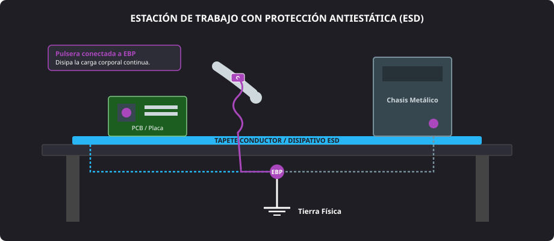

<h1 style="color: #ab47bc;">⚠️ Tema 4 — Precauciones y Advertencias de Seguridad</h1>

<h2 style="color: #29b6f6;">4.1. Riesgos Eléctricos y Electricidad Estática (ESD)</h2>

Previo a cualquier procedimiento de montaje, desmontaje o sustitución de componentes, el personal técnico debe interiorizar los riesgos derivados de la energía electrostática y aplicar protocolos estandarizados para salvaguardar tanto su integridad física como la vida útil de los circuitos integrados.

#### Concepto y Peligros de la Descarga Electrostática
* **Electricidad estática:** Carga eléctrica que permanece en reposo sobre la superficie de materiales aislantes o en el cuerpo humano, acumulada habitualmente por fricción triboeléctrica (rozamiento con suelos sintéticos o vestimenta) o por baja humedad ambiental.
* **Descarga electrostática (ESD):** Transferencia súbita de corriente eléctrica entre dos cuerpos con distinto potencial electrostático al producirse contacto directo o aproximación crítica.
* **Vulnerabilidad del hardware:** Una descarga de escasos voltios —totalmente imperceptible para los sentidos humanos, que solo perciben descargas a partir de los $3000\text{ V}$— resulta suficiente para perforar las capas microscópicas de óxido de los transistores **MOSFET** y dañar microcircuitos en procesadores, módulos de memoria **RAM**, chips de **ROM BIOS** o controladoras de almacenamiento.

<figure markdown="span">
  
  <figcaption>Figura 4.1 — Configuración técnica de una estación de trabajo protegida contra descargas electrostáticas (ESD).</figcaption>
</figure>

#### Elementos de Protección y Aislamiento Antiestático
* **Pulsera antiestática:** Dispositivo conductor sujeto a la muñeca dotado de una resistencia de seguridad (habitualmente de $1\text{ M}\Omega$) que drena gradualmente las cargas electrostáticas hacia la toma de tierra o al chasis metálico sin pintar del equipo, evitando descargas abruptas.
* **Tapete antiestático:** Superficie de trabajo semiconductora conectada al punto común de tierra que permite apoyar placas base y componentes durante las intervenciones sin peligro de acumulación de carga por deslizamiento.
* **Bolsas antiestáticas:** Embalajes específicos diseñados para el transporte y custodia de componentes sensibles:
    * **Bolsas disipativas (rosa/azul):** Tratadas químicamente para no generar carga por rozamiento superficial.
    * **Bolsas metalizadas de blindaje (plateadas):** Crean una jaula de Faraday integral que protege los componentes frente a campos electrostáticos exteriores.

!!! warning "Regla de Oro en la Manipulación de Módulos"
    No extraer ningún componente electrónico (placa base, módulo RAM, microprocesador o tarjeta de expansión) de su bolsa de protección antiestática hasta el instante exacto en que vaya a ser ensamblado en la máquina.

#### Protocolo de Conducta para la Disipación Estática
1. **Descarga manual por contacto:** Si no se dispone puntualmente de pulsera, tocar con ambas manos una zona metálica sin pintar de un chasis enchufado con toma de tierra activa para equiparar potenciales.
2. **Equiparación periódica:** Repetir el contacto con masa metálica de forma recurrente durante montajes prolongados para neutralizar recargas accidentales.
3. **Indumentaria técnica:** Emplear prendas de algodón $100\%$ y suelas conductoras, prescindiendo por completo de jerseys de lana o tejidos acrílicos sintéticos.

---

<h2 style="color: #29b6f6;">4.2. Otros Riesgos en la Manipulación y Ensamblado de Componentes</h2>

El ensamblaje y mantenimiento microinformático reúne factores adicionales de riesgo eléctrico de red, mecánicos y de higiene de contactos que exigen medidas preventivas específicas.

### 4.2.1. Riesgos de la Energía Eléctrica de Red ($230\text{ V}$)
* **Desconexión física total:** Antes de retirar paneles laterales o intervenir el cableado, desenchufar el cable de corriente alterna de la toma mural y conmutar a la posición `0` (**OFF**) el balancín de la fuente de alimentación.
* **Descarga de condensadores residuales:** Tras desconectar el cable de red, presionar el pulsador de encendido (**Power SW**) frontal del chasis durante $5\text{ segundos}$ para vaciar la energía almacenada en los condensadores electrolíticos primarios de la fuente.
* **Prevención de electrocución y cortocircuitos:** Intervenir un equipo bajo tensión expone al técnico a riesgos de fibrilación por $230\text{ V}$ y arriesga la destrucción instantánea de pistas si un tornillo o punta metálica cae sobre la placa encendida.

---

### 4.2.2. Riesgos Mecánicos, Control de Fuerza y Cierres de Seguridad
* **Inserción sin fuerza desmedida:** Los zócalos y ranuras de expansión incorporan muescas guía (*notches*) para impedir inserciones invertidas. Si un componente opone resistencia excesiva, no debe forzarse.
* **Zócalo del microprocesador (Socket):**
    * En sistemas **LGA** (Land Grid Array), alinear con precisión las muescas del procesador sobre el marco y bajar la palanca de retención asegurando una presión uniforme sobre la matriz de pines sin desplazamientos laterales.
    * En sistemas **PGA** (Pin Grid Array), comprobar que los pines del procesador caigan por gravedad en los orificios antes de cerrar la palanca de bloqueo.
* **Módulos de memoria RAM:** Introducir el módulo perpendicularmente en la ranura **DIMM** haciendo coincidir la muesca descentrada; aplicar presión vertical con ambos pulgares en los extremos hasta escuchar el chasquido (*click*) de los pestillos de retención.
* **Separadores de latón del chasis:** Atornillar la placa base única y exclusivamente sobre los postes separadores coincidentes con los taladros reforzados con anillo de masa. Un separador colocado en una posición ciega rozará las soldaduras posteriores de la placa, generando un cortocircuito irreversible al alimentar el equipo.

---

### 4.2.3. Riesgo por Suciedad, Grasa e Higiene Técnica
* **Contaminación por grasa dactilar:** La grasa y el sudor de la dermis contienen sales y ácidos que corroen los terminales dorados y forman capas dieléctricas aislantes que provocan falsos contactos e intermitencias en buses de alta frecuencia (PCI-Express, ranuras DIMM).
* **Pautas de higiene:** Lavar y secar completamente las manos antes de iniciar la jornada técnica y sujetar las tarjetas y placas únicamente por sus bordes exteriores, evitando tocar la matriz de contactos dorados.

---

<h2 style="color: #29b6f6;">4.3. Comparativa de Medidas de Protección en el Laboratorio</h2>

| Elemento / Medida | Tipo de Riesgo que Combate | Función Técnica Principal | Protocolo Correcto de Aplicación |
| :--- | :--- | :--- | :--- |
| **Pulsera antiestática** | Descargas electrostáticas (**ESD**) | Derivar cargas del cuerpo a tierra de manera controlada y continua. | Ceñida a la muñeca y conectada con pinza al punto común de tierra (**EBP**) o metal del chasis. |
| **Tapete antiestático** | Descargas electrostáticas (**ESD**) | Proporcionar una superficie de apoyo equipotencial libre de cargas. | Extendido sobre el banco técnico y conectado al circuito de tierra. |
| **Bolsa antiestática** | Descargas electrostáticas (**ESD**) | Proteger módulos contra acumulación superficial y campos estáticos externos. | Conservar el componente empaquetado hasta el momento inmediato de su montaje. |
| **Desconexión de red** | Electrocución y conato de incendio | Suprimir la presencia de corriente alterna de $230\text{ V}$ en la fuente y chasis. | Desenchufar cable y pulsar el botón frontal de encendido para vaciar condensadores. |
| **Separadores de latón** | Cortocircuitos mecánicos | Mantener distancia física aislante entre el reverso de la placa y la chapa. | Enroscar únicamente en los puntos que coincidan con los orificios perforados de la placa. |
| **Manos limpias y secas** | Corrosión y fallos de contacto | Evitar depositar sales ácidas, humedad y grasa en terminales dorados. | Manipular componentes sujetándolos exclusivamente por los bordes de la placa. |

--8<-- "docs/includes/glosario.md"
