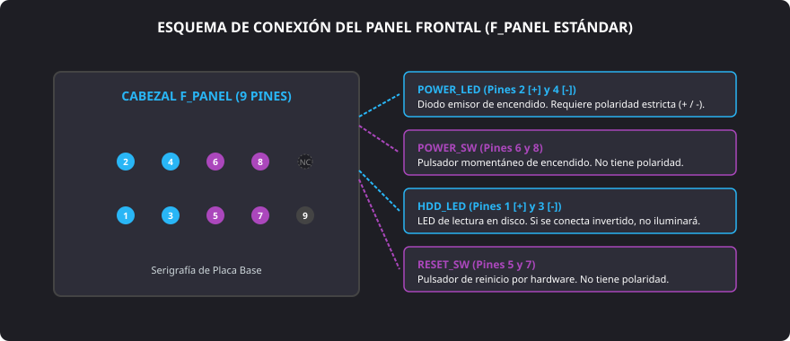

<h1 style="color: #ab47bc;">🧰 Tema 5 — Herramientas Necesarias</h1>

<h2 style="color: #29b6f6;">5.1. Utensilios para el Montaje</h2>

Para llevar a cabo un proceso de ensamblado limpio, sistemático y seguro, el técnico microinformático debe preparar con antelación un banco de trabajo dotado del instrumental físico adecuado. Disponer de las herramientas correctas previene daños mecánicos en los componentes, deformaciones en las cabezas de la tornillería y accidentes laborales por sobreesfuerzo o cortes.

### 5.1.1. Herramientas e Instrumental Imprescindible

* **Destornillador de estrella (*Phillips* / Pozidriv):** Herramienta nuclear de ensamblaje (tamaño habitual PH1 y PH2) utilizada para fijar la placa base sobre los separadores, atornillar la fuente de alimentación, las unidades de almacenamiento y las pletinas de las tarjetas de expansión. Es fundamental que cuente con punta magnetizada y aislamiento para sostener la tornillería métrica fina al operar en cavidades profundas o estrechas del chasis.
* **Pinzas de precisión:** Útiles metálicos o antiestáticos indispensables para sujetar y orientar elementos microscópicos, tales como puentes de configuración (**jumpers**), tornillos caídos sobre pistas de la placa o cabezales diminutos del panel frontal.
* **Tenazas y alicates de corte:** Herramientas de presión y corte empleadas para moldear o enderezar pletinas metálicas, ajustar clips de retención y cortar al ras los extremos plásticos sobrantes de las bridas de sujeción del cableado.
* **Pulsera antiestática:** Dispositivo de protección individual (**EPI**) que se ciñe a la muñeca del técnico y deriva gradualmente a través de una resistencia de $1\text{ M}\Omega$ las cargas electrostáticas del cuerpo hacia una toma de tierra o a una parte metálica sin pintar del chasis, blindando al microprocesador y los módulos de memoria RAM contra descargas electrostáticas (**ESD**).
* **Pasta térmica conductora:** Compuesto de base metálica (óxido de zinc, partículas de plata) o cerámica dotado de alta conductividad térmica. Se aplica entre el encapsulado metálico del procesador (**IHS**) y la base del disipador para rellenar los valles e imperfecciones microscópicas del metal, expulsando las bolsas de aire que actuarían como aislante térmico.

---

### 5.1.2. Herramientas e Instrumental Recomendado

* **Cinta aislante técnica:** Material elástico de PVC con altas propiedades dieléctricas, apto para fijar cableado secundario de forma provisional o aislar conectores obsoletos.
* **Linterna o foco técnico auxiliar:** Emisor de luz fría concentrada imprescindible para inspeccionar serigrafías microscópicas en la placa base, verificar la orientación de las patillas del conector frontal o comprobar el asentamiento de separadores de latón en zonas oscuras del chasis.
* **Bridas de sujeción de plástico:** Abrazaderas diseñadas para agrupar y canalizar los mazos de cables procedentes de la fuente de alimentación y las líneas **SATA**. Un guiado adecuado maximiza el flujo de ventilación y previene el bloqueo físico de las aspas del ventilador del procesador o la caja.
* **Polímetro / Multímetro digital:** Instrumento de comprobación eléctrica empleado para medir la continuidad en pistas o cables, verificar la polaridad de adaptadores y medir las tensiones continuas en los raíles de la fuente ($+3.3\text{ V}$, $+5\text{ V}$, $+12\text{ V}$) para descartar fallos de suministro energético.

---

<h2 style="color: #29b6f6;">5.2. El Manual de Usuario y Documentación Técnica</h2>

El ensamblado de componentes nunca debe realizarse por ensayo y error. La documentación técnica redactada por los fabricantes proporciona las tolerancias mecánicas, secuencias de instalación y directrices de compatibilidad eléctrica que aseguran la estabilidad del equipo y conservan la validez de la garantía oficial.

### 5.2.1. Importancia del Manual del Fabricante
* **Especificaciones y tolerancias:** Detalla los rangos de voltaje nominales, consumo térmico (**TDP**), compatibilidad de memorias y frecuencias operativas admitidas.
* **Prevención de fallos críticos:** Evita errores irreversibles como forzar conexiones en sentido invertido, emparejar zócalos con familias incompatibles de procesadores o aplicar un par de apriete destructivo sobre la placa de circuito impreso.

---

### 5.2.2. El Manual de la Placa Base (*Motherboard Layout*)

Constituye el manual técnico más relevante del montaje, ya que la placa base coordina y comunica la totalidad del subsistema informático. Todo manual técnico de placa debe incluir:

* **Tabla de compatibilidades (QVL - *Qualified Vendor List*):** Relación de microprocesadores validados según su zócalo (**socket**) y versión de firmware, así como módulos de memoria RAM testeados (frecuencias, voltajes y perfiles **XMP/EXPO** admitidos).
* **Mapa de la placa base (*Layout*):** Diagrama esquemático que identifica la localización de zócalos, ranuras **PCI-Express**, puertos **SATA**, conectores de alimentación (**ATX 24 pines**, **EPS 12V**) y cabezales de ventilación (**CPU_FAN**, **SYS_FAN**).
* **Guía del Panel Frontal (F_PANEL):** Esquema de conexionado que especifica la polaridad y la posición de los 9 o 10 pines que enlazan los elementos de la caja con la placa base.

<figure markdown="span">
  
  <figcaption>Figura 5.1 — Disposición de patillas estándar del cabezal F_PANEL, diferenciando conectores con polaridad y pulsadores simples.</figcaption>
</figure>

!!! warning "Polaridad en el Frontal (F_PANEL)"
    * **Pulsadores (Power_SW, Reset_SW):** Son interruptores simples de circuito abierto. No poseen polaridad; basta con cerrar momentáneamente el contacto entre los dos pines.
    * **Diodos LED (Power_LED, HDD_LED):** Son componentes semiconductores polarizados. Si el terminal positivo ($+$) y negativo ($-$) se conectan de forma invertida, el indicador luminoso no encenderá (aunque no provocará avería eléctrica en el circuito).

* **Guía de Configuración del Firmware (BIOS / UEFI):**
    * Instrucciones para acceder a la utilidad de configuración (teclas ++del++, ++f2++ o ++f12++).
    * Interpretación de las secuencias de códigos o pitidos emitidos por la rutina **POST** (*Power-On Self-Test*) ante averías de inicialización.
    * Modificación de la hora del sistema en la memoria **CMOS** alimentada por la **pila CMOS**.
    * Definición de la prioridad en la secuencia de inicio (**Boot**) para instalar el sistema operativo desde un medio externo.

---

<h2 style="color: #29b6f6;">5.3. Clasificación y Función del Instrumental de Montaje</h2>

| Herramienta / Documento | Categoría | Función Técnica Principal | Riesgo que Evita o Resuelve |
| :--- | :--- | :--- | :--- |
| **Destornillador de estrella magnetizado** | **Imprescindible** | Fijar tornillería métrica en chasis, placa y unidades. | Pérdida de tornillos dentro de la placa que provoquen cortocircuitos. |
| **Pulsera antiestática** | **Imprescindible** | Derivar cargas del cuerpo a masa o toma de tierra. | Daño electrostático irreversible (**ESD**) en semiconductores y RAM. |
| **Pasta térmica conductora** | **Imprescindible** | Eliminar bolsas de aire entre el procesador y el disipador. | Sobrecalentamiento crítico de la CPU (*Thermal Throttling*) o apagados bruscos. |
| **Pinzas de precisión** | **Imprescindible** | Manipular **jumpers**, tornillos en rincones y cables finos. | Doblado o fractura de pines y pistas al intentar maniobrar con los dedos. |
| **Polímetro / Multímetro** | **Recomendado** | Medir voltajes de los raíles de la fuente y verificar continuidad. | Ensamblar componentes sobre fuentes inestables o detectar cables cortados. |
| **Bridas de plástico** | **Recomendado** | Agrupar y canalizar el cableado en el reverso del chasis. | Interferencia de cables sueltos con las aspas de ventiladores y flujo pobre. |
| **Manual de la placa base** | **Documentación** | Consultar patillaje del **F_PANEL**, orden de slots y BIOS. | Conexiones de polaridad invertida y configuraciones de memoria erróneas. |

--8<-- "docs/includes/glosario.md"
