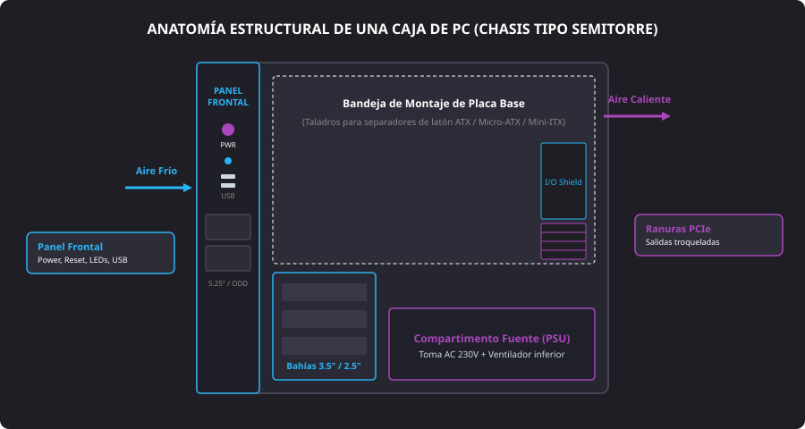
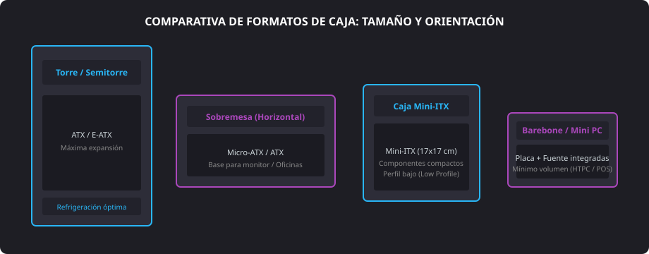

<h1 style="color: #ab47bc;">🛒 Tema 6 — Análisis de Mercado de Componentes de un Equipo Microinformático</h1>

<h2 style="color: #29b6f6;">6.1. La Caja de un Equipo Microinformático</h2>

La caja (también denominada torre, carcasa o chasis) constituye el soporte estructural sobre el que se articulan, anclan y protegen la totalidad de los componentes hardware de un ordenador. Su diseño determina la rigidez mecánica, la contención del polvo, el aislamiento acústico y la eficacia del circuito de refrigeración térmica.

<figure markdown="span">
  
  <figcaption>Figura 6.1 — Distribución interna, compartimentos funcionales y flujo de aire en un chasis semitorre.</figcaption>
</figure>

#### Partes y Elementos Estructurales del Chasis
* **Chasis:** Estructura o bastidor metálico interior (fabricado normalmente en acero electrogalvanizado **SECC** o aluminio) que incorpora los taladros, columnas y ranuras donde se atornillan la placa base, discos y fuente de alimentación.
* **Cubierta:** Paneles laterales y superior (metálicos, con filtros antipolvo magnéticos o ventanales de cristal templado) que aíslan el interior frente a agentes externos y reducen las interferencias electromagnéticas.
* **Panel frontal:** Sección delantera provista de:
    * Botón de encendido (**Power SW**) y pulsador de reinicio forzado (**Reset SW**).
    * Indicadores luminosos de estado: **Power_LED** (equipo encendido) y **HDD_LED** (lectura/escritura activa en unidades de almacenamiento).
    * Puertos de entrada/salida rápida: cabezales internos de bus **F_USB** (USB 3.0 / USB-C) y tomas analógicas **F_Audio** (auriculares y micrófono).
    * Bahías externas frontales de $5.25"$ para unidades ópticas (CD, DVD, Blu-Ray) o paneles de control de ventiladores.
* **Bahías para unidades (*Drive bays*):** Alojamientos mecánicos con guías o bandejas para fijar unidades de almacenamiento:
    * **Formato de $3.5"$:** Diseñadas para discos duros mecánicos (**HDD**).
    * **Formato de $2.5"$:** Diseñadas para discos de estado sólido (**SSD SATA**) o discos de ordenador portátil.
* **Ubicación de la fuente de alimentación:** Cavidad estandarizada ubicada comúnmente en la parte inferior trasera del chasis (aislada bajo un carenado o *PSU shroud*), permitiendo que la fuente tome aire fresco directamente del suelo del chasis mediante una rejilla con filtro antipolvo independiente.
* **Rejillas y puntos de ventilación:** Zonas troqueladas preparadas para fijar ventiladores de $120\text{ mm}$ o $140\text{ mm}$, creando un flujo de aire positivo o neutro (entrada frontal/inferior y extracción trasera/superior).
* **Salidas a puertos y ranuras de expansión:** Abertura trasera para encajar la chapa de conexiones de la placa base (**I/O Shield**) y ranuras horizontales con pletinas metálicas perforadas para la fijación de tarjetas gráficas y controladoras **PCI-Express**.

---

<h2 style="color: #29b6f6;">6.2. Clasificación de las Cajas según el Factor de Forma</h2>

Las dimensiones, anclajes y volumen interno de la caja vienen condicionados de forma directa por el factor de forma de la **placa base** que debe albergar.

<figure markdown="span">
  
  <figcaption>Figura 6.2 — Variantes constructivas de chasis según orientación, tamaño y factor de forma de placa.</figcaption>
</figure>

#### Tipos de Cajas Principales
* **Torre (Semitorre / Gran Torre):**
    * Es el estándar más extendido en puestos de trabajo avanzados, gaming y servidores.
    * Admite factores de forma **ATX**, **XL-ATX** y **Micro ATX**.
    * Ofrece la máxima capacidad de refrigeración (soporte para radiadores de refrigeración líquida), holgura para tarjetas gráficas de gran longitud y facilidad de maniobra durante el cableado.
* **Sobremesa (*Desktop*):**
    * Diseñada para operar en disposición horizontal, ubicándose frecuentemente bajo el monitor para ahorrar espacio en escritorios de oficina.
    * Diseñada para placas **ATX** o **Micro ATX**, limitando la altura de los disipadores de CPU instalables.
* **Cajas Mini ITX:**
    * Chasis ultracompactos (formato cubo o torre reducida) diseñados exclusivamente para placas base **Mini ITX** ($17 \times 17\text{ cm}$).
    * Requieren fuentes de formato reducido (**SFX**) y tarjetas gráficas cortas o de perfil bajo (*Low Profile*).
* **Barebone:**
    * Sistema de integración vertical de tamaño mínimo concebido para puestos de venta (**POS/TPV**), terminales ligeros o centros multimedia (**HTPC**).
    * Incorpora de serie la placa base y la fuente de alimentación ajustadas milimétricamente al chasis, dejando únicamente a elección del técnico la instalación del procesador, la memoria RAM y el almacenamiento.

---

<h2 style="color: #29b6f6;">6.3. Comparativa Técnica de Cajas</h2>

| Tipo de Caja | Factores de Forma Admitidos | Capacidad de Expansión | Ventilación y Espacio | Ámbito de Aplicación Preferente |
| :--- | :--- | :--- | :--- | :--- |
| **Gran Torre / Semitorre** | E-ATX, ATX, Micro ATX, Mini ITX | **Muy alta:** $7$ o más ranuras de expansión PCIe, múltiples bahías de $3.5"$ y $2.5"$. | Excelente flujo de aire; espacio para ventiladores múltiples y disipadores de gran volumen. | Estaciones de trabajo de renderizado, servidores locales y gaming. |
| **Sobremesa (*Desktop*)** | ATX, Micro ATX | **Media:** Limitada por la altura del perfil horizontal de la caja. | Flujo moderado; requiere disipadores de bajo perfil y disipación canalizada. | Oficinas corporativas, despachos y puestos ofimáticos convencionales. |
| **Mini ITX** | Exclusivo Mini ITX ($17 \times 17\text{ cm}$) | **Baja:** Generalmente restringida a una única ranura PCIe (para tarjeta gráfica dedicada). | Flujo concentrado; montaje milimétrico y gestión de cables crítica. | Equipos compactos para salones, espacios reducidos y puestos discretos. |
| **Barebone** | Propietario / Factor reducido | **Mínima:** Componentes críticos preinstalados; nula adición de tarjetas secundarias. | Ventilación ajustada mediante turbina o disipación pasiva. | Terminales de Punto de Venta (**POS**), quioscos de información y cartelería digital. |

--8<-- "docs/includes/glosario.md"
