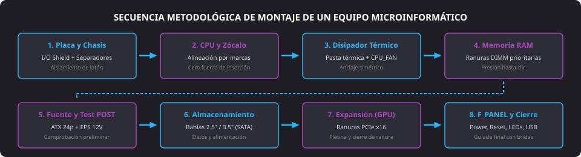

<h1 style="color: #ab47bc;">🔧 Tema 7 — Procedimientos de Montaje</h1>

<h2 style="color: #29b6f6;">7.1. Preparación General e Instalación de la Placa Base</h2>

El proceso de ensamblado de un ordenador exige acondicionar el banco de trabajo técnico, comprobar el inventario de componentes (**chasis**, **placa base**, **microprocesador**, disipador térmico, **memoria RAM**, **fuente de alimentación**, unidades de almacenamiento, tarjetas de expansión y tornillería métrica) y seguir un orden secuencial riguroso para asegurar la estabilidad mecánica y el aislamiento eléctrico del sistema.

<figure markdown="span">
  
  <figcaption>Figura 7.1 — Diagrama de flujo de las 8 fases estructuradas para el montaje completo de un equipo microinformático.</figcaption>
</figure>

#### Protocolo de Fijación de la Placa Base
1. **Acondicionamiento del chasis:** Retirar los paneles laterales de la caja desenroscando la tornillería trasera manual y colocar el chasis en posición horizontal sobre una superficie libre de cargas estáticas.
2. **Protección antiestática:** Desprecintar la placa base sujetándola exclusivamente por los cantos del circuito impreso (**PCB**) y apoyarla sobre el tapete electrostático o sobre la parte exterior de su envoltorio de protección.
3. **Colocación de la chapa de conexiones (I/O Shield):** Encajar firmemente la máscara trasera troquelada a presión en el vano posterior del chasis desde el interior hacia fuera hasta escuchar el asentamiento de las pestañas perimetrales.
4. **Instalación de separadores de latón:** Localizar los orificios troquelados del chasis que coinciden con los taladros reforzados con corona de masa de la placa base (**ATX** o **Micro ATX**). Enroscar los postes separadores correspondientes.
5. **Fijación mecánica:** Posicionar la placa base sobre los separadores haciendo coincidir los puertos traseros con las aberturas del **I/O Shield**. Fijar la placa mediante tornillos métricos aplicando un par de apriete moderado para evitar microfisuras en las pistas internas de cobre.

!!! danger "Riesgo de Cortocircuito Destructivo"
    Un separador de latón enroscado en una posición ciega (sin taladro coincidente en la placa) rozará las soldaduras del dorso del circuito impreso, generando un cortocircuito a masa que destruirá componentes al recibir tensión eléctrica.

---

<h2 style="color: #29b6f6;">7.2. Instalación del Microprocesador</h2>

El microprocesador es la unidad central del sistema. Su colocación en el **zócalo** (**socket**) demanda máxima precisión para preservar intactas las matrices de pines y contactos dorados.

#### Procedimiento de Montaje Paso a Paso
1. **Apertura del zócalo:** Liberar la palanca metálica lateral presionando hacia fuera y levantándola hasta la posición vertical ($90^\circ$ o superior) para retirar la presión de retención.
2. **Manipulación del chip:** Extraer el procesador sujetándolo únicamente por sus extremos plásticos o metálicos. Prohibido tocar los contactos dorados inferiores o la superficie de la matriz del zócalo para evitar corrosión por ácidos dérmicos o descargas por **ESD**.
3. **Alineación de guías:** Localizar el triángulo impreso en uno de los vértices del encapsulado metálico (**IHS**) y hacerlo coincidir exactamente con el triángulo serigrafiado en el marco del zócalo de la placa.
4. **Inserción por gravedad (ZIF - *Zero Insertion Force*):** Dejar caer suavemente el chip en su lecho. Debe asentarse plano y sin holguras de manera espontánea, sin ejercer presión manual.
5. **Bloqueo y aseguramiento:** Bajar la armadura de retención y retornar la palanca metálica a su clip lateral. Esta acción aplica la fuerza mecánica calibrada necesaria para asegurar un contacto eléctrico de baja resistencia entre todos los terminales.

---

<h2 style="color: #29b6f6;">7.3. Instalación del Sistema de Refrigeración del Procesador</h2>

Para evitar el estrangulamiento térmico (*thermal throttling*) y apagados de emergencia, es imperativo montar un conjunto térmico compuesto por un bloque **disipador** pasivo y un **ventilador** activo.

* **Comprobación de la base:** Verificar si la base de cobre o aluminio del disipador cuenta con compuesto térmico preaplicado de fábrica (protegido por un plástico adhesivo que debe ser retirado obligatoriamente antes del montaje).
* **Aplicación de interfaz térmica:** En caso de superficies pulidas, dispensar una pequeña cantidad de **pasta térmica** (tamaño de un grano de arroz o gota central de $4\text{ a }5\text{ mm}$) en el centro del **IHS**. Al apretar el disipador, la presión distribuirá la masa rellenando las imperfecciones microscópicas y evacuando el aire aislante.
* **Fijación del disipador:** Presentar el bloque sobre el procesador y apretar la tornillería en esquema cruzado (en diagonal) para distribuir la tensión de forma homogénea sobre el silicio.
* **Alimentación eléctrica:** Conectar el cable del ventilador a la toma PWM serigrafiada como **CPU_FAN** en la placa base para habilitar la regulación dinámica de revoluciones en función de la sonda de temperatura.

---

<h2 style="color: #29b6f6;">7.4. Fijación de Módulos de Memoria RAM</h2>

Los módulos **DDR4** o **DDR5** se insertan sobre las ranuras **DIMM** aprovechando arquitecturas de doble canal (**Dual Channel**).

1. **Selección de canales:** Consultar el manual de la placa base para identificar la pareja de ranuras preferente (habitualmente canales `A2` y `B2`, o ranuras 2 y 4 partiendo desde el zócalo).
2. **Desbloqueo:** Abrir hacia el exterior las pestañas plásticas basculantes de los extremos de la ranura.
3. **Orientación de la muesca:** Alinear la muesca descentrada del conector dorado del módulo con la guía física saliente del interior del zócalo DIMM (diseño que impide la inserción invertida).
4. **Inserción y enclavamiento:** Apoyar el módulo perpendicularmente y presionar simultáneamente con ambos pulgares en los extremos superiores hasta percibir el cierre automático de las pestañas laterales y escuchar el sonido de bloqueo (*clic*).

---

<h2 style="color: #29b6f6;">7.5. Instalación de la Fuente de Alimentación y Testeo Preliminar</h2>

La **fuente de alimentación** transforma la tensión alterna de red en los raíles directos necesarios para el hardware.

* **Fijación al chasis:** Introducir la fuente en su habitáculo inferior o superior, orientando su ventilador hacia la rejilla de ventilación externa con filtro, y apretar los cuatro tornillos exteriores de rosca gruesa (**UNC 6-32**).
* **Conexión de energía elemental:**
    * Conector principal **ATX de 24 pines** a la placa base.
    * Conector auxiliar **EPS / CPU de 12V** (4 u 8 pines) en la esquina superior adyacente a los reguladores de voltaje del procesador.
* **Prueba preliminar de encendido (*Pre-assembly Test*):**
    * Conectar la fuente a la toma de corriente, enlazar el monitor a la salida de vídeo y puentear momentáneamente los dos pines de encendido (**Power_sw**) del panel frontal mediante la punta de un destornillador o pulsador de pruebas.
    * **Verificación de éxito:** Comprobar que los ventiladores giren sin interrupción, los diodos de diagnóstico de la placa no se detengan en errores de CPU o RAM y el monitor emita la señal visual de la rutina **POST** o **BIOS**.

---

<h2 style="color: #29b6f6;">7.6. Instalación de Almacenamiento, Ópticos y Expansión</h2>

### 7.6.1. Unidades de Almacenamiento (HDD / SSD SATA)
* **Montaje en sobremesa:** Alinear la unidad en su bahía de $3.5"$ (mecánicos) o $2.5"$ (SSD) y fijar mediante tornillos laterales o bandejas de clip rápido. Conectar el cable plano de datos **SATA** a la controladora de la placa y la manguera de alimentación SATA procedente de la fuente.
* **Montaje en portátil:** Retirar la tapa de mantenimiento inferior, deslizar la unidad horizontalmente hacia el puerto SATA integrado y atornillar el marco metálico de sujeción (*caddy*).

### 7.6.2. Dispositivos Ópticos ($5.25"$)
* Retirar el embellecedor frontal de la caja, insertar el lector o grabador desde el frontal exterior hacia el interior del chasis y atornillar a ambos lados de la bahía. Conectar cables de datos y energía SATA.

### 7.6.3. Tarjetas de Expansión (GPU / Red / Sonido)
* Localizar la ranura adecuada (ej. **PCI-Express x16** reforzada para tarjeta gráfica dedicada).
* Retirar la pletina trasera troquelada del chasis correspondiente al alineamiento del slot.
* Abrir el pestillo posterior de la ranura PCIe, insertar la tarjeta ejerciendo presión vertical uniforme hasta el encaje del conector y fijar la pletina exterior mediante su tornillo al chasis. Conectar los cables de alimentación suplementarios (**PCIe 6+2 pines** o **12VHPWR**) si la gráfica lo requiere.

### 7.6.4. Conexión del Panel Frontal (F_PANEL)
Enlazar los cables provenientes de la botonera y testigos luminosos de la caja a los pines serigrafiados de la placa:

* **HDD_LED:** Indicador luminoso de acceso a disco (respeta polaridad $+ / -$).
* **Power_LED:** Indicador luminoso de encendido (respeta polaridad $+ / -$).
* **Power_sw:** Pulsador de encendido momentáneo (sin polaridad).
* **Reset:** Pulsador de reinicio por hardware (sin polaridad).
* **F_USB:** Cabezal interno para tomas de puertos USB externos.
* **F_Audio:** Cabezal interno para conectores analógicos de sonido (**HD Audio**).

---

<h2 style="color: #29b6f6;">7.7. Cuadro Resumen de la Secuencia de Ensamblado</h2>

| Fase | Componente | Interfaz / Alojamiento | Elemento de Fijación y Seguridad |
| :--- | :--- | :--- | :--- |
| **1. Placa Base** | Chasis y placa de circuitos | Vano posterior y bandeja interna | Máscara **I/O Shield**, separadores de latón y tornillería métrica. |
| **2. Procesador** | Microprocesador | Zócalo (**Socket**) con matriz | Sistema **ZIF**, marcas triangulares de orientación y palanca de bloqueo. |
| **3. Refrigeración** | Conjunto disipador y ventilador | Cabezal eléctrico **CPU_FAN** (4 pines PWM) | Capa fina de **pasta térmica**, backplate trasero y anclaje en diagonal. |
| **4. Memoria RAM** | Módulos DDR4 o DDR5 | Ranuras **DIMM** (prioridad Dual Channel) | Muesca física asimétrica y pestillos plásticos de retención lateral. |
| **5. Fuente (PSU)** | Fuente de alimentación | Hueco posterior (carenado inferior) | Conectores **ATX 24 pines** + **CPU 12V**, tornillos UNC 6-32 y **test POST**. |
| **6. Almacenamiento** | Discos HDD / SSD SATA | Bahías internas de $3.5"$ y $2.5"$ | Raíles con amortiguación, cable de datos SATA y conector de energía SATA. |
| **7. Expansión** | Tarjeta gráfica / Adaptadores | Ranura **PCI-Express x16 / x1** | Pestaña de retención en slot, tornillo de pletina y cables PCIe auxiliares. |
| **8. Frontal** | Botonera y puertos frontales | Cabezal agrupado **F_PANEL** | Cables **Power_sw**, **Reset**, **HDD_LED**, **F_USB** y peinado con bridas. |

--8<-- "docs/includes/glosario.md"
