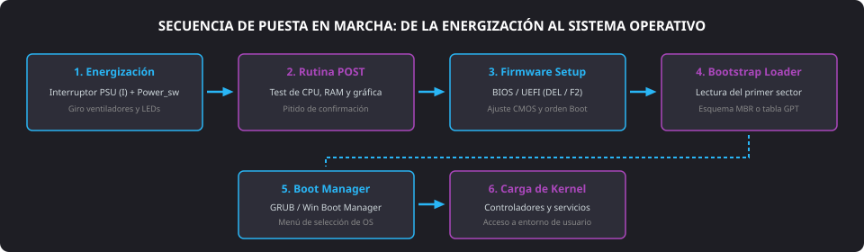
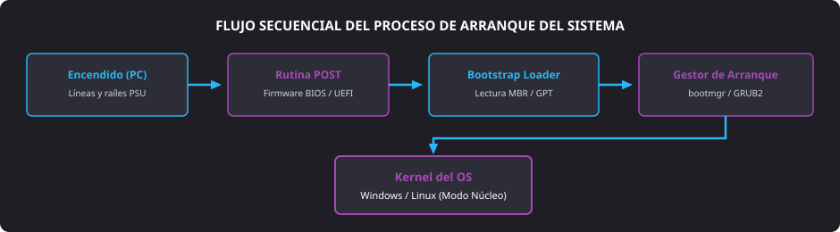

<h1 style="color: #ab47bc;">🚀 Tema 8 — Puesta en Marcha del Equipo</h1>

<h2 style="color: #29b6f6;">8.1. Conexión de Periféricos y Comprobación Inicial de Encendido</h2>

Una vez completado el ensamblado físico de los componentes en el chasis, la puesta en marcha inicial requiere conectar los dispositivos periféricos indispensables para establecer la comunicación y monitorizar el comportamiento eléctrico del sistema.

#### Protocolo de Conexión de Periféricos Externos
* **Monitor:** Conectar el cable de señal de vídeo (**DisplayPort**, **HDMI** o **VGA**) a la salida de la **tarjeta gráfica dedicada**. Si el procesador cuenta con gráficos integrados y no se dispone de GPU dedicada, conectar a las salidas de la propia **placa base**.
* **Teclado y ratón:** Insertar en los puertos **USB** traseros directos de la placa base (preferentemente puertos USB 2.0 estándar para evitar fallos de reconocimiento en firmwares antiguos).
* **Alimentación y audio:** Enchufar el cable de corriente a la toma mural con toma de tierra activa e interconectar los altavoces a la clavija analógica **MiniJack** de color verde (salida de línea estéreo).

#### Secuencia Técnica de Encendido
1. Conmutar el interruptor balancín trasero de la **fuente de alimentación** a la posición de encendido (`I` / **ON**).
2. Encender el monitor para que detecte la sincronización de señal.
3. Presionar el pulsador de encendido frontal (**Power_sw**).

#### Comprobación Visual y Acústica
* **Giro de ventiladores:** Verificar que las aspas del conjunto disipador de la CPU (**CPU_FAN**) y los ventiladores auxiliares del chasis giren de manera continua y sin rozar con ningún cable.
* **Testigos frontales:** Constatar que el diodo **Power_LED** permanezca iluminado y el **HDD_LED** parpadee al transferir datos.
* **Diagnóstico acústico por zumbador (*Speaker*):**
    * **Un pitido corto:** Indica que la rutina **POST** ha superado con éxito la comprobación de los componentes básicos.
    * **Ráfagas continuas o pitidos largos:** Alertan de fallos graves en subsistemas críticos (ausencia o mala inserción de memoria **RAM**, fallo de alimentación o ausencia de tarjeta gráfica).

<figure markdown="span">
  
  <figcaption>Figura 8.1 — Flujo cronológico desde la alimentación eléctrica y testeo de bajo nivel hasta la inicialización del sistema operativo.</figcaption>
</figure>

---

<h2 style="color: #29b6f6;">8.2. Configuración del Firmware (BIOS / UEFI)</h2>

El programa de configuración del firmware (**BIOS Setup** o interfaz **UEFI**) reside en una **memoria Flash** no volátil soldada a la placa base, encargándose de inicializar el hardware y gestionar los parámetros de bajo nivel.

### 8.2.1. Acceso y Navegación
* **Teclas de acceso:** Durante los primeros segundos tras el encendido, pulsar repetidamente la tecla designada por el fabricante antes de que empiece la carga del disco. Las combinaciones estándar son ++del++ (Suprimir) o ++f2++ (en determinados ensambladores portátiles o servidores: ++f10++, ++f12++ o ++esc++).
* **Entorno gráfico:** Las interfaces **UEFI** modernas permiten interacción mediante ratón, admiten discos con particionado **GPT** superiores a $2\text{ TB}$ y ofrecen interfaces multilingües avanzadas.

---

### 8.2.2. Estructura de Secciones del Menú de Configuración
* **Principal (*Main*):** Expone la versión de compilación del firmware, modelo de procesador, cantidad y frecuencia de la memoria **RAM**, y permite actualizar la fecha y hora almacenadas en la **CMOS** respaldada por la **pila CMOS** (CR2032).
* **Avanzado (*Advanced*):** Control del controlador de almacenamiento (**SATA / NVMe** en modo AHCI/RAID), tecnologías de virtualización asistida por hardware (**Intel VT-x** o **AMD-V**), perfiles de memoria (**XMP / EXPO**) y ajuste de curvas térmicas para ventiladores.
* **Seguridad (*Security*):** Configuración de contraseñas de supervisor y usuario, activación del módulo de plataforma de confianza (**TPM**) y habilitación del arranque seguro (**Secure Boot**).
* **Arranque (*Boot*):** Jerarquía y orden de prioridad de dispositivos de inicio (unidades SSD, memorias USB instalables o arranque por red **PXE**).
* **Salir (*Exit*):** Grabación de cambios en la CMOS (**Save & Exit** mediante ++f10++), descarte de ajustes o recuperación de los valores de fábrica estables (*Load Setup Defaults*).

---

<h2 style="color: #29b6f6;">8.3. Gestor de Arranque y Secuencia de Inicio</h2>

Tras superar la verificación del hardware por el **POST** y cargar los parámetros del firmware, toma el control el proceso de inicialización de software.

<figure markdown="span">
  
  <figcaption>Figura 8.2 — Arquitectura del flujo de ejecución desde el suministro de energía hasta la transferencia al kernel.</figcaption>
</figure>

#### 1. Ejecución del Bootstrap Loader
Es una rutina residente en la placa base encargada de explorar los dispositivos configurados en la lista de prioridad de arranque (**Boot**) para localizar el primer sector ejecutable.

#### 2. Lectura del Sector de Inicio (MBR vs. GPT)
* **MBR (*Master Boot Record*):** Esquema tradicional vinculado a BIOS que lee los primeros $512\text{ bytes}$ del disco para obtener la tabla de particiones primarias y el código de inicio.
* **GPT (*GUID Partition Table*):** Estándar moderno vinculado a **UEFI** que ejecuta el binario del cargador directamente desde la partición del sistema **EFI** (`ESP`), eliminando el límite de 4 particiones primarias y aportando redundancia mediante cabeceras de respaldo.

#### 3. Gestores de Arranque (*Boot Managers*)
Programas que posibilitan seleccionar qué sistema operativo inicializar cuando conviven múltiples instalaciones en el equipo (**Dual Boot**):

* **Windows Boot Manager (`bootmgr`):** Gestor nativo del ecosistema Microsoft. Localiza el archivo de configuración BCD (*Boot Configuration Data*) y cede la ejecución al ejecutable del núcleo (`ntoskrnl.exe`).
* **GRUB / GRUB2 (Linux):** Gestor estándar en distribuciones libres. Detecta automáticamente particiones con otros sistemas operativos (incluidas instalaciones de Windows), presentando un menú interactivo configurable para elegir el núcleo a ejecutar.

---

<h2 style="color: #29b6f6;">8.4. Realización del Informe de Montaje</h2>

Todo proceso técnico de ensamblaje concluye formalmente con la redacción del **informe de montaje**. Este documento técnico garantiza la trazabilidad operativa, respalda la garantía del servicio y sirve de referencia para futuros mantenimientos preventivos y correctivos.

#### Apartados Estructurales del Informe
1. **Fase de planificación y metodología:** Registro cronológico de los pasos ejecutados (instalación de chasis, colocación del procesador, aplicación de interfaz térmica, cableado del **F_PANEL** y puesta en marcha).
2. **Inventario técnico de componentes:** Tabla detallada que recoge fabricante, modelo exacto, número de serie (**S/N**), capacidad y especificaciones de cada componente ensamblado.
3. **Incidencias y dificultades:** Documentación precisa de cualquier desviación técnica surgida (bloqueos de espacio en bahías, necesidad de actualizar la versión de UEFI para reconocer procesadores recientes o falsos contactos en conectores).
4. **Acciones correctivas adoptadas:** Justificación de las medidas tomadas para subsanar los problemas (peinado de cableado con **bridas**, recolocación de módulos en ranuras DIMM alternas o reajuste de la pasta térmica).
5. **Protocolo de pruebas y certificación final:** Métricas obtenidas tras someter el equipo a pruebas de estrés (temperaturas de reposo y carga máxima, voltajes registrados por el software de diagnóstico y comprobación de ausencia de errores de memoria con herramientas tipo MemTest). Firma del técnico certificando la operatividad.

---

<h2 style="color: #29b6f6;">8.5. Cuadro Resumen de Puesta en Marcha y Gestores</h2>

| Fase / Elemento | Función Técnica Principal | Entidad / Software Responsable | Resultado Operativo Esperado |
| :--- | :--- | :--- | :--- |
| **1. Comprobación inicial** | Verificar suministro eléctrico estable y ausencia de cortocircuitos. | Fuente de alimentación, ventilador **CPU_FAN** y pulsadores. | Giro regular de ventiladores, iluminación de diodos y ausencia de olores extraños. |
| **2. Rutina POST** | Autodiagnóstico por hardware de procesador, memoria RAM y GPU. | **ROM BIOS / UEFI** y zumbador (**speaker**). | Un único pitido corto de validación o encendido del LED de estado "Boot OK". |
| **3. Configuración CMOS** | Ajustar perfiles térmicos, frecuencias y prioridad de discos. | Interfaz **BIOS/UEFI Setup** (parámetros retenidos por **pila CMOS**). | Detección completa de memorias, microprocesador y unidades **SATA / NVMe**. |
| **4. Bootstrap Loader** | Leer la cabecera de arranque en el medio seleccionado. | Microcódigo del firmware hacia sectores **MBR** o partición **GPT**. | Carga en memoria RAM del bloque de arranque del medio de almacenamiento. |
| **5. Windows Boot Manager** | Cargar el kernel y controladores iniciales de Windows. | Archivo `bootmgr` en partición reservada / EFI. | Carga de los servicios y pantalla de inicio de sesión de usuario en Windows. |
| **6. Gestor GRUB (Linux)** | Ofrecer un menú multisección con soporte para varios sistemas. | Gestor de arranque **GRUB2**. | Selección interactiva del sistema operativo deseado o arranque desatendido. |
| **7. Informe de Montaje** | Documentar inventario, dificultades técnicas y test de estrés. | Técnico de soporte microinformático. | Documento formal de entrega, garantía de control de calidad y registro de trazabilidad. |

--8<-- "docs/includes/glosario.md"

---

<h2 style="color: #29b6f6;">8.3. Gestor de Arranque y Secuencia de Inicio</h2>

Tras superar la verificación del hardware por el **POST** y cargar los parámetros del firmware, toma el control el proceso de inicialización de software.
