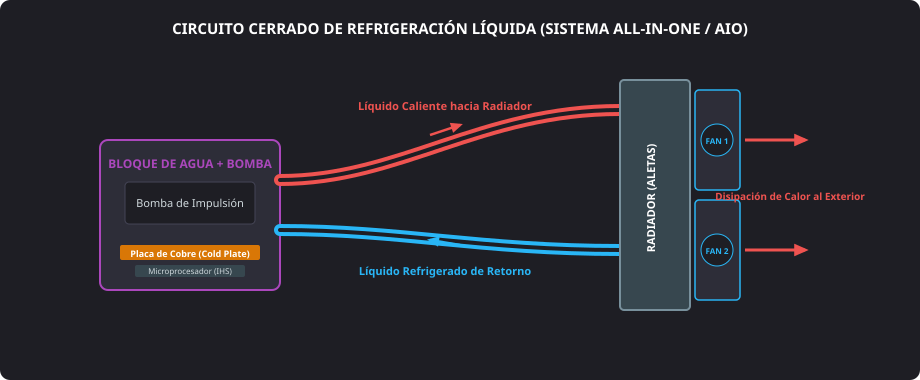

<h1 style="color: #ab47bc;">💡 Tema 9 — Aplicaciones de Nuevas Tendencias en Equipos Informáticos</h1>

<h2 style="color: #29b6f6;">9.1. Reconocimiento de Novedades para el Chasis y la Placa Base</h2>

El sector del hardware microinformático evoluciona de forma continuada para atender cargas de trabajo intensivas (renderizado, inteligencia artificial local, simulación y videojuegos). La adopción de técnicas avanzadas sobre el chasis y la placa base persigue desatar el rendimiento bruto y gestionar la disipación térmica generada.

### 9.1.1. Overclocking
* **Definición técnica:** Práctica consistente en forzar la frecuencia de reloj del microprocesador o alterar al alza su multiplicador interno (**CPU Multiplier**) y voltaje nominal (**Vcore**) desde la utilidad de configuración de la **BIOS / UEFI**.
* **Impacto térmico directo:** El incremento de frecuencia y tensión eleva de forma cuadrática la generación de calor residual, elevando drásticamente el consumo térmico de diseño (**TDP**).
* **Requisitos de estabilidad y suministro:**
    * Exige **fuentes de alimentación** de alta eficiencia (certificación *80 PLUS Gold* o superior) con rieles de $+12\text{ V}$ filtrados y estables.
    * Requiere módulos de memoria **RAM** con perfiles de alto rendimiento validados (**XMP / EXPO**).
    * Obliga a sustituir los disipadores convencionales de aire por sistemas térmicos de alto caudal o circuitos de refrigeración líquida para evitar el estrangulamiento térmico (*thermal throttling*).

---

### 9.1.2. Refrigeración Líquida (*Watercooling*)

Técnica de enfriamiento basada en la circulación continua de un fluido refrigerante (agua destilada tratada con aditivos anticorrosivos y biocidas) a través de un circuito hermético.

<figure markdown="span">
  
  <figcaption>Figura 9.1 — Elementos funcionales de un sistema de refrigeración líquida All-In-One (AIO): bloque disipador, bomba de impulsión, mangueras y radiador de aletas.</figcaption>
</figure>

* **Propiedades térmicas superiores:** El líquido posee un calor específico sensiblemente mayor que el aire ambiental, permitiendo absorber grandes picos calóricos procedentes del encapsulado metálico (**IHS**) de la CPU con menor variación térmica.
* **Componentes clave de un sistema AIO (*All-In-One*):**
    1. **Bloque de agua (*Waterblock*):** Pieza con base de cobre pulido (*cold plate*) provista de microaletas internas que transfieren el calor del procesador al líquido.
    2. **Bomba impulsora:** Motor hidráulico integrado generalmente sobre el propio bloque que mantiene el fluido en movimiento continuo hacia el cabezal **CPU_FAN** o `AIO_PUMP`.
    3. **Tuberías flexibles de teflón o caucho:** Conductos sellados que canalizan el caudal sin riesgo de evaporación.
    4. **Radiador con aletas:** Estructura metálica que disipa el calor del líquido al exterior mediante ventiladores forzados de $120\text{ mm}$ o $140\text{ mm}$.

---

<h2 style="color: #29b6f6;">9.2. Uso de Barebones en el Montaje de Equipos</h2>

Los sistemas **barebone** constituyen una solución intermedia entre las torres de sobremesa ATX tradicionales y los ordenadores portátiles compactos.

* **Concepto constructivo:** Chasis de reducidas dimensiones concebido para optimizar espacio en escritorios y abaratar el coste final de implantación, prescindiendo de bahías secundarias y ranuras de expansión accesorias.
* **Integración de fábrica:** El fabricante suministra el conjunto con la **placa base** (de factor propietario o **Mini ITX**) y la **fuente de alimentación** (formato **SFX** o externa) mecánicamente premontadas y cableadas a medida.
* **Margen de ensamblado para el técnico:** El profesional se encarga de instalar el microprocesador compatible, la memoria RAM (a menudo módulos compactos **SO-DIMM**) y la unidad de almacenamiento secundario (**SSD NVMe M.2** o disco SATA de $2.5"$).

---

<h2 style="color: #29b6f6;">9.3. Ordenadores de Aplicaciones Específicas y Multimedia</h2>

La segmentación del mercado ha impulsado el ensamblaje de arquitecturas de hardware adaptadas al entorno operativo y la acústica del puesto de trabajo.

### 9.3.1. Equipos HTPC (*Home Theater Personal Computer*)
Ordenadores personales de salón concebidos como centros de entretenimiento digital multimedia (*Media Centers*):

* **Formato compacto e integrador:** Chasis horizontales o de cubo estilizados que encajan estéticamente en mobiliario doméstico junto al receptor de audio y televisión.
* **Aislamiento acústico riguroso:** Empleo de refrigeración semipasiva, rodamientos de ventilador silenciosos y unidades SSD en sustitución de discos duros mecánicos para eliminar ruidos de fondo durante la reproducción sonora.
* **Eficiencia de bajo voltaje:** Componentes con procesadores de bajo consumo térmico (**TDP** moderado) capaces de reproducir vídeo $4\text{K}$ con mínima emisión térmica.

### 9.3.2. Dispositivos de Streaming y Android TV
* **Integración telemática:** Reproductores compactos (*dongles* HDMI o decodificadores) que dotan a cualquier panel o televisor tradicional de conectividad de red por cable o Wi-Fi.
* **Arquitectura de hardware dedicada:** Integran sistemas en un chip (**SoC**) con núcleos de arquitectura ARM, módulos de memoria Flash integrada (**eMMC / UFS**), memoria RAM dedicada, lectores de tarjetas de memoria para expansión y puertos USB para conectar periféricos estándar (teclado, ratón o mandos).

---

<h2 style="color: #29b6f6;">9.4. Informática Móvil</h2>

La miniaturización de componentes y la eficiencia de baterías de litio permiten sostener flujos de trabajo profesionales sin dependencia de una toma de corriente fija.

* **Ordenadores portátiles (*Laptops / Ultrabooks*):** Máquinas completas que integran pantalla, teclado, ratón táctil (*touchpad*) y batería recargable, equiparando su capacidad de cómputo a las estaciones de oficina.
* **Teléfonos inteligentes (*Smartphones*):** Fusión integral de comunicaciones celulares con sistemas operativos multitarea avanzados, pantallas táctiles capacitivas y conectividad permanente a Internet.
* **Sistema de Posicionamiento Global (GPS):** Constelación de satélites en órbita terrestre que permite triangular la posición geográfica exacta y calcular coordenadas para trazabilidad y navegación.
* **Tabletas (*Tablets*):** Plataformas táctiles intermedias diseñadas para consumo audiovisual ágil, firma digital y toma de datos en movilidad.
* **Lectores de libros electrónicos (*e-readers*):** Dispositivos monopropósito optimizados para lectura prolongada mediante pantallas de tinta electrónica (**e-ink**), las cuales reflejan la luz ambiental sin emitir brillo perjudicial, garantizando semanas de autonomía por carga.

!!! note "Distinción Conceptual Básica"
    * **e-book:** El fichero o archivo digital estructurado que contiene el texto (formatos EPUB, PDF o MOBI).
    * **e-reader:** El dispositivo de hardware físico provisto de pantalla y almacenamiento para visualizar dichos libros electrónicos.

---

<h2 style="color: #29b6f6;">9.5. Personalización de PC (*Modding*)</h2>

El término **modding** (*modify*) abarca las intervenciones artesanales, técnicas y estéticas realizadas sobre la caja o el hardware para dotarlo de una identidad visual exclusiva o mejorar sus capacidades de refrigeración.

* **Modificaciones comunes:**
    * Sustitución de tapas opacas por paneles laterales de metacrilato o cristal templado (*tempered glass*).
    * Inclusión de diodos emisores de luz direccionables (**ARGB** de $+5\text{ V}$) sincronizados por bus con la placa base.
    * Canalización de cables mediante fundas trenzadas individuales (*sleeving*).
    * Montaje vertical de tarjetas gráficas mediante cables elevadores flexibles (*riser PCIe*).
    * Adaptación de bucles personalizados de refrigeración líquida (*custom loops*) con tubos rígidos de acrílico o PETG.
* **Herramientas de taller empleadas:** Herramientas rotativas multifunción tipo Dremel (corte, fresado y lijado de chapas), pistolas de calor para curvar tubos, caladoras para troquelar aberturas de ventilación y soldadores de estaño.

---

<h2 style="color: #29b6f6;">9.6. Documentación de Nuevas Tendencias y Guías de Usuario</h2>

Toda integración técnica especializada requiere la redacción y entrega de documentación formal normalizada para garantizar que el usuario opere el sistema con seguridad.

### 9.6.1. Tipos de Documentos Técnicos
* **Manual de usuario completo:** Documento exhaustivo que expone las especificaciones de hardware, configuraciones de la UEFI, diagramas de conectores, políticas de mantenimiento y advertencias de seguridad.
* **Guía rápida de inicio (*Quick Start Guide*):** Manual sintético y multilingüe ilustrado paso a paso enfocado exclusivamente en las conexiones elementales y el primer encendido seguro.

### 9.6.2. Elaboración y Estructura Normalizada
* **Herramientas de maquetación y salida:** Redacción y compilación en formatos vectoriales no editables mediante herramientas tipo Adobe Acrobat Professional o procesadores Markdown/PDF.
* **Estructura canónica de un manual técnico:**
    1. **Portada:** Marca, denominación del modelo y fotografía del montaje.
    2. **Encabezado y pie:** Control de versión técnica, número de página y títulos capitulares.
    3. **Índice temático:** Relación de secciones paginadas.
    4. **Cuerpo técnico:** Especificaciones eléctricas, procedimientos de conexión y resolución de fallos comunes.
    5. **Cierre y soporte:** Información de cobertura de garantía, certificaciones (CE, RoHS) y canales del servicio de asistencia técnica (**SAT**).

---

<h2 style="color: #29b6f6;">9.7. Cuadro Comparativo de Tecnologías y Tendencias</h2>

| Tendencia / Concepto | Componente o Instrumental | Objetivo Técnico Principal | Entorno de Aplicación |
| :--- | :--- | :--- | :--- |
| **Overclocking** | Procesador desbloqueado, **UEFI**, raíles de $+12\text{ V}$. | Forzar frecuencia de reloj y multiplicador para ganar rendimiento. | Puestos de cálculo intensivo, renderizado y gaming. |
| **Refrigeración Líquida** | Bloque de agua, bomba, líquido refrigerante, radiador. | Evacuar calor con mayor tasa de transferencia que el aire. | Equipos con overclocking y chasis de ventilación restringida. |
| **Barebones** | Chasis reducido con placa y fuente preinstaladas. | Minimizar tamaño físico y abaratar costes operativos. | Oficinas compactas, recepciones y mostradores comerciales. |
| **HTPC / Android TV** | SoC integrado, salida HDMI, periféricos USB. | Habilitar servicios multimedia y navegación en pantalla grande. | Salones domésticos y cartelería digital comercial. |
| **Movilidad (Smartphones/Laptops)** | Baterías de litio, pantallas táctiles, receptor **GPS**. | Garantizar conectividad telemática y capacidad de cómputo móvil. | Profesionales en ruta y puestos de trabajo remotos. |
| **Modding** | Herramienta multifunción (Dremel), cristal templado, **ARGB**. | Personalización estética y estructural del chasis del equipo. | Exhibiciones tecnológicas, diseño exclusivo y talleres entusiastas. |
| **Manual vs. Guía Rápida** | Suites PDF, maquetación técnica normalizada. | Documentar especificaciones, riesgos y puesta en marcha. | Entrega formal de proyectos microinformáticos. |

--8<-- "docs/includes/glosario.md"
