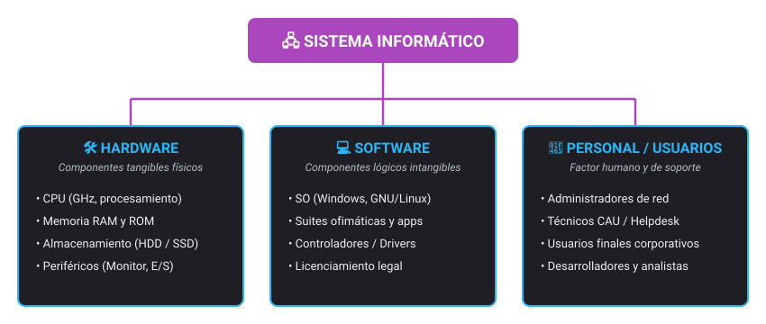
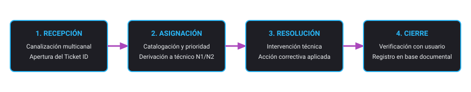
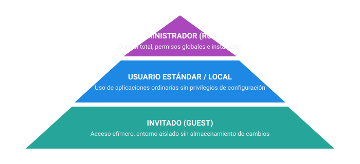

<h1 style="color: #ab47bc;">⚙️ Tema 1 — Instalación de Aplicaciones Ofimáticas</h1>

El despliegue de herramientas de ofimática en el entorno corporativo exige evaluar los requerimientos del hardware, parametrizar los permisos del sistema operativo, documentar incidencias a través del CAU y gestionar el marco legal de licencias y garantías técnicas de los proveedores de servicios informáticos.

---

<h2 style="color: #29b6f6;">1.1. Organización de los Sistemas Informáticos en la Empresa</h2>

Un **sistema informático** se define como el conjunto coordinado de componentes físicos, lógicos y humanos interrelacionados para el procesamiento automático de la información.

<figure markdown="span">
  
  <figcaption>Figura 1.1 — Pilares del sistema informático: Hardware, Software y Usuarios.</figcaption>
</figure>

### Componentes de Hardware y Rendimiento
* **Unidad Central de Proceso (CPU):** Microprocesador que ejecuta las instrucciones lógicas del sistema. Su frecuencia de trabajo se expresa en gigahercios ($\text{GHz}$), donde $1\text{ GHz} = 10^9\text{ operaciones/segundo}$.
* **Memoria RAM (*Random Access Memory*):** Memoria volátil, de acceso aleatorio y reutilizable. Alberga temporalmente los ejecutables y datos en curso; su contenido se extingue al interrumpir el suministro eléctrico.
* **Memoria ROM (*Read Only Memory*):** Memoria de solo lectura no volátil. Contiene el firmware base (BIOS/UEFI) y las rutinas de inicialización y chequeo del hardware.
* **Almacenamiento Secundario:**
    * **Discos Duros Mecánicos (HDD):** Basados en platos magnéticos; ofrecen gran capacidad volumétrica calculada en gigabytes ($\text{GB}$) o terabytes ($\text{TB}$, donde $1\text{ TB} = 10^{12}\text{ bytes}$).
    * **Unidades de Estado Sólido (SSD):** Matrices de celdas de silicio que reducen los tiempos de latencia y aceleran los accesos de lectura/escritura.
* **Disipación Térmica:** Combinación de disipador metálico pasivo (contacto térmico con la CPU) y ventilador forzado (*cooler*) para evacuar el calor y evitar el estrangulamiento térmico (*throttling*).
* **Adaptador Gráfico (GPU) y Monitores:** La tarjeta de vídeo convierte datos binarios en señales visuales. La nitidez se determina por la **resolución de pantalla** (número de píxeles); por ejemplo, el estándar Full HD comprende $1920 \times 1080\text{ píxeles}$ ($2.073.600\text{ puntos discretos}$).

---

### Ecosistema de Software Ofimático
Las herramientas ofimáticas automatizan las funciones administrativas y documentales corporativas mediante soluciones de escritorio local o entornos colaborativos en la nube:

* **Procesadores de texto:** Composición, maquetación y tipografía de informes y escritos formales (Microsoft Word, Google Docs).
* **Hojas de cálculo:** Modelado matemático, contabilidad, proyecciones financieras y análisis de datos (Microsoft Excel, Google Sheets).
* **Sistemas de gestión de bases de datos:** Estructuración, almacenamiento y consulta relacional de registros (Microsoft Access, AppSheet).
* **Presentaciones multimedia:** Exposición visual de diapositivas interactivas con recursos audiovisuales (Microsoft PowerPoint, Google Slides).
* **Tratamiento audiovisual:** Edición de imágenes rasterizadas (Photoshop, GIMP), secuenciación de vídeo (Premiere) y posproducción sonora (Audacity).

---

### Clasificación Jurídica y Régimen de Licencias de Software

| Modalidad de Licencia | Código Fuente | Modificación | Redistribución | Condiciones de Explotación |
| :--- | :--- | :--- | :--- | :--- |
| **Propietario / Privativo** | Cerrado | No permitida | Restringida | Exige pago por licencia o suscripción periódica; prohíbe la ingeniería inversa. |
| **Software Libre** | Abierto | Permitida | Permitida | Garantiza las 4 libertades básicas: uso libre, inspección, redistribución y mejora. |
| **Copyleft** | Abierto | Permitida | Obligatoria | Obliga a citar al autor original y exige que las obras derivadas mantengan la misma licencia libre. |
| **Código Abierto (*Open Source*)** | Abierto | Permitida | Condicionada | Permite la modificación técnica, requiriendo renombrar versiones para proteger la marca. |
| **Dominio Público** | Abierto | Permitida | Ilimitada | Exento de derechos patrimoniales de autor y restricciones de uso o explotación. |
| **Freeware** | Cerrado | No permitida | Gratuita | Distribución gratuita sin coste de adquisición; código cerrado sin derecho a alteración. |
| **Shareware** | Cerrado | No permitida | Temporal / Limitada | Distribución de prueba con caducidad temporal (ej. 30 días) o recorte de funciones operativas. |
| **Educativa / Académica** | Variable | No permitida | Restringida | Acceso promocional para centros formativos y estudiantes con funciones limitadas. |

---

### Procedimiento de Instalación, Actualización e Integración
* **Verificación de Requisitos Mínimos:** Comprobación del entorno de destino (Panel de control / Información del sistema) evaluando frecuencia de CPU, capacidad de memoria RAM libre, espacio disponible en disco y arquitectura del sistema ($32\text{ bits}$ vs. $64\text{ bits}$).
* **Desinstalación Previa:** Se recomienda purgar versiones anteriores u obsoletas de la suite para evitar conflictos en el registro de Windows y en las bibliotecas dinámicas compartidas.
* **Mecanismos de Actualización:** Despliegue de parches de estabilidad y seguridad gestionados de manera desatendida mediante **Windows Update** en Microsoft Windows o **App Store** en macOS.
* **Complementos (*Add-ins / Plugins*):** Módulos auxiliares que inyectan funciones, comandos o diccionarios adicionales en la barra de herramientas del programa para ampliar sus prestaciones nativas.
* **Compatibilidad de Formatos:**
    * *Retrocompatibilidad:* Las suites actuales abren archivos de versiones anteriores, pero el software heredado no interpreta de forma nativa los estándares modernos.
    * *Ejemplo documental:* Microsoft Word 2010 (`.docx`) no puede abrirse en Microsoft Word 97 (`.doc`) a menos que el documento se guarde explícitamente en modo de compatibilidad Word 97-2003.

---

<h2 style="color: #29b6f6;">1.2. Gestión de Incidencias en la Implantación</h2>

El **mantenimiento preventivo** audita de forma proactiva la infraestructura técnica para neutralizar vulnerabilidades antes de que se manifieste el fallo físico o lógico.

### El Centro de Atención al Usuario (CAU)
Punto centralizado de soporte técnico encargado de registrar, catalogar y gestionar los requerimientos y averías informáticas mediante canales telefónicos, telemáticos o de correo:

<figure markdown="span">
  
  <figcaption>Figura 1.2 — Ciclo de vida del ticket de soporte: Recepción, Asignación, Resolución y Cierre.</figcaption>
</figure>

* **Inventario de Sistemas:** Recopilación estructurada de los activos de hardware y software del parque informático para validar la compatibilidad antes de una implantación masiva. Se apoya en utilidades diagnósticas como **AIDA64** o **Everest**.
* **Estructura del Registro de Incidencias:**
    * Identificador secuencial numérico único (Ticket ID).
    * Marca temporal de apertura (fecha y hora exacta).
    * Identidad del usuario solicitante y departamento afectado.
    * Técnico o nivel de soporte asignado.
    * Descripción técnica del síntoma reportado.
    * Diagnóstico y acciones correctoras aplicadas.
    * Estado de tramitación: *Pendiente, En curso, En espera o Resuelta*.

---

<h2 style="color: #29b6f6;">1.3. Clasificación de Sistemas Operativos y Gestión de Permisos</h2>

El sistema operativo actúa como intermediario lógico entre el hardware del equipo y las aplicaciones del usuario, coordinando la asignación de recursos y protegiendo la integridad del sistema.

### Criterios de Clasificación
* **Por la gestión de procesos:**
    * **Monotarea:** El procesador atiende exclusivamente una sola instrucción o tarea secuencial cada vez.
    * **Multitarea:** El núcleo conmuta de manera rápida entre múltiples procesos concurrentes en memoria.
* **Por la gestión de accesos:**
    * **Monousuario:** Solo permite la sesión de una cuenta de usuario a la vez (ej. MS-DOS).
    * **Multiusuario:** Permite la coexistencia y ejecución paralela de múltiples sesiones y perfiles con aislamiento de recursos.

### Familias Principales
* **MS-DOS:** Sistema monousuario y monotarea basado enteramente en interfaces de línea de comandos (CLI).
* **Microsoft Windows:** Sistema propietario con interfaz gráfica amigable (GUI); líder en despliegues ofimáticos corporativos.
* **macOS:** Sistema propietario desarrollado por Apple para equipos Macintosh, sustentado en una base Unix y un entorno gráfico cerrado.
* **GNU/Linux:** Sistema multitarea y multiusuario de código abierto, con múltiples distribuciones corporativas (Ubuntu, Debian, Red Hat, Fedora).

### Perfiles de Usuario y Niveles de Privilegio

<figure markdown="span">
  
  <figcaption>Figura 1.3 — Jerarquía de perfiles: Administrador (Root), Usuario Estándar e Invitado.</figcaption>
</figure>

---

<h2 style="color: #29b6f6;">1.4. Documentación Técnica, Protocolos y Reportes</h2>

* **Manuales de Usuario y Guías de Fabricante:** Documentación estructurada que describe la funcionalidad de cada módulo ofimático y recoge pautas para solucionar incidencias comunes.
* **Protocolos de Actuación:** Procedimientos estandarizados y jerarquizados que guían al personal técnico u operativo ante fallos de despliegue, evitando intervenciones empíricas o soluciones no verificadas procedentes de la red.
* **Reportes de Telemetría (*Crash Reports*):** Archivos de volcado y traza que el sistema operativo o las suites ofimáticas compilan automáticamente tras un bloqueo inesperado. Recogen información sobre el estado del registro, llamadas de memoria y controladores implicados para remitirlos al equipo desarrollador.

---

<h2 style="color: #29b6f6;">1.5. Empresas de Servicios Informáticos y Marcos de Garantía</h2>

### Modalidades de Proveedores de Servicios
* **Proveedores de Servicios de Internet (ISP / Hosting):** Gestión de nombres de dominio corporativos, plataformas de comercio electrónico, servidores DNS y alojamiento web.
* **Empresas de Software:** Desarrolladoras dedicadas al diseño, despliegue, adaptación y mantenimiento de software a medida o suites de oficina.
* **Empresas Multimedia:** Producción y tratamiento de contenidos interactivos y comunicación visual.

### Arquitectura de Prestación del Servicio
* **Sistemas Centralizados:** La totalidad de las herramientas de infraestructura (alojamiento, servidores de correo, gestión de dominios y bases de datos) se administran y monitorizan desde un único panel o consola de control.
* **Sistemas Descentralizados:** Los servicios se distribuyen y consumen mediante plataformas y proveedores independientes y desacoplados.

### Régimen Legal de Garantías Técnicas
* **Garantía Legal sobre Productos Físicos (Hardware):** Cobertura legal mínima exigible de **2 años** frente a defectos de fabricación o ensamblaje.
* **Garantía sobre Servicios y Asistencia Técnica:** Cobertura de **3 meses** para intervenciones técnicas de reparación y sustitución de piezas mecánicas o electrónicas.

---

<h2 style="color: #29b6f6;">🎯 Casos Prácticos de Aplicación Real</h2>

!!! example "Caso 1: Auditoría previa a la implantación masiva"
    **Escenario:** Un técnico del departamento de microinformática debe certificar si un parque de 30 estaciones de trabajo cumple las especificaciones de hardware para desplegar una nueva suite ofimática.  
    **Solución:** En lugar de recopilar manualmente los datos estación por estación, el técnico ejecuta scripts basados en herramientas de inventario como **AIDA64** o **Everest** para exportar informes unificados con el procesador, memoria RAM disponible y espacio en disco de cada equipo.

!!! example "Caso 2: Resolución de incompatibilidad documental entre versiones"
    **Escenario:** El departamento legal de una empresa redacta un pliego en Microsoft Word 2010 (`.docx`), pero debe enviarlo a un organismo que aún opera con terminales que ejecutan Word 97 (`.doc`).  
    **Solución:** Desde el procesador moderno se aplica la opción de exportación o guardado explícito en **Modo de compatibilidad Word 97-2003**. Esto asegura la apertura del archivo en la versión heredada, advirtiendo sobre las características visuales o complementos que no se representarán en el entorno antiguo.

!!! example "Caso 3: Integración de servicios descentralizados en la nube"
    **Escenario:** Una compañía contrata el registro de su nombre de dominio corporativo con un proveedor de Internet, el alojamiento web con un segundo proveedor y el correo electrónico profesional mediante Google Workspace.  
    **Solución:** Esta configuración representa una arquitectura de **servicios informáticos descentralizados**, lo que exige gestionar por separado las zonas DNS y los contratos de soporte de cada proveedor.

--8<-- "docs/includes/glosario.md"
