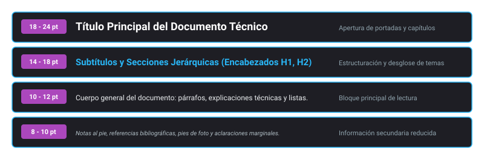
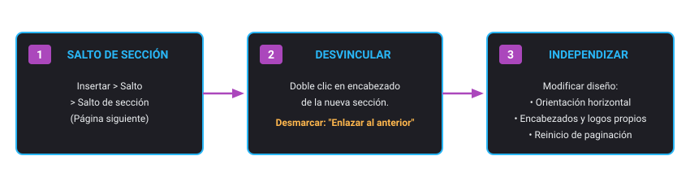
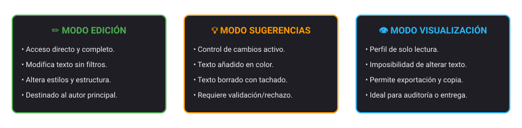

<h1 style="color: #ab47bc;">📝 Tema 2 — Elaboración de Documentos y Plantillas mediante Procesadores de Texto</h1>

El uso técnico de procesadores de texto en entornos profesionales exige dominar la maquetación avanzada, la jerarquización documental mediante estilos, la automatización de índices, el diseño de plantillas corporativas y los flujos de coedición síncrona en la nube.

---

<h2 style="color: #29b6f6;">2.1. Introducción al Procesador de Texto</h2>

Un **procesador de texto** es una aplicación de software diseñada para la composición, edición, maquetación, formato y salida gráfica de documentos digitales estructurados. Supera los límites mecánicos tradicionales al permitir la edición interactiva en memoria, la corrección ortográfica asistida, la gestión dinámica de párrafos y la integración de objetos multimedia.

### Ecosistema de Herramientas Ofimáticas Documentales

| Criterio | Soluciones Libres / Cloud (Google Docs, LibreOffice Writer) | Soluciones Propietarias de Escritorio (Microsoft Word) |
| :--- | :--- | :--- |
| **Licenciamiento y Coste** | Gratuito o de Código Abierto (Open Source). | Licencia comercial perpetua o suscripción periódica (Microsoft 365). |
| **Plataforma y Acceso** | Basado en navegador web nativo (Docs) o ejecutable local libre (Writer). | Instalación completa en local (escritorio) combinada con versión web recortada. |
| **Formato Nativo** | Formato OpenDocument (`.odt`) y formato interno en nube. | Estándar Office Open XML (`.docx`). |
| **Soporte y Comunidad** | Documentación comunitaria, foros públicos y soporte de plataforma. | Soporte técnico corporativo centralizado y acuerdos a medida (SLA). |
| **Colaboración** | Coedición concurrente síncrona nativa en la nube. | Colaboración mediante sincronización con cuentas de OneDrive / SharePoint. |

* **Google Docs:** Herramienta web integrada en Google Workspace orientada a la coedición en tiempo real y el guardado automático persistente en Google Drive.
* **Microsoft Word:** Estándar de mercado corporativo con amplio catálogo de funciones avanzadas de maquetación editorial, control de cambios y correspondencia.
* **LibreOffice Writer:** Procesador libre y gratuito que utiliza de forma nativa el estándar internacional OASIS OpenDocument (`.odt`).
* **Apple Pages:** Procesador optimizado para entornos macOS e iOS, centrado en el diseño editorial visual e intuitivo.

---

<h2 style="color: #29b6f6;">2.2. Configuración del Entorno y Formatos de Exportación</h2>

### Entorno Base de Trabajo
* **Identificación y Guardado Automático:** El documento se vincula a una cuenta cloud mediante un título asignado en la cabecera, guardando cada modificación sin requerir combinaciones manuales.
* **Configuración de Página:** Acceso a *Archivo > Configuración de página* para definir el estándar de soporte (A4, Carta), orientación (*Vertical* u *Horizontal*), color de fondo y márgenes perimetrales medidos en centímetros.
* **Historial de Versiones:** Registro cronológico de auditoría que permite inspeccionar la autoría individual de cada cambio, comparar diferencias temporales y restaurar estados previos del archivo.

### Matriz de Formatos e Interoperabilidad

| Extensión | Denominación Técnica | Características Operativas |
| :--- | :--- | :--- |
| **`.docx`** | Microsoft Word XML | Formato propietario editable estándar del ecosistema Microsoft Office. |
| **`.odt`** | OpenDocument Text | Estándar abierto internacional ISO/IEC para suites ofimáticas libres. |
| **`.pdf`** | Portable Document Format | Formato estático que fija la maquetación vectorial para evitar alteraciones de diseño al imprimir o cambiar de dispositivo. |
| **`.rtf`** | Rich Text Format | Formato de texto enriquecido que conserva estilos básicos sin macros, con amplia compatibilidad entre sistemas operativos. |
| **`.txt`** | Archivo de Texto Plano | Cadena pura de caracteres binarios codificados (UTF-8, ASCII) sin propiedades tipográficas ni objetos embebidos. |
| **`.epub`** | Electronic Publication | Formato reflowable adaptativo optimizado para su lectura en dispositivos lectores de libros electrónicos (*e-readers*). |
| **`.html`** | HyperText Markup Language | Estructura de marcas para visualización directa mediante motores de navegación web. |

---

<h2 style="color: #29b6f6;">2.3. Formato Tipográfico y Estilos de Carácter</h2>

<figure markdown="span">
  
  <figcaption>Figura 2.1 — Jerarquía visual recomendada: Título principal, Subtítulos, Cuerpo de texto y Notas al pie.</figcaption>
</figure>

### Clasificación de Familias Tipográficas
* **Serif (con remate):** Tipografías provistas de pequeñas terminaciones ornamentales en los extremos de los trazos (ej. *Times New Roman, Georgia*). Facilitan el seguimiento de la línea en documentos impresos de alta densidad.
* **Sans Serif (sin remate / palo seco):** Diseños limpios de trazo constante sin remates terminales (ej. *Arial, Roboto, Open Sans*). Resultan idóneos para su lectura sobre pantallas y dispositivos móviles.
* **Decorativas / Manuscritas:** Diseños artísticos o caligráficos reservados exclusivamente para elementos gráficos de portada, logotipos o diplomas, desaconsejados para cuerpos de texto densos.

### Atributos de Carácter y Atajos Esenciales
* **Negrita (`Ctrl + B`):** Engrosa el trazo vectorial de la tipografía para marcar términos clave o encabezados.
* **Cursiva (`Ctrl + I`):** Inclina el glifo para distinguir citas textuales, vocablos en idiomas extranjeros, tecnicismos o nombres científicos.
* **Subrayado (`Ctrl + U`):** Añade una línea inferior para guiar la atención hacia códigos o referencias específicas.
* **Tachado (`Alt + Shift + 5`):** Traza una línea horizontal media sobre el texto; se emplea en fases de revisión para señalar fragmentos obsoletos o pendientes de validación.
* **Superíndice (`Ctrl + .`) y Subíndice (`Ctrl + ,`):** Posicionan caracteres por encima (ej. metros cuadrados: $\text{m}^2$) o por debajo de la línea base (ej. fórmulas químicas: $\text{H}_2\text{O}$).

---

<h2 style="color: #29b6f6;">2.4. Formato de Párrafo, Secciones y Maquetación Avanzada</h2>

### Ajustes Espaciales y Sangrías
* **Alineación:** Izquierda (orientación estándar), Centrada (portadas y fórmulas), Derecha (fechas, destinatarios y firmas) y Justificada (distribución regular entre márgenes para documentos formales).
* **Tipos de Sangrías:**
    * *Sangría de primera línea:* Desplaza hacia la derecha únicamente el primer renglón del párrafo.
    * *Sangría izquierda / derecha:* Retrae el bloque íntegro de texto respecto a los límites de margen.
    * *Sangría francesa:* Mantiene el primer renglón anclado al margen izquierdo y desplaza los renglones subsiguientes hacia la derecha (patrón estándar en bibliografías y referencias normativas).
* **Interlineado y Espaciado:** El **interlineado** modula la distancia vertical entre renglones dentro de un mismo párrafo (1.0, 1.15, 1.5, 2.0). El **espaciado de párrafo** define la separación antes (*anterior*) o después (*posterior*) de cada bloque de texto, evitando la inserción manual de saltos en blanco.

### Control de Flujo: Saltos de Línea, Página y Sección

| Mecanismo de Salto | Atajo de Teclado | Comportamiento Técnico |
| :--- | :--- | :--- |
| **Salto de Línea** | `Shift + Enter` | Pasa al renglón inmediatamente inferior dentro del mismo párrafo, sin reiniciar sangrías ni aplicar el espaciado entre párrafos. |
| **Salto de Página** | `Ctrl + Enter` | Fuerza el traslado inmediato del texto restante al comienzo de la página siguiente, manteniendo idénticas propiedades de sección. |
| **Salto de Sección (Página Siguiente)** | *Menú Insertar* | Divide el documento en dos entornos de maquetación independientes e inicia la nueva sección en una nueva hoja física. |
| **Salto de Sección (Continuo)** | *Menú Insertar* | Fragmenta las directivas de formato en la misma página (útil para alternar texto estándar con bloques de múltiples columnas). |

### Encabezados, Pies y Desvinculación de Secciones
Los encabezados y pies de página se alojan en los márgenes superior e inferior del folio. Para proyectos técnicos (memorias, manuales), admiten reglas avanzadas:
1. **Primera página diferente:** Oculta encabezados y numeración en la portada sin alterar el cuerpo del trabajo.
2. **Páginas pares e impares diferentes:** Permite maquetar documentos destinados a encuadernación e impresión a doble cara.
3. **Desvinculación entre secciones:** Al insertar un *Salto de sección*, se debe editar el encabezado de la nueva sección y desmarcar la directiva **Enlazar con el anterior** para poder cambiar logotipos, títulos de capítulo o numeraciones.

<figure markdown="span">
  
  <figcaption>Figura 2.2 — Flujo para independizar márgenes y encabezados: Salto de sección y desactivación de enlace previo.</figcaption>
</figure>

---

<h2 style="color: #29b6f6;">2.5. Tablas, Listas de Verificación y Objetos Gráficos</h2>

### Matrices de Tablas
* **Generación:** Configuración de cuadrículas iniciales de hasta $20 \times 20$ celdas desde el menú *Insertar > Tabla*.
* **Propiedades de Formato:** Combinación y división de celdas, distribución equitativa de filas y columnas, ajuste métrico de márgenes internos (*padding*), personalización de bordes por color/grosor y sombreado cromático de celda.

### Listas de Verificación (*Checklists*)
Permiten insertar casillas interactivas que tachan automáticamente el texto al completarse. Admiten anidamiento en niveles mediante sangrías con la tecla `Tab` (y retroceso con `Shift + Tab`), optimizando el seguimiento de protocolos y tareas técnicas.

### Integración de Recursos Visuales y Diagramas
* **Ajuste de Imágenes con el Texto:**
    * *En línea:* Trata la imagen como un glifo o carácter tipográfico insertado dentro de la línea de texto.
    * *Ajustar texto:* Envuelve el contorno del elemento gráfico con el texto adyacente según una distancia métrica configurable.
    * *Dividir / Separar texto:* Reserva el ancho de columna completo, posicionando el texto por encima y por debajo del objeto sin elementos a los laterales.
* **Diagramas y Gráficos Dinámicos:** Creación de diagramas de flujo mediante lienzos de dibujo (*Insertar > Dibujo*) e importación de gráficos de barras, líneas o dispersión vinculados a hojas de cálculo externas.

---

<h2 style="color: #29b6f6;">2.6. Referencias, Navegación e Índices Automáticos</h2>

* **Hipervínculos (`Ctrl + K`):** Redirigen a recursos URL externos, archivos compartidos o secciones internas del documento.
* **Marcadores:** Puntos de anclaje invisibles posicionados en puntos clave del texto que sirven como destino para enlaces internos.
* **Notas al Pie (`Ctrl + Alt + F`):** Referencias bibliográficas o aclaraciones numeradas ubicadas al pie de la página correspondiente.
* **Índices Automáticos (Tablas de Contenido):**
    * Se generan a partir del escaneo del árbol jerárquico de estilos del documento (**Encabezado 1**, **Encabezado 2**, **Encabezado 3**).
    * Admiten tres formatos: texto estructurado con numeración de página tabulada, texto con líneas de puntos de relleno y formato hipervinculado navegable.
    * Tras añadir o modificar apartados, se debe pulsar el botón **Actualizar índice** para recalcular títulos y numeraciones.

!!! warning "Requisito Obligatorio para Índices"
    Un índice automático no puede compilarse sobre texto con formato manual libre. Es imprescindible aplicar los estilos de encabezado nativos para que el motor reconozca los niveles jerárquicos del documento.

---

<h2 style="color: #29b6f6;">2.7. Colaboración Síncrona, Auditoría y Herramientas Avanzadas</h2>

### Modos Operativos de Trabajo
* **Modo Edición:** Aplicación de modificaciones directas sobre el contenido y la maquetación.
* **Modo Sugerencias:** Marca las inserciones y supresiones con un color distintivo sin destruir el original, requiriendo validación por parte del propietario.
* **Modo Visualización:** Bloqueo de escritura; habilita lectura e impresión sin riesgo de modificaciones accidentales.
* **Comentarios y Asignaciones:** Anotaciones vinculadas a fragmentos de texto; permiten citar colaboradores mediante `@usuario` para asignarles la resolución de una tarea.

<figure markdown="span">
  
  <figcaption>Figura 2.3 — Esquema de permisos: Edición directa, Sugerencias con validación y Visualización de solo lectura.</figcaption>
</figure>

### Herramientas de Productividad y Análisis
* **Estadísticas del Documento (`Ctrl + Shift + C`):** Panel informativo con cómputo de páginas, palabras, caracteres totales y caracteres sin espacios.
* **Búsqueda y Reemplazo (`Ctrl + H`):** Sustitución automatizada de cadenas con soporte para expresiones regulares (*Regex*), distinción de mayúsculas/minúsculas e ignorado de caracteres diacríticos (acentos).
* **Vinculación con Hojas de Cálculo:** Inserción de tablas y gráficos desde Google Sheets seleccionando *Vincular con la hoja de cálculo*. Al detectar modificaciones en la fuente, el procesador muestra el botón *Actualizar* para sincronizar las cifras de forma inmediata.
* **Accesibilidad:** Soporte nativo para software lector de pantalla, emuladores de líneas Braille y catálogo de atajos mediante `Ctrl + /`.

---

<h2 style="color: #29b6f6;">🎯 Casos Prácticos de Aplicación Real</h2>

!!! example "Caso 1: Maquetación editorial de una memoria técnica con anexos horizontales"
    **Escenario:** Se requiere confeccionar un informe técnico cuya portada no debe mostrar encabezado ni número de página. Además, la sección de esquemas de red debe maquetarse en orientación apaisada (horizontal) sin que el cuerpo del documento pierda la orientación vertical.  
    **Solución:**  
    1. Se activa la casilla **Primera página diferente** en la cabecera de la página 1 para limpiar la portada.  
    2. Al final del texto ordinario, se inserta un **Salto de sección (Página siguiente)**.  
    3. En la nueva sección, se accede a la cabecera y se desmarca **Enlazar con el anterior**.  
    4. Se accede a *Archivo > Configuración de página* y se aplica la orientación **Horizontal** seleccionando *Esta sección*.

!!! example "Caso 2: Revisión editorial con resolución de incompatibilidad documental"
    **Escenario:** Un equipo técnico redacta las especificaciones de un proyecto en una versión moderna de procesador (`.docx`), pero debe remitir el borrador a una contrata externa equipada con terminales antiguos limitados a Word 97 (`.doc`).  
    **Solución:** El redactor valida las propuestas a través del **Modo Sugerencias** y compila el **Índice Automático**. Para garantizar la lectura en el destino, exporta el archivo activando el guardado en **Modo de compatibilidad Word 97-2003 (`.doc`)**, o bien genera una copia final en **PDF** para fijar la maquetación.

--8<-- "docs/includes/glosario.md"
