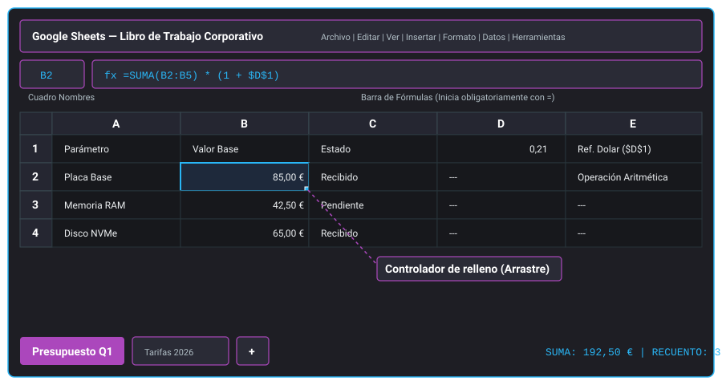
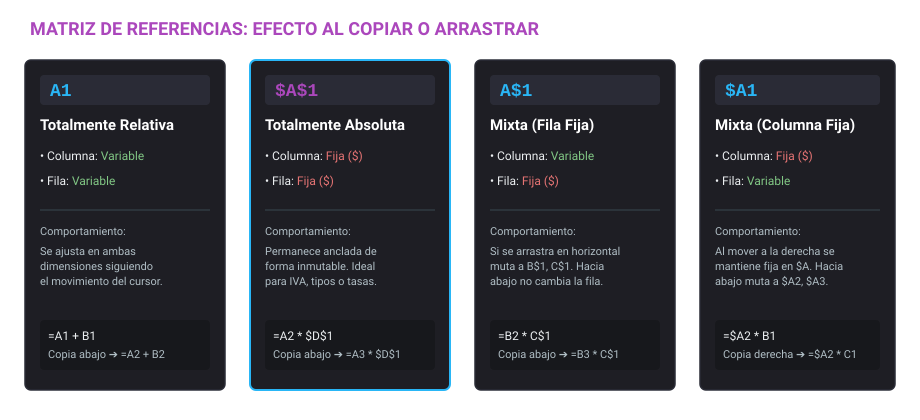
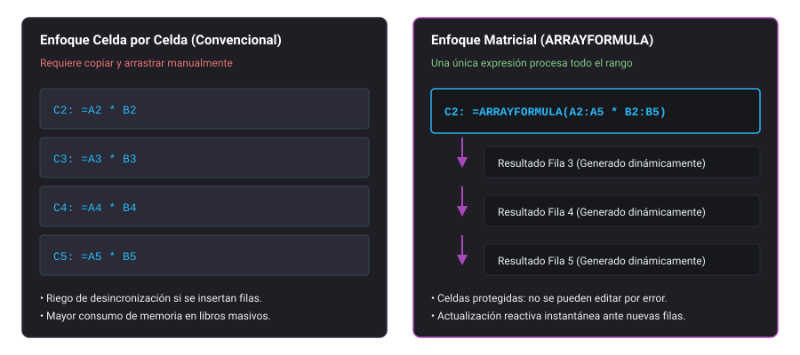

<h1 style="color: #ab47bc;">📊 Tema 3: Elaboración de documentos y plantillas mediante hojas de cálculo</h1>

!!! info "Resultado de Aprendizaje (RA)"
    Elabora hojas de cálculo y plantillas optimizadas utilizando fórmulas, funciones complejas, herramientas de análisis visual, automatización y colaboración en red para la gestión financiera, contable y operativa en entornos corporativos.

---

<h2 style="color: #29b6f6;">3.1. Introducción a las hojas de cálculo</h2>

### 3.1.1. Conceptos básicos y áreas de aplicación
Una **hoja de cálculo** es una herramienta informática estructurada en una cuadrícula bidimensional de filas y columnas, diseñada para almacenar, organizar, calcular y analizar datos numéricos y alfanuméricos mediante algoritmos lógicos y matemáticos.

Sustituye por completo los libros contables manuales, minimizando el error humano y acelerando los procesos de cálculo recurrente. Sus áreas fundamentales de implantación son:

* **Financiera y contable:** Confección de balances, previsiones de tesorería, liquidaciones tributarias y control de gastos operacionales.
* **Gestión de proyectos y operaciones:** Cronogramas de entrega, inventarios en almacenes de recambios, control de horas de trabajo y asignación de recursos técnicos.
* **Análisis estadístico e informes ejecutivos:** Consolidación de conjuntos de datos masivos para generar cuadros de mando, distribuciones de frecuencias y proyecciones de tendencias mediante gráficos especializados.

### 3.1.2. Beneficios del modelo en la nube (Google Sheets)
Frente a las soluciones ofimáticas monousuario basadas en archivos locales, **Google Sheets** introduce un paradigma centrado en la red corporativa:

* **Sincronización continua y persistencia en Google Drive:** Los cambios se graban en tiempo real sin requerir acciones explícitas de guardado local por parte del operador.
* **Auditoría mediante historial de versiones:** Registro detallado de cada edición con identificación de usuario y marca de tiempo, permitiendo restaurar estados anteriores del archivo.
* **Interoperabilidad de formatos:** Compatibilidad con Microsoft Excel (`.xlsx`), archivos de texto con valores separados por comas (`.csv`), valores delimitados por tabulaciones (`.tsv`) y documentos portátiles (`.pdf`).
* **Edición concurrente multiusuario:** Varios técnicos pueden trabajar de forma simultánea en la misma hoja con bloqueos granulares a nivel de celda o rango para evitar colisiones.

### 3.1.3. Anatomía de la interfaz y entorno de trabajo
El espacio de trabajo se articula en zonas de control claramente delimitadas:

* **Barra de menús y herramientas:** Acceso superior a comandos globales (`Archivo`, `Editar`, `Ver`, `Formato`, `Datos`, `Herramientas`, `Extensiones`).
* **Barra de fórmulas:** Espacio horizontal bajo las herramientas donde se inspecciona y edita el contenido subyacente de la celda activa. Si la celda contiene una fórmula, aquí se muestra la expresión matemática iniciada por `=`, mientras que la celda de la cuadrícula expone únicamente el resultado calculado.
* **Cuadrícula de celdas:** Formada por **columnas** (identificadas mediante letras desde la A hasta la Z, seguidas de AA, AB...) y **filas** (numeradas consecutivamente del 1 en adelante).
* **Pestañas de hojas de trabajo:** Área inferior que permite navegar, agregar, duplicar, renombrar y ordenar las distintas páginas dentro de un mismo libro de trabajo.
* **Barra de estado y exploración:** Zona inferior derecha con indicadores de cálculo dinámico (Suma, Promedio, Mín, Máx, Recuento) del rango seleccionado y acceso al panel de análisis asistido.

<figure markdown="span">
  
  <figcaption>Figura 3.1 — Arquitectura de elementos y zonas de trabajo en una hoja de cálculo.</figcaption>
</figure>

### 3.1.4. Gobernanza del documento y niveles de acceso
La seguridad del archivo se gestiona mediante listas de control de acceso (ACL) asignables a cuentas individuales o grupos de dominio corporativo:

* **Lector:** Permiso de solo lectura. No puede alterar fórmulas, valores ni configuraciones.
* **Comentador:** Puede visualizar los datos e insertar notas de revisión o hilos de comentarios sin modificar el contenido de las celdas.
* **Editor:** Control total sobre la cuadrícula: edición de fórmulas, creación de rangos con nombre, alteración de la estructura de filas/columnas y gestión de formatos condicionales.

---

<h2 style="color: #29b6f6;">3.2. Gestión de datos</h2>

### 3.2.1. Tipología de datos e introducción
Una **celda** es la unidad atómica de información resultante de la intersección entre una columna y una fila (ej. `B4`). Un **rango** es un grupo de celdas adyacentes (continuo, ej. `B2:D10`) o dispersas (discontinuo, ej. `B2; D5; F8`).

Las hojas de cálculo aplican criterios estrictos de interpretación según el tipo de dato:

| Tipo de Dato | Alineación por Defecto | Criterio de Reconocimiento | Tratamiento Aritmético |
| :--- | :--- | :--- | :--- |
| **Texto (String)** | Izquierda | Cadenas alfanuméricas o números precedidos de apóstrofo (`'123`) | No operable directamente con operadores aritméticos (`+`, `*`) |
| **Numérico** | Derecha | Dígitos con separador decimal configurado regionalmente (coma o punto) | Operable directamente en fórmulas y funciones |
| **Fecha / Hora** | Derecha | Formato reconocido (ej. `DD/MM/AAAA` o `HH:MM:SS`) | Internamente es un número de serie continuo (días transcurridos) |
| **Booleano** | Centro | Valores lógicos nativos `VERDADERO` o `FALSO` | Evaluados como condiciones lógicas o valores numéricos (1 y 0) |
| **Fórmula** | Según el resultado | Expresión matemática que inicia estrictamente con el carácter `=` | Se computa en tiempo de ejecución del motor de cálculo |

!!! tip "Borrado de contenido vs. borrado de formato"
    Al pulsar la tecla `Backspace` o `Supr`, se elimina el contenido de la celda pero se conservan los estilos aplicados (bordes, colores de fondo, formatos de moneda). Para eliminar los estilos sin borrar el dato, debe utilizarse **Formato > Borrar formato** o el atajo `Ctrl + \`.

### 3.2.2. Portapapeles técnico y pegado especial
El pegado convencional (`Ctrl + C` y `Ctrl + V`) transfiere el valor, la fórmula interna y todas las reglas de estilo de la celda de origen.

El **Pegado especial** (`Ctrl + Shift + V`) es crítico en tareas de consolidación de datos: vuelca únicamente los **valores calculados**, desvinculándolos de sus fórmulas originales y evitando que se hereden estilos no deseados o errores por rotura de referencias relativas.

### 3.2.3. Formatos numéricos y control de precisión
La representación visual de un número es independiente de su valor numérico real de cómputo:

* **Moneda:** Asigna el símbolo de divisa correspondiente (ej. `1250,50 €`), manteniendo dos decimales por convención contable.
* **Porcentaje:** Multiplica el valor por 100 de forma visual y añade el signo `%` (el valor `0,21` se renderiza como `21,00 %`).
* **Número con decimales fijos:** Permite fijar los decimales visibles. La hoja redondea visualmente en pantalla, pero preserva la precisión original en la memoria de cálculo para no propagar errores de redondeo.
* **Formatos personalizados de fecha:** Permite configurar patrones como `AAAA-MM-DD` (estándar ISO 8601) para estandarizar bases de datos antes de su exportación.

### 3.2.4. Series automáticas y controlador de relleno
El **controlador de relleno** es el pequeño cuadrado azul situado en la esquina inferior derecha de la celda activa. Al arrastrarlo horizontal o verticalmente:

1. **Detección de patrones:** Si se seleccionan dos celdas con valores `1` y `2`, el arrastre prolonga la serie aritmética (`3`, `4`, `5`...).
2. **Series cronológicas:** Reconoce días de la semana (`Lunes`, `Martes`...), meses (`Enero`, `Febrero`...) y fechas consecutivas con solo arrastrar una única celda de origen.
3. **Propagación de fórmulas:** Replica la lógica de la celda inicial adaptando automáticamente las referencias a celdas según sean relativas o absolutas.

---

<h2 style="color: #29b6f6;">3.3. Formato y diseño estructural de hojas</h2>

### 3.3.1. Estilos, alineaciones y delimitación visual
El diseño técnico de una plantilla ofimática persigue maximizar la legibilidad y reducir la fatiga visual:

* **Bordes de celda:** Permiten jerarquizar la información. Es recomendable utilizar bordes dobles inferiores para filas de totales y bordes simples de color gris medio (`#b0bec5` o `#9e9e9e`) para la cuadrícula interna, evitando saturar la vista.
* **Ajuste de texto:** Opciones disponibles en **Formato > Ajuste de texto**:
    * *Desbordamiento:* El texto invade las celdas contiguas si están vacías.
    * *Ajuste:* Expande la altura de la fila para que el texto se distribuya en varias líneas dentro del ancho disponible de la columna.
    * *Recorte:* Corta el contenido en el borde derecho de la celda sin alterar la altura de la fila.
* **Alineación mixta:** Los textos descriptivos deben alinearse a la izquierda, los códigos o estados breves al centro, y los importes económicos a la derecha para que los separadores decimales queden alineados verticalmente.

### 3.3.2. Formato condicional y mapas de calor
El **formato condicional** (**Formato > Formato condicional**) automatiza la aplicación de propiedades visuales (color de relleno, color de texto, negrita) en función de reglas lógicas evaluadas sobre el valor de la propia celda o mediante fórmulas personalizadas.

* **Reglas de celda única:** Evalúan condiciones fijas (*Mayor que*, *Menor o igual que*, *El texto contiene*, *La celda está vacía*).
* **Escala de colores (Mapas de calor):** Aplica un degradado continuo entre dos o tres puntos de control (mínimo, punto medio y máximo). Resulta indispensable en auditorías financieras y operativas para detectar de un vistazo valores atípicos (*outliers*), desvíos presupuestarios o sobrecargas en tickets de soporte.
* **Jerarquía de reglas:** Si coinciden dos reglas sobre una misma celda, se procesan en orden descendente; la que esté situada más arriba en la lista de reglas prevalece sobre las inferiores.

### 3.3.3. Inmovilización y segmentación de datos
Para trabajar con volúmenes de datos extensos:

* **Inmovilización (`Ver > Inmovilizar`):** Fija una o varias filas superiores (cabeceras de columna) y/o columnas izquierdas (códigos identificadores). Al realizar scroll vertical u horizontal, los encabezados permanecen visibles en pantalla en todo momento.
* **Gestión de pestañas:** Se recomienda organizar los libros de trabajo complejos segmentando las tablas maestras, los cálculos intermedios y los informes finales en diferentes pestañas, asignando un color distintivo a cada una mediante clic secundario sobre su etiqueta.
* **Colores alternos (`Formato > Colores alternos`):** Aplica bandas sombreadas automáticas a filas alternas (técnica *zebra striping*), facilitando el seguimiento visual de registros anchos.

### 3.3.4. Gráficos técnicos para análisis de datos
Mediante el menú **Insertar > Gráfico**, el motor ofimático permite transformar rangos de datos en modelos visuales:

* **Columnas / Barras:** Adecuados para comparar magnitudes numéricas discretas entre distintas categorías (ej. consumo por departamento).
* **Líneas / Áreas:** Muestran la evolución continua de una variable a lo largo del tiempo (ej. consumo de ancho de banda o evolución mensual de incidencias).
* **Circulares / Anillos:** Indican la proporción de cada parte respecto al total del 100 %. No recomendables cuando existen más de 5 categorías para evitar saturación visual.
* **Dispersión (Scatter):** Permiten identificar la relación de correlación estadística entre dos variables numéricas continuas.

---

<h2 style="color: #29b6f6;">3.4. Fórmulas y funciones matemáticas básicas</h2>

### 3.4.1. Sintaxis de fórmulas y jerarquía de operadores
Una fórmula es una ecuación matemática definida por el usuario. Exige como requisito de sintaxis ineludible comenzar con el signo igual (`=`):

```
= (Precio_Unitario * Unidades) - Descuento
```

La evaluación de las expresiones sigue la jerarquía algebraica estándar:

1. **Agrupación:** Paréntesis interiores hacia exteriores `( )`.
2. **Exponenciación:** Símbolo intercalado `^`.
3. **Multiplicación y División:** Operadores `*` y `/` (evaluados de izquierda a derecha).
4. **Suma y Resta:** Operadores `+` y `-`.
5. **Concatenación de texto:** Operador ampersand `&`.
6. **Comparación relacional:** Operadores `=`, `<>`, `>`, `<`, `>=`, `<=`. Devuelven `VERDADERO` o `FALSO`.

### 3.4.2. Catálogo de funciones estándar
A diferencia de una fórmula construida solo con operadores básicos, una **función** es una rutina de cálculo preconfigurada en el motor ofimático que recibe argumentos entre paréntesis y devuelve un resultado procesado.

| Función | Sintaxis Estricta | Descripción Técnica | Ejemplo Práctico |
| :--- | :--- | :--- | :--- |
| **SUMA** | `=SUMA(valor1; [valor2; ...])` | Añade todos los valores numéricos del rango ignorando celdas de texto | `=SUMA(C2:C50)` |
| **PROMEDIO** | `=PROMEDIO(valor1; [valor2; ...])` | Calcula la media aritmética de los valores numéricos del rango | `=PROMEDIO(D2:D100)` |
| **MIN** | `=MIN(valor1; [valor2; ...])` | Determina el valor numérico más bajo dentro del rango evaluado | `=MIN(E2:E20)` |
| **MAX** | `=MAX(valor1; [valor2; ...])` | Determina el valor numérico más alto dentro del rango evaluado | `=MAX(E2:E20)` |
| **CONTAR** | `=CONTAR(valor1; [valor2; ...])` | Cuantifica el número de celdas que contienen exclusivamente datos numéricos | `=CONTAR(A2:A500)` |
| **CONTARA** | `=CONTARA(valor1; [valor2; ...])` | Cuenta las celdas no vacías (números, texto, errores, valores lógicos) | `=CONTARA(B2:B500)` |

### 3.4.3. Referencias relativas, absolutas y mixtas
El direccionamiento de celdas dentro de las fórmulas condiciona su comportamiento al ser copiadas, movidas o arrastradas con el controlador de relleno:

* **Referencia Relativa (`A1`):** La posición de la celda de destino se calcula con base en el desplazamiento relativo (filas y columnas) respecto a la celda de origen. Si en `C1` escribimos `=A1+B1` y arrastramos la fórmula hacia la fila 2, muta automáticamente a `=A2+B2`.
* **Referencia Absoluta (`$A$1`):** Bloquea de forma inmutable tanto la columna como la fila mediante el operador dólar (`$`). Si se arrastra la fórmula por la cuadrícula, la celda apuntada sigue siendo siempre `$A$1`.
* **Referencia Mixta:** Bloquea únicamente uno de los dos componentes:
    * `$A1` (Columna fija, fila relativa): Al arrastrar verticalmente la fila varía (`$A2`, `$A3`), pero al arrastrar horizontalmente la columna no cambia.
    * `A$1` (Columna relativa, fila fija): Al arrastrar horizontalmente la columna varía (`B$1`, `C$1`), pero al arrastrar hacia abajo la fila permanece anclada.

<figure markdown="span">
  
  <figcaption>Figura 3.2 — Comportamiento de referencias relativas, absolutas y mixtas al arrastrar fórmulas.</figcaption>
</figure>

### 3.4.4. Errores estrictos de cálculo y resolución técnica
Cuando el motor de cálculo no puede evaluar una expresión, devuelve un código de error específico. Conocer su causa exacta permite diagnosticarlos y corregirlos rápidamente:

| Código | Causa Raíz Técnica |
| :--- | :--- |
| **`#DIV/0!`** | Intento de división entre cero o celda vacía en denominador |
| **`#N/A`** | Valor buscado no disponible o inexistente en matriz destino |
| **`#REF!`** | Referencia inválida por celda, fila o columna eliminada |
| **`#¡VALOR!`** | Tipo de dato incompatible (ej. operar aritméticamente texto) |
| **`#¿NOMBRE?`** | Nombre de función mal escrito o rango con nombre inexistente |
| **`#¡NUM!`** | Cálculo produce un número fuera de los límites admitidos |

* **`#DIV/0!`:** Se produce al intentar dividir entre cero o apuntar a una celda sin valor numérico en el denominador. Se subsana validando el divisor con una función condicional o asegurando datos numéricos válidos.
* **`#N/A`:** Ocurre habitualmente en funciones de búsqueda (`BUSCARV`, `BUSCARX`, `COINCIDIR`) cuando el parámetro consultado no existe en la matriz de referencia.
* **`#REF!`:** Muy frecuente tras borrar físicamente filas o columnas que formaban parte de fórmulas activas en otras partes de la hoja.
* **`#¡VALOR!` (`#VALUE!`):** Aparece cuando un operador matemático estricto (`+`, `*`) intenta procesar celdas que contienen texto alfanumérico o espacios en blanco interpretados como cadena.

---

<h2 style="color: #29b6f6;">3.5. Colaboración en red e integración en el entorno ofimático</h2>

### 3.5.1. Mecanismos de trabajo colaborativo
La edición concurrente en Google Sheets ofrece herramientas de comunicación integradas en el propio libro:

* **Comentarios orientados a tareas:** Al pulsar `Ctrl + Alt + M` sobre una celda, se abre un cuadro de comentario. Escribiendo el carácter `@` seguido de una dirección de correo corporativa (ej. `@soporte@empresa.com`), el sistema envía una notificación formal y permite asignar la celda como tarea de seguimiento al usuario citado.
* **Notas estáticas:** A diferencia de los comentarios, no permiten hilos de debate ni asignaciones; son etiquetas informativas emergentes que aparecen al situar el cursor sobre una celda identificada con un pequeño triángulo negro en su esquina superior derecha.
* **Rangos protegidos:** Desde **Datos > Proteger hojas y rangos**, los administradores pueden autorizar la edición de celdas clave únicamente a determinados usuarios, bloqueando celdas con fórmulas sensibles para evitar modificaciones accidentales por parte de los operadores de datos.

### 3.5.2. Integración cruzada con la suite ofimática
El flujo de trabajo corporativo conecta las hojas de cálculo con el resto de componentes del sistema:

* **Vinculación dinámica en procesadores de texto y diapositivas:** Al copiar un gráfico o tabla desde Google Sheets y pegarlo en Google Docs o Google Slides, se debe activar la opción **Vincular con la hoja de cálculo**. Cuando los datos cambian en la hoja de cálculo, aparece el botón interactivo **Actualizar** en el documento destino, reflejando las cifras actualizadas sin tener que rehacer el informe o la presentación.
* **Captura automatizada mediante Google Forms:** Los cuestionarios y partes de trabajo generados con Forms vuelcan automáticamente cada respuesta enviada en una fila consecutiva de una hoja de cálculo vinculada, registrando de forma nativa la marca temporal (`Timestamp`) del sistema.

---

<h2 style="color: #29b6f6;">3.6. Funciones avanzadas y automatización de consultas</h2>

### 3.6.1. Funciones condicionales y de agregación lógica
Permiten bifurcar el flujo de cálculo y aplicar operaciones matemáticas sobre registros que satisfacen criterios explícitos:

#### Función SI
Evalúa una condición lógica y devuelve un resultado configurable para el caso verdadero y otro para el falso.

```
=SI(prueba_lógica; valor_si_verdadero; valor_si_falso)
```

```
=SI(C2 >= 5; "Aprobado"; "Suspenso")
```

#### Función CONTAR.SI
Cuenta el número de celdas dentro de un rango que cumplen una condición determinada.

```
=CONTAR.SI(rango; criterio)
```

```
=CONTAR.SI(E2:E100; ">=1000")
```

#### Función SUMAR.SI
Suma los valores de un rango si las celdas correspondientes cumplen el criterio especificado.

```
=SUMAR.SI(rango_criterio; criterio; [rango_suma])
```

```
=SUMAR.SI(A2:A50; "Hardware"; C2:C50)
```

#### Función BUSCAR
Localiza un elemento dentro de un vector ordenado y recupera el valor equivalente en la misma posición de un vector de resultados.

```
=BUSCAR(valor_buscado; rango_de_búsqueda; rango_de_resultado)
```

```
=BUSCAR("SMR-01"; A2:A20; B2:B20)
```

!!! warning "Ordenación en la función BUSCAR clásica"
    La función `BUSCAR` tradicional exige estrictamente que el vector de búsqueda se encuentre ordenado de forma ascendente. Para búsquedas exactas no ordenadas en entornos modernos, se recomienda utilizar `BUSCARV(valor; rango; indice; FALSO)` o la función `BUSCARX`.

### 3.6.2. Manipulación avanzada de cadenas de texto y fechas

#### Funciones de texto
* `=MAYUSC(A1)` / `=MINUSC(A1)`: Transforman cadenas de texto a mayúsculas o minúsculas íntegras.
* `=NOMPROPIO(A1)`: Capitaliza la primera letra de cada palabra (ideal para nombres propios y apellidos).
* `=IZQUIERDA(A1; n)` / `=DERECHA(A1; n)`: Extraen los primeros o últimos *n* caracteres de la cadena.
* `=EXTRAE(A1; inicio; n)`: Extrae una subcadena de longitud *n* a partir de la posición `inicio`.
* `=LARGO(A1)`: Devuelve el número total de caracteres de la celda (incluyendo espacios en blanco).
* `=HALLAR("subcadena"; A1)`: Devuelve la posición numérica inicial de una subcadena sin distinguir mayúsculas de minúsculas.
* `=UNIRCADENAS(delimitador; ignorar_vacías; texto1; [texto2; ...])`: Concatena una lista de celdas o rangos introduciendo un separador definido entre ellas.

#### Funciones cronológicas
* `=HOY()`: Devuelve la fecha actual del sistema. Es una función volátil que se recalcula al abrir el archivo.
* `=AHORA()`: Devuelve la marca temporal completa (fecha y hora en curso).
* `=FECHA(año; mes; día)`: Ensambla una fecha nativa a partir de valores numéricos individuales de año, mes y día, garantizando su validez cronológica con independencia de la configuración regional.
* `=SIFECHA(fecha_inicial; fecha_final; "unidad")`: Calcula el intervalo transcurrido entre dos fechas en años (`"Y"`), meses (`"M"`) o días (`"D"`).

### 3.6.3. El motor de consulta QUERY
La función `QUERY` ejecuta consultas avanzadas sobre una matriz de datos utilizando una variante reducida y estructurada del estándar SQL (*Structured Query Language*).

```
=QUERY(datos; "consulta"; [encabezados])
```

Los comandos más utilizados dentro de la cadena de consulta son:

* `SELECT`: Especifica las columnas que se van a extraer (mediante su letra de columna: `SELECT A, C, F`).
* `WHERE`: Filtra las filas que cumplan una o varias condiciones lógicas (`WHERE B > 100 AND D = 'Murcia'`).
* `ORDER BY`: Ordena los resultados según una columna de forma ascendente (`ASC`) o descendente (`DESC`).
* `LIMIT`: Limita la cantidad máxima de filas retornadas por la consulta.
* `LABEL`: Renombra las etiquetas de cabecera de las columnas en la tabla resultante.

```
=QUERY(A1:E200; "SELECT A, B, E WHERE E >= 500 ORDER BY E DESC LIMIT 10"; 1)
```

### 3.6.4. Fórmulas matriciales con ARRAYFORMULA
En el cálculo convencional, para operar dos columnas completas celda por celda (ej. multiplicar `A2*B2`, `A3*B3`...) es necesario escribir la fórmula y arrastrarla a lo largo de cientos de filas.

La función `ARRAYFORMULA` procesa matrices de datos de forma masiva:

```
=ARRAYFORMULA(A2:A50 * B2:B50)
```

Al introducir esta fórmula en la celda `C2`, el motor calcula y desborda automáticamente el resultado por todo el rango `C2:C50`. Si se añaden nuevas filas o se modifica una celda, toda la matriz se recalcula sin necesidad de volver a arrastrar fórmulas manualmente.

<figure markdown="span">
  
  <figcaption>Figura 3.3 — Flujo de cálculo celda por celda frente al despliegue matricial con ARRAYFORMULA.</figcaption>
</figure>

---

<h2 style="color: #29b6f6;">3.7. Casos prácticos resueltos</h2>

### Caso Práctico 1: Plantilla contable con IVA y referencias mixtas
**Escenario:** El departamento de compras de un integrador de sistemas microinformáticos recibe una tabla con 300 componentes de hardware. Es necesario calcular el importe de IVA y el precio de venta al público (PVP) final de cada producto aplicando un tipo impositivo general del 21 %, centralizado en la celda `H1`.

**Estructura del libro:**
* Columna A: Código de artículo (ej. `CPU-01`).
* Columna B: Denominación técnica (ej. `Intel Core i5-13400`).
* Columna C: Precio base imponible (ej. `185,00 €`).
* Celda `H1`: `0,21` (formateado como porcentaje: `21 %`).

**Solución técnica implementada:**
1. En la celda `D2` (Importe de IVA) se introduce la fórmula utilizando la referencia fija a la celda impositiva:
    ```
    =C2 * $H$1
    ```
2. En la celda `E2` (PVP con IVA) se formula el totalizado:
    ```
    =C2 + D2
    ```
    *(o directamente `=C2 * (1 + $H$1)`)*
3. Al posicionar el cursor sobre el controlador de relleno de `D2:E2` y arrastrarlo verticalmente hasta la fila 301, las referencias a los precios base mutan consecutivamente (`C3`, `C4`, `C5`...), mientras que el puntero impositivo permanece bloqueado en `$H$1`. Si se hubiese utilizado `=C2 * H1`, a partir de la fila 3 la fórmula multiplicaría por celdas vacías (`H2`, `H3`...), generando ceros o errores técnicos.

### Caso Práctico 2: Cuadro de mando con formato condicional y vinculación a Google Docs
**Escenario:** El responsable del Centro de Atención a Usuarios (CAU) gestiona el seguimiento semanal de incidencias abiertas en una hoja de cálculo y debe presentar los resultados en un informe ejecutivo para la dirección técnica.

**Implementación técnica:**
1. **Detección de tiempos de resolución:** En la columna `F` se registran los días que lleva abierta cada incidencia.
2. **Configuración del mapa de calor:**
    * Se selecciona el rango de datos `F2:F150`.
    * Se accede a **Formato > Formato condicional** y se selecciona la pestaña **Escala de colores**.
    * Punto mínimo (0 días): fondo verde claro (`#c8e6c9`).
    * Punto medio (5 días): fondo amarillo (`#fff59d`).
    * Punto máximo (>= 10 días): fondo rojo intenso (`#ffcdd2`) con texto en rojo oscuro.
3. **Elaboración y vinculación del gráfico:**
    * Se genera un gráfico de barras horizontales desde **Insertar > Gráfico**, representando el volumen de incidencias por técnico asignado.
    * Se copia el gráfico al portapapeles con `Ctrl + C`.
    * Se abre el informe semanal en **Google Docs**, se ejecuta el comando de pegado (`Ctrl + V`) y se marca la casilla obligatoria **Vincular con la hoja de cálculo**.
    * Cuando los técnicos cierran incidencias en Sheets a lo largo de la semana, el redactor del informe únicamente pulsa el botón **Actualizar** en Docs, manteniendo el documento impreso y digital completamente sincronizado con los datos reales.

---

<h2 style="color: #29b6f6;">3.8. Apéndice técnico: Atajos de teclado y glosario</h2>

### 3.8.1. Tabla de atajos de teclado esenciales

| Atajo | Acción Técnica Asociada | Entorno de Aplicación |
| :--- | :--- | :--- |
| `F2` | Activa el modo edición dentro de la celda activa sin sobrescribirla | Cuadrícula de datos |
| `F4` | Alterna entre referencias relativas, absolutas y mixtas (`A1` -> `$A$1` -> `A$1` -> `$A1`) | Durante la escritura de fórmulas |
| `Ctrl + C` | Copia al portapapeles el contenido, formato y fórmula de la selección | Global |
| `Ctrl + X` | Corta la selección actual para desplazarla a otra ubicación | Global |
| `Ctrl + V` | Pega la totalidad del contenido, fórmulas y estilos del portapapeles | Global |
| `Ctrl + Shift + V` | **Pegado especial:** vuelca únicamente los valores calculados de la selección | Global |
| `Ctrl + Espacio` | Selecciona la columna completa correspondiente a la celda activa | Navegación |
| `Shift + Espacio` | Selecciona la fila completa correspondiente a la celda activa | Navegación |
| `Ctrl + D` | Rellena hacia abajo replicando la fórmula o valor de la celda superior | Edición de rangos |
| `Ctrl + R` | Rellena hacia la derecha replicando el valor de la celda izquierda | Edición de rangos |
| `Ctrl + 1` | Despliega el panel de formato de celdas y propiedades numéricas | Formato |
| `Ctrl + \` | Elimina de forma inmediata todos los estilos y formatos del rango | Formato |

### 3.8.2. Glosario de términos clave
* **Celda activa:** Celda que se encuentra seleccionada en un momento dado, delimitada visualmente por un borde perimetral azul continuo y cuya dirección aparece en el cuadro de nombres.
* **Rango con nombre:** Identificador alfanumérico que reemplaza una dirección de celdas (ej. denominar `IVA_GENERAL` al rango `$H$1`), haciendo que las fórmulas sean más legibles y fáciles de auditar (ej. `=C2 * IVA_GENERAL`).
* **Tabla dinámica:** Herramienta interactiva de agregación que permite resumir, categorizar, filtrar y pivotar grandes volúmenes de registros tabulares sin alterar la fuente de datos original.
* **Controlador de relleno:** Herramienta gráfica interactiva ubicada en la esquina inferior derecha de la celda activa utilizada para extrapolar series lógicas y copiar fórmulas.

---

<h2 style="color: #29b6f6;">3.9. Puntos críticos para examen (Claves PAC)</h2>

!!! danger "Conceptos determinantes para evaluación"
    1. **Carácter obligatorio de inicio de fórmula:** Toda función o cálculo matemático en una celda DEBE comenzar de forma ineludible con el carácter igual (`=`). Si se omite, el motor interpretará la entrada como una cadena de texto alfanumérica.
    2. **Identificación quirúrgica de errores técnicos:**
        * `#DIV/0!`: División aritmética entre cero o denominador referenciado vacío.
        * `#REF!`: Pérdida de integridad referencial. Una fórmula apunta a una celda, fila o columna que ha sido eliminada físicamente de la hoja.
        * `#¡VALOR!`: Conflicto de tipos. Ocurre al aplicar un operador matemático estricto sobre celdas que contienen caracteres de texto.
        * `#N/A`: Valor no disponible (*Not Available*). Indica que la función de búsqueda no ha localizado la clave especificada en el rango de búsqueda.
    3. **Comportamiento del operador dólar (`$`):**
        * `$A$1`: Referencia absoluta (fila y columna bloqueadas).
        * `A$1`: Referencia mixta (fila bloqueada, columna relativa al desplazarla horizontalmente).
        * `$A1`: Referencia mixta (columna bloqueada, fila relativa al desplazarla verticalmente).
        * `A1`: Referencia relativa (muta libremente en filas y columnas al replicarse).
    4. **Sintaxis exacta de la función condicional:**
        `=SI(prueba_lógica; valor_si_verdadero; valor_si_falso)`. Las salidas que representen texto deben ir siempre delimitadas entre comillas dobles (ej. `"Aprobado"`), mientras que las salidas numéricas o de cálculo se escriben directamente sin comillas.
    5. **Pegado exclusivo de valores:** El comando `Ctrl + Shift + V` es el único atajo que omite fórmulas, vínculos y colores, volcando exclusivamente los datos en texto plano.
    6. **Operador de concatenación:** El símbolo `&` une cadenas alfanuméricas o contenidos de celdas (`=A1 & " " & B1`), actuando de forma análoga a la función `CONCATENAR` o `UNIRCADENAS`.
    7. **Edición no destructiva de celda:** La tecla `F2` entra en modo de edición interactiva dentro del contenido de la celda activa sin borrar su información previa.
    8. **Estructura de la función QUERY:** Requiere una matriz de datos y una consulta en formato texto basada en lenguaje tipo SQL, admitiendo cláusulas como `SELECT`, `WHERE`, `ORDER BY` y `LIMIT`.

--8<-- "docs/includes/glosario.md"
