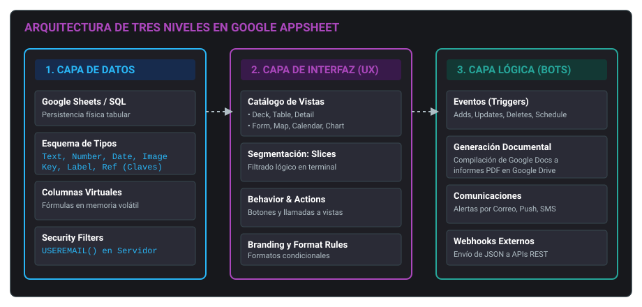
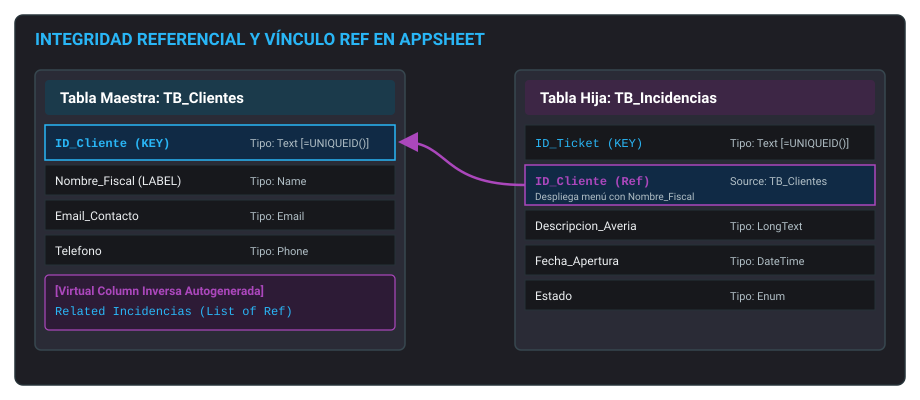
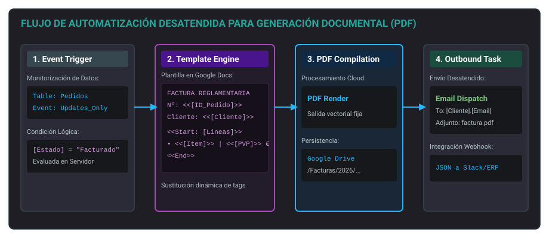

<h1 style="color: #ab47bc;">Tema 4: Elaboración de documentos con bases de datos</h1>

!!! info "Resultado de Aprendizaje (RA)"
    Elabora soluciones de gestión de datos mediante plataformas de desarrollo no-code (AppSheet) e integración de bases de datos relacionales, estructurando tablas, claves, vistas interactivas, automatizaciones con bots y políticas de seguridad y sincronización.

---

<h2 style="color: #29b6f6;">1. Introducción a la gestión de datos y AppSheet</h2>

### 1.1. Principios de bases de datos relacionales
Una **base de datos** es un sistema estructurado concebido para almacenar, procesar, consultar e indexar grandes volúmenes de datos de forma persistente e íntegra. Su arquitectura elimina redundancias operativas, previene la inconsistencia de datos concurrentes y optimiza la velocidad de respuesta frente a sistemas basados en almacenamiento plano de ficheros.

La estructura relacional se fundamenta en elementos claramente jerarquizados:

*   **Tabla:** Estructura atómica bidimensional configurada en filas y columnas donde se almacena un conjunto estructurado de información asociada a una misma entidad temática (ej. `Clientes`, `Artículos`, `Facturas`).
*   **Registro (Tupla o Fila):** Instancia unitaria e indivisible de información correspondiente a un objeto o individuo único del sistema.
*   **Campo (Columna o Atributo):** Propiedad homogénea que describe a todos los registros de una tabla (ej. `ID_Cliente`, `Nombre`, `Email`, `Telefono`).
*   **Clave Primaria (*Primary Key*):** Columna o conjunto de columnas cuyo valor identifica unívocamente a cada registro en la tabla. Impide registros duplicados y no admite valores nulos (`NULL`).
*   **Clave Externa (*Foreign Key* / `Ref`):** Atributo presente en una tabla subordinada que almacena el valor de la clave primaria de una tabla maestra, estableciendo un vínculo relacional de integridad referencial.

```
                  ESTRUCTURA DE UNA BASE DE DATOS RELACIONAL
+-------------------------------------------------------------------------+
| TABLA: Clientes                                                         |
+-------------------++------------------+-----------------+---------------+
| ID Cliente (KEY)  || Nombre           | Correo          | Teléfono      |  <-- CAMPOS (Columnas)
+-------------------++------------------+-----------------+---------------+
| CLI-001           || Juan Pérez       | juan@email.com  | 600111222     |  <-- REGISTRO 1 (Fila)
| CLI-002           || Ana Gómez        | ana@email.com   | 600333444     |  <-- REGISTRO 2 (Fila)
+-------------------++------------------+-----------------+---------------+
```

### 1.2. Tipología de repositorios de datos
La elección del motor de persistencia subyacente condiciona la arquitectura, el rendimiento y la escalabilidad de la solución desplegada:

| Criterio Técnico | Bases de Datos Relacionales (SQL) | Bases de Datos No Relacionales (NoSQL) | Hojas de Cálculo (Google Sheets / Excel) |
| :--- | :--- | :--- | :--- |
| **Estructura** | Tablas estrictas acopladas por claves primarias y foráneas con esquemas rígidos | Colecciones flexibles basadas en documentos (JSON), grafos o clave-valor | Matrices tabulares de filas y columnas sin restricciones estrictas de esquema |
| **Integridad y ACID** | Cumplimiento estricto de propiedades ACID (Atomicidad, Consistencia, Aislamiento, Durabilidad) | Consistencia eventual optimizada para disponibilidad y tolerancia a particiones | Sin transacciones nativas formales; vulnerable a corrupción por edición directa |
| **Casos de Uso** | Sistemas ERP, facturación, control contable e inventarios críticos corporativos | Redes de telemetría IoT, mensajería, big data y catálogos dinámicos | Prototipos ágiles, pequeñas empresas, departamentos administrativos locales |
| **Conexión con AppSheet** | Conexión directa mediante conectores nativos Cloud SQL, MySQL, PostgreSQL o SQL Server | Requiere capas intermedias de integración mediante APIs REST o Webhooks | Integración transparente, inmediata y reactiva dentro del ecosistema en la nube |

### 1.3. La plataforma AppSheet: Arquitectura y pilares
**AppSheet** es la plataforma de desarrollo sin código (*no-code*) de Google Workspace orientada a la ingeniería de aplicaciones corporativas móviles y de escritorio. El sistema desacopla el almacenamiento del frontend, operando sobre tres pilares coordinados:

1.  **Datos (Data Tier):** Abstrae fuentes tabulares (Sheets, SQL, Cloud Datastores) transformándolas en modelos relacionales con tipado estricto, fórmulas de validación y claves foráneas.
2.  **Interfaz de Usuario (UX Tier):** Genera vistas dinámicas orientadas a eventos (tablas interactivas, vistas de mazo, formularios de captura, diagramas de dispersión, mapas geoespaciales y calendarios).
3.  **Automatización (Logic Tier):** Motores de reglas asíncronos (*Bots*) que monitorizan mutaciones en la capa de datos para desencadenar acciones en cascada, generar documentos formateados y comunicarse con servicios externos.

<figure markdown="span">
  
  <figcaption>Figura 4.1 — Arquitectura de tres capas en la plataforma no-code AppSheet.</figcaption>
</figure>

### 1.4. Análisis de viabilidad técnica: Ventajas y limitaciones
*   **Ventajas:** Reducción drástica del *Time-to-Market*, eliminación de costes asociados al mantenimiento de código fuente tradicional, despliegue multiplataforma simultáneo (Android, iOS y Web) y sincronización con soporte offline nativo.
*   **Limitaciones:** La escalabilidad horizontal está condicionada por la fuente de datos (Google Sheets degrada a partir de 20.000-50.000 registros, requiriendo migración a SQL) y la capa visual no admite inyección de código CSS o scripts JavaScript arbitrarios.

---

<h2 style="color: #29b6f6;">2. Primeros pasos con AppSheet</h2>

### 2.1. Integración con Google Workspace
El aprovisionamiento de una aplicación en AppSheet requiere autenticación corporativa mediante una cuenta de Google Workspace o proveedor federado (Microsoft, Apple, Dropbox). Existen dos flujos de inicio:

*   **Desde la hoja de cálculo:** En Google Sheets, seleccionando `Extensiones > AppSheet > Crear una aplicación`. El motor examina la primera fila de la hoja, infiere los tipos de columna a partir de los datos existentes y ensambla un prototipo funcional.
*   **Desde la consola de AppSheet:** Accediendo al panel de administración en `appsheet.com` y seleccionando `Create > App > Start with existing data`.

### 2.2. Anatomía del editor de aplicaciones
El panel de desarrollo de AppSheet centraliza todas las herramientas en cinco módulos de gestión técnica:

```
+-------------------------------------------------------------------------+
|                  EDITOR DE APLICACIONES EN APPSHEET                     |
+--------------+------------------+---------------+----------+------------+
|     DATA     |        UX        |   BEHAVIOR    | SECURITY |AUTOMATION  |
|  Estructura  | Diseño visual    | Acciones      | Roles    |  Bots      |
|  Tablas/Ref  | Tablas/Formularios| Botones       | Permisos |Alertas/PDF |
+--------------+------------------+---------------+----------+------------+
```

*   **Data (Datos):** Control de tablas vinculadas, esquemas de columnas, tipos primitivos, validaciones de rango, columnas virtuales y asignación de la clave primaria.
*   **UX (Experiencia de usuario):** Construcción y jerarquía de vistas de navegación (menú principal, barra inferior o vistas secundarias), definición de marcas (*Branding*) y formatos condicionales.
*   **Behavior (Comportamiento):** Definición de acciones (*Actions*) manuales o automáticas asociadas a botones (ej. abrir enlaces externos, ejecutar llamadas, navegar entre formularios o modificar valores en celdas).
*   **Security (Seguridad):** Configuración de mecanismos de autenticación corporativa, auditoría de accesos y aplicación de filtros de seguridad en el servidor (*Security Filters*).
*   **Automation (Automatización):** Configuración de flujos lógicos gobernados por eventos (*Bots*, *Events* y *Processes*) para enviar correos electrónicos, emitir notificaciones push y generar informes PDF.

### 2.3. Preparación e importación de la fuente de datos
Para garantizar un mapeo directo de columnas en el motor de AppSheet, la hoja de origen en Google Sheets debe seguir estas normas técnicas:

1.  **Fila 1 estrictamente reservada a cabeceras:** Debe contener exclusivamente los nombres de las columnas, sin espacios redundantes ni caracteres de escape conflictivos.
2.  **Continuidad espacial:** No deben existir filas completamente vacías en el cuerpo de la tabla ni celdas combinadas (*merged cells*).
3.  **Identificadores limpios:** Cada tabla del libro debe ubicarse en una pestaña independiente claramente rotulada con un nombre funcional (ej. `TB_Dispositivos`, `TB_Tecnicos`).

### 2.4. Flujo de despliegue básico: Prototipado rápido
La creación de un prototipo operativo sigue un proceso secuencial de 6 fases:

1.  **Conexión de la fuente:** Importar la tabla desde `Data > Add Table`.
2.  **Tipado estricto:** Ajustar los campos en la vista de columnas (asignar `Text`, `Number`, `Email`, `Date`, `Image`, `Ref`).
3.  **Configuración de claves:** Identificar la columna que actúa como `Key` (identificador único) y la que actúa como `Label` (texto descriptivo para menús desplegables).
4.  **Generación de la vista:** Diseñar la vista inicial en `UX > Views` (ej. seleccionar tipo `Table` o `Deck`).
5.  **Testeo en emulador:** Validar la inserción, modificación y borrado de registros desde el panel de previsualización interactivo lateral.
6.  **Despliegue operativo:** Ejecutar el asistente de verificación en `Deployment Check` y pasar la aplicación al estado `Deployed` para distribuir el enlace a los operadores finales.

---

<h2 style="color: #29b6f6;">3. Modelado y diseño de la estructura de datos</h2>

### 3.1. Normalización de datos en entornos no-code
El diseño relacional debe estructurarse para evitar la redundancia y mantener la coherencia de la información. Por ejemplo, en una base de datos de soporte técnico, los datos de un cliente (nombre, dirección, teléfono) no deben repetirse en cada parte de avería; deben residir exclusivamente en la tabla `Clientes`, mientras que la tabla `Incidencias` almacenará únicamente el identificador del cliente.

### 3.2. Implementación de relaciones mediante el tipo Ref
Para crear un vínculo de clave foránea entre dos tablas:

1.  En la tabla secundaria (`Incidencias`), se selecciona la columna que albergará el vínculo (ej. `ID_Cliente`).
2.  Se asigna como tipo de dato **`Ref`**.
3.  En la configuración de la columna, se define el parámetro `Source Table` apuntando a la tabla maestra (`Clientes`).
4.  AppSheet genera automáticamente en la tabla maestra una **columna virtual de lista inversa** (`Related Incidencias`), que muestra dinámicamente todas las incidencias asociadas a ese cliente en su vista de detalle.

<figure markdown="span">
  
  <figcaption>Figura 4.2 — Implementación de integridad referencial mediante el tipo de dato Ref y listas inversas en AppSheet.</figcaption>
</figure>

### 3.3. Gestión de claves primarias: UNIQUEID() vs. Identificadores naturales
*   **Identificadores Naturales:** Atributos ya presentes en la entidad que garantizan unicidad absoluta (ej. DNI, dirección MAC o número de serie de hardware). Solo deben utilizarse si se garantiza que jamás cambiarán a lo largo del ciclo de vida del registro.
*   **Identificadores Sintéticos con UNIQUEID():** En ausencia de un identificador natural inmutable, la clave primaria debe configurarse como un valor autogenerado. En el campo `Initial Value` de la columna `Key` se debe asignar la expresión:
    ```
    =UNIQUEID()
    ```
    Esta función computa una cadena pseudoaleatoria de 8 caracteres alfanuméricos únicos en el momento exacto en que se instancia el registro, evitando colisiones de claves concurrentes.

### 3.4. Columnas físicas frente a Columnas Virtuales
*   **Columnas Físicas:** Residen directamente como columnas en la hoja de cálculo o tabla SQL. Consumen espacio de almacenamiento persistente.
*   **Columnas Virtuales (`Add Virtual Column`):** Existen exclusivamente en la memoria de la aplicación y se recalculan al procesar el registro. No alteran la estructura de la hoja de cálculo de origen. Se utilizan para:
    *   Cálculos matemáticos derivados: `=[Precio_Unitario] * [Unidades]`.
    *   Concatenaciones descriptivas: `=[Marca] & " - " & [Modelo]`.
    *   Consultas desnormalizadas: `=[ID_Cliente].[Telefono]`.

---

<h2 style="color: #29b6f6;">4. Creación y personalización de interfaces (UX)</h2>

### 4.1. Catálogo técnico de vistas
AppSheet ofrece distintos tipos de vistas en el módulo `UX > Views` según la naturaleza de la información a mostrar:

| Tipo de Vista UX | Disposición Visual | Caso de Uso Principal en Soporte/Sistemas |
| :--- | :--- | :--- |
| **Table** | Cuadrícula tabular densa de filas y columnas | Listados masivos de inventario para pantallas de escritorio |
| **Deck** | Tarjetas compactas con soporte de imagen, título y subtítulo | Listas móviles de tickets de incidencias pendientes |
| **Form** | Formulario interactivo con campos de entrada y validación | Recogida de datos en campo, aperturas de partes de avería |
| **Detail** | Ficha desglosada del registro con botones de acción directa | Inspección pormenorizada de los datos de un servidor o PC |
| **Map** | Mapa interactivo geolocalizado | Localización de clientes o sedes en intervenciones de campo |
| **Chart** | Gráficos estadísticos (barras, líneas, áreas, sectores) | Paneles ejecutivos de consumo eléctrico o tickets cerrados |
| **Calendar** | Cuadrícula cronológica mensual, semanal o diaria | Planificación de mantenimientos preventivos y citas |

### 4.2. Filtrado dinámico mediante Slices
Un **Slice** (porción de datos) es una vista filtrada de una tabla existente configurada en `Data > Slices`. Permite segmentar filas y columnas sin duplicar tablas en la base de datos mediante la aplicación de una expresión booleana en el parámetro `Row filter condition`.

```
AND([Estado] = "Pendiente", [Asignado_A] = USEREMAIL())
```

Al asociar una vista de tipo `Deck` a este Slice, la aplicación muestra al técnico únicamente sus propias tareas sin resolver.

### 4.3. Formatos condicionales y personalización de marca
*   **Brand (`UX > Brand`):** Permite configurar el logotipo corporativo, las imágenes de inicio (*Launch image*), el fondo general y la paleta de colores de acento.
*   **Format Rules (`UX > Format Rules`):** Aplican estilos dinámicos a los campos cuando se cumple una condición lógica. Permiten alterar el color del texto, el color de fondo o anteponer iconos específicos (ej. mostrar en rojo e incorporar un icono de advertencia cuando `[Dias_Abierto] > 15`).

---

<h2 style="color: #29b6f6;">5. Automatización de flujos de trabajo (Bots)</h2>

### 5.1. Arquitectura de un Bot en AppSheet
Los procesos desatendidos se configuran en el módulo `Automation`. La arquitectura de un Bot se compone de tres elementos enlazados:

```
+-------------------------------------------------------------------------+
|                  ARQUITECTURA DE AUTOMATIZACIÓN (BOTS)                  |
+-------------------+--------------------+--------------------------------+
|       EVENT       |     CONDITION      |              RUN               |
| Desencadenante    | Filtro lógico      | Tareas secuenciales:           |
| (Adds/Updates/    | [Prioridad]="Alta" | • Notificación Push            |
|  Deletes/Schedule)|                    | • Generación de Informe PDF    |
+-------------------+--------------------+--------------------------------+
```

1.  **Event (Evento):** Define la circunstancia que activa el Bot. Puede basarse en mutaciones de datos (`Adds_Only`, `Updates_Only`, `Adds_And_Updates`, `Deletes_Only`) o en una programación cronológica periódica (*Scheduled*).
2.  **Condition (Condición del evento):** Expresión lógica opcional que debe evaluarse como `TRUE` para continuar con el flujo (ej. `[Stock_Actual] <= [Stock_Minimo]`).
3.  **Process y Tasks (Tareas):** Secuencia de operaciones de salida que ejecuta el motor de automatización.

### 5.2. Emisión de notificaciones push, SMS y correos electrónicos
Una tarea de tipo `Send an email` permite redactar plantillas con destinatarios calculados dinámicamente mediante fórmulas como `[ID_Cliente].[Email_Contacto]` y cuerpos de mensaje que combinan texto estático con atributos del registro usando la sintaxis `<<[Campo]>>`.

### 5.3. Generación y renderizado de documentos PDF
Para emitir facturas, actas de entrega o albaranes técnicos automáticos:

1.  Se crea una plantilla como documento de texto en **Google Docs**.
2.  En el cuerpo del documento, las variables dinámicas se delimitan mediante corchetes dobles angulares:
    ```
    ACTA DE ENTREGA DE EQUIPO INFORMÁTICO
    Cliente: <<[Nombre_Cliente]>>
    Número de Serie: <<[Numero_Serie]>>
    Fecha de Intervención: <<[Fecha]>>
    Técnico Responsable: <<[Tecnico_Asignado]>>
    Firma del Receptor: <<[Firma_Cliente]>>
    ```
3.  Para iterar sobre registros secundarios (ej. la lista de componentes instalados), se utilizan las etiquetas de bucle:
    ```
    <<Start: Componentes] [Related>>
    Artículo: <<[Descripcion]>> | Cantidad: <<[Unidades]>> | Precio: <<[Precio]>> €
    <<End>>
    ```
4.  La tarea `Create a new file` del Bot compila el documento en formato `.pdf` y lo almacena de forma persistente en una carpeta estructurada de Google Drive.

<figure markdown="span">
  
  <figcaption>Figura 4.3 — Secuencia técnica de compilación documental desatendida mediante Bots y Google Docs.</figcaption>
</figure>

### 5.4. Integración externa mediante Webhooks
La tarea `Call a webhook` envía un paquete de datos formateado en **JSON** hacia un endpoint HTTP/HTTPS externo mediante métodos `POST`, `PUT` o `PATCH`. Esto permite integrar AppSheet con sistemas de mensajería (Slack, Microsoft Teams) o plataformas de gestión de incidencias corporativas.

---

<h2 style="color: #29b6f6;">6. Funciones avanzadas, expresiones y rendimiento</h2>

### 6.1. Expresiones avanzadas y funciones de contexto
AppSheet utiliza un motor de expresiones propio para cómputos en tiempo real:

*   **Expresiones de contexto del usuario:**
    *   `USEREMAIL()`: Devuelve la dirección de correo electrónico autenticada en el dispositivo.
    *   `USERNAME()`: Devuelve el nombre de perfil del usuario en sesión.
    *   `CONTEXT("ViewType")`: Devuelve el tipo de vista que se está renderizando (`Form`, `Table`, etc.).
*   **Funciones de búsqueda y agregación:**
    *   `LOOKUP(valor_buscado, "Tabla_Destino", "Columna_Búsqueda", "Columna_Retorno")`: Localiza y devuelve un atributo concreto de una tabla remota.
    *   `FILTER("Tabla", condición)`: Devuelve una lista de claves primarias que cumplen el criterio especificado.
    *   `SELECT(Tabla[Columna_Retorno], condición)`: Construye un array con los valores de una columna filtrada.
*   **Funciones cronológicas y de formateo:**
    *   `TODAY()`: Devuelve la fecha del sistema sin componente horario.
    *   `NOW()`: Devuelve la marca temporal completa (fecha y hora en curso).
    *   `CONCATENATE(texto1, texto2, ...)`: Ensambla múltiples cadenas de caracteres en un único valor textual.

### 6.2. Captura y tratamiento de datos multimedia
Los campos admiten tipos de contenido multimedia avanzados gestionados por el hardware del terminal:

*   **Image / Drawing:** Permite capturar fotografías mediante la cámara del dispositivo móvil o adjuntar ficheros de imagen desde el explorador. Las imágenes se guardan en el almacenamiento de Google Drive y en la celda de la hoja se almacena únicamente la ruta relativa al archivo.
*   **Signature:** Despliega un panel táctil en pantalla para la captura de firmas biométricas manuscritas en albaranes y partes de trabajo.
*   **File:** Admite la carga de documentos externos en formatos como `.pdf`, `.docx` o `.zip`.
*   **LatLong:** Captura las coordenadas geográficas exactas (latitud y longitud) utilizando el sensor GPS integrado del teléfono.

### 6.3. Arquitectura offline y modos de sincronización
AppSheet está diseñado para operar en entornos con conectividad nula o intermitente mediante una base de datos local embebida en la memoria caché del dispositivo:

1.  **Operativa sin red:** El usuario registra datos, toma fotografías y añade firmas. Las transacciones se encolan en una cola de escritura local segura.
2.  **Sincronización Retrasada (*Delayed Sync*):** Los cambios se mantienen en el almacenamiento local del teléfono y se transmiten al servidor en segundo plano cuando se detecta conectividad Wi-Fi o datos estables, o cuando el usuario pulsa el botón de sincronización.
3.  **Resolución de conflictos:** Si dos técnicos modifican el mismo registro simultáneamente sin conexión, prevalece por defecto la última transacción enviada al servidor (*Last-write-wins*), registrándose el evento en el log de auditoría.

### 6.4. Diagnóstico y optimización con Performance Profile
La herramienta de análisis de rendimiento (`Manage > Monitor > Performance Profile`) registra las trazas de ejecución de la aplicación, midiendo los tiempos exactos de:

*   Descarga inicial de tablas (*Sync time*).
*   Evaluación de fórmulas y columnas virtuales complejas.
*   Tiempo de respuesta de los servidores de persistencia.

!!! tip "Optimización de rendimiento en producción"
    Para acelerar la apertura de la aplicación, se deben evitar las columnas virtuales que utilicen expresiones `SELECT()` anidadas sobre tablas con más de 5.000 registros, optando en su lugar por campos calculados mediante Bots o preprocesados en la base de datos de origen.

---

<h2 style="color: #29b6f6;">7. Seguridad, control de acceso y auditoría</h2>

### 7.1. Roles y control de acceso basado en usuario (RBAC)
La asignación de permisos de edición, adición o borrado sobre una tabla puede condicionarse mediante la tabla de propiedades de datos (`Are updates allowed?`):

```
IFS(
  LOOKUP(USEREMAIL(), "Usuarios", "Email", "Rol") = "Administrador", "ALL_CHANGES",
  LOOKUP(USEREMAIL(), "Usuarios", "Email", "Rol") = "Tecnico", "UPDATES_ONLY",
  TRUE, "READ_ONLY"
)
```

### 7.2. Filtros de Seguridad en el Servidor (Security Filters)
Un **Security Filter** (`Data > Tables > Table Settings > Security Filter`) es una directiva de seguridad que se evalúa directamente en los servidores de AppSheet **antes** de enviar los datos al terminal:

```
[Tecnico_Asignado] = USEREMAIL()
```

!!! danger "Diferencia crítica: Slice vs. Security Filter"
    *   **Slice:** Filtra los datos **en el propio dispositivo del usuario**. Los registros ocultos se descargan igualmente en la memoria local del teléfono, lo que representa un riesgo de seguridad si se maneja información confidencial.
    *   **Security Filter:** Filtra los datos **en el servidor de la nube**. Las filas que no cumplen la condición jamás viajan a través de la red ni se almacenan en el dispositivo móvil, garantizando el cumplimiento estricto del RGPD.

### 7.3. Registro de auditoría (Audit Log)
Ubicado en `Manage > Monitor > Audit Log`, permite a los administradores de sistemas auditar la trazabilidad de cualquier alteración en la base de datos:

*   Identidad del usuario autenticado (`Email`).
*   Marca temporal precisa de la operación (`Timestamp`).
*   Tipo de acción realizada (`Add`, `Edit`, `Delete`).
*   Valores previos y valores nuevos registrados en cada columna.

---

<h2 style="color: #29b6f6;">8. Casos prácticos de aplicación real</h2>

### Caso Práctico 1: Digitalización del parte de mantenimiento técnico en campo (Offline)
**Escenario:** Los técnicos de una empresa de mantenimiento informático realizan revisiones en salas de servidores ubicadas en sótanos sin cobertura móvil. Deben registrar componentes revisados, capturar una fotografía de la avería, recoger la firma del responsable y garantizar que la información se consolide en la oficina central.

**Implementación técnica:**
1.  **Estructura:** Se define la tabla `Intervenciones` en Google Sheets con campos: `ID_Intervencion` (Key), `Fecha`, `Dispositivo` (Ref a `Equipos`), `Foto_Averia` (tipo `Image`), `Firma_Responsable` (tipo `Signature`) y `Tecnico` (tipo `Email`).
2.  **Valores Iniciales:** Se asigna `=UNIQUEID()` a la clave primaria y `=USEREMAIL()` al campo `Tecnico`.
3.  **Persistencia local:** Se activa el modo offline en la configuración de la app. Los técnicos rellenan el formulario y capturan las imágenes en el sótano sin señal de red.
4.  **Sincronización:** Al regresar a la planta baja con acceso a la red corporativa, el motor ejecuta la **sincronización retrasada**, transfiriendo las imágenes a Google Drive y los registros a la tabla central sin intervención manual.

### Caso Práctico 2: Facturación automatizada con Bot y plantilla en Google Docs
**Escenario:** El departamento de ventas gestiona pedidos a través de una aplicación AppSheet. Cada vez que un pedido pasa al estado "Facturado", el sistema debe generar una factura reglamentaria en PDF con el desglose de productos y remitirla por correo electrónico al cliente de forma desatendida.

**Implementación técnica:**
1.  **Diseño del documento:** Se elabora una plantilla en Google Docs (`Plantilla_Factura`) con encabezados institucionales y etiquetas dinámicas `<<[Numero_Factura]>>`, `<<[Fecha]>>` y `<<[ID_Cliente].[Nombre_Fiscal]>>`.
2.  **Tabla repetitiva:** En el cuerpo de la factura, se estructura la tabla de líneas de venta mediante el bucle:
    ```
    <<Start: Lineas_Pedidos] [Related>>
    Concepto: <<[Descripcion]>> | Unid: <<[Cantidad]>> | Precio: <<[Precio_Unitario]>> €
    <<End>>
    ```
3.  **Configuración del Bot:**
    *   *Event:* `Updates_only` sobre la tabla `Pedidos`, con la condición `AND([Estado] = "Facturado", [_THISROW_BEFORE].[Estado] <> "Facturado")`.
    *   *Task 1:* `Create a new file` (tipo PDF, apuntando a `Plantilla_Factura`).
    *   *Task 2:* `Send an email` con el archivo PDF generado adjunto, dirigido dinámicamente a `[ID_Cliente].[Email_Facturacion]`.

---

<h2 style="color: #29b6f6;">9. Puntos críticos para examen (Claves PAC)</h2>

!!! danger "Conceptos determinantes para evaluación"
    1.  **Tipo de dato para relaciones entre tablas:** Para construir una clave externa que conecte dos tablas en AppSheet es imprescindible asignar el tipo de dato **`Ref`** indicando la tabla de origen en `Source Table`.
    2.  **Generación de identificadores únicos:** La función estándar para garantizar que una clave primaria jamás contenga valores repetidos es **`=UNIQUEID()`**, aplicada en el parámetro `Initial Value`.
    3.  **Distribución funcional de los módulos del editor:**
        *   **Data:** Esquemas de tablas, tipado de columnas, fórmulas de cálculo, claves primarias y referencias.
        *   **UX:** Creación de vistas (Table, Deck, Form, Map, Chart), marcas, logotipos y formato condicional.
        *   **Behavior:** Acciones manuales e interactivas vinculadas a botones (`Actions`).
        *   **Security:** Autenticación corporativa, políticas de acceso y filtros de seguridad en el servidor.
        *   **Automation:** Configuración de procesos desatendidos basados en eventos y tareas (*Bots*).
    4.  **Captura del usuario activo:** La función **`USEREMAIL()`** devuelve la dirección de correo corporativa del usuario que ejecuta la aplicación en su dispositivo.
    5.  **Diferencia de seguridad fundamental (Slice vs. Security Filter):**
        *   El **Slice** filtra los registros en el terminal cliente; los datos no visibles se descargan igualmente en la memoria del dispositivo.
        *   El **Security Filter** ejecuta el filtrado en los servidores de Google; los datos excluidos nunca viajan por la red ni se almacenan en el teléfono.
    6.  **Sintaxis estricta en plantillas de informes:** En los documentos de Google Docs vinculados a tareas de automatización, los campos dinámicos deben delimitarse obligatoriamente mediante corchetes dobles angulares: **`<<[Nombre_Campo]>>`**, y las listas de registros relacionados mediante **`<<Start: [Lista]>> ... <<End>>`**.
    7.  **Operativa en modo desconectado:** Los datos registrados sin conexión se almacenan en la base de datos local del terminal móvil y se suben al servidor mediante la **sincronización retrasada (*Delayed Sync*)** en cuanto se detecta conectividad.
    8.  **Herramienta de diagnóstico de latencia:** El módulo **Performance Profile** mide los tiempos exactos de respuesta de consultas, descarga de tablas y evaluación de expresiones para optimizar la velocidad de la aplicación.

--8<-- "docs/includes/glosario.md"
