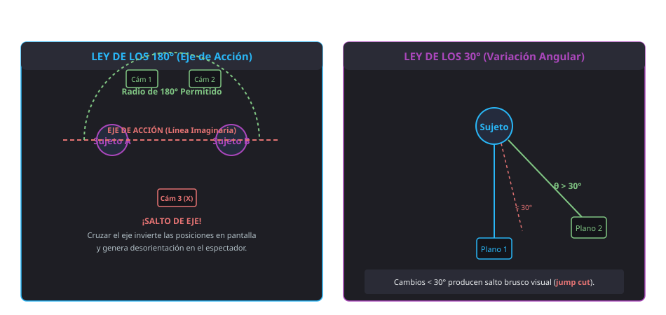

<h1 style="color: #ab47bc;">🎬 Tema 6 — Manipulación de Secuencias de Vídeo</h1>

La edición y el procesamiento de secuencias de vídeo digital en entornos corporativos requiere estructurar proyectos audiovisuales sobre la línea de tiempo, dominar los algoritmos de compresión mediante códecs, diferenciar los formatos de contenedor multimedia, aplicar las reglas universales del lenguaje cinematográfico y producir material formativo como videotutoriales técnicos de soporte.

---

<h2 style="color: #29b6f6;">6.1. Composición de una secuencia de vídeo, manipulación de la línea de tiempo</h2>

El montaje digital se fundamenta en el principio de la **edición no destructiva**: la suite ofimática o de edición no duplica ni modifica físicamente los archivos multimedia almacenados en el disco duro, sino que crea accesos directos y referencias lógicas dentro del archivo de proyecto.

<figure markdown="span">
  
  <figcaption>Figura 6.1 — Arquitectura de edición no destructiva en OpenShot: Archivos de proyecto, visor de previsualización y pistas en la línea de tiempo.</figcaption>
</figure>

### 6.1.1. Añadir ficheros
El proceso de producción audiovisual se inicia con la incorporación de los activos brutos (grabaciones de cámara, capturas de pantalla, locuciones sonoras, pistas musicales e ilustraciones estáticas):

* **Procedimiento de importación en OpenShot:** Clic derecho sobre el panel *Archivos del proyecto > Importar archivos*, o mediante la combinación de teclas `Ctrl + F`.
* **Mantenimiento del vínculo lógico:** Si los archivos multimedia originales son eliminados, renombrados o trasladados a otra ruta física en el sistema de almacenamiento, el software pierde la referencia lógica y es incapaz de reproducir o renderizar dichos fragmentos en el proyecto.

---

### 6.1.2. Edición de vídeo
La composición secuencial se estructura coordinando cuatro elementos funcionales del espacio de trabajo:

* **Línea de Tiempo (*Timeline*):** Eje métrico horizontal graduado cronológicamente sobre el que se distribuyen, ordenan y solapan los clips multimedia.
* **Pistas de Vídeo y Audio:** Capas operativas superpuestas. Las pistas situadas en niveles superiores gozan de prioridad visual sobre las inferiores. En suites como OpenShot, las pistas son híbridas, permitiendo alojar clips de vídeo, gráficos estáticos o pistas de audio de forma indistinta.
* **Herramienta de Recorte (Tijeras / Cuchilla):** Mecanismo de corte destinado a segmentar clips para purgar los segundos residuales iniciales y finales grabados antes o después de la acción principal.
* **Cabezal de Lectura y Controles de Reproducción:** Permiten previsualizar el montaje a tiempo real, desplazarse fotograma a fotograma (*frame by frame*) o saltar a los puntos de corte de los clips.

---

### 6.1.3. Agregar imágenes y títulos
* **Imágenes estáticas:** Se insertan en las pistas de la línea de tiempo comportándose como clips de vídeo sin movimiento, cuya duración temporal puede extenderse o reducirse arrastrando sus límites perimetrales.
* **Títulos y Rótulos estáticos (`Ctrl + T`):** Permiten crear carátulas de inicio, textos identificativos de ponentes (*lower thirds*) y fichas de cierre desde el menú *Título > Título*.
* **Títulos animados (`Ctrl + B`):** Renderizan secuencias tipográficas tridimensionales dinámicas mediante motores auxiliares de animación vectorial (como Blender).

---

### 6.1.4. Inserción de clips de audio
Permite integrar bandas sonoras, locuciones explicativas y efectos ambientales en pistas independientes:

* **Filtrado y acondicionamiento:** Incorporación de efectos nativos para la atenuación de ruido estático de fondo (*Noise Reduction*).
* **Control de envolvente:** Aplicación de transiciones de volumen suaves al inicio (*Fade In*) o al cierre (*Fade Out*) para evitar cortes sonoros abruptos.

---

<h2 style="color: #29b6f6;">6.2. Formatos de vídeo y de códecs</h2>

Un **códec** (*Codificador / Decodificador*) es un algoritmo matemático concebido para comprimir la señal audiovisual durante la captura o renderizado y descomprimirla en tiempo real durante la reproducción, reduciendo drásticamente el espacio de almacenamiento sin degradación visual perceptible.

### Demostración Técnica: Cálculo de Almacenamiento Sin Compresión
El vídeo digital se compone de una secuencia continua de fotogramas procesados a una cadencia estandarizada (habitualmente $24$ o $25\text{ fotogramas/segundo}$). Considerando un espacio de color RGB de $24\text{ bits}$ ($3\text{ bytes por píxel}$):

1. **Fotograma individual en resolución HD ($1280 \times 720\text{ px}$):**
   $$1280 \times 720 = 921.600\text{ píxeles}$$
   $$921.600\text{ píxeles} \times 3\text{ bytes} = 2.764.800\text{ bytes} \approx 2,76\text{ MB por fotograma}$$
2. **Un segundo de reproducción continua (a $24\text{ fps}$):**
   $$2,76\text{ MB} \times 24 = 66,24\text{ MB/segundo}$$
3. **Un minuto de emisión sin compresión ($60\text{ segundos}$):**
   $$66,24\text{ MB} \times 60 \approx 3,97\text{ GB/minuto}$$
4. **Una hora de metraje bruto sin comprimir:**
   $$3,97\text{ GB} \times 60 \approx 238,2\text{ GB/hora}$$

Mediante códecs de compresión inter-cuadro e intra-cuadro (como **H.264 / AVC**), ese volumen de $238\text{ GB}$ se comprime de forma eficiente a únicamente **$1\text{ o }2\text{ GB}$**, posibilitando la distribución en red y el almacenamiento local.

---

### Catálogo de Contenedores Multimedia y Códecs

| Formato Contenedor | Desarrollador / Licencia | Códecs de Vídeo Habituales | Códecs de Audio Habituales | Características Operativas y Ámbito |
| :--- | :--- | :--- | :--- | :--- |
| **MP4 (`.mp4`)** | MPEG / Estándar ISO | H.264 (AVC), H.265 (HEVC) | AAC, MP3 | Estándar global de máxima compatibilidad en terminales móviles, streaming y web. |
| **MKV (`.mkv`)** | Matroska / Código Abierto | H.264, H.265, VP9, AV1 | DTS, AC3, AAC, FLAC | Contenedor flexible de código abierto; admite múltiples pistas de audio y subtítulos embebidos. |
| **AVI (`.avi`)** | Microsoft / Propietario | DivX, Xvid, MJPEG | MP3, AC3 | Contenedor clásico de arquitectura rígida; en progresivo desuso frente a MP4. |
| **MOV (`.mov`)** | Apple / Propietario | H.264, Apple ProRes | AAC, PCM lineal | Estándar del ecosistema QuickTime y formato de captura nativo en cámaras réflex y profesionales. |
| **WMV (`.wmv`)** | Microsoft / Propietario | Windows Media Video | WMA | Formato propietario para Windows. Requiere licencias comerciales; restringido en editores libres. |
| **FLV (`.flv`)** | Adobe Systems | Sorenson Spark, VP6 | MP3, AAC | Diseñado para el plugin Adobe Flash Player; estándar en los inicios del vídeo web, hoy obsoleto. |
| **WebM (`.webm`)** | Google / Abierto (Royalty-free) | VP8, VP9, AV1 | Vorbis, Opus | Formato nativo optimizado para reproducción ultraligera mediante la etiqueta `<video>` en HTML5. |
| **3GP (`.3gp`)** | 3GPP | MPEG-4 Parte 2, H.263 | AMR-NB, AAC-LC | Diseñado para redes móviles primitivas y teléfonos con recursos hardware extremadamente limitados. |
| **RealMedia (`.rm`)** | RealNetworks | RealVideo | RealAudio | Formato pionero de transmisión por streaming adaptativo en tiempo real en los inicios de Internet. |

---

<h2 style="color: #29b6f6;">6.3. Importación y exportación de vídeo</h2>

Finalizada la composición en la línea de tiempo, el proyecto debe consolidarse mediante el proceso de renderizado:

* **Exportación en OpenShot:** Acceso desde el menú *Archivo > Exportar vídeo*, mediante el icono circular rojo de la barra superior o con el atajo de teclado **`Ctrl + E`**.
* **Parámetros de salida:** Permite parametrizar el perfil de destino (Web, Blu-ray, Dispositivos móviles), contenedor final (MP4, AVI, MKV), códec de compresión de vídeo/audio, tasa de bits (*bitrate* expresado en $\text{kbps}$ o $\text{Mbps}$) y resolución espacial ($1080\text{p}$, $720\text{p}$).

---

<h2 style="color: #29b6f6;">6.4. Captura de secuencias de vídeo</h2>

La digitalización de la actividad del escritorio para la generación de evidencias o material formativo se apoya en soluciones de código abierto como **OBS Studio** (*Open Broadcaster Software*):

1. **Configuración de lienzo:** Iniciar OBS Studio y verificar el panel de **Escenas**.
2. **Definición de entradas:** En el panel **Fuentes**, pulsar clic secundario y seleccionar *Agregar > Captura de pantalla* (para el monitor completo) o *Captura de ventana* (para aislar una aplicación específica).
3. **Parametrización de audio:** Comprobar los vúmetros en el panel *Mezclador de audio* para validar la entrada del micrófono y el audio interno del sistema.
4. **Ejecución del registro:** En el panel de **Controles**, hacer clic en **Iniciar grabación**; al concluir el procedimiento, pulsar **Detener grabación** para que el software empaquete el archivo final (`.mp4` o `.mkv`) en la ruta predeterminada.

---

<h2 style="color: #29b6f6;">6.5. Elaboración de videotutoriales</h2>

Un videotutorial técnico es un recurso audiovisual estructurado para capacitar al usuario en la resolución de incidencias informáticas o el manejo de aplicaciones:

* **Registro lingüístico:** Vocabulario técnico riguroso, estructurado, claro y desprovisto de términos ambiguos.
* **Sincronización audiovisual estricta:** La narración en off debe coincidir exactamente con el puntero del ratón y los eventos mostrados en pantalla.
* **Temporización óptima:** La duración debe situarse entre **5 y 10 minutos** (con un límite máximo admisible de **15 minutos**). Los procedimientos técnicos extensos deben modularse en cápsulas temáticas independientes.

---

<h2 style="color: #29b6f6;">6.6. Captura de vídeos de la red</h2>

Al incorporar metraje descargado de repositorios en línea en producciones corporativas, se debe auditar estrictamente su marco legal:

* **Inspección de licencias:** Verificar si el recurso cuenta con derechos reservados (*Copyright*), licencias libres (**Creative Commons**) o si pertenece al **Dominio Público**.
* **Condiciones de explotación:** Las licencias *Creative Commons* imponen condiciones explícitas: atribución de autoría (**BY**), no comercialización (**NC**), prohibición de obras derivadas (**ND**) o distribución bajo idéntica licencia (**SA**).

---

<h2 style="color: #29b6f6;">6.7. Captura de portales</h2>

El aprovisionamiento de recursos de apoyo recurre a plataformas de metraje de stock (*stock footage*):

* **Bancos comerciales (de pago):** Plataformas con catálogo profesional bajo suscripción o pago por activo (Shutterstock, Getty Images, Depositphotos, iStockphoto).
* **Bancos abiertos (gratuitos):** Repositorios con licencias permisivas para uso corporativo y formativo (Coverr, Pexels Video, Pixabay).

---

<h2 style="color: #29b6f6;">6.8. Creación audiovisual</h2>

### Leyes Universales del Lenguaje Audiovisual
* **Ley de los 180° (Eje de Acción):** Traza una línea recta imaginaria entre las miradas de los sujetos o la dirección del movimiento. Los tiros de cámara deben situarse estrictamente dentro del mismo semicírculo de $180^\circ$. Si una cámara cruza esta línea divisoria, se produce un **salto de eje**, invirtiendo la posición espacial relativa de los personajes en la pantalla y desorientando al espectador.
* **Ley de los 30°:** Exige que entre dos planos consecutivos que encuadran al mismo sujeto exista una variación angular de cámara superior a **$30^\circ$**. Variaciones inferiores generan en el espectador la percepción de un corte fallido o salto brusco (*jump cut*).

<figure markdown="span">
  
  <figcaption>Figura 6.2 — Principios de dirección de cámara: Semicírculo de la Ley de los 180° y variación angular mínima de 30°.</figcaption>
</figure>

---

### Expresividad y Tipología de Transiciones
* **Corte directo:** Salto instantáneo entre dos planos continuos; no sugiere alteración temporal dentro de la misma escena.
* **Fundido encadenado (*Crossfade*):** Disolución gradual de un plano sobre el siguiente; denota el transcurso de un breve lapso de tiempo o un cambio armónico de estancia.
* **Fundido a negro (*Fade to Black*):** La imagen se extingue progresivamente hasta alcanzar un cuadro negro absoluto; indica la conclusión definitiva de una secuencia narrativa o un salto temporal significativo.
* **Cortinillas y Barridos:** Movimientos gráficos acelerados; su abuso técnico sobrecarga el montaje confiriéndole un acabado poco profesional.

---

### Estructura de Pistas de Audio en Producciones Profesionales

```
+-------------------------------------------------------------------------+
|                  ARQUITECTURA DE PISTAS DE AUDIO                        |
+-------------------+-----------------------------------------------------+
| PISTA 1: Diálogos | Voces de locutores y actores (aislada para doblaje) |
+-------------------+-----------------------------------------------------+
| PISTA 2: Foleys   | Efectos de sala grabados en estudio (pasos, tecleo) |
+-------------------+-----------------------------------------------------+
| PISTA 3: Música   | Banda sonora y colchón armónico de fondo            |
+-------------------+-----------------------------------------------------+
```

* **Canal de Diálogos:** Registra exclusivamente las voces y locuciones. Debe permanecer rigurosamente aislado del resto de sonidos para permitir su sustitución en procesos de traducción y doblaje internacional.
* **Canal de Efectos de Sonido (*Foleys*):** Alberga sonidos diegéticos sincronizados y efectos de sala creados o grabados de forma artificial en estudio.
* **Canal Musical:** Aloja el acompañamiento musical, ecualizado para no enmascarar las frecuencias de la voz humana.

---

<h2 style="color: #29b6f6;">6.9. Formatos de audio</h2>

Los algoritmos de compresión de audio eliminan selectivamente las frecuencias imperceptibles para el sistema auditivo humano mediante modelos psicoacústicos:

| Formato de Audio | Creador / Régimen de Licencia | Ratios de Compresión y Calidad | Ámbito de Aplicación Técnica |
| :--- | :--- | :--- | :--- |
| **MP3 (MPEG-1 Layer 3)** | Fraunhofer / Thomson (1996) | Ratios de compresión de 10:1 a 12:1; bitrates habituales de 128 a 320 kbps. | Estándar histórico universal para reproducción musical y podcasts en la web. |
| **OGG Vorbis** | Xiph.Org / Código Abierto | Algoritmo libre de patentes; calidad perceptualmente superior a MP3 a idéntico bitrate. | Formato estándar de audio en suites de software libre, Linux y motores de videojuegos. |
| **AAC (Advanced Audio Coding)** | Bell, Fraunhofer, Dolby, Sony | Compresión más eficiente y mayor rendimiento acústico que MP3 a menor tasa de bits. | Códec de audio estándar para contenedores MP4 y ecosistema Apple. |
| **WMA (Windows Media Audio)** | Microsoft / Propietario | Rendimiento homólogo a MP3 en ratios estándar. | Formato nativo en plataformas de escritorio Windows. |
| **RealAudio (`.ra`)** | RealNetworks / Propietario | Altas tasas de compresión con fidelidad acústica media. | Formato pionero en emisiones tempranas de streaming por Internet. |

---

<h2 style="color: #29b6f6;">🎯 Casos Prácticos de Aplicación Real</h2>

!!! example "Caso 1: Producción de un videotutorial técnico para despliegue de software corporativo"
    **Escenario:** Un técnico del CAU debe generar una guía visual para formar a los empleados en la instalación y parametrización de un certificado digital en sus navegadores.  
    **Solución técnica implementada:**  
    1. Configura **OBS Studio** añadiendo como fuente la pantalla del equipo y calibra la ganancia del micrófono en el mezclador de audio.  
    2. Ejecuta el procedimiento técnico mientras realiza la locución en tiempo real, finalizando la captura con una duración total de **7 minutos**.  
    3. Abre **OpenShot**, importa el vídeo grabado mediante `Ctrl + F` y recorta los segundos muertos iniciales con la herramienta de corte.  
    4. Mediante `Ctrl + T` genera un rótulo explicativo en la cabecera e inserta un efecto de atenuación de ruido sobre la pista sonora.  
    5. Pulsa `Ctrl + E` y exporta el material en contenedor **MP4** con códec de vídeo **H.264** y audio **AAC** a resolución **1080p**.

!!! example "Caso 2: Montaje de cápsula institucional para traducción y localización internacional"
    **Escenario:** Una compañía multinacional requiere editar un vídeo corporativo en español de modo que una agencia externa en Alemania pueda sustituir la voz del narrador por una pista en alemán sin rehacer el montaje técnico.  
    **Solución técnica implementada:**  
    1. En la línea de tiempo de **OpenShot**, el técnico organiza la mezcla sonora en tres pistas estrictamente independientes: Pista 1 (*Diálogos*), Pista 2 (*Foleys / Efectos de sala*) y Pista 3 (*Banda sonora musical*).  
    2. Al finalizar el corte de vídeo, exporta el proyecto final y suministra de forma desvinculada las pistas de música y efectos limpias de voz (*pistas M&E*).  
    3. La delegación receptora sustituye únicamente la pista de diálogos con la locución sincronizada en alemán, preservando intactos todos los foleys y la música original.

---

<h2 style="color: #29b6f6;">📌 Apéndice Técnico: Atajos y Puntos Críticos de Evaluación</h2>

### Atajos de Teclado Esenciales en OpenShot

| Atajo de Teclado | Acción Técnica Asociada | Ámbito de Aplicación |
| :--- | :--- | :--- |
| `Ctrl + F` | Abre el cuadro de diálogo para importar archivos multimedia al proyecto | Panel Archivos del Proyecto |
| `Ctrl + T` | Crea un título o rótulo tipográfico estático mediante plantilla | Generador de Títulos |
| `Ctrl + B` | Abre el generador de títulos animados en tres dimensiones | Integración 3D (Blender) |
| `Ctrl + E` | Despliega la consola de exportación y renderizado final de vídeo | Salida y Codificación |

---

### Conceptos Determinantes para Examen (Claves PAC)

!!! danger "Puntos críticos para pruebas de evaluación"
    1. **Ecosistema de software audiovisual libre:** **OpenShot** es el editor no destructivo de código abierto recomendado para montaje; **OBS Studio** es la solución estándar libre para captura de pantalla y streaming.
    2. **Cálculo de almacenamiento sin compresión:** Un vídeo HD a 24 fps sin compresión alcanza aproximadamente **$234\text{ a }238\text{ GB}$ por hora de metraje**. Los códecs de compresión reducen ese volumen a **$1\text{ - }2\text{ GB}$** sin pérdida apreciable de calidad.
    3. **Composición estándar del contenedor MP4:** Estructura de distribución estándar en web y telefonía móvil formada habitualmente por vídeo codificado en **H.264** y audio en **AAC**.
    4. **Especificaciones de contenedores libres (MKV y WebM):**
        * **MKV (Matroska):** Contenedor multimedia universal de código abierto capaz de empaquetar un número ilimitado de pistas de vídeo, audio y subtítulos.
        * **WebM:** Formato abierto de Google para HTML5 que integra contenedor MKV con códec de vídeo **VP8/VP9** y audio **Vorbis/Opus**.
    5. **Restricción operativa del formato WMV:** Desarrollado por Microsoft; al ser software propietario cerrado, los conversores y suites de código abierto no pueden codificar en este formato sin adquirir licencias comerciales.
    6. **Directrices de duración de videotutoriales:** La temporización pedagógica idónea se sitúa entre **5 y 10 minutos**, fijando un límite máximo recomendado de **15 minutos**.
    7. **Reglas del lenguaje audiovisual:**
        * **Ley de los 180°:** Obliga a mantener las posiciones de cámara dentro del mismo semicírculo de $180^\circ$ delimitado por la línea imaginaria de acción para impedir el salto de eje y la desorientación visual del espectador.
        * **Ley de los 30°:** Impone una variación de al menos $30^\circ$ entre dos planos consecutivos que encuadran al mismo sujeto para evitar saltos bruscos (*jump cuts*).
    8. **Aislamiento de la pista de diálogos:** Los diálogos deben registrarse en un canal desvinculado de la música y los efectos de sonido (*Foleys*) para posibilitar el doblaje a otros idiomas sin rehacer la ambientación sonora.
    9. **Naturaleza jurídica de OGG Vorbis:** Formato de compresión de audio totalmente de código abierto y **libre de patentes**, con calidad acústica equiparable o superior a MP3 y AAC.

--8<-- "docs/includes/glosario.md"
