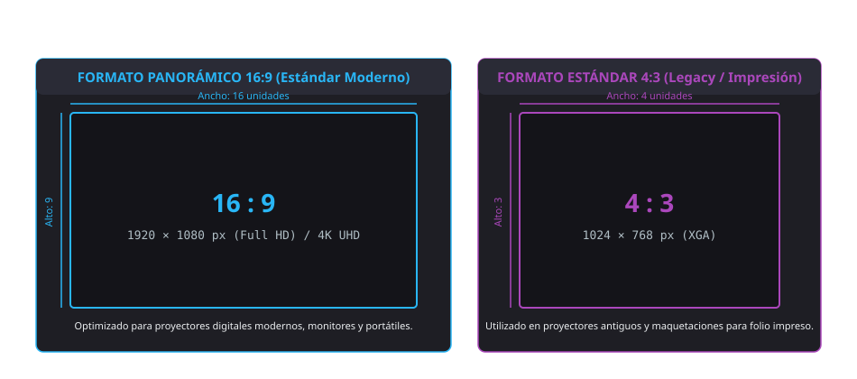
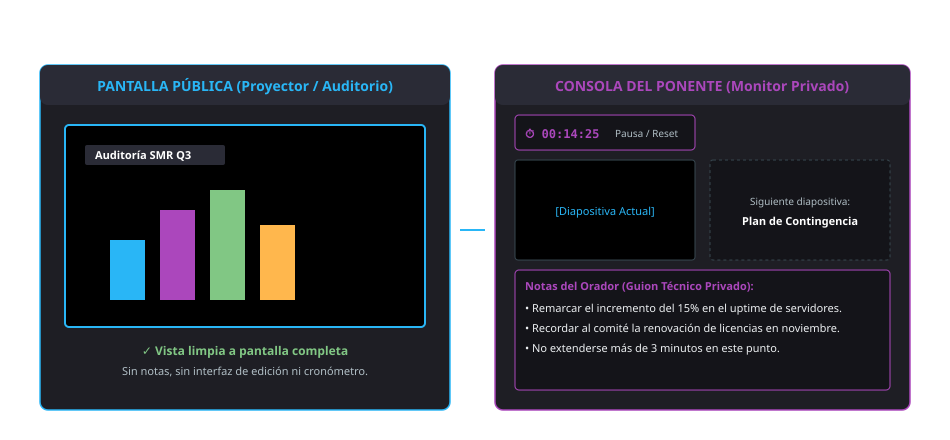

<h1 style="color: #ab47bc;">📽️ Tema 7 — Elaboración de Presentaciones Multimedia</h1>

El diseño y ejecución de presentaciones multimedia eficaces en el entorno corporativo exige articular una planificación estratégica previa orientada a la audiencia, dominar la jerarquización visual mediante diapositivas maestras y patrones de tema, vincular dinámicamente conjuntos de datos analíticos, integrar flujos de audio y vídeo de alta fidelidad, y controlar el modo de exposición y la sincronización colaborativa en la nube.

---

<h2 style="color: #29b6f6;">7.1. Introducción a Presentaciones de Google</h2>

### 7.1.1. Qué es Presentaciones de Google
**Presentaciones de Google** (*Google Slides*) es una aplicación ofimática basada íntegramente en la nube e integrada en el ecosistema **Google Workspace**, diseñada para la creación, maquetación, edición colaborativa y proyección de diapositivas interactivas a través de un navegador web estándar sin necesidad de instalar software local.

Sus pilares de rendimiento corporativo incluyen:

* **Persistencia síncrona en la nube:** Guardado automático continuo e instantáneo en Google Drive tras cualquier evento de edición, suprimiendo la pérdida accidental de datos.
* **Coedición concurrente síncrona:** Trabajo multiusuario en tiempo real con identificación cromática de cursores y punteros de colaboradores activos.
* **Interoperabilidad de estándares:** Capacidad de importación, conversión y exportación bidireccional con presentaciones de Microsoft PowerPoint (`.pptx`) y documentos estáticos no editables (`.pdf`).

---

### 7.1.2. Diferencias y similitudes con PowerPoint
Ambas plataformas convergen en su modelo estructural (organización secuencial por diapositivas, inserción de tablas, gráficos estadísticos, soporte para transiciones y animaciones de objetos):

| Criterio Técnico | Presentaciones de Google (Google Slides) | Microsoft PowerPoint |
| :--- | :--- | :--- |
| **Entorno de Ejecución** | Basado $100\%$ en la nube a través de navegador web. | Aplicación de escritorio nativa local (con versión web recortada en Microsoft 365). |
| **Licenciamiento y Coste** | Gratuito mediante cuenta Google estándar / Suscripción Google Workspace. | Comercial propietario (licencia perpetua o suscripción periódica a Microsoft 365). |
| **Persistencia de Datos** | Guardado instantáneo y desatendido continuo en Google Drive. | Guardado manual en disco local o autoguardado sujeto a sincronización en OneDrive. |
| **Coedición y Concurrencia** | Coedición simultánea nativa fluida con cursores identificados en pantalla. | Edición compartida coordinada mediante sincronización en la nube (SharePoint / OneDrive). |
| **Capacidades de Personalización** | Interfaz ágil, intuitiva y estandarizada orientada a despliegues rápidos. | Amplio catálogo de diseño editorial avanzado, animación compleja y macros en VBA. |
| **Operativa Desconectada** | Requiere la parametrización previa de la extensión *Google Docs sin conexión*. | Funcionamiento nativo autónomo sin requerir conectividad de red. |

---

### 7.1.3. Acceso y requisitos del servicio
* **Acceso corporativo:** Autenticación mediante cuenta corporativa o personal a través del lanzador de aplicaciones de Google o accediendo directamente a la consola web.
* **Requerimientos técnicos de cliente:** Navegador web moderno compatible con estándares HTML5 (Chrome, Firefox, Edge, Safari), conexión a Internet para persistencia en red y disponibilidad de aplicaciones cliente nativas para entornos móviles Android e iOS.

---

### 7.1.4. Interfaz principal: menús, paneles y vistas
* **Barra de Menús Superior:** Agrupa las directivas globales del documento (`Archivo`, `Editar`, `Ver`, `Insertar`, `Formato`, `Diapositiva`, `Organizar`, `Herramientas`).
* **Barra de Herramientas de Acceso Directo:** Botones rápidos para control tipográfico, inserción de formas vectoriales, paleta de rellenos, bordes y configuraciones de transición.
* **Panel Lateral de Diapositivas:** Columna izquierda estructurada en miniaturas verticales que permite reordenar, duplicar, agrupar o suprimir diapositivas de forma secuencial.
* **Área Central de Trabajo (Lienzo):** Espacio interactivo de maquetación y posicionamiento de objetos visuales.
* **Panel Inferior de Notas del Orador:** Área dedicada a la redacción de apuntes técnicos, guiones y marcas temporales visibles únicamente para el ponente.
* **Modos de Visualización:**
    * *Vista Normal:* Modo predeterminado de composición y edición individual.
    * *Vista de Cuadrícula:* Muestra la totalidad de diapositivas en mosaico para reorganizar la estructura general del discurso.
    * *Vista de Edición de Tema (Diapositiva Maestra):* Acceso desde *Diapositiva > Editar tema* para alterar el patrón global y las plantillas maestras de diseño.

---

<h2 style="color: #29b6f6;">7.2. Crear y gestionar presentaciones</h2>

### 7.2.1. Objetivos profesionales, público objetivo e indicaciones o limitaciones
La fase previa al diseño técnico exige auditar tres factores estratégicos:

* **Objetivo Profesional:** Delimitar el propósito central de la comunicación (defensa de un proyecto de sistemas, formación técnica interna, informe de ventas o auditoría de seguridad).
* **Público Objetivo (*Target*):** Nivel de especialización técnica, perfil competencial y edad del auditorio para ajustar la terminología y la densidad conceptual.
* **Limitaciones Físicas y Técnicas del Entorno:** Nivel de luminosidad de la sala, resolución nativa del proyector o pantalla de salida (Full HD vs. XGA), distancia al espectador más alejado (fijando un tamaño de fuente mínimo legible) y limitación estricta de la sobrecarga textual.

---

### 7.2.2. Crear una presentación desde cero o con plantillas
* **Lienzo en Blanco:** Inicialización limpia para maquetaciones personalizadas desde cero.
* **Galería de Plantillas Corporativas:** Diseños preconfigurados con esquemas de distribución, tipografías y paletas normalizadas clasificadas por sectores.

---

### 7.2.3. Guardar presentaciones en Google Drive
Cualquier alteración estructural o tipográfica se sincroniza de forma inmediata en los servidores de Google, confirmándose mediante el indicador de estado *Guardado en Drive* en la cabecera del documento.

---

### 7.2.4. Exportar e importar presentaciones
* **Exportación documental (`Archivo > Descargar`):**
    * *Microsoft PowerPoint (`.pptx`):* Formato propietario estándar de presentaciones para intercambio corporativo.
    * *Documento PDF (`.pdf`):* Formato estático vectorial no editable que congela la maquetación para impresión o distribución segura.
    * *Imágenes rasterizadas (`.png` / `.jpg`):* Exportación de la diapositiva activa en mapa de bits de alta resolución.
    * *Texto sin formato (`.txt`):* Vuelca la totalidad del contenido textual despojado de estilos y elementos gráficos.
* **Importación y compatibilidad:** Carga directa de ficheros `.pptx` arrastrándolos a Google Drive y seleccionando *Abrir con > Presentaciones de Google*, permitiendo la conversión automática de elementos y layouts.

---

### 7.2.5. Configuración general: tamaño de diapositiva, orientación y temas
* **Configuración de Página (`Archivo > Configuración de página`):**
    * *Panorámica 16:9:* Relación de aspecto estándar moderna para monitores, televisores y proyectores contemporáneos.
    * *Estándar 4:3:* Relación de aspecto tradicional optimizada para proyectores heredados o salida a soporte impreso físico.
    * *Personalizada:* Definición métrica exacta de dimensiones expresadas en centímetros, pulgadas o píxeles.
* **Gestión de Temas (`Diapositiva > Cambiar tema`):** Selección y propagación de patrones cromáticos y tipográficos armónicos en la totalidad del libro de diapositivas.

<figure markdown="span">
  
  <figcaption>Figura 7.1 — Comparativa estructural de relaciones de aspecto: Formato panorámico 16:9 frente a estándar 4:3.</figcaption>
</figure>

---

<h2 style="color: #29b6f6;">7.3. Trabajar con diapositivas</h2>

### 7.3.1. Insertar, duplicar y eliminar diapositivas
* **Inserción:** Menú *Diapositiva > Nueva diapositiva* o mediante el atajo de teclado **`Ctrl + M`**.
* **Duplicación:** Clic derecho sobre la miniatura en el panel lateral y selección de *Duplicar diapositiva* (conserva la totalidad de objetos y formatos del original).
* **Eliminación:** Clic derecho > *Eliminar* o pulsación directa de la tecla `Supr` o `Backspace` sobre la diapositiva seleccionada.

---

### 7.3.2. Diseñar diapositivas: fondo, temas y estilos personalizados
Desde **Diapositiva > Cambiar fondo** se parametrizan las propiedades visuales del soporte:

* Asignación de color plano, gradiente cromático o imagen ráster (subida en local o desde Google Drive).
* El botón **Añadir al tema** aplica el fondo seleccionado a la totalidad de diapositivas que compartan el mismo patrón maestro.

---

### 7.3.3. Aplicación de las diferentes tipografías y normas básicas de composición, diseño y utilización del color
* **Familias Serif (con remates):** Presentan terminaciones ornamentales (ej. *Times New Roman, Georgia*); reservadas para documentos impresos o títulos de alta solemnidad.
* **Familias Sans Serif (de palo seco):** Diseños limpios de trazo constante sin remates (ej. *Arial, Roboto, Open Sans*); optimizadas para la lectura ágil sobre proyectores y pantallas digitales.
* **Directrices de diseño técnico:**
    * Mantener contrastes lumínicos elevados entre el fondo y la tipografía (texto claro sobre fondo oscuro o viceversa).
    * No superar un máximo de **2 o 3 fuentes distintas** por presentación para preservar la coherencia visual.
    * Evitar la saturación textual aplicando la regla del espacio en blanco (*whitespace*).

---

<h2 style="color: #29b6f6;">7.4. Elementos básicos: texto, imágenes y formas</h2>

### 7.4.1. Insertar y editar cuadros de texto
Se habilitan mediante la herramienta **Cuadro de texto** de la barra de control:

* **Propiedades tipográficas y de caja:** Modulación de tamaño, tracking, interlineado, color de relleno del contenedor, grosor y color del trazo perimetral.
* **Eje de rotación:** Tirador circular superior que permite orientar la caja tipográfica en cualquier ángulo geométrico.

---

### 7.4.2. Inserción y ajustes de imágenes
* **Canales de aprovisionamiento:** Carga de ficheros locales, búsqueda integrada en Google Imágenes, Google Drive, Google Fotos, enlace URL directo o captura mediante cámara web.
* **Ajustes y transformaciones:** Recorte ortogonal, enmascaramiento con formas geométricas (*crop to shape*), balance de transparencia, brillo y contraste.

---

### 7.4.3. Dibujar formas y líneas
* **Formas vectoriales:** Cuadriláteros, elipses, flechas de bloque direccionales, llamadas de diálogo y operadores matemáticos.
* **Líneas y conectores:** Trazado de líneas rectas, flechas y conectores angulares dinámicos que se anclan a los nodos magnéticos de las formas, manteniéndose enlazados al mover los bloques.

---

<h2 style="color: #29b6f6;">7.5. Elementos avanzados y contenido multimedia</h2>

### 7.5.1. Insertar gráficos y tablas: creación y personalización
* **Tablas (`Insertar > Tabla`):** Generación de cuadrículas bidimensionales para estructurar datos cualitativos o resúmenes de parámetros técnicos.
* **Gráficos Vinculados (`Insertar > Gráfico`):** Inserción de diagramas de barras, líneas, columnas o sectores exportados desde Google Sheets. Al seleccionar la casilla obligatoria **Vincular con la hoja de cálculo**, cualquier modificación en las cifras de la hoja de cálculo de origen genera el botón interactivo **Actualizar** en la diapositiva, recalculando el gráfico sin necesidad de reconstruirlo.

---

### 7.5.2. Incrustar contenido externo: vídeos, audio, hipervínculos y recursos web
* **Incrustar Vídeos (`Insertar > Vídeo`):** Integración directa desde YouTube, mediante URL directa o seleccionando archivos de Google Drive. En el panel lateral *Opciones de formato* permite fijar los segundos exactos de inicio y fin, silenciar el audio y configurar el encendido automático al entrar en la diapositiva.
* **Incrustar Audio (`Insertar > Audio`):** Inserción de pistas sonoras en formato `.mp3` o `.wav` alojadas en Google Drive. Configura un icono interactivo con opciones de reproducción automática, bucle continuo y ocultación del icono durante la presentación.
* **Hipervínculos (`Ctrl + K`):** Enlaces sobre textos u objetos vectoriales dirigidos hacia páginas web externas o anclajes de salto hacia diapositivas específicas dentro del mismo documento.

---

<h2 style="color: #29b6f6;">7.6. Animaciones y transiciones</h2>

### 7.6.1. Animaciones de objetos: tipos y personalización
Se aplican sobre elementos individuales seleccionando el objeto y accediendo a **Insertar > Animación** o mediante clic derecho > *Animar*:

* **Tipologías:** Fundidos de entrada/salida, apariciones súbitas, desplazamientos laterales direccionales y zooms de escala.
* **Disparadores de Activación:**
    1. *Al hacer clic:* El efecto se detiene a la espera de la pulsación manual por parte del ponente.
    2. *Con la anterior:* Se reproduce de forma síncrona en paralelo con la animación precedente.
    3. *Después de la anterior:* Se encadena automáticamente de forma secuencial en cuanto concluye el efecto previo.
* **Control métrico de velocidad:** Barra deslizante para parametrizar la duración temporal de la animación (lenta, media, rápida).

---

### 7.6.2. Configuración de transiciones entre diapositivas
La **transición** es el efecto cinemático que gobierna el paso visual entre una diapositiva y la consecutiva, configurada desde **Diapositiva > Transición**:

* Opciones visuales: *Disolver, Fundir, Desplazar, Cubrir, Voltear, Cubo o Galería*.
* El botón **Aplicar a todas las diapositivas** garantiza la sobriedad y uniformidad de la presentación corporativa.

---

### 7.6.3. Efectos dinámicos y presentaciones interactivas
Permiten romper el discurso lineal tradicional configurando botones de salto mediante hipervínculos internos (`Ctrl + K`), ensamblando menús interactivos de navegación temáticos adaptables a las demandas de la audiencia.

---

<h2 style="color: #29b6f6;">7.7. Colaboración y trabajo en equipo</h2>

### 7.7.1. Compartir presentaciones: permisos y enlaces
El control de la seguridad y la gobernanza del archivo se administra desde el botón superior **Compartir**:

| Perfil de Acceso | Modificación de Diapositivas | Inserción de Comentarios | Descarga y Proyección |
| :--- | :--- | :--- | :--- |
| **Lector** | Denegada | Denegada | Habilitada |
| **Comentador** | Denegada | Habilitada | Habilitada |
| **Editor** | Habilitada | Habilitada | Habilitada |

---

### 7.7.2. Comentarios, sugerencias y ediciones colaborativas
* **Comentarios y menciones (`Ctrl + Alt + M`):** Permiten anclar observaciones técnicas a elementos concretos. Escribir `@correo@empresa.com` notifica formalmente e involucra al colaborador citado.
* **Inspección de colaboradores concurrentes:** Muestra en tiempo real los avatares y cajas delimitadoras cromáticas de los técnicos editando activamente el documento.

---

### 7.7.3. Historial de versiones y recuperación de cambios
Acceso desde **Archivo > Historial de versiones > Ver historial de versiones** o mediante el atajo de teclado **`Ctrl + Alt + Shift + H`**:

* Muestra el registro secuencial de modificaciones auditadas por fecha, hora y autor mediante código de colores.
* Permite asignar nombres identificativos a hitos clave (ej. *"Propuesta Validada por Dirección"*) y ejecutar en cualquier momento la directiva **Restaurar esta versión**.

---

<h2 style="color: #29b6f6;">7.8. Preparación y presentación</h2>

### 7.8.1. Configurar el modo de presentación
El lanzamiento de la exposición se ejecuta mediante el botón **Presentación** situado en el extremo superior derecho:

* **Navegación manual:** Control mediante el teclado (flechas direccionales, barra espaciadora) o puntero de control remoto.
* **Avance automático:** Configurable desde el menú de opciones de presentación para programar transiciones automáticas temporizadas a intervalos fijos (ej. cada 5 segundos).
* **Exportación a vídeo:** Generación de archivos dinámicos no interactivos para paneles informativos en bucle continuo.

---

### 7.8.2. Notas del presentador y diapositivas ocultas
* **Vista de Presentador:** Configuración de doble pantalla donde el proyector público exhibe exclusivamente las diapositivas limpias a pantalla completa, mientras el monitor privado del ponente expone un panel de control con el cronómetro de tiempo transcurrido, la vista previa de la diapositiva siguiente y las notas del orador.
* **Saltar Diapositiva (Ocultar):** Acción ejecutada mediante clic secundario sobre la miniatura seleccionando *Saltar diapositiva*. Identifica el marco con un **icono de ojo tachado**, omitiendo su proyección en la presentación pública sin destruirla del proyecto original (óptima para diapositivas de reserva o anexos técnicos).

<figure markdown="span">
  
  <figcaption>Figura 7.2 — Arquitectura de doble pantalla en la Vista de Presentador: Pantalla pública frente a consola de control del ponente.</figcaption>
</figure>

---

<h2 style="color: #29b6f6;">🎯 Casos Prácticos de Aplicación Real</h2>

!!! example "Caso 1: Exposición técnica corporativa con gráficos vinculados y Vista de Presentador"
    **Escenario:** Un analista de sistemas debe presentar la auditoría trimestral de disponibilidad del servidor ante el comité de dirección. Requiere incorporar diagramas de métricas elaborados en Google Sheets y controlar el tiempo de su discurso sin saturar la pantalla del auditorio con apuntes.  
    **Solución técnica implementada:**  
    1. Importa el diagrama de rendimiento desde Google Sheets marcando obligatoriamente la casilla **Vincular con la hoja de cálculo**. Si los registros de auditoría varían en el último momento, actualiza las cifras de la diapositiva pulsando el botón emergente **Actualizar**.  
    2. Conecta el equipo al proyector de la sala y activa la **Vista de presentador**.  
    3. La audiencia visualiza en el proyector las diapositivas limpias en alta definición, mientras que el analista consulta en la pantalla de su portátil el cronómetro, la miniatura de la diapositiva posterior y el guion técnico redactado en las **Notas del orador**.

!!! example "Caso 2: Trabajo colaborativo multiusuario con auditoría y restauración de cambios"
    **Escenario:** Tres técnicos de microinformática maquetan simultáneamente un manual de procedimientos para una licitación. Durante la jornada de redacción, un operador reestructura por error el orden de los capítulos e introduce cambios que descuadran el formato corporativo.  
    **Solución técnica implementada:**  
    1. El coordinador del proyecto accede al menú *Archivo > Historial de versiones > Ver historial de versiones* mediante la combinación **`Ctrl + Alt + Shift + H`**.  
    2. Inspecciona el registro cronológico y localiza el punto exacto previo a la alteración fallida identificando al autor mediante su código de color.  
    3. Asigna la etiqueta *"Versión Base Homologada"* al estado correcto y pulsa **Restaurar esta versión**, revirtiendo de inmediato la presentación al diseño estable sin pérdida de información.

---

<h2 style="color: #29b6f6;">📌 Apéndice Técnico: Atajos y Puntos Críticos de Evaluación</h2>

### Atajos de Teclado Esenciales en Presentaciones de Google

| Atajo de Teclado | Acción Técnica Asociada | Entorno de Aplicación |
| :--- | :--- | :--- |
| `Ctrl + M` | Inserta una nueva diapositiva en la presentación | Panel lateral / Modo edición |
| `Ctrl + K` | Abre el cuadro de diálogo para insertar un hipervínculo | Textos y objetos vectoriales |
| `Ctrl + Alt + M` | Inserta un comentario o abre un hilo de debate | Global / Objetos seleccionados |
| `Ctrl + Alt + Shift + H` | Despliega el panel de auditoría del Historial de versiones | Archivo / Gestión de cambios |

---

### Conceptos Determinantes para Examen (Claves PAC)

!!! danger "Puntos críticos para pruebas de evaluación"
    1. **Relación de aspecto panorámica vs. estándar:** El estándar nativo para proyectores, televisores y monitores modernos es el formato **16:9**; el formato **4:3** se restringe a terminales antiguos o maquetaciones destinadas a impresión física.
    2. **Criterio tipográfico de legibilidad en proyecciones:** Las fuentes **Sans Serif** (de palo seco, como *Arial* o *Roboto*) carecen de remates ornamentales y constituyen la opción recomendada para asegurar la legibilidad sobre proyectores y pantallas digitales.
    3. **Actualización dinámica de gráficos:** Para que un gráfico refleje de forma automatizada las alteraciones realizadas en la hoja de cálculo de origen, es obligatorio marcar la directiva **Vincular con la hoja de cálculo** en el momento de su inserción.
    4. **Parametrización de vídeos incrustados:** Las opciones de formato permiten acotar el segundo exacto de inicio y finalización del metraje, silenciar el canal sonoro y configurar la reproducción automática al transicionar a la diapositiva.
    5. **Disparadores de animación de objetos:**
        * *Al hacer clic:* Requiere la pulsación manual por parte del operador para ejecutarse.
        * *Con la anterior:* Se activa simultáneamente en paralelo con el efecto precedente.
        * *Después de la anterior:* Se reproduce en cascada de forma automática al término de la animación anterior.
    6. **Arquitectura de la Vista de Presentador:** Divide la emisión en dos interfaces independientes: el proyector de la sala muestra las diapositivas limpias a pantalla completa, mientras el monitor privado del ponente despliega el cronómetro, la diapositiva siguiente y las notas del orador.
    7. **Operativa de la función Saltar Diapositiva:** Oculta la diapositiva durante la exposición pública (señalizada mediante un **icono de ojo tachado** en el panel de miniaturas), pero conserva el elemento íntegro en el archivo del proyecto.

--8<-- "docs/includes/glosario.md"
