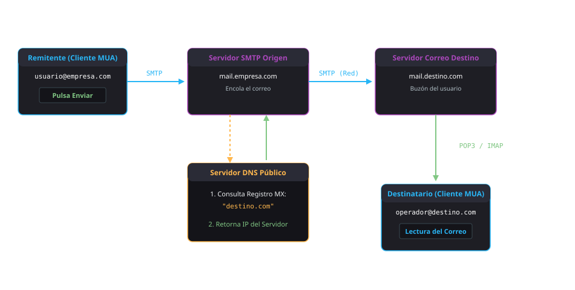
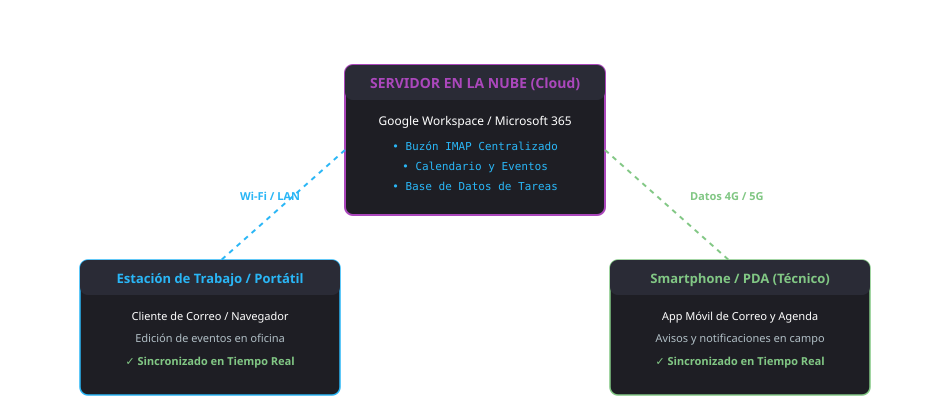

<h1 style="color: #ab47bc;">📬 Tema 8 — Gestión del Correo y la Agenda Electrónica</h1>

La administración del correo electrónico, las agendas digitales y los canales de sindicación informativa en el ámbito empresarial requiere dominar la arquitectura de red y protocolos de transporte (POP3, IMAP, SMTP), implementar reglas avanzadas de filtrado y clasificación, garantizar la sincronización multidispositivo y aplicar protocolos rigurosos de seguridad perimetral, higiene de contraseñas y certificados digitales.

---

<h2 style="color: #29b6f6;">8.1. Correo electrónico, elementos que lo conforman y necesidades básicas</h2>

El **correo electrónico** (*e-mail*) constituye el servicio telemático estándar para el intercambio asíncrono de mensajes y archivos estructurados en redes de computadores, superando los condicionantes del correo postal tradicional por su inmediatez métrica, ausencia de costes marginales y capacidad para anexar documentación técnica digital.

* **Origen histórico:** Concebido en 1971 por **Ray Tomlinson**, quien introdujo el símbolo **`@`** (*arroba*) como delimitador sintáctico para desacoplar de forma inequívoca el nombre del usuario de la máquina o dominio servidor receptor (`usuario@servidor.com`).

### Estructura General de un Gestor de Correo
* **Bandeja de Entrada (*Inbox*):** Depósito canónico donde se recepcionan y almacenan los mensajes entrantes verificados.
* **Bandeja de Salida (*Outbox*):** Cola de almacenamiento temporal que retiene los correos pendientes de transferencia ante caídas de enlace o saturación del cliente.
* **Elementos Enviados (*Sent*):** Registro secuencial auditado de mensajes transmitidos y reconocidos por el servidor emisor.
* **Eliminados / Papelera (*Trash*):** Almacén transitorio de mensajes purgados antes de su borrado físico definitivo del disco o base de datos.
* **Borradores (*Drafts*):** Mensajes en fase de redacción o revisión preliminar guardados de forma persistente sin orden de envío.
* **Ventana de Redacción y Estructura de Encabezados:**
    * *Para (*To*):* Dirección o lista de direcciones de los destinatarios directos principales.
    * *Copia (*CC* - Copia de Carbón):* Destinatarios secundarios informativos cuyas direcciones son visibles para todos los integrantes del hilo.
    * *Copia Oculta (*CCO / BCC* - Copia de Carbón Oculta):* Mecanismo de privacidad que remite copias sin exponer las direcciones al resto de destinatarios, de uso preceptivo para cumplir la normativa de protección de datos en envíos colectivos.
    * *Asunto (*Subject*):* Descripción sintetizada que contextualiza el motivo técnico del mensaje.
    * *Cuerpo (*Body*):* Bloque de contenido formateado (texto plano o HTML enriquecido) y ficheros adjuntos (*attachments*).

---

<h2 style="color: #29b6f6;">8.2. Proveedores, servidores y gestores de cuentas de correo electrónico. Dominios y protocolos</h2>

La prestación del servicio requiere una infraestructura coordinada de servidores de correo (*Mail Transfer Agents / Mail Delivery Agents*) y nombres de dominio parametrizados:

* **Proveedores Webmail Gratuitos:** Soluciones de acceso vía navegador web vinculadas a portales públicos (Gmail, Outlook.com, Yahoo! Mail).
* **Proveedores Corporativos de Dominio Privado:** Plataformas autogestionadas o delegadas que asocian las cuentas a la entidad mercantil (`tecnico@empresa.com`), sustentadas en servidores dedicados o suites de colaboración en la nube.
* **Clientes de Correo (*MUA - Mail User Agent*):** Aplicaciones cliente de escritorio (Mozilla Thunderbird, Microsoft Outlook, Evolution) que se comunican con los servidores mediante puertos y protocolos estandarizados.

---

<h2 style="color: #29b6f6;">8.3. Tipos de cuentas de correo electrónico</h2>

El comportamiento del almacenamiento, descarga y sincronización de los mensajes se gobierna mediante la tríada de protocolos de red fundamentales:

| Protocolo de Comunicación | Función Técnica | Descarga Física en Cliente | Persistencia en Servidor | Ámbito de Implantación Recomendado |
| :--- | :--- | :--- | :--- | :--- |
| **POP3** (*Post Office Protocol 3*) | Recepción de correo entrante. | Sí (transfiere el archivo al disco duro local). | No (se purga por defecto del servidor tras la descarga). | Puestos aislados monodispositivo con limitaciones severas de cuota en el servidor. |
| **IMAP** (*Internet Message Access Protocol*) | Recepción y sincronización bidireccional. | No obligatoria (descarga cabeceras, previsualizaciones y copias locales en caché). | Sí (permanece alojado de forma centralizada hasta borrado explícito). | Entornos corporativos multidispositivo (PC de oficina, portátil y smartphone). |
| **SMTP** (*Simple Mail Transfer Protocol*) | Transporte y retransmisión de correo saliente. | N/A (protocolo exclusivo de envío y reenvío entre nodos de red). | N/A | Protocolo universal de salida que opera de forma conjunta tanto con POP3 como con IMAP. |

---

<h2 style="color: #29b6f6;">8.4. Plantillas y firmas corporativas</h2>

* **Plantillas de Mensaje:** Diseños preestructurados con tipografías, logotipos vectoriales y márgenes normalizados para garantizar la coherencia corporativa en comunicados oficiales o respuestas tipo del CAU.
* **Firma Corporativa Automática:** Bloque de cierre incorporado automáticamente al final de cada mensaje emitido. Integra el nombre del técnico, cargo profesional, departamento, canal telefónico directo y cláusula legal de confidencialidad y exención de responsabilidad conforme al RGPD.

---

<h2 style="color: #29b6f6;">8.5. Suscripción o sindicación de noticias (RSS): configuración, uso y sincronización de mensajes</h2>

El estándar **RSS** (*Really Simple Syndication*) es un formato de archivo basado en XML diseñado para la distribución automatizada de contenidos actualizados desde portales web y boletines técnicos hacia lectores de noticias sin saturar la bandeja de entrada del correo:

* **Lectores Locales (Instalables):** Software dedicado que monitoriza periódicamente los canales web (ej. *Feedreader, RSSReader*).
* **Lectores Online (Basados en Web):** Agregadores centralizados accesibles mediante credenciales (ej. *Netvibes*).
* **Lectores Integrados:** Módulos de agregación embebidos en el propio navegador web o en clientes de correo como Mozilla Thunderbird.

---

<h2 style="color: #29b6f6;">8.6. Clasificación y archivo de los mensajes de correo electrónico</h2>

Para mantener la operatividad y mitigar el colapso informativo de la bandeja de entrada:

| Criterio Operativo | Sistema de Etiquetas (*Labels*) | Sistema Tradicional de Carpetas (*Folders*) |
| :--- | :--- | :--- |
| **Ubicación del Archivo** | El correo permanece en la bandeja o en el archivo general sin desplazarse. | El mensaje se extrae físicamente de la bandeja y se reubica en un directorio exclusivo. |
| **Asignación Múltiple** | **Sí**: Un mismo mensaje puede acumular múltiples etiquetas simultáneas (ej. *Sistemas*, *Urgente*, *Pendiente*). | **No**: Un mensaje solo puede pertenecer a una única carpeta contenedora a la vez. |
| **Flexibilidad de Consulta** | Muy alta; permite consultas cruzadas mediante filtros combinados. | Rígida; jerarquía en árbol que dificulta la clasificación multidepartamental. |

---

<h2 style="color: #29b6f6;">8.7. Enviar, crear borradores, guardar, mover y hacer copias de seguridad, entre otros</h2>

### Circuito Técnico de Transmisión de Correo
El envío de un correo electrónico desde un cliente hasta su receptor final articula una secuencia de consultas entre protocolos y servidores DNS:

<figure markdown="span">
  
  <figcaption>Figura 8.1 — Ciclo de transmisión de correo: Envío SMTP, resolución de registros MX en DNS y entrega por POP3/IMAP.</figcaption>
</figure>

1. El usuario remitente compone el mensaje y acciona el comando **Enviar** desde su cliente MUA.
2. El cliente transfiere el paquete al servidor SMTP de su empresa mediante una conexión saliente segura.
3. El servidor SMTP emisor realiza una consulta recursiva a los servidores **DNS** interrogando por el registro de intercambio de correo (**Registro MX**) del dominio del destinatario.
4. El sistema DNS resuelve la consulta retornando la dirección IP pública del servidor de correo entrante receptor.
5. El servidor SMTP de origen se conecta con el servidor de correo de destino a través de Internet y le entrega el mensaje mediante protocolo SMTP.
6. El destinatario final ejecuta su cliente de correo y descarga o visualiza el mensaje conectándose a su servidor mediante protocolo **POP3** o **IMAP**.

---

<h2 style="color: #29b6f6;">8.8. Opciones del correo electrónico</h2>

* **Agrupación por Conversaciones (Hilos):** Mecanismo de consolidación que concatena cronológicamente todos los mensajes que comparten el mismo asunto y cabeceras de respuesta (*In-Reply-To*), permitiendo auditar el histórico completo del debate sin dispersión de correos.
* **Acciones Rápidas:** Marcadores visuales de seguimiento (banderas o estrellas de prioridad), reglas de archivado instantáneo para omitir la bandeja de entrada y asignación cromática de categorías.

---

<h2 style="color: #29b6f6;">8.9. Entorno de trabajo: configuración y personalización</h2>

### 8.9.1. Migración entre diferentes gestores de correo POP3
Procedimiento técnico para transferir buzones históricos, estructuras de archivo y libretas de direcciones (en formatos normalizados como `.mbox`, `.pst` o `.vcf`) entre clientes de correo distintos (ej. de Outlook a Mozilla Thunderbird) mediante asistentes de migración o exportación de bases de datos locales.

---

### 8.9.2. Gestión del correo basura (*Spam*)
Algoritmos de filtrado heurístico y bayesiano que analizan las cabeceras, procedencia de IPs y palabras clave del cuerpo para desviar automáticamente correos publicitarios o no solicitados hacia la carpeta de **Spam**, programando su destrucción automática tras un periodo de cuarentena.

---

### 8.9.3. Certificados digitales
Un **certificado digital** es un fichero criptográfico emitido y rubricado por una **Autoridad de Certificación** (**AC**) reconocida (como la *FNMT-RCM* o el *DNI electrónico*) que vincula de forma fehaciente una pareja de claves (pública y privada) con la identidad de un usuario o entidad:

* **Soporte físico vs. software:** Pueden alojarse en tarjetas criptográficas inteligentes (*smartcards*) o importarse directamente en el almacén de certificados del navegador o sistema operativo.
* **Respaldo y custodia:** Todo certificado digital instalado por software debe exportarse obligatoriamente a una unidad externa protegida mediante contraseña cifrada (ficheros `.pfx` o `.p12`) para permitir su restauración en caso de formateo o avería de la unidad de almacenamiento.

---

<h2 style="color: #29b6f6;">8.10. Agenda electrónica, necesidades básicas, avisos, tareas, configuración y utilización</h2>

La agenda digital corporativa reemplaza la planificación en papel proporcionando avisos acústicos, recordatorios emergentes en terminales móviles y coordinación de calendarios entre equipos:

| Dimensión Funcional | Evento / Cita en Calendario | Tarea (*Task* / Pendiente) |
| :--- | :--- | :--- |
| **Asignación Temporal** | **Obligatoria**: Bloquea un intervalo de fecha, hora de inicio y hora de finalización en la cuadrícula. | **Opcional / Flexible**: Lista de control orientada a objetivos sin vinculación obligatoria a una hora fija. |
| **Gestión de Estado** | Ocupa disponibilidad temporal en la agenda (*Disponible / Ocupado*). | Control de resolución mediante casilla de verificación (*Pendiente / Completada*). |
| **Colaboración** | Permite invocar a otros asistentes y remitir convocatorias automáticas con confirmación de asistencia. | Habitualmente de gestión individual o asignada en paneles de tareas personales. |

---

<h2 style="color: #29b6f6;">8.11. Sincronización de agendas electrónicas con los dispositivos móviles</h2>

Los dispositivos móviles contemporáneos operan como **Asistentes Digitales Personales** (**PDA**):

<figure markdown="span">
  
  <figcaption>Figura 8.2 — Arquitectura de sincronización continua: Servidor en la nube enlazado con PC de sobremesa y dispositivos móviles vía Wi-Fi o datos móviles.</figcaption>
</figure>

* **Mecanismos de Sincronización:** Vinculación de cuentas corporativas mediante protocolos de sincronización en tiempo real (*Exchange ActiveSync, CalDAV, CardDAV* o sincronización nativa de Google Workspace).
* **Canales de Transporte:** Las transacciones de actualización se canalizan a través de redes inalámbricas **Wi-Fi** o conexiones de datos móviles (**4G/5G**), propagando de forma instantánea cualquier modificación de contactos, eventos o tareas entre todos los terminales registrados del usuario.

---

<h2 style="color: #29b6f6;">8.12. Seguridad en la gestión del correo: filtros. Tratamiento del correo</h2>

### Operadores de Búsqueda y Filtrado Avanzado en Motores de Correo
El motor de filtrado permite parametrizar reglas lógicas complejas para clasificar, marcar o reenviar mensajes entrantes de forma desatendida:

| Operador de Búsqueda | Función Técnica Específica | Sintaxis / Ejemplo Práctico |
| :--- | :--- | :--- |
| **`from:`** | Filtra los correos procedentes de un emisor determinado. | `from:soporte@empresa.com` |
| **`to:`** | Filtra mensajes dirigidos a una cuenta o lista de distribución concreta. | `to:departamento.sistemas@empresa.com` |
| **`subject:`** | Localiza términos específicos incluidos en la línea de asunto. | `subject:incidencia_critica` |
| **`has:attachment`** | Restringe los resultados a correos que incluyan archivos adjuntos. | `has:attachment` |
| **`" "`** *(Comillas)* | Fuerza la coincidencia exacta y literal de la cadena de texto indicada. | `"Acta de Entrega de Servidores"` |
| **`is:unread` / `is:read`** | Discrimina los correos según su estado de lectura en el buzón. | `is:unread` |
| **`before:` / `after:`** | Acota temporalmente la búsqueda por fechas bajo estándar `AAAA/MM/DD`. | `after:2026/01/01 before:2026/06/30` |
| **`in:`** | Circunscribe la consulta a una carpeta o etiqueta determinada. | `in:trash` o `in:spam` |

---

<h2 style="color: #29b6f6;">8.13. Gestión de archivos y seguridad de las aplicaciones de correo y agenda electrónica</h2>

### Directrices de Higiene Informática y Ciberseguridad
* **Ciclo de Renovación de Claves:** Modificar las contraseñas corporativas de acceso periódicamente (intervalos de **1 a 3 meses**), implantando políticas de longitud mínima, combinación alfanumérica y caracteres especiales.
* **Segmentación y Descentralización:** Aislar operativamente las cuentas personales de las cuentas corporativas y los accesos a banca digital, neutralizando el compromiso total del perfil ante fugas de credenciales.
* **Inspección de Adjuntos y Amenazas Vectoriales:** Escanear sistemáticamente cualquier fichero descargado con motores antivirus perimetrales antes de proceder a su ejecución o apertura en el equipo.
* **Defensa frente a Técnicas de Phishing e Ingeniería Social:** Verificar minuciosamente las direcciones reales en las cabeceras del remitente, desconfiar de requerimientos urgentes de contraseñas y abstenerse de pulsar hipervínculos acortados no verificados.

---

<h2 style="color: #29b6f6;">🎯 Casos Prácticos de Aplicación Real</h2>

!!! example "Caso 1: Configuración de cliente corporativo multidispositivo con IMAP y certificado digital"
    **Escenario:** Un técnico de microinformática debe configurar la cuenta `soporte@empresa.com` en el equipo de un nuevo empleado que utiliza un portátil de sobremesa y un terminal móvil. Se requiere garantizar la sincronización permanente de los mensajes leídos y permitir la firma electrónica de los albaranes remitidos a clientes.  
    **Solución técnica implementada:**  
    1. Parametriza el cliente Mozilla Thunderbird seleccionando el protocolo **IMAP** para el servidor de entrada (`imap.empresa.com`, puerto 993 con cifrado SSL/TLS) y **SMTP** para la salida (`smtp.empresa.com`, puerto 465). Esto garantiza que cualquier mensaje leído o movido en el portátil se refleje idénticamente en el smartphone del usuario.  
    2. Incorpora la firma corporativa unificada en HTML con los logotipos de la empresa y la cláusula del RGPD.  
    3. Importa el certificado digital de la FNMT emitido para el usuario desde una unidad flash USB protegida al almacén de claves del cliente de correo, habilitando la firma digital criptográfica de los mensajes salientes.

!!! example "Caso 2: Automatización de la bandeja de entrada del CAU mediante filtros combinados"
    **Escenario:** El buzón de recepción de incidencias se satura diariamente con cientos de albaranes automáticos de proveedores de hardware que impiden la visualización ágil de las alertas urgentes de caídas de servicio.  
    **Solución técnica implementada:**  
    1. En el gestor de correo se accede al panel de configuración de reglas y se define un filtro estructurado:  
       `from:albaranes@distribuidor.com has:attachment subject:"Factura"`  
    2. Se establecen las acciones desatendidas: marcar la opción *Omitir Recibidos (Archivar)*, asignar de forma automática la etiqueta coloreada **Facturación_Hardware** y clasificar el correo como leído.  
    3. El correo no satura la bandeja de entrada principal pero queda accesible e indexado para su consulta contable periódica.

---

<h2 style="color: #29b6f6;">📌 Apéndice Técnico: Puntos Críticos de Evaluación</h2>

!!! danger "Conceptos determinantes para evaluación"
    1. **Origen y paternidad del correo electrónico:** Diseñado por **Ray Tomlinson** en 1971, quien seleccionó el carácter **`@`** para independizar el identificador de usuario del nodo servidor.
    2. **Diferenciación estricta de protocolos de correo:**
        * **POP3:** Descarga físicamente los correos en el equipo local y los suprime por defecto del servidor remoto.
        * **IMAP:** Mantiene los mensajes sincronizados y alojados centralmente en el servidor, permitiendo acceso concurrente multidispositivo.
        * **SMTP:** Gestiona de forma exclusiva la transferencia y salida de correos hacia Internet.
    3. **Privacidad de destinatarios en envíos múltiples:** El campo **CCO** (*BCC*) oculta la lista completa de direcciones a todos los receptores, impidiendo la revelación pública de datos de contacto.
    4. **Definición técnica de RSS:** Siglas correspondientes a **Really Simple Syndication**, formato XML concebido para la suscripción y lectura automatizada de noticias web sin saturar los buzones de correo.
    5. **Diferencia entre Etiquetas y Carpetas:**
        * **Etiquetas:** Permiten asociar múltiples categorías simultáneas a un único mensaje sin moverlo de su ubicación original.
        * **Carpetas:** Mueven el fichero físicamente; un correo solo puede residir en una carpeta a la vez.
    6. **Función del registro MX en el sistema DNS:** El servidor SMTP emisor consulta al servidor DNS el **registro MX** (*Mail Exchange*) del dominio receptor para determinar la dirección IP del servidor de correo al que debe entregar el paquete.
    7. **Sintaxis de operadores de filtrado avanzado:**
        * `has:attachment`: Discrimina correos provistos de archivos adjuntos.
        * `is:unread`: Filtra mensajes no leídos.
        * `before:` / `after:`: Acota temporalmente por fechas (`AAAA/MM/DD`).
    8. **Diferencia operativa entre Eventos y Tareas:**
        * **Eventos / Citas:** Ocupan de forma obligatoria un bloque de fecha y hora delimitado en la cuadrícula de la agenda.
        * **Tareas:** Listados de acciones pendientes con casilla de verificación, sin requerir una hora prefijada.
    9. **Custodia de certificados digitales en software:** Es preceptivo exportar una copia de seguridad cifrada a un soporte externo protegido con contraseña para prevenir su pérdida irrevocable ante fallos o formateos del sistema operativo.

--8<-- "docs/includes/glosario.md"
