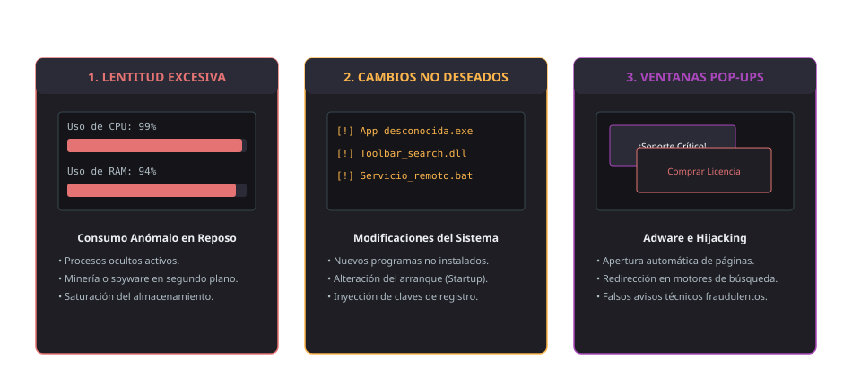
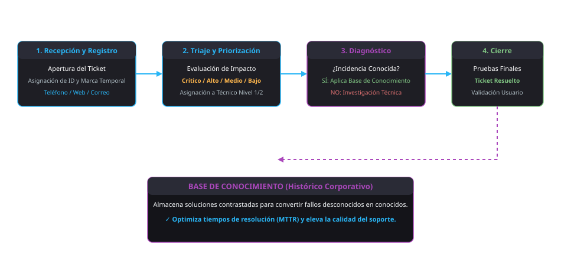

<h1 style="color: #ab47bc;">🛠️ Tema 9 — Técnicas de Soporte al Usuario</h1>

La prestación eficaz de soporte técnico en infraestructuras ofimáticas exige estructurar documentación técnica y manuales de usuario normalizados, diagnosticar anomalías lógicas derivadas de software malintencionado, ejecutar protocolos escalonados de atención presencial y remota, registrar con rigor incidencias conocidas y desconocidas, e implantar políticas proactivas de salvaguarda y contingencia de la información corporativa.

---

<h2 style="color: #29b6f6;">9.1. Elaboración de guías y manuales de uso de aplicaciones</h2>

La **documentación técnica** constituye el conjunto de especificaciones, procedimientos e instrucciones operativas diseñadas para instruir al usuario final en la explotación eficiente y segura de los activos informáticos.

### Tipología de Documentación Técnica
* **Manuales de Usuario:** Tratados exhaustivos que desglosan pormenorizadamente la totalidad de funciones, comandos, parámetros de configuración y advertencias de seguridad de una aplicación o hardware.
* **Guías Rápidas (*Quick Start Guides*):** Documentación condensada, habitualmente multilingüe y de carácter esquemático, concebida para orientar en el desempaquetado, ensamblaje, cableado y puesta en marcha inicial del equipamiento.

---

### Estructura Estándar de un Manual de Usuario

```
+-------------------------------------------------------------------------+
|                  ESTRUCTURA DE UN MANUAL DE USUARIO                     |
+-------------------+-----------------------------------------------------+
| 1. PORTADA        | Título, versión del software/hardware y metadatos   |
+-------------------+-----------------------------------------------------+
| 2. MARCO LEGAL    | Derechos de autor, licencias de explotación (GPL/EULA)|
+-------------------+-----------------------------------------------------+
| 3. INTRODUCCIÓN   | Alcance técnico, prerrequisitos de sistema y metas  |
+-------------------+-----------------------------------------------------+
| 4. ÍNDICE         | Tabla de contenidos jerarquizada y paginada         |
+-------------------+-----------------------------------------------------+
| 5. CUERPO TÉCNICO | Guías operativas paso a paso y capturas explicativas|
+-------------------+-----------------------------------------------------+
| 6. FAQ Y CIERRE   | Resolución de problemas comunes y glosario técnico  |
+-------------------+-----------------------------------------------------+
```

* **Herramientas de Autoría y Compilación:** Edición estructurada en procesadores ofimáticos o suites editoriales y compilación final en **PDF** estático no editable mediante software como Adobe Acrobat Professional o utilidades de virtualización de impresión.

---

<h2 style="color: #29b6f6;">9.2. Identificación de los problemas con el software ofimático</h2>

El protocolo de diagnóstico y resolución de anomalías funcionales en las aplicaciones ofimáticas está condicionado por su modelo de licenciamiento y soporte:

* **Software Propietario / Comercial:** Canalización a través del **Centro de Atención al Usuario (CAU)** del desarrollador o soporte técnico oficial mediante acuerdos de nivel de servicio (**SLA**), ticketing o asistencia telefónica corporativa.
* **Software Libre / Código Abierto:** Búsqueda en bases de conocimiento colaborativas, repositorios oficiales de incidencias (*bug trackers*) y foros especializados donde la comunidad técnica documenta parches, configuraciones y dependencias compartidas.
* **Telemetría y Monitorización:** Utilidades de diagnóstico del sistema operativo (Visor de eventos de Windows, volcados de memoria y logs de aplicaciones) para auditar bloqueos y excepciones lógicas.

---

<h2 style="color: #29b6f6;">9.3. Identificación de los problemas con el software malintencionado</h2>

Cuando los motores antivirus tradicionales no cuentan con firmas actualizadas para neutralizar una amenaza de día cero, la presencia de **malware** se infiere analizando anomalías directas en el rendimiento de la máquina:

<figure markdown="span">
  
  <figcaption>Figura 9.1 — Patrones de degradación operativa vinculados a intrusiones de software malintencionado.</figcaption>
</figure>

1. **Lentitud Operativa Severa:** Sobrecarga anómala y constante en el uso de CPU y memoria RAM originada por procesos ocultos en segundo plano (minería de criptoactivos no autorizada, software espía o escaneo de red).
2. **Despliegue de Software No Autorizado:** Aparición repentina de ejecutables, complementos en navegadores (*toolbars*) o servicios del sistema no instalados por el usuario ni por el administrador.
3. **Publicidad Emergente Masiva (*Pop-ups* / Adware):** Apertura espontánea de ventanas del navegador, redirecciones DNS involuntarias y alteración de los motores de búsqueda predeterminados.

---

<h2 style="color: #29b6f6;">9.4. Utilización de los manuales de usuario para instruir en el uso de aplicaciones</h2>

Los manuales de fabricante (Microsoft 365, LibreOffice, Google Workspace) funcionan como recursos didácticos de autoformación para los empleados:

* **Sección de Preguntas Frecuentes (*FAQ*) y Problemas Comunes:** Permite a los usuarios subsanar bloqueos operativos elementales (problemas de maquetación, fórmulas mal cerradas o errores de exportación) sin sobrecargar el flujo de trabajo del CAU.
* **Repositorios Oficiales en Línea:** Consulta de documentación viva y permanentemente actualizada para conocer la compatibilidad entre versiones y nuevas características.

---

<h2 style="color: #29b6f6;">9.5. Técnicas de asesoramiento en el uso de aplicaciones</h2>

Tras la implantación de una nueva suite ofimática o módulo de gestión en el parque informático corporativo, es preceptivo activar un plan de acompañamiento técnico escalonado:

* **Jornadas Formativas y Talleres Prácticos:** Sesiones de capacitación inicial para anticipar dudas recurrentes y homogeneizar las competencias de los empleados.
* **Canales de Asistencia Gradual:**
    1. *Atención Telemática y Remota (Primer Nivel):* Recepción de consultas por correo corporativo, chat institucional, teléfono o intervención mediante herramientas de **escritorio remoto**. Constituye la vía primaria para minimizar tiempos de parada y costes operativos.
    2. *Atención Presencial (Segundo Nivel):* Desplazamiento físico del técnico al puesto de trabajo únicamente cuando los canales remotos hayan resultado infructuosos o ante averías físicas del hardware.
* **Matriz de Priorización:** Clasificación de los requerimientos según su impacto en el negocio (crítico, alto, medio, bajo) para coordinar la asignación de personal.

---

<h2 style="color: #29b6f6;">9.6. Realización de informes de incidencias</h2>

El reporte formal de averías asegura la trazabilidad técnica de las intervenciones y alimenta la **base de conocimiento** (*Knowledge Base*) corporativa:

<figure markdown="span">
  
  <figcaption>Figura 9.2 — Ciclo de vida del ticket de soporte: Recepción, Triaje, Diagnóstico, Resolución y Cierre.</figcaption>
</figure>

### Campos Obligatorios del Informe de Incidencia
* **Identificador Único y Clasificación:** Código numérico correlativo (Ticket ID) y categorización del incidente como **conocido** o **desconocido**.
* **Marca Temporal Auditada:** Registro exacto de fecha y hora de apertura, inicio de atención y cierre formal.
* **Identidad de los Actores:** Datos del usuario afectado, departamento y técnico de soporte asignado.
* **Diagnóstico Técnico y Síntomas:** Descripción objetiva del fallo observado, software/hardware involucrado y posibles causas raíz.
* **Acciones Correctoras y Pruebas:** Procedimiento de reparación ejecutado, verificaciones funcionales de estabilidad y estado administrativo (*Resuelta, En espera, Escalada*).

---

<h2 style="color: #29b6f6;">9.7. Salvaguardar la información</h2>

La salvaguarda de datos protege el patrimonio de información de la compañía frente a catástrofes físicas, fallos lógicos o ataques de ransomware combinando dos estrategias complementarias:

| Dimensión Técnica | Enfoque de Actuación | Medidas e Instrumentos Aplicados |
| :--- | :--- | :--- |
| **Medidas Preventivas** | Actuaciones previas al fallo destinadas a evitar la pérdida irreversible de información. | • Planificación periódica de **copias de seguridad** (*backups* completos, incrementales y diferenciales).<br>• Sistemas de **control de versiones** documentales y almacenamiento redundante (RAID / Cloud). |
| **Medidas Correctivas** | Procedimientos de choque aplicados con posterioridad a una avería o desastre lógico. | • Utilidades de reconstrucción de sectores lógicos dañados.<br>• Herramientas de **recuperación forense de datos** tras formateos no deseados o corrupción de tablas de particiones. |

---

<h2 style="color: #29b6f6;">9.8. Utilización de todos los recursos disponibles para la resolución de incidencias</h2>

El personal técnico debe disponer de un catálogo diversificado de herramientas para abordar contingencias en ambos planos del sistema informático:

| Categoría de Incidencia | Recursos y Herramientas Especializadas | Finalidad Técnica en el Soporte |
| :--- | :--- | :--- |
| **Incidencias de Software** | Antivirus, suites antimalware especializadas, herramientas de desinfección en arranque, desfragmentadores de disco y utilidades de optimización del registro. | Erradicar infecciones víricas, aislar procesos espía, recomponer archivos del sistema corruptos y restablecer el rendimiento operativo. |
| **Incidencias de Hardware** | **Multímetro digital (polímetro)**, testers de fuentes de alimentación, pulsera antiestática, destornilladores de precisión y componentes de sustitución en stock. | Comprobar voltajes en raíles de alimentación, verificar continuidad en líneas eléctricas, medir tensiones de la pila CMOS y desmontar componentes averiados. |

---

<h2 style="color: #29b6f6;">9.9. Resolución de incidencias en el tiempo y con la calidad adecuados</h2>

En la operativa del soporte técnico existe una paradoja inherente entre **tiempo** y **calidad**: una mayor dedicación analítica eleva la profundidad del diagnóstico pero prolonga la inactividad del usuario, mientras que una respuesta precipitada puede inducir a resoluciones transitorias o fallos recurrentes.

### Tipología de Incidencias y Base de Conocimiento
* **Incidencia Conocida:** Fallo ya documentado y tipificado con anterioridad en el histórico corporativo; dispone de una guía de resolución rápida validada, permitiendo maximizar la calidad del servicio en un tiempo mínimo.
* **Incidencia Desconocida:** Anomalía nueva no registrada previamente; requiere aislar variables, reproducir el error en laboratorio, investigar parches y documentar la solución final. Al concluir la intervención, pasa a catalogarse como conocida, enriqueciendo la base de conocimiento de la empresa.

---

<h2 style="color: #29b6f6;">🎯 Casos Prácticos de Aplicación Real</h2>

!!! example "Caso 1: Diagnóstico de malware y descontaminación sin soporte de firmas antivirus"
    **Escenario:** Un usuario del departamento de compras alerta de que su equipo responde con extrema lentitud, el disco trabaja al 100% de forma ininterrumpida y se despliegan ventanas emergentes en el navegador con avisos de soporte técnico no solicitados. El antivirus residente no alerta de ningún riesgo activo.  
    **Solución técnica implementada:**  
    1. El técnico aísla inmediatamente el equipo desconectando el cable de red RJ-45 para evitar la exfiltración de datos o la propagación lateral por la LAN.  
    2. Accede al Administrador de tareas y al Monitor de recursos, localizando un proceso ejecutable con nombre pseudoaleatorio que absorbe el 90% de los ciclos de CPU.  
    3. Reinicia la estación de trabajo en **Modo seguro** (*Safe Mode*) para evitar la carga en memoria de controladores no esenciales y ejecuta utilidades avanzadas de análisis heurístico fuera de línea para eliminar el archivo malicioso y las claves añadidas en el Registro de Windows.

!!! example "Caso 2: Triaje, resolución y documentación de una incidencia desconocida"
    **Escenario:** Tras actualizar la suite ofimática en un departamento contable, varios puestos experimentan cierres abruptos al compilar macros complejas vinculadas a bases de datos externas. El fallo no figura en el histórico del CAU.  
    **Solución técnica implementada:**  
    1. El técnico clasifica el ticket como **incidencia desconocida** y aplica atención inicial por **escritorio remoto** para replicar el error e inspeccionar el visor de eventos del sistema.  
    2. Identifica una incompatibilidad de arquitectura entre el complemento de base de datos ($32\text{ bits}$) y el nuevo entorno ofimático ($64\text{ bits}$).  
    3. Despliega la biblioteca dinámica homóloga compatible y verifica la correcta ejecución de los libros de cálculo.  
    4. Redacta el informe técnico de incidencia formal detallando el síntoma, la causa raíz y el protocolo de corrección. Al registrarse en la base de datos centralizada, la incidencia pasa al estado de **incidencia conocida**, permitiendo a cualquier otro técnico resolver idénticos fallos en pocos minutos.

---

<h2 style="color: #29b6f6;">📌 Apéndice Técnico: Puntos Críticos de Evaluación</h2>

!!! danger "Conceptos determinantes para evaluación"
    1. **Diferencia entre Manual de Usuario y Guía Rápida:** El manual describe con detalle todas las características y configuraciones del producto; la guía rápida recoge instrucciones condensadas y esenciales de instalación y puesta en marcha inicial en varios idiomas.
    2. **Escalabilidad de los canales de asistencia:** El soporte técnico debe canalizarse prioritariamente mediante medios telemáticos (teléfono, correo, chat, control remoto); el desplazamiento presencial del técnico constituye el **último recurso** operativo.
    3. **Indicadores de software malintencionado en ausencia de alertas antivirus:**
        * Lentitud operativa acusada con saturación injustificada de CPU y memoria RAM.
        * Instalaciones no autorizadas de programas, barras de herramientas o servicios en segundo plano.
        * Aparición descontrolada de publicidad emergente (*pop-ups*) o redirecciones en el navegador web.
    4. **Dicotomía de incidencias (Conocida vs. Desconocida):**
        * **Conocida:** Ya experimentada y documentada previamente; cuenta con una pauta de solución ágil y protocolizada.
        * **Desconocida:** Anomalía inédita que exige investigación, pruebas y posterior documentación formal para su incorporación al histórico.
    5. **Clasificación de medidas de salvaguarda:**
        * **Preventivas:** Copias de seguridad periódicas (*backups*) y control de versiones.
        * **Correctivas:** Software de recuperación forense de datos sobre discos dañados o formateados tras la avería.
    6. **Función del instrumental de hardware:** El **multímetro digital (polímetro)** permite al técnico comprobar voltajes, medir resistencias y verificar que los componentes reciben suministro eléctrico adecuado.
    7. **Estrategia para resolver la paradoja tiempo-calidad:** El uso y consulta sistemática del **registro histórico de incidencias** (base de conocimiento) es la herramienta determinante para maximizar la calidad de resolución reduciendo al mínimo el tiempo de parada.

--8<-- "docs/includes/glosario.md"
